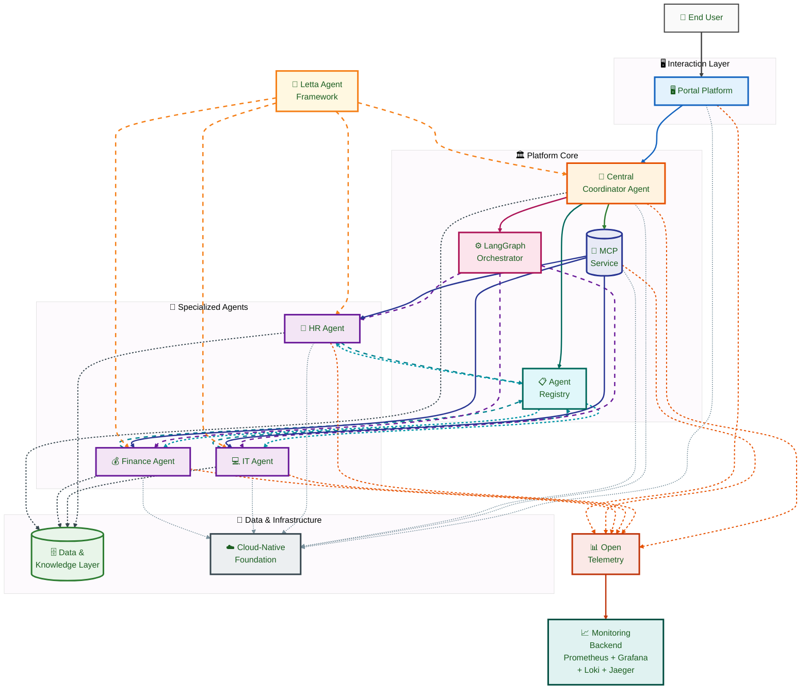
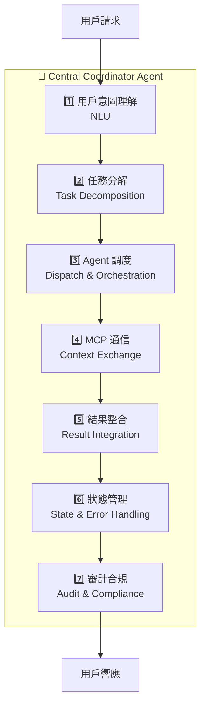
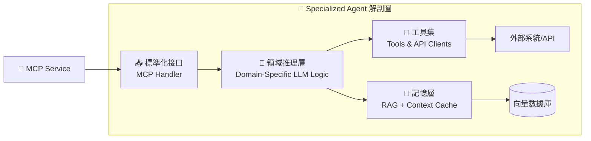
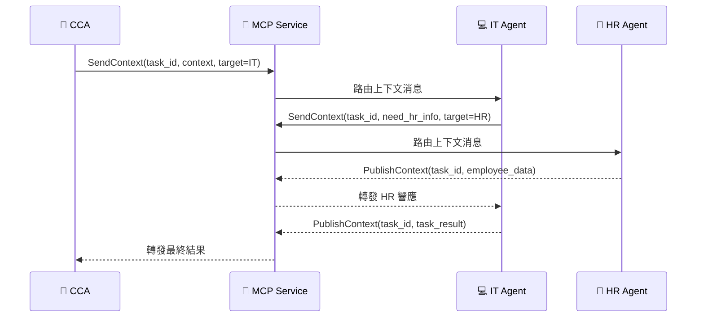
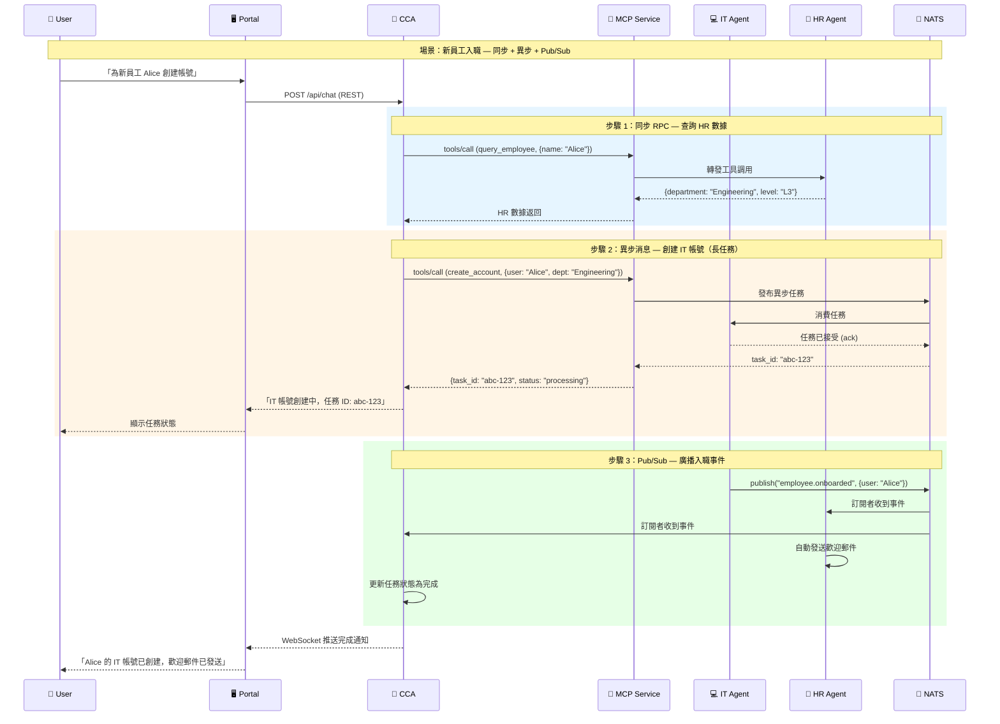
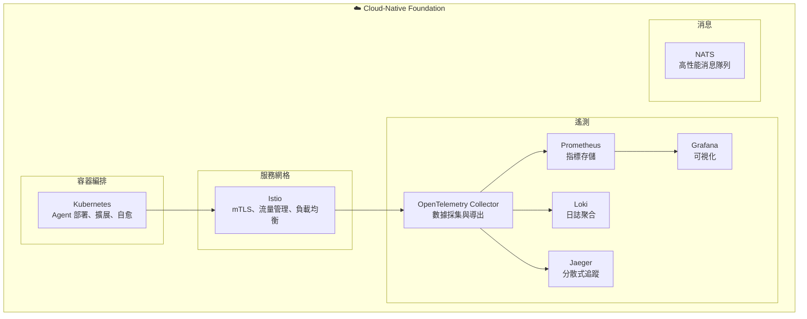
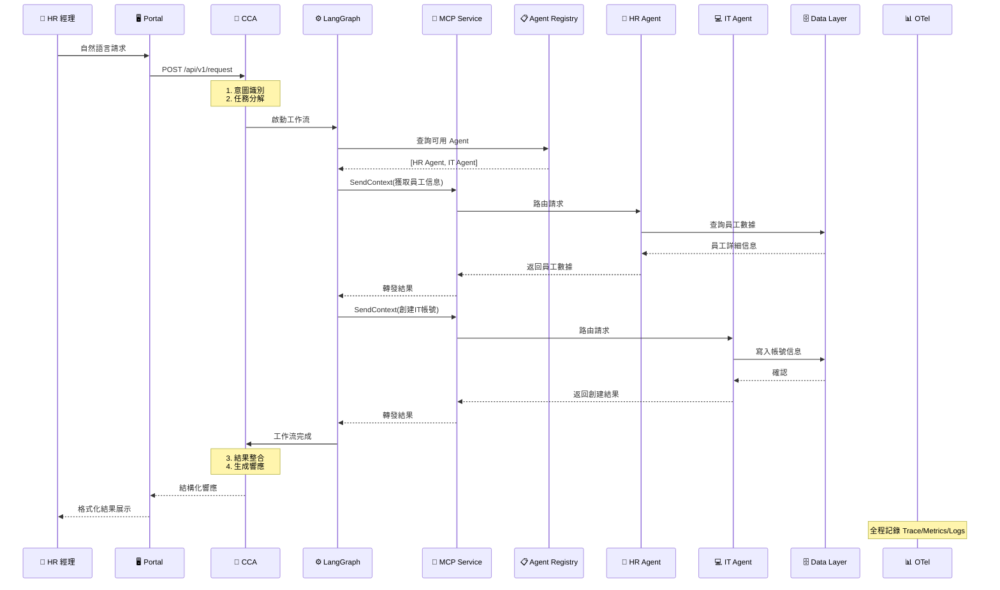

# 第二章：核心架構藍圖 — 一個 Agent 生態系統

> 「好的架構不是畫出來的，而是從約束條件中生長出來的。我們的約束很明確：企業級的可靠性、Agent 驅動的智能性、雲原生的可擴展性。」

在第一章中，我們確立了 AI Native Agent Platform 的願景。本章將這個願景轉化為具體的架構藍圖 — 一個由多個協同工作的組件構成的 Agent 生態系統。這個藍圖將作為後續所有章節的基礎：第五章到第十章將逐一深入每個組件的實現細節，第十一章和第十二章將基於這個藍圖給出實作路線。

---

## 2.1 平台頂層視圖：The Agent Ecosystem

### 2.1.1 設計哲學

在展開架構圖之前，我們先明確三個指導這個架構設計的核心哲學：

1. **智能與執行分離**：CCA（中央協調 Agent）負責「想清楚要做什麼」，Specialized Agents 負責「把具體事情做好」。這種分離讓智能層可以獨立演進，而不影響執行層的穩定性。

2. **通信標準化**：所有 Agent 之間的通信都通過 MCP（Model Context Protocol）進行，不存在私有的點對點通信協議。這確保了平台可觀察性和可審計性。

3. **基礎設施無關性**：雖然我們推薦 Kubernetes 作為部署平台，但架構本身不綁定特定基礎設施。Agent 的邏輯與部署方式是解耦的。

> **新興標準參考**：多 Agent 協同領域正逐步形成標準化生態。IETF 的 MACP（Multi-Agent Collaboration Protocol） Internet-Draft 正在定義 Agent 註冊、能力發現與安全交互的規範，與 MCP 互補 — MCP 負責 Agent 與外部資源的數據交換，MACP 負責多 Agent 間的協同編排。Google 主導的 A2A（Agent-to-Agent）協議已捐贈予 Linux Foundation，提供 Agent 間通信的標準化框架，與 MCP 形成互補關係：**MCP 定義 Agent 與工具的交互標準，A2A 定義 Agent 與 Agent 的交互標準**。兩者共同構成完整的 Agent 通訊棧，本書架構設計已預留與這些未來標準接軌的擴展點。

### 2.1.2 宏觀架構圖

以下是 AI Native Agent Platform 的宏觀架構圖，展示了所有核心組件及其關係：



**圖例：關係線條說明**

| 線條類型 | 顏色 | 樣式 | 說明 |
|---------|------|------|------|
| REST / WebSocket | `#1565C0` 藍 | <span style="color:#1565C0">━━━━━━</span> | Portal → CCA，HTTP/WS 請求 |
| gRPC / MCP | `#2E7D32` 綠 | <span style="color:#2E7D32">━━━━━━</span> | CCA → MCP Service，結構化通信 |
| 工作流編排 | `#AD1457` 紅 | <span style="color:#AD1457">━━━━━━</span> | CCA → LangGraph，任務流程控制 |
| 查詢可用 Agent | `#00695C` 深綠 | <span style="color:#00695C">━━━━━━</span> | CCA → Agent Registry，查詢可用 |
| 註冊 | `#00838F` 青綠 | <span style="color:#00838F">━ ━ ━ ━</span> | Agent → Agent Registry，自我註冊 |
| 發現 | `#0097A7` 藍青 | <span style="color:#0097A7">━ ━ ━ ━</span> | Agent Registry → Agent，揭露可用 |
| 調度 | `#6A1B9A` 紫 | <span style="color:#6A1B9A">━ ━ ━ ━</span> | LangGraph → Agent，分派任務 |
| 上下文傳遞 | `#283593` 靛藍 | <span style="color:#283593">━━━━━━</span> | MCP Service → Agent，傳遞上下文 |
| 讀寫 | `#37474F` 灰 | <span style="color:#37474F">┅┅┅┅┅</span> | Agent → Data Layer，資料存取 |
| 部署於 | `#78909C` 淺灰 | <span style="color:#78909C">┅┅┅┅┅</span> | 元件 → Cloud-Native Foundation |
| 開發框架 | `#F57F17` 橙 | <span style="color:#F57F17">━ ━ ━ ━</span> | Letta → Agent，框架開發 |
| 導出 | `#BF360C` 深橙 | <span style="color:#BF360C">━━━━━━</span> | OTel → Monitoring，匯出遙測 |
| 遙測數據 | `#E65100` 橙紅 | <span style="color:#E65100">┅┅┅┅┅</span> | 元件 → OTel，發送遙測訊號 |

### 2.1.3 架構圖解讀

這張架構圖包含四個邏輯層次：

**交互層（Interaction Layer）**
- **Portal Platform**：用戶與平台交互的唯一入口。提供自然語言對話界面、任務管理儀表板、Agent 狀態可視化。它不直接與 Specialized Agents 通信，所有請求都經過 CCA。

**平台核心層（Platform Core）**
- **CCA**：平台的「大腦」，負責理解意圖、分解任務、協調執行。
- **MCP Service**：Agent 間通信的標準化通道。
- **Agent Registry**：Agent 的註冊與發現機制，類比微服務架構中的 Service Registry。
- **LangGraph Orchestrator**：CCA 內部的工作流引擎，管理複雜的多步驟任務狀態。

**Agent 層（Agent Layer）**
- **Specialized Agents**：各自負責特定領域的任務執行（HR、IT、Finance 等）。它們是平台的「手腳」，執行具體的業務操作。

**數據與基礎設施層（Data & Infrastructure）**
- **Data & Knowledge Layer**：企業數據存儲、知識庫、向量數據庫。
- **Cloud-Native Foundation**：Kubernetes + Istio 構成的部署與運行基礎。
- **Monitoring Backend**：Prometheus + Grafana + Loki + Jaeger 構成的可觀察性後端。

**橫切關注點（Cross-Cutting）**
- **Letta Agent Framework**：所有 Agent 的開發框架，提供統一的 Agent 抽象。
- **OpenTelemetry**：貫穿所有組件的遙測數據採集。

---

## 2.2 Central Coordinator Agent (CCA)：平台的心臟與大腦

### 2.2.1 CCA 的定位

CCA 是整個平台最關鍵的組件，也是實現「AI Native」願景的核心。如果用作業系統來類比：

- **傳統 ERP 系統** 像一個「批處理系統」：用戶提交表單（Job），系統按預定流程處理。
- **AI Native Platform** 像一個「現代作業系統」：CCA 是內核（Kernel），負責任務調度與資源分配；Specialized Agents 是進程（Process），各自執行特定任務；MCP 是 IPC（進程間通信）機制。

### 2.2.2 CCA 的七大核心職責



**（1）用戶請求解析與意圖識別**

CCA 接收來自 Portal 的自然語言請求，使用 LLM 進行意圖識別與實體提取：

```
用戶輸入：「幫新來的張小明開個 IT 帳號，他是市場部的」

CCA 解析結果：
{
  "intent": "create_it_account",
  "entities": {
    "employee_name": "張小明",
    "department": "市場部",
    "request_type": "new_hire_it_setup"
  },
  "confidence": 0.94,
  "missing_info": ["employee_id", "start_date", "role_title"]
}
```

當信心度不足或關鍵信息缺失時，CCA 應主動向用戶澄清，而非盲目執行。

**（2）任務分解與智能編排**

基於識別的意圖，CCA 將複雜任務分解為子任務圖（Sub-task Graph）：

```
任務：新員工 IT 帳號創建
├── 子任務 1：從 HR 系統獲取員工詳細信息 → HR Agent
├── 子任務 2：創建 Active Directory 帳號 → IT Agent（依賴子任務 1）
├── 子任務 3：配置部門權限與群組 → IT Agent（依賴子任務 2）
├── 子任務 4：發送歡迎郵件與登錄指南 → IT Agent（依賴子任務 3）
└── 子任務 5：通知用人部門主管 → HR Agent（依賴子任務 4）
```

這個分解過程由 LLM 驅動，使用 Chain-of-Thought 或 Tree-of-Thoughts 等推理技術（詳見第三章）。

**（3）專用 Agent 調度與協調**

CCA 根據子任務的性質，從 Agent Registry 中查詢最合適的 Specialized Agent，並通過 LangGraph 編排其執行順序：

- **順序執行**：子任務 1 → 2 → 3 → 4 → 5（有依賴關係）
- **並行執行**：若子任務 5 不依賴前面的 IT 操作，可與子任務 2-4 並行

**（4）MCP 協議通信**

CCA 作為 MCP 協議的主要使用者：
- **發送上下文**：向 Specialized Agent 發送包含任務指令、參數、相關上下文的 MCP 消息
- **接收響應**：接收 Agent 返回的執行結果、狀態更新或錯誤信息
- **訂閱事件**：訂閱特定 Agent 的進度事件，實現實時追蹤

**（5）結果整合與反饋**

當多個 Agent 完成各自子任務後，CCA 整合所有結果，生成統一的自然語言響應：

```
✅ 張小明的 IT 帳號已創建完成：
• AD 帳號：zhangxm@company.com
• 初始密碼：已通過安全通道發送
• 部門權限：市場部標準權限組
• 歡迎郵件：已發送至 zhangxm@personal.com
• 主管通知：已通知市場部王經理

⏱️ 總耗時：3 分 24 秒
```

**（6）狀態管理與錯誤處理**

CCA 維護每個任務的完整狀態機，處理各種異常情況：
- **Agent 執行失敗**：觸發重試機制或選擇備用 Agent
- **部分完成**：當某個子任務失敗但其他成功時，向用戶報告部分結果並提供補救選項
- **超時處理**：長時間未響應的 Agent 被標記為異常，CCA 啟動降級流程

**（7）審計日誌生成**

CCA 記錄每一個關鍵操作的完整審計軌跡：
- 誰發起了請求（用戶身份）
- CCA 做了什麼決策（任務分解結果）
- 每個 Agent 執行了什麼操作（輸入、輸出、耗時）
- 最終結果是什麼

這對於企業合規至關重要，也是 AIEBoK「可信度」領域的核心要求。

### 2.2.3 CCA 的設計約束

CCA 雖然是「大腦」，但其設計必須受到嚴格約束：

| 約束 | 說明 | 理由 |
|------|------|------|
| **不直接執行業務操作** | CCA 不調用業務 API，所有業務操作由 Specialized Agents 執行 | 職責分離，便於權限控制 |
| **決策必須可追溯** | 每個調度決策都記錄推理過程 | 審計合規要求 |
| **有界的自主權** | CCA 的自主決策範圍受策略限制 | 安全與可控性 |
| **無狀態傾向** | CCA 的持久狀態存儲在外部（Data Layer），便於水平擴展 | 雲原生可擴展性 |

---

## 2.3 Specialized Agents：任務的執行者

### 2.3.1 角色定位

Specialized Agents 是平台的「執行層」，每個 Agent 專注於一個特定的業務領域。它們的設計哲學是「**深而窄**」— 在特定領域內具備深度能力，但不試圖理解整個平台的複雜性。



**協作關係**

Specialized Agents 的運作依賴四個關鍵組件的協作：

| 組件 | 職責 | 詳見 |
|------|------|------|
| **Letta** | Agent 生命週期管理、記憶持久化、狀態恢復 | §2.6 |
| **Agent Registry** | 能力註冊、服務發現、SLA 管理 | §2.3.4 |
| **LangGraph** | 任務調度、工作流編排、並行/串行控制 | §2.2.2 |
| **MCP Service** | 標準化上下文傳遞、結構化通信 | §2.4 |

這四個組件形成 Agent 的「**基礎設施層**」：Letta 負責「Agent 是什麼」，Agent Registry 負責「Agent 能做什麼」，LangGraph 負責「Agent 何時做」，MCP Service 負責「Agent 如何溝通」。

### 2.3.2 能力暴露（Capability Exposure）

每個 Specialized Agent 通過標準化的 Schema 向平台暴露其能力：

```python
# 示例：IT Agent 的能力定義
{
  "agent_id": "it-agent-v1",
  "agent_type": "it_operations",
  "capabilities": [
    {
      "name": "create_ad_account",
      "description": "在 Active Directory 中創建新用戶帳號",
      "input_schema": {
        "type": "object",
        "properties": {
          "employee_name": {"type": "string"},
          "department": {"type": "string"},
          "role": {"type": "string"},
          "manager_email": {"type": "string"}
        },
        "required": ["employee_name", "department"]
      },
      "output_schema": {
        "type": "object",
        "properties": {
          "account_id": {"type": "string"},
          "email": {"type": "string"},
          "initial_password_ref": {"type": "string"},
          "status": {"type": "string", "enum": ["created", "pending", "failed"]}
        }
      }
    },
    {
      "name": "reset_password",
      "description": "重置用戶密碼",
      "input_schema": { "..." : "..." },
      "output_schema": { "..." : "..." }
    }
  ],
  "sla": {
    "avg_response_time_ms": 5000,
    "max_concurrent_tasks": 10
  }
}
```

**Schema 各欄位的關鍵設計意圖**

| 欄位 | 用途 | 為什麼重要 |
|------|------|-----------|
| `agent_id` | Agent 的唯一標識，包含版本號（`v1`） | 支援金絲雀發布：新版本 Agent 註冊新 `agent_id`，CCA 可逐步切換流量 |
| `agent_type` | Agent 的業務域分類 | CCA 按類型快速篩選，避免遍歷所有 Agent 的能力列表 |
| `capabilities[].name` | 能力的程式化名稱 | CCA 在任務分解後，透過此名稱匹配最合適的 Agent |
| `input_schema` | JSON Schema 格式的輸入規範 | CCA 自動驗證請求格式，不合格的請求在發送前就被攔截 |
| `required` | 必填欄位列表 | 當 CCA 缺少必填欄位時，應先向用戶澄清而非盲目執行 |
| `output_schema` | 輸出結構的規範 | CCA 可提前知道 Agent 會返回什麼，便於結果整合與呈現 |
| `status` 的 `enum` | 受控的狀態值 | 避免 Agent 返回非預期狀態，CCA 的狀態機可以窮舉處理 |
| `sla` | 服務水平協議 | CCA 據此判斷 Agent 是否能承接任務（如併發上限已滿時選擇備用 Agent） |

這種標準化的能力暴露讓 CCA 能夠：
- **發現**：查詢 Agent Registry 找到能執行特定任務的 Agent
- **調用**：構造符合 Schema 的請求（自動驗證必填欄位）
- **解析**：理解 Agent 返回的結構化結果（基於 `output_schema` 做型別檢查）

### 2.3.3 工具使用（Tool Use）

Specialized Agent 通過 Tool Use 機制與外部系統交互。每個 Tool 是對一個外部能力的封裝：

```python
# 示例：IT Agent 的工具集
from letta import tool

# Letta 的 @tool 裝飾器做三件事：
# 1. 將函數註冊為 Agent 可調用的工具（Tool）
# 2. 從函數簽名自動生成 JSON Schema（供 LLM 理解參數結構）
# 3. 從 docstring 提取工具描述（供 LLM 判斷何時使用此工具）

@tool
def query_hr_database(employee_name: str) -> dict:
    """從 HR 數據庫查詢員工信息"""
    # 實際實現：調用 HR 系統 API
    pass

@tool
def create_active_directory_account(
    username: str,
    department: str,
    groups: list[str]
) -> dict:
    """在 Active Directory 中創建帳號"""
    # 實際實現：調用 AD API
    pass

@tool
def send_welcome_email(email: str, name: str, temp_password_ref: str) -> bool:
    """發送歡迎郵件"""
    # 實際實現：調用郵件服務 API
    pass
```

**Tool Use 機制的運作原理**

當 LLM 決定調用某個 Tool 時，實際發生以下流程：

```
LLM 推理 → 決定調用 create_active_directory_account
         → 生成結構化參數 {"username": "zhangxm", "department": "市場部", "groups": ["market-team"]}
         → Letta Runtime 接收調用請求
         → 驗證參數是否符合 JSON Schema
         → 執行函數體（調用外部 AD API）
         → 返回結果給 LLM
         → LLM 根據結果決定下一步行動
```

**三個設計要點**

| 要點 | 說明 | 為什麼重要 |
|------|------|-----------|
| **型別提示（Type Hints）** | 每個參數都標註了 Python 型別（`str`、`list[str]`） | Letta 自動將型別提示轉換為 JSON Schema，確保 LLM 生成的參數格式正確 |
| **Docstring 作為描述** | 函數的 docstring 成為工具的 `description` 欄位 | LLM 根據描述判斷何時應該使用此工具——描述越精確，LLM 的工具選擇越準確 |
| **返回值型別** | `-> dict` 或 `-> bool` | LLM 知道預期的返回格式，便於後續處理結果 |

**Tool 與 Agent 的關係**

每個 Specialized Agent 擁有自己的 Tool 集合——IT Agent 有 `create_active_directory_account`，HR Agent 有 `query_employee_record`。這種「深而窄」的設計確保每個 Agent 專注於自己的領域，不會出現跨領域的工具衝突。Tool 的註冊發生在 Agent 啟動時，並通過 Agent Registry 暴露給 CCA。

### 2.3.4 Agent Registry 的實現

Agent Registry 是平台的「服務目錄」，讓 CCA 能夠動態發現可用的 Specialized Agents：

```python
from dataclasses import dataclass, field
from datetime import datetime

@dataclass
class AgentRegistration:
    """Agent 註冊信息"""
    agent_id: str
    agent_type: str
    capabilities: list[dict]
    endpoint: str  # K8s Service 名稱
    version: str
    status: str  # "healthy", "degraded", "unhealthy"
    registered_at: datetime
    last_heartbeat: datetime
    sla: dict = field(default_factory=dict)

class AgentRegistry:
    """Agent 註冊中心 — 基於 etcd 的分佈式服務發現"""

    def __init__(self, etcd_client):
        self.etcd = etcd_client
        self.prefix = "/ai-platform/agents/"

    async def register(self, registration: AgentRegistration):
        """Agent 啟動時註冊"""
        key = f"{self.prefix}{registration.agent_id}"
        value = json.dumps(asdict(registration))
        await self.etcd.put(key, value, lease=None)  # 帶 TTL 的 lease

    async def deregister(self, agent_id: str):
        """Agent 停止時註銷"""
        await self.etcd.delete(f"{self.prefix}{agent_id}")

    async def discover(self, capability: str) -> list[AgentRegistration]:
        """查詢具備特定能力的健康 Agent"""
        agents = []
        async for key, value in self.etcd.get_prefix(self.prefix):
            reg = AgentRegistration(**json.loads(value))
            if reg.status == "healthy":
                if any(c["name"] == capability for c in reg.capabilities):
                    agents.append(reg)
        return agents

    async def heartbeat(self, agent_id: str, status: str = "healthy"):
        """Agent 定期發送心跳，更新狀態"""
        key = f"{self.prefix}{agent_id}"
        existing = await self.etcd.get(key)
        if existing:
            reg = AgentRegistration(**json.loads(existing))
            reg.last_heartbeat = datetime.now()
            reg.status = status
            await self.etcd.put(key, json.dumps(asdict(reg)))
```

**AgentRegistry 實現的設計決策**

這段代碼看似簡單，但每個設計選擇都反映了分佈式系統的關鍵考量：

**① 為什麼選擇 etcd 作為後端存儲？**

| 特性 | etcd 提供的能力 | 平台如何受益 |
|------|----------------|-------------|
| **強一致性** | 基於 Raft 協議，所有節點看到相同的註冊信息 | CCA 在任何節點查詢 Agent Registry，結果一致 |
| **Watch 機制** | 支持對 key 的變更進行即時通知 | Agent 上線/下線時，CCA 可即時感知，無需輪詢 |
| **TTL/Lease** | 為 key 設置生存時間，過期自動刪除 | Agent 崩潰後未發送心跳，註冊信息自動過期——無需手動清理 |
| **分佈式鎖** | 基於 key 的 CAS（Compare-And-Swap）操作 | 防止多個 Agent 實例同時註冊同一 `agent_id` 時的競態條件 |

**② 資料結構的每個欄位都有用途**

```python
@dataclass
class AgentRegistration:
    agent_id: str          # 唯一標識（含版本號），支持金絲雀發布
    agent_type: str        # 業務域分類（"it_operations"、"hr_management"）
    capabilities: list[dict]  # 能力列表，每個能力包含 name + input/output schema
    endpoint: str          # K8s Service 名稱（如 "it-agent.default.svc.cluster.local"）
    version: str           # 軟體版本號，用於灰度發布
    status: str            # 健康狀態：healthy / degraded / unhealthy
    registered_at: datetime  # 註冊時間，用於計算 Agent 存活時長
    last_heartbeat: datetime # 最後心跳時間，用於判斷 Agent 是否存活
    sla: dict              # 服務水平協議（回應時間、併發上限等）
```

**③ 四個核心方法的協作關係**

```
Agent 啟動 → register() 寫入 etcd → CCA 可 discover() 此 Agent
     ↓
Agent 運行 → heartbeat() 定期更新 last_heartbeat 和 status
     ↓
Agent 健康 → discover() 返回此 Agent → CCA 分派任務
Agent 異常 → heartbeat() 上報 status="unhealthy" → discover() 過濾掉此 Agent
Agent 崩潰 → 心跳停止 → etcd Lease 過期 → 自動刪除註冊信息
Agent 停止 → deregister() 主動刪除 → 立即從發現列表移除
```

**④ `discover()` 的能力匹配邏輯**

```python
# discover("create_ad_account") 的執行過程：
async for key, value in self.etcd.get_prefix(self.prefix):
    reg = AgentRegistration(**json.loads(value))  # 反序列化
    if reg.status == "healthy":                    # 過濾：只選健康的
        if any(c["name"] == capability for c in reg.capabilities):  # 匹配能力名稱
            agents.append(reg)
return agents  # 返回所有匹配的 Agent，CCA 再按 SLA 選擇最優
```

注意：`discover()` 返回的是**列表**而非單個 Agent——這是有意為之。當多個 Agent 具備相同能力時，CCA 可以根據 SLA（回應時間、當前負載）選擇最合適的一個，實現負載均衡。

**發現流程**：當 CCA 需要「創建 IT 帳號」時，它調用 `registry.discover("create_ad_account")`，Registry 返回所有具備該能力且狀態健康的 Agent 列表，CCA 從中選擇最合適的（基於負載、延遲等指標）。

---

## 2.4 Model Context Protocol (MCP) Service：標準化的溝通橋樑

### 2.4.1 MCP 的定位

MCP（Model Context Protocol）是由 Anthropic 提出的開放標準，旨在標準化 AI 模型與外部系統之間的上下文交換。在本平台中，MCP 扮演**通信基礎設施**的角色 — 它不是一個協調者或調度器，而是一個**標準化的消息傳遞通道**。

### 2.4.2 MCP 通信流程



上圖展示了 MCP 通信流程的六個關鍵步驟，揭示了一個重要事實：**MCP Service 不是「大腦」，而是「郵局」**。它不理解業務邏輯，只負責將消息精準投遞到正確的 Agent。

**六個通信步驟的逐一拆解**

| 步驟 | 發送方 → 接收方 | 消息內容 | 發生了什麼 | 為什麼重要 |
|------|---------------|---------|-----------|-----------|
| ① | CCA → MCP | `SendContext(task_id, context, target=IT)` | CCA 將任務上下文（員工信息、任務指令）發送給 MCP Service，指定目標為 IT Agent | CCA 不直接與 IT Agent 通信——所有消息必須經過 MCP 路由 |
| ② | MCP → IT | 路由上下文消息 | MCP 根據 `target=IT` 查找 IT Agent 的網絡地址，將消息轉發過去 | MCP Service 基於 Agent Registry 實現服務發現，Agent 無需知曉彼此的網絡位置 |
| ③ | IT → MCP | `SendContext(task_id, need_hr_info, target=HR)` | IT Agent 在執行過程中發現需要 HR 數據，主動通過 MCP 向 HR Agent 請求 | **關鍵設計**：Agent 不只是被動接收任務，還能主動發起通信——MCP 是雙向通道 |
| ④ | MCP → HR | 路由上下文消息 | MCP 將 IT Agent 的請求轉發給 HR Agent | MCP Service 的「郵局」角色在此展現：它不知道消息的業務含義，只負責精準投遞 |
| ⑤ | HR → MCP | `PublishContext(task_id, employee_data)` | HR Agent 查詢完畢，將員工數據返回給 MCP | `task_id` 是關聯鍵——同一個 task_id 的所有消息構成完整的通信鏈路 |
| ⑥ | MCP → CCA | 轉發最終結果 | MCP 將 IT Agent 的最終執行結果轉發給 CCA | CCA 收到結果後整合並返回給用戶，整個流程閉環 |

**MCP Service 的「郵局」類比**

| 郵局概念 | MCP 對應 | 說明 |
|---------|---------|------|
| 信封上的收件地址 | `target=Agent_ID` | 每條消息都攜帶目標 Agent 的唯一標識 |
| 郵局分揀中心 | MCP 路由引擎 | 根據 Agent ID 查找網絡地址，轉發消息 |
| 掛號回執 | `task_id` 追蹤 | 每個任務的通信歷史可追溯，支持完整審計 |
| 郵局的監控攝像機 | OpenTelemetry | 所有消息經過 MCP，天然形成可觀察性數據 |

**設計要點**

- **雙向通信**：注意步驟 ③——IT Agent 可以主動通過 MCP 向其他 Agent 請求數據。這不是「CCA 下發指令 → Agent 被動執行」的單向模式，而是 Agent 之間可以自主協作。
- **消息路由 ≠ 消息處理**：MCP Service 不解析消息的業務內容，只負責路由。這意味著 MCP 可以獨立升級（更換序列化格式、優化路由算法），而無需修改任何 Agent 的代碼。
- **通信可觀察性**：所有 Agent 間通信都經過 MCP Service，形成天然的審計軌跡。這在企業合規場景中至關重要——你可以追溯「誰在什麼時候給誰發了什麼消息」。

### 2.4.3 MCP Service 的核心功能

| 功能 | 說明 | 技術實現 |
|------|------|----------|
| **消息路由** | 根據目標 Agent ID 路由消息 | gRPC + 服務發現 |
| **上下文存儲** | 持久化關鍵上下文，支持查詢 | Redis / PostgreSQL |
| **協議驗證** | 驗證消息格式是否符合 Protobuf Schema | Protobuf 驗證 |
| **發布/訂閱** | 支持一對多的上下文廣播 | NATS 集成 |
| **歷史查詢** | 支持按 task_id 查詢完整通信歷史 | 時間序列存儲 |

### 2.4.4 為什麼需要專門的 MCP Service

一個自然的疑問是：為什麼不讓 Agent 之間直接通過 gRPC 或 HTTP 通信？引入專門的 MCP Service 的理由：

1. **統一可觀察性**：所有 Agent 間通信經過 MCP Service，天然形成完整的通信審計軌跡。
2. **解耦**：Agent 不需要知道其他 Agent 的網絡位置，只需知道其 Agent ID。
3. **協議演進**：當 MCP 協議版本升級時，只需更新 MCP Service 的適配層，各 Agent 無需修改。
4. **流量控制**：MCP Service 可以實現消息優先級、限流、熔斷等功能。

---

## 2.5 Agent-to-Agent (A2A) 通信模式

MCP 定義了上下文信息的**格式標準**，但 Agent 之間「如何互動」— 何時同步等待、何時異步發送、何時廣播事件 — 則由 A2A（Agent-to-Agent）通信模式決定。MCP 是**傳輸層**，A2A 是**交互模式**。

### 2.5.1 A2A vs MCP 的關係

```
┌─────────────────────────────────────────────────┐
│                  A2A 交互模式                     │
│   同步 RPC  │  異步消息  │  發布/訂閱 (Pub/Sub)  │
├─────────────────────────────────────────────────┤
│              MCP 協議標準                         │
│   格式規範  │  上下文交換  │  工具發現與調用       │
├─────────────────────────────────────────────────┤
│              傳輸層                               │
│   HTTP/SSE  │  gRPC  │  NATS 消息隊列            │
└─────────────────────────────────────────────────┘
```

**核心區別**：

| 維度 | MCP | A2A |
|------|-----|-----|
| **定位** | 協議標準（格式） | 交互模式（行為） |
| **定義** | 上下文如何封裝、傳遞、解析 | Agent 之間何時通信、以何種方式通信 |
| **類比** | HTTP 協議 | RESTful API 設計模式 |
| **關注點** | 數據格式、序列化、版本兼容 | 時序、依賴、錯誤恢復、並發控制 |

### 2.5.2 三種通信模式

在本平台中，Agent 之間的通信可以分為三種模式：

| 模式 | 場景 | 特點 | 實現方式 |
|------|------|------|---------|
| **同步 RPC** | CCA 調用 IT Agent 創建帳號 | 調用方阻塞等待結果，適合單步快速任務 | MCP `tools/call` + HTTP/gRPC |
| **異步消息** | CCA 發送長時間任務給 Agent | 調用方立即返回，通過回調或輪詢獲取結果 | MCP + NATS 消息隊列 |
| **發布/訂閱** | Agent 廣播「新員工已入職」事件 | 多個訂閱者接收事件，鬆耦合 | NATS Pub/Sub + MCP 事件格式 |

### 2.5.3 A2A 交互序列圖



### 2.5.4 A2A 在本平台中的實踐

| 通信路徑 | 模式 | 原因 |
|---------|------|------|
| **Portal → CCA** | 同步 HTTP/REST | 用戶等待即時響應 |
| **CCA → Specialized Agent（簡單任務）** | 同步 MCP tools/call | 任務秒級完成，阻塞可接受 |
| **CCA → Specialized Agent（複雜任務）** | 異步 NATS 消息 | 任務耗時長，不阻塞 CCA |
| **Agent → Agent（跨部門事件）** | Pub/Sub via NATS | 鬆耦合，多訂閱者，事件驅動 |
| **Agent → MCP Service（工具註冊）** | 同步 HTTP | 啟動時一次性註冊 |
| **MCP Service → Agent（心跳/健康檢查）** | 異步定期輪詢 | 監控 Agent 可用性 |

**與 Google A2A Protocol 的整合**：

本平台的 A2A 模式可與 Google A2A 協議（Agent2Agent Protocol）整合，實現跨平台 Agent 互操作。Google A2A 是一個開放標準，定義了 Agent 之間的發現、通信與任務管理規範，目前已由 Linux Foundation 維護，擁有 150+ 組織支持（包括 Google、Microsoft、IBM、Salesforce 等）。

| 整合面向 | 本平台 A2A 模式 | Google A2A Protocol |
|---------|----------------|---------------------|
| **Agent 發現** | Agent Registry（內部） | AgentCard（`.well-known/agent-card.json`） |
| **通信協議** | MCP + NATS | JSON-RPC 2.0 / gRPC |
| **任務管理** | CCA 調度 + NATS 任務隊列 | Task Lifecycle（submitted → working → completed） |
| **適用場景** | 平台內部 Agent 協作 | 跨平台、跨組織 Agent 互操作 |

> **設計建議**：平台內部通信使用本章定義的 A2A 模式（§2.5.2），若需與外部 Agent 系統（如合作夥伴的 Agent 服務）互操作，則可通過 A2A 適配層轉換為 Google A2A 協議格式。詳見 §2.5.5。

**設計原則**：

1. **默認同步**：除非有明確的異步需求，否則使用同步 RPC。同步模型更容易推理和調試。
2. **異步需明確標記**：異步任務必須返回 `task_id`，並支持狀態查詢（`GET /tasks/{id}`）。
3. **事件需幂等**：Pub/Sub 事件的消費者必須實現幂等處理，因為 NATS 可能投遞重複消息。
4. **所有通信經過 MCP Service**：即使 Agent 之間直接通信，也必須通過 MCP Service 路由，以確保可觀察性。

### 2.5.5 Google A2A Protocol 簡介

Google A2A Protocol（Agent2Agent Protocol）是一個開放標準，由 Google於 2025 年 4 月 發起，目前已捐贈給 Linux Foundation 維護。該協議定義了異構 Agent 系統之間的通信規範，解決跨平台、跨組織的 Agent 互操作問題。

**核心概念**：

| 概念 | 說明 |
|------|------|
| **AgentCard** | Agent 的能力描述文件，托管於 `/.well-known/agent-card.json`，包含名稱、能力、安全要求等 |
| **Task** | 任務的生命週期管理（submitted → working → input-required → completed / failed / canceled） |
| **Message** | Agent 之間的通信單元，包含多個 Part（文本、文件、結構化數據） |
| **Artifact** | 任務的輸出結果，如生成的文件、數據等 |

**與 MCP 的關係**：

A2A 與 MCP 並非競爭關係，而是互補的兩層協議。MCP 定義了「Agent 如何使用工具」，A2A 則定義了「Agent 之間如何協作」。在實際部署中，Agent 可同時實現兩種協議：透過 MCP 調用工具，透過 A2A 與其他 Agent 交換任務。

| 層級 | 協議 | 職責 | 實例 |
|------|------|------|------|
| **工具層** | MCP | Tool Discovery、Tool Calling、Context Exchange | HR Agent 調用 `create_onboarding_task` 工具 |
| **協作層** | A2A | Agent Discovery、Task Lifecycle、Messaging | CCA 將任務委託給 IT Agent 執行 |
| **傳輸層** | 共用 | HTTP/JSON-RPC、gRPC、WebSocket | 兩者均可運行於相同傳輸協議之上 |

```
┌─────────────────────────────────────────────────┐
│           Agent A (CCA)                          │
│  ┌──────────────┐  ┌──────────────────────────┐ │
│  │ A2A Client   │  │ MCP Client               │ │
│  │ (發現/委託)  │  │ (工具調用/上下文)         │ │
│  └──────┬───────┘  └────────────┬─────────────┘ │
├─────────┼───────────────────────┼───────────────┤
│         ↓ A2A Protocol          ↓ MCP Protocol  │
├─────────┼───────────────────────┼───────────────┤
│  ┌──────┴───────┐  ┌────────────┴─────────────┐ │
│  │ A2A Server   │  │ MCP Server               │ │
│  │ (任務接收)   │  │ (工具註冊/路由)           │ │
│  └──────────────┘  └──────────────────────────┘ │
│           Agent B (HR Agent)                     │
└─────────────────────────────────────────────────┘
```

**技術規範**：

| 項目 | 規格 |
|------|------|
| **協議版本** | v1.0（2026 年 4 月發布） |
| **序列化** | JSON-RPC 2.0 / Protocol Buffers |
| **傳輸層** | HTTP + JSON 或 gRPC |
| **發現機制** | AgentCard（REST）或 Signed AgentCard（安全擴展） |
| **授權** | OAuth 2.0、API Key、OpenID Connect |
| **SDK** | Python、TypeScript、Java、.NET、Go |

**適用場景**：

| 場景 | 使用本平台 A2A | 使用 Google A2A |
|------|---------------|-----------------|
| 平台內部 Agent 協作 | ✅ | ❌ |
| 與合作夥伴 Agent 互操作 | ❌ | ✅ |
| 跨組織 Agent 委託 | ❌ | ✅ |
| 混合雲 Agent 部署 | 視情況 | ✅ |

> **參考資源**：
> - 官方規範：https://a2a-protocol.org
> - GitHub：https://github.com/a2aproject/A2A
> - 規範文件：`specification/a2a.proto`

---

## 2.6 Letta Agent Framework：Agent 的生命週期與集成

### 2.6.1 為什麼選擇 Letta

[Letta](https://github.com/letta-ai/letta)（前身為 MemGPT）是一個開源的 Agent 框架，其核心優勢在於：

- **狀態持久化**：Agent 的記憶與狀態自動持久化，支持長期運行的 Agent
- **記憶管理**：內建分層記憶系統（主記憶 + 歸檔記憶），與 RAG 天然集成
- **工具集成**：簡潔的 Tool 定義與註冊機制
- **開源活躍**：Apache 2.0 許可，社區活躍，持續更新

### 2.6.2 Letta 在平台中的角色

```
┌─────────────────────────────────────────┐
│           Letta Agent Framework          │
│                                          │
│  ┌─────────────┐  ┌──────────────────┐  │
│  │ Agent SDK   │  │ Memory Manager   │  │
│  │ (定義/構建) │  │ (記憶持久化)      │  │
│  └─────────────┘  └──────────────────┘  │
│  ┌─────────────┐  ┌──────────────────┐  │
│  │ Tool Registry│  │ Agent Registry  │  │
│  │ (工具註冊)   │  │ (Agent 註冊)     │  │
│  └─────────────┘  └──────────────────┘  │
└─────────────────────────────────────────┘
           ↑ 被所有 Agent 使用
    ┌──────┴──────┬──────────┬──────────┐
    CCA          HR Agent   IT Agent   Fin Agent
```

**關鍵點**：Letta 是**開發框架**，不是運行時平台。它提供 Agent 的定義、構建、測試的 SDK，但 Agent 的部署與運行由雲原生基礎設施（Kubernetes）管理。

---

## 2.7 Portal Platform：人機交互的入口

### 2.7.1 功能定位

Portal Platform 是用戶與 AI Native Agent Platform 交互的唯一入口，其核心功能：

| 功能模塊 | 說明 |
|----------|------|
| **對話界面** | 自然語言交互，支持多輪對話 |
| **任務儀表板** | 展示進行中/已完成的任務及其狀態 |
| **Agent 狀態監控** | 實時展示各 Agent 的運行狀態、負載 |
| **審計日誌查詢** | 查詢歷史操作的完整審計軌跡 |
| **管理後台** | Agent 註冊、權限配置、系統設置 |

### 2.7.2 設計原則

- **對話優先**：用戶的主要交互方式是自然語言對話，而非傳統表單。
- **透明性**：用戶可以看到 Agent 的執行過程（「正在為您查詢 HR 系統...」），而非黑箱等待。
- **漸進式披露**：簡單請求直接顯示結果；複雜請求展示任務分解與執行進度。

---

## 2.8 Cloud-Native Foundation：彈性、可擴展性與可觀測性的基石

### 2.8.1 技術棧總覽



上圖將 Cloud-Native Foundation 劃分為四個子系統，展示了 AI Agent Platform 的基礎設施全貌。每個子系統解決一類特定的基礎設施問題，它們之間的依賴關係形成了一條清晰的技術鏈路。

**四大子系統的職責劃分**

| 子系統 | 核心組件 | 在平台中的角色 | 為什麼選擇它 |
|--------|---------|--------------|-------------|
| **容器編排** | Kubernetes | 管理所有 Agent 與服務的部署、擴展、自愈。每個 Agent 運行在獨立的 Pod 中，K8s 負責生命週期管理 | 業界標準，生態最成熟，天然支持自動擴展與故障恢復 |
| **服務網格** | Istio | 提供 Pod 間的安全通信（mTLS）、流量管理（金絲雀發布）、負載均衡。Agent 間的通信安全由 Istio 全權處理 | 企業級安全與流量控制，與 K8s 深度集成 |
| **遙測** | OTel Collector + Prometheus + Grafana + Loki + Jaeger | 統一採集 Trace/Metrics/Logs 三類可觀察性數據，並導出到對應的存儲後端 | CNCF 標準，廠商無關，一個 Collector 對接所有後端 |
| **消息** | NATS | 高性能消息隊列，支持 Agent 間的異步通信、事件發布/訂閱 | 輕量級、高吞吐、雲原生設計，部署資源需求極低 |

**組件間的依賴鏈路**

圖中箭頭揭示了一條關鍵的依賴鏈路：

```
Kubernetes → Istio → OTel Collector → Prometheus/Grafana/Loki/Jaeger
```

這條鏈路的含義是：

- **K8s 是基礎**：Istio 作為 K8s 的 Sidecar 注入，依賴 K8s 的 Pod 管理能力
- **Istio 依賴 K8s**：Istio 的控制平面（istiod）部署在 K8s 上，通過 K8s API 管理 Sidecar 配置
- **OTel Collector 依賴 Istio**：Istio 的 Envoy Proxy 自動生成遙測數據（如 mTLS 連接數、請求延遲），OTel Collector 負責採集這些數據
- **後端存儲依賴 OTel Collector**：Prometheus、Loki、Jaeger 各自只關心自己擅長的數據類型，OTel Collector 是統一的「數據分發中心」

**為什麼遙測子系統有最多組件（5個）**

遙測子系統佔據了圖中最大的區域，這是因為可觀察性在 AI Agent 平台中是一等公民（First-Class Concern）。與傳統微服務不同，AI Agent 系統面臨額外的可觀察性挑戰：

| 挑戰 | 傳統微服務 | AI Agent 平台 |
|------|-----------|-------------|
| 請求延遲 | 網絡 + 處理時間 | 網絡 + 處理 + **LLM 推理時間**（可能佔 80%+） |
| 錯誤類型 | HTTP 500、超時 | **LLM 幻覺**、工具調用失敗、上下文溢出 |
| 成本歸因 | 按請求計費 | 按 **Token 消耗**計費，需要精確到每個 Agent 的用量 |

因此，遙測子系統需要 5 個組件分別處理：數據採集（OTel Collector）、指標存儲（Prometheus）、可視化（Grafana）、日誌聚合（Loki）、分散式追蹤（Jaeger）。

**NATS 為什麼獨立於其他子系統**

NATS 在圖中沒有與其他子系統的連接箭頭——這是有意為之。消息隊列是**正交的基礎設施**：它不關心 Pod 如何編排（K8s 的事）、不關心通信是否加密（Istio 的事）、不關心數據如何監控（OTel 的事）。NATS 只做一件事：高效、可靠地投遞消息。這種正交性使得任何子系統的替換都不會影響消息投遞。

### 2.8.2 各組件的角色

| 組件 | 角色 | 為什麼選擇它 |
|------|------|-------------|
| **Kubernetes** | 容器編排，管理所有 Agent 與服務的部署、擴展、自愈 | 行業標準，生態最成熟 |
| **Istio** | 服務網格，提供 mTLS、流量管理、負載均衡 | 企業級安全與流量控制 |
| **OpenTelemetry** | 統一遙測標準，採集 Trace/Metrics/Logs | CNCF 標準，廠商無關 |
| **Prometheus** | 指標存儲與查詢 | 雲原生監控標準 |
| **Grafana** | 可視化儀表板 | 豐富的圖表與告警 |
| **Loki** | 日誌聚合 | 與 Grafana 深度集成 |
| **Jaeger** | 分散式追蹤 | 跨 Agent 請求鏈路追蹤 |
| **NATS** | 高性能消息隊列 | 輕量級、高吞吐、雲原生 |

這些技術的詳細選型理由將在第四章深入探討。

---

## 2.9 組件交互全景：一個請求的完整旅程

讓我們通過一個具體場景，看看所有組件如何協同工作：

**場景**：HR 經理在 Portal 中輸入「幫新入職的張小明開通 IT 帳號，他是市場部的產品經理」



上圖是第 2 章的「壓軸圖」——將前面所有章節介紹的組件串聯成一個完整的請求旅程。這不只是 MCP 通信的展示，而是**整個 AI Agent Platform 的協同全景**：從用戶輸入到結果返回，涉及 10 個參與者、約 15 條消息、4 個處理階段。

**四個處理階段的逐一拆解**

| 階段 | 參與組件 | 發生了什麼 | 關鍵設計要點 |
|------|---------|-----------|------------|
| **① 意圖理解與任務分解** | Portal → CCA | 用戶以自然語言輸入請求（「幫新入職的張小明開通 IT 帳號」），CCA 使用 LLM 進行意圖識別，將其分解為子任務圖：先查 HR 數據，再創建 IT 帳號 | CCA 是唯一的「思考」環節——它決定做什麼、怎麼做、由誰做 |
| **② 數據檢索** | LangGraph → Agent Registry → MCP → HR Agent → Data Layer | LangGraph 從 Agent Registry 查詢可用 Agent，發現需要 HR Agent 和 IT Agent。先通過 MCP 向 HR Agent 請求員工數據 | Agent Registry 是「黃頁」——CCA 不硬編碼 Agent 地址，而是動態查詢 |
| **③ 任務執行** | LangGraph → MCP → IT Agent → Data Layer | 拿到 HR 數據後，LangGraph 通過 MCP 將上下文傳遞給 IT Agent，IT Agent 執行具體的帳號創建操作（寫入 AD、配置權限） | IT Agent 的操作是**有副作用的**——它修改了外部系統狀態 |
| **④ 結果整合** | CCA → Portal → 用戶 | CCA 整合所有 Agent 的執行結果，生成結構化響應，通過 Portal 返回給用戶 | 用戶只看到最終結果，看不到中間的 15 條消息——複雜性被完全隱藏 |

**每個組件在哪些章節深入講解**

| 組件 | 圖中角色 | 詳見章節 | 核心關注點 |
|------|---------|---------|-----------|
| **Portal** | 用戶交互入口 | 第 10 章 | UI 設計、消息流、實時通信 |
| **CCA** | 大腦——理解意圖、分解任務 | 第 2 章（§2.2）、第 5 章 | NLU、任務分解、狀態管理 |
| **LangGraph** | 工作流引擎——控制執行順序 | 第 3 章（§3.2）、第 5 章 | 有狀態工作流、並行/串行控制 |
| **Agent Registry** | 黃頁——發現可用 Agent | 第 2 章（§2.3.4） | 能力註冊、服務發現 |
| **MCP Service** | 郵局——路由所有消息 | 第 2 章（§2.4）、第 7 章 | 消息路由、協議驗證、可觀察性 |
| **HR Agent** | 領域專家——人力資源操作 | 第 2 章（§2.3）、第 6 章 | RAG 知識庫、工具集成 |
| **IT Agent** | 領域專家——IT 操作 | 第 6 章、第 12 章 | AD 帳號管理、工具調用 |
| **Data Layer** | 數據存儲——所有 Agent 共享 | 第 3 章（§3.3） | RAG、向量數據庫、結構化存儲 |
| **OTel** | 隱形觀察者——全程記錄 | 第 4 章（§4.3）、第 9 章 | Traces、Metrics、Logs |

**OTel 的「隱形觀察者」角色**

注意圖底部的 `Note over OTel: 全程記錄 Trace/Metrics/Logs`。OTel 在圖中沒有任何連接箭頭指向其他組件——它是一個**被動觀察者**。所有組件在執行業務操作的同時，會「順便」向 OTel 發送遙測數據（Trace Span、Metric Point、Log Entry）。OTel 不參與任何業務邏輯，但它記錄了業務邏輯的完整執行軌跡。這就是可觀察性的核心理念：**觀察不影響被觀察系統的行為**。

**用戶視角 vs 系統視角**

| 維度 | 用戶看到的 | 系統實際發生的 |
|------|-----------|-------------|
| **交互次數** | 2 次（輸入 + 輸出） | ~15 條消息在 10 個組件間流轉 |
| **感知延遲** | 等待若干秒 | LLM 推理 + 數據庫查詢 + 外部 API 調用 + 消息路由 |
| **失敗感知** | 「處理失敗，請重試」 | CCA 可能重試了 3 次，切換了 Agent，降級了策略 |
| **複雜性** | 一句自然語言 | 意圖識別 → 任務分解 → Agent 調度 → 數據檢索 → 任務執行 → 結果整合 |

這張圖的核心啟示是：**AI Agent Platform 的價值在於將複雜性完全隱藏在簡單的用戶體驗背後**。用戶只需要一句話，平台就能自動完成多步驟、多 Agent 的協同操作——而用戶感知到的只是一個快速、準確的結果。

---

## 本章小結

本章完成了從願景到架構藍圖的轉化，定義了 AI Native Agent Platform 的核心組件：

- **CCA（中央協調 Agent）**：平台的「大腦」，負責意圖理解、任務分解、Agent 調度、結果整合，具有七大核心職責
- **Specialized Agents**：平台的「執行層」，深而窄的領域專家，通過標準化 Schema 暴露能力
- **MCP Service**：標準化的通信基礎設施，確保所有 Agent 間通信可觀察、可審計
- **A2A 通信模式**：三種交互模式（同步 RPC、異步消息、Pub/Sub），MCP 是傳輸層，A2A 是交互模式
- **Letta Framework**：Agent 的開發框架，提供狀態持久化與記憶管理
- **Portal Platform**：用戶交互入口，對話優先、透明性、漸進式披露
- **Cloud-Native Foundation**：Kubernetes + Istio + OpenTelemetry + NATS 構成的基礎設施

這個架構的關鍵設計決策是**智能與執行的分離**：CCA 專注於「想清楚」，Specialized Agents 專注於「做好事」，MCP 確保「說清楚」，雲原生基礎設施確保「跑得穩」。

在下一章中，我們將深入 Agent 的「智能」本身 — LLM 選型、Prompt Engineering、協同模式與記憶機制，探討如何讓 Agent 真正「聰明」起來。

---

## 延伸閱讀

### 架構模式
1. **《Building Microservices》(2nd Edition)** — Sam Newman, O'Reilly Media. 微服務架構的經典著作，許多設計原則（服務邊界、去中心化治理）同樣適用於 Agent 架構。
2. **《Enterprise Integration Patterns》** — Gregor Hohpe & Bobby Woolf. 企業集成的模式語言，MCP Service 的設計深受其消息路由模式的影響。

### Agent 架構
3. **《A Survey on LLM-based Autonomous Agents》** — Wang et al., 2024. 對 LLM Agent 架構模式的全面綜述。
4. **Anthropic MCP Specification** — https://spec.modelcontextprotocol.io/ — MCP 協議的完整技術規範。

### 雲原生架構
5. **《Cloud Native Patterns》** — Cornelia Davis, Manning. 雲原生架構模式的實踐指南。
6. **CNCF Landscape** — https://landscape.cncf.io/ — 雲原生技術全景圖，理解各技術在生態中的位置。
