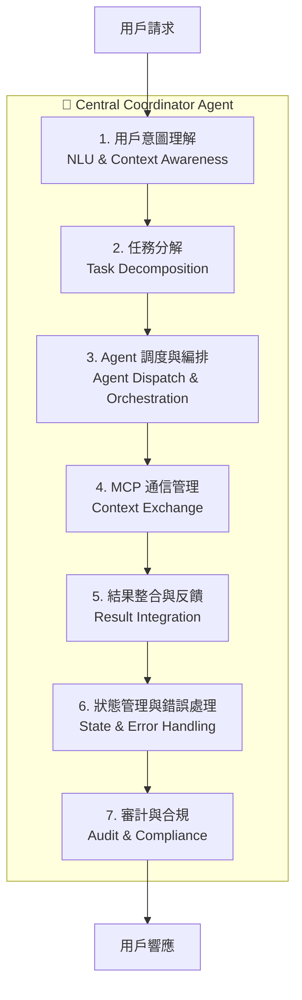
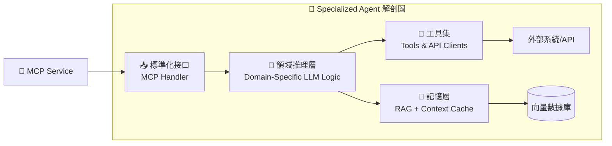
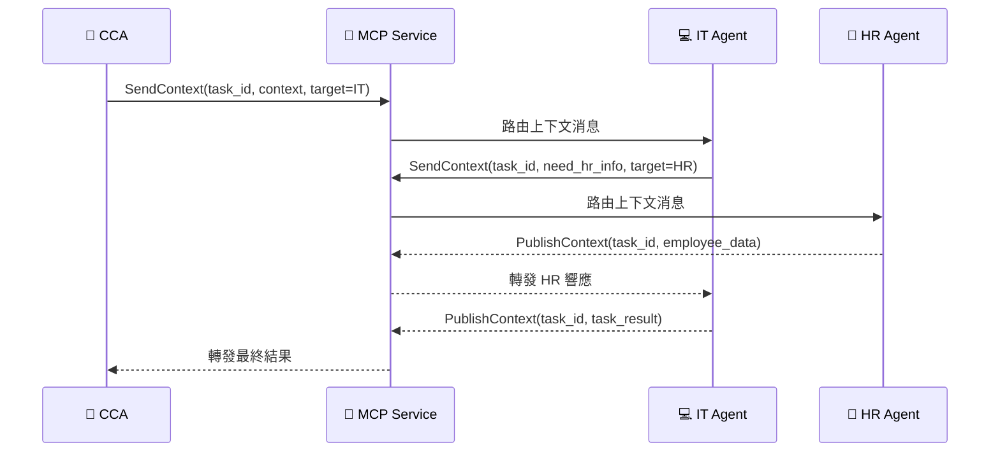
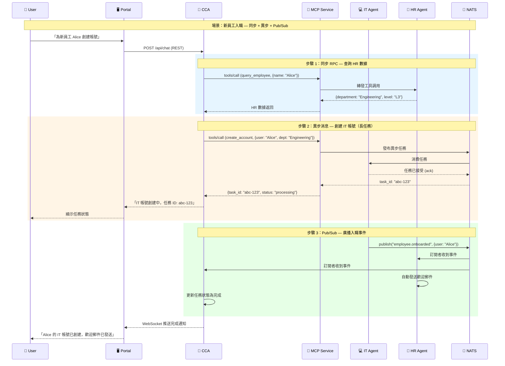
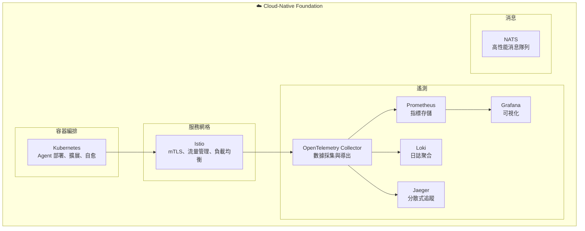
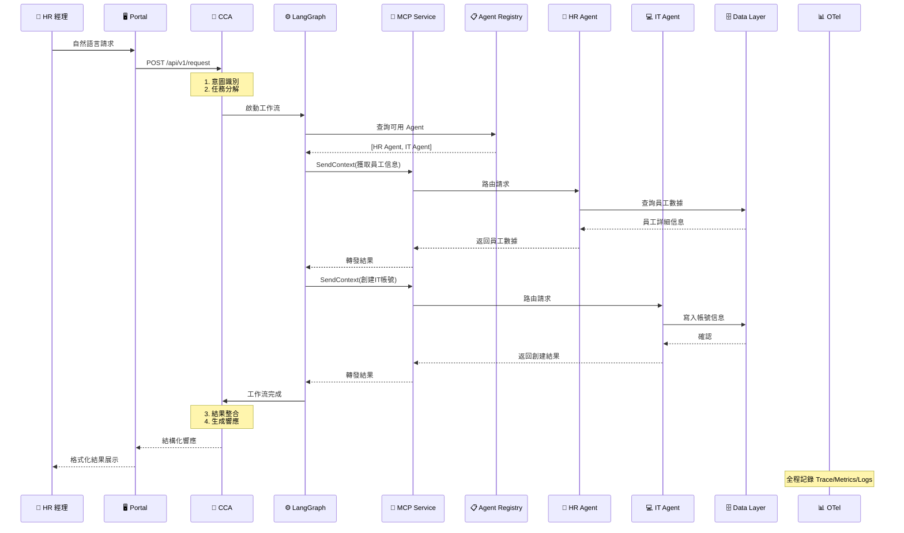

# 第二章：核心架構藍圖 — 一個 Agent 生態系統

> 「好的架構不是畫出來的，而是從約束條件中生長出來的。我們的約束很明確：企業級的可靠性、Agent 驅動的智能性、雲原生的可擴展性。」

在第一章中，我們確立了 AI Native Agent Platform 的願景。本章將這個願景轉化為具體的架構藍圖 — 一個由多個協同工作的組件構成的 Agent 生態系統。這個藍圖將作為後續所有章節的基礎：第五章到第十章將逐一深入每個組件的實現細節，第十一章和第十二章將基於這個藍圖給出實作路線。

---

## 2.1 平台頂層視圖：The Agent Ecosystem

### 2.1.1 設計哲學

在展開架構圖之前，我們先明確三個指導這個架構設計的核心哲學：

1. **智能與執行分離**：CCA（中央協調 Agent）負責「想清楚要做什麼」，Specialized Agents 負責「把具體事情做好」。這種分離讓智能層可以獨立演進，而不影響執行層的穩定性。

2. **通信標準化**：所有 Agent 之間的通信都通過 MCP（Model Context Protocol）進行，不存在私有的點對點通信協議。這確保了平台可觀察性和可審計性。

3. **基礎設施無關性**：雖然我們推薦 Kubernetes 作為部署平台，但架構本身不綁定特定基礎設施。Agent 的邏輯與部署方式是解耦的。

> **新興標準參考**：多 Agent 協同領域正逐步形成標準化生態。IETF 的 MACP（Multi-Agent Collaboration Protocol） Internet-Draft 正在定義 Agent 註冊、能力發現與安全交互的規範，與 MCP 互補 — MCP 負責 Agent 與外部資源的數據交換，MACP 負責多 Agent 間的協同編排。Google 主導的 A2A（Agent-to-Agent）協議已捐贈予 Linux Foundation，提供 Agent 間通信的標準化框架，與 MCP 形成互補關係：**MCP 定義 Agent 與工具的交互標準，A2A 定義 Agent 與 Agent 的交互標準**。兩者共同構成完整的 Agent 通訊棧，本書架構設計已預留與這些未來標準接軌的擴展點。

### 2.1.2 宏觀架構圖

以下是 AI Native Agent Platform 的宏觀架構圖，展示了所有核心組件及其關係：

```mermaid
%%{init: {
  "theme": "base",
  "themeVariables": {
    "primaryColor": "#E8F5E9",
    "primaryTextColor": "#1B5E20",
    "lineColor": "#666666",
    "fontSize": "14px"
  }
}}%%
graph TD
    User[👤 End User] --> Portal[🖥️ Portal Platform]
    Portal -->|"REST / WebSocket"| CCA[🧠 Central Coordinator Agent]

    CCA -->|"gRPC / MCP"| MCPSvc[(📡 MCP Service)]
    CCA -->|"工作流編排"| LangGraph[⚙️ LangGraph Orchestrator]
    CCA -->|"查詢可用 Agent"| AgentReg[📋 Agent Registry]

    AgentReg -->|"註冊"| HRAgent[👥 HR Agent]
    AgentReg -->|"發現"| ITAgent[💻 IT Agent]
    AgentReg -->|"發現"| FinAgent[💰 Finance Agent]

    LangGraph -->|"調度"| HRAgent
    LangGraph -->|"調度"| ITAgent
    LangGraph -->|"調度"| FinAgent

    MCPSvc -->|"上下文傳遞"| HRAgent
    MCPSvc -->|"上下文傳遞"| ITAgent
    MCPSvc -->|"上下文傳遞"| FinAgent

    HRAgent -->|"讀寫"| DataLayer[(🗄️ Data & Knowledge Layer)]
    ITAgent -->|"讀寫"| DataLayer
    FinAgent -->|"讀寫"| DataLayer
    CCA -->|"讀寫"| DataLayer

    subgraph PlatformCore["🏛️ Platform Core"]
        CCA
        MCPSvc
        AgentReg
        LangGraph
    end

    subgraph AgentLayer["🤖 Specialized Agents"]
        HRAgent
        ITAgent
        FinAgent
    end

    subgraph InteractionLayer["🖥️ Interaction Layer"]
        Portal
    end

    subgraph DataInfra["💾 Data & Infrastructure"]
        DataLayer
        CloudNative[☁️ Cloud-Native Foundation]
    end

    Portal -. "部署於" .-> CloudNative
    CCA -. "部署於" .-> CloudNative
    MCPSvc -. "部署於" .-> CloudNative
    HRAgent -. "部署於" .-> CloudNative
    ITAgent -. "部署於" .-> CloudNative
    FinAgent -. "部署於" .-> CloudNative

    Letta[🔧 Letta Agent Framework] -. "開發框架" .-> CCA
    Letta -. "開發框架" .-> HRAgent
    Letta -. "開發框架" .-> ITAgent
    Letta -. "開發框架" .-> FinAgent

    OTel[📊 OpenTelemetry] -->|"導出"| Monitoring[📈 Monitoring Backend<br/>Prometheus + Grafana + Loki + Jaeger]
    CCA -. "遙測數據" .-> OTel
    HRAgent -. "遙測數據" .-> OTel
    ITAgent -. "遙測數據" .-> OTel
    FinAgent -. "遙測數據" .-> OTel
    MCPSvc -. "遙測數據" .-> OTel
    Portal -. "遙測數據" .-> OTel

    %% 關係線條樣式：顏色對應圖例
    style Portal fill:#E3F2FD,stroke:#1565C0,stroke-width:2px
    style CCA fill:#FFF3E0,stroke:#E65100,stroke-width:2px
    style MCPSvc fill:#E8EAF6,stroke:#283593,stroke-width:2px
    style AgentReg fill:#E0F7FA,stroke:#00695C,stroke-width:2px
    style LangGraph fill:#FCE4EC,stroke:#AD1457,stroke-width:2px
    style HRAgent fill:#F3E5F5,stroke:#6A1B9A,stroke-width:2px
    style ITAgent fill:#F3E5F5,stroke:#6A1B9A,stroke-width:2px
    style FinAgent fill:#F3E5F5,stroke:#6A1B9A,stroke-width:2px
    style DataLayer fill:#E8F5E9,stroke:#2E7D32,stroke-width:2px
    style CloudNative fill:#ECEFF1,stroke:#37474F,stroke-width:2px
    style Letta fill:#FFF8E1,stroke:#F57F17,stroke-width:2px
    style OTel fill:#FBE9E7,stroke:#BF360C,stroke-width:2px
    style Monitoring fill:#E0F2F1,stroke:#004D40,stroke-width:2px
    style User fill:#FAFAFA,stroke:#424242,stroke-width:1px

    %% 邊樣式定義：依圖例顏色
    linkStyle 0 stroke:#1565C0,stroke-width:2px,fill:none
    linkStyle 1 stroke:#2E7D32,stroke-width:2px,fill:none
    linkStyle 2 stroke:#AD1457,stroke-width:2px,fill:none
    linkStyle 3 stroke:#00695C,stroke-width:2px,fill:none,stroke-dasharray:5,5
    linkStyle 4 stroke:#00695C,stroke-width:2px,fill:none,stroke-dasharray:5,5
    linkStyle 5 stroke:#00695C,stroke-width:2px,fill:none,stroke-dasharray:5,5
    linkStyle 6 stroke:#6A1B9A,stroke-width:2px,fill:none,stroke-dasharray:8,4
    linkStyle 7 stroke:#6A1B9A,stroke-width:2px,fill:none,stroke-dasharray:8,4
    linkStyle 8 stroke:#6A1B9A,stroke-width:2px,fill:none,stroke-dasharray:8,4
    linkStyle 9 stroke:#E65100,stroke-width:2px,fill:none
    linkStyle 10 stroke:#E65100,stroke-width:2px,fill:none
    linkStyle 11 stroke:#E65100,stroke-width:2px,fill:none
    linkStyle 12 stroke:#283593,stroke-width:2px,fill:none
    linkStyle 13 stroke:#283593,stroke-width:2px,fill:none
    linkStyle 14 stroke:#283593,stroke-width:2px,fill:none
    linkStyle 15 stroke:#37474F,stroke-width:1.5px,fill:none,stroke-dasharray:3,3
    linkStyle 16 stroke:#37474F,stroke-width:1.5px,fill:none,stroke-dasharray:3,3
    linkStyle 17 stroke:#37474F,stroke-width:1.5px,fill:none,stroke-dasharray:3,3
    linkStyle 18 stroke:#37474F,stroke-width:1.5px,fill:none,stroke-dasharray:3,3
    linkStyle 19 stroke:#37474F,stroke-width:1.5px,fill:none,stroke-dasharray:3,3
    linkStyle 20 stroke:#37474F,stroke-width:1.5px,fill:none,stroke-dasharray:3,3
    linkStyle 21 stroke:#F57F17,stroke-width:2px,fill:none,stroke-dasharray:8,4
    linkStyle 22 stroke:#F57F17,stroke-width:2px,fill:none,stroke-dasharray:8,4
    linkStyle 23 stroke:#F57F17,stroke-width:2px,fill:none,stroke-dasharray:8,4
    linkStyle 24 stroke:#F57F17,stroke-width:2px,fill:none,stroke-dasharray:8,4
    linkStyle 25 stroke:#BF360C,stroke-width:2px,fill:none
    linkStyle 26 stroke:#E65100,stroke-width:1.5px,fill:none,stroke-dasharray:4,4
    linkStyle 27 stroke:#E65100,stroke-width:1.5px,fill:none,stroke-dasharray:4,4
    linkStyle 28 stroke:#E65100,stroke-width:1.5px,fill:none,stroke-dasharray:4,4
    linkStyle 29 stroke:#E65100,stroke-width:1.5px,fill:none,stroke-dasharray:4,4
    linkStyle 30 stroke:#E65100,stroke-width:1.5px,fill:none,stroke-dasharray:4,4
    linkStyle 31 stroke:#E65100,stroke-width:1.5px,fill:none,stroke-dasharray:4,4
```



### 2.1.3 架構圖解讀

這張架構圖包含四個邏輯層次：

**交互層（Interaction Layer）**
- **Portal Platform**：用戶與平台交互的唯一入口。提供自然語言對話界面、任務管理儀表板、Agent 狀態可視化。它不直接與 Specialized Agents 通信，所有請求都經過 CCA。

**平台核心層（Platform Core）**
- **CCA**：平台的「大腦」，負責理解意圖、分解任務、協調執行。
- **MCP Service**：Agent 間通信的標準化通道。
- **Agent Registry**：Agent 的註冊與發現機制，類比微服務架構中的 Service Registry。
- **LangGraph Orchestrator**：CCA 內部的工作流引擎，管理複雜的多步驟任務狀態。

**Agent 層（Agent Layer）**
- **Specialized Agents**：各自負責特定領域的任務執行（HR、IT、Finance 等）。它們是平台的「手腳」，執行具體的業務操作。

**數據與基礎設施層（Data & Infrastructure）**
- **Data & Knowledge Layer**：企業數據存儲、知識庫、向量數據庫。
- **Cloud-Native Foundation**：Kubernetes + Istio 構成的部署與運行基礎。
- **Monitoring Backend**：Prometheus + Grafana + Loki + Jaeger 構成的可觀察性後端。

**橫切關注點（Cross-Cutting）**
- **Letta Agent Framework**：所有 Agent 的開發框架，提供統一的 Agent 抽象。
- **OpenTelemetry**：貫穿所有組件的遙測數據採集。

---

## 2.2 Central Coordinator Agent (CCA)：平台的心臟與大腦

### 2.2.1 CCA 的定位

CCA 是整個平台最關鍵的組件，也是實現「AI Native」願景的核心。如果用作業系統來類比：

- **傳統 ERP 系統** 像一個「批處理系統」：用戶提交表單（Job），系統按預定流程處理。
- **AI Native Platform** 像一個「現代作業系統」：CCA 是內核（Kernel），負責任務調度與資源分配；Specialized Agents 是進程（Process），各自執行特定任務；MCP 是 IPC（進程間通信）機制。

### 2.2.2 CCA 的七大核心職責



**（1）用戶請求解析與意圖識別**

CCA 接收來自 Portal 的自然語言請求，使用 LLM 進行意圖識別與實體提取：

```
用戶輸入：「幫新來的張小明開個 IT 帳號，他是市場部的」

CCA 解析結果：
{
  "intent": "create_it_account",
  "entities": {
    "employee_name": "張小明",
    "department": "市場部",
    "request_type": "new_hire_it_setup"
  },
  "confidence": 0.94,
  "missing_info": ["employee_id", "start_date", "role_title"]
}
```

當信心度不足或關鍵信息缺失時，CCA 應主動向用戶澄清，而非盲目執行。

**（2）任務分解與智能編排**

基於識別的意圖，CCA 將複雜任務分解為子任務圖（Sub-task Graph）：

```
任務：新員工 IT 帳號創建
├── 子任務 1：從 HR 系統獲取員工詳細信息 → HR Agent
├── 子任務 2：創建 Active Directory 帳號 → IT Agent（依賴子任務 1）
├── 子任務 3：配置部門權限與群組 → IT Agent（依賴子任務 2）
├── 子任務 4：發送歡迎郵件與登錄指南 → IT Agent（依賴子任務 3）
└── 子任務 5：通知用人部門主管 → HR Agent（依賴子任務 4）
```

這個分解過程由 LLM 驅動，使用 Chain-of-Thought 或 Tree-of-Thoughts 等推理技術（詳見第三章）。

**（3）專用 Agent 調度與協調**

CCA 根據子任務的性質，從 Agent Registry 中查詢最合適的 Specialized Agent，並通過 LangGraph 編排其執行順序：

- **順序執行**：子任務 1 → 2 → 3 → 4 → 5（有依賴關係）
- **並行執行**：若子任務 5 不依賴前面的 IT 操作，可與子任務 2-4 並行

**（4）MCP 協議通信**

CCA 作為 MCP 協議的主要使用者：
- **發送上下文**：向 Specialized Agent 發送包含任務指令、參數、相關上下文的 MCP 消息
- **接收響應**：接收 Agent 返回的執行結果、狀態更新或錯誤信息
- **訂閱事件**：訂閱特定 Agent 的進度事件，實現實時追蹤

**（5）結果整合與反饋**

當多個 Agent 完成各自子任務後，CCA 整合所有結果，生成統一的自然語言響應：

```
✅ 張小明的 IT 帳號已創建完成：
• AD 帳號：zhangxm@company.com
• 初始密碼：已通過安全通道發送
• 部門權限：市場部標準權限組
• 歡迎郵件：已發送至 zhangxm@personal.com
• 主管通知：已通知市場部王經理

⏱️ 總耗時：3 分 24 秒
```

**（6）狀態管理與錯誤處理**

CCA 維護每個任務的完整狀態機，處理各種異常情況：
- **Agent 執行失敗**：觸發重試機制或選擇備用 Agent
- **部分完成**：當某個子任務失敗但其他成功時，向用戶報告部分結果並提供補救選項
- **超時處理**：長時間未響應的 Agent 被標記為異常，CCA 啟動降級流程

**（7）審計日誌生成**

CCA 記錄每一個關鍵操作的完整審計軌跡：
- 誰發起了請求（用戶身份）
- CCA 做了什麼決策（任務分解結果）
- 每個 Agent 執行了什麼操作（輸入、輸出、耗時）
- 最終結果是什麼

這對於企業合規至關重要，也是 AIEBoK「可信度」領域的核心要求。

### 2.2.3 CCA 的設計約束

CCA 雖然是「大腦」，但其設計必須受到嚴格約束：

| 約束 | 說明 | 理由 |
|------|------|------|
| **不直接執行業務操作** | CCA 不調用業務 API，所有業務操作由 Specialized Agents 執行 | 職責分離，便於權限控制 |
| **決策必須可追溯** | 每個調度決策都記錄推理過程 | 審計合規要求 |
| **有界的自主權** | CCA 的自主決策範圍受策略限制 | 安全與可控性 |
| **無狀態傾向** | CCA 的持久狀態存儲在外部（Data Layer），便於水平擴展 | 雲原生可擴展性 |

---

## 2.3 Specialized Agents：任務的執行者

### 2.3.1 角色定位

Specialized Agents 是平台的「執行層」，每個 Agent 專注於一個特定的業務領域。它們的設計哲學是「**深而窄**」— 在特定領域內具備深度能力，但不試圖理解整個平台的複雜性。



### 2.3.2 能力暴露（Capability Exposure）

每個 Specialized Agent 通過標準化的 Schema 向平台暴露其能力：

```python
# 示例：IT Agent 的能力定義
{
  "agent_id": "it-agent-v1",
  "agent_type": "it_operations",
  "capabilities": [
    {
      "name": "create_ad_account",
      "description": "在 Active Directory 中創建新用戶帳號",
      "input_schema": {
        "type": "object",
        "properties": {
          "employee_name": {"type": "string"},
          "department": {"type": "string"},
          "role": {"type": "string"},
          "manager_email": {"type": "string"}
        },
        "required": ["employee_name", "department"]
      },
      "output_schema": {
        "type": "object",
        "properties": {
          "account_id": {"type": "string"},
          "email": {"type": "string"},
          "initial_password_ref": {"type": "string"},
          "status": {"type": "string", "enum": ["created", "pending", "failed"]}
        }
      }
    },
    {
      "name": "reset_password",
      "description": "重置用戶密碼",
      "input_schema": { "..." : "..." },
      "output_schema": { "..." : "..." }
    }
  ],
  "sla": {
    "avg_response_time_ms": 5000,
    "max_concurrent_tasks": 10
  }
}
```

這種標準化的能力暴露讓 CCA 能夠：
- **發現**：查詢 Agent Registry 找到能執行特定任務的 Agent
- **調用**：構造符合 Schema 的請求
- **解析**：理解 Agent 返回的結構化結果

### 2.3.3 工具使用（Tool Use）

Specialized Agent 通過 Tool Use 機制與外部系統交互。每個 Tool 是對一個外部能力的封裝：

```python
# 示例：IT Agent 的工具集
from letta import tool

@tool
def query_hr_database(employee_name: str) -> dict:
    """從 HR 數據庫查詢員工信息"""
    # 實際實現：調用 HR 系統 API
    pass

@tool
def create_active_directory_account(
    username: str,
    department: str,
    groups: list[str]
) -> dict:
    """在 Active Directory 中創建帳號"""
    # 實際實現：調用 AD API
    pass

@tool
def send_welcome_email(email: str, name: str, temp_password_ref: str) -> bool:
    """發送歡迎郵件"""
    # 實際實現：調用郵件服務 API
    pass
```

### 2.3.4 Agent Registry 的實現

Agent Registry 是平台的「服務目錄」，讓 CCA 能夠動態發現可用的 Specialized Agents：

```python
from dataclasses import dataclass, field
from datetime import datetime

@dataclass
class AgentRegistration:
    """Agent 註冊信息"""
    agent_id: str
    agent_type: str
    capabilities: list[dict]
    endpoint: str  # K8s Service 名稱
    version: str
    status: str  # "healthy", "degraded", "unhealthy"
    registered_at: datetime
    last_heartbeat: datetime
    sla: dict = field(default_factory=dict)

class AgentRegistry:
    """Agent 註冊中心 — 基於 etcd 的分佈式服務發現"""

    def __init__(self, etcd_client):
        self.etcd = etcd_client
        self.prefix = "/ai-platform/agents/"

    async def register(self, registration: AgentRegistration):
        """Agent 啟動時註冊"""
        key = f"{self.prefix}{registration.agent_id}"
        value = json.dumps(asdict(registration))
        await self.etcd.put(key, value, lease=None)  # 帶 TTL 的 lease

    async def deregister(self, agent_id: str):
        """Agent 停止時註銷"""
        await self.etcd.delete(f"{self.prefix}{agent_id}")

    async def discover(self, capability: str) -> list[AgentRegistration]:
        """查詢具備特定能力的健康 Agent"""
        agents = []
        async for key, value in self.etcd.get_prefix(self.prefix):
            reg = AgentRegistration(**json.loads(value))
            if reg.status == "healthy":
                if any(c["name"] == capability for c in reg.capabilities):
                    agents.append(reg)
        return agents

    async def heartbeat(self, agent_id: str, status: str = "healthy"):
        """Agent 定期發送心跳，更新狀態"""
        key = f"{self.prefix}{agent_id}"
        existing = await self.etcd.get(key)
        if existing:
            reg = AgentRegistration(**json.loads(existing))
            reg.last_heartbeat = datetime.now()
            reg.status = status
            await self.etcd.put(key, json.dumps(asdict(reg)))
```

**發現流程**：當 CCA 需要「創建 IT 帳號」時，它調用 `registry.discover("create_ad_account")`，Registry 返回所有具備該能力且狀態健康的 Agent 列表，CCA 從中選擇最合適的（基於負載、延遲等指標）。

---

## 2.4 Model Context Protocol (MCP) Service：標準化的溝通橋樑

### 2.4.1 MCP 的定位

MCP（Model Context Protocol）是由 Anthropic 提出的開放標準，旨在標準化 AI 模型與外部系統之間的上下文交換。在本平台中，MCP 扮演**通信基礎設施**的角色 — 它不是一個協調者或調度器，而是一個**標準化的消息傳遞通道**。

### 2.4.2 MCP 通信流程



### 2.4.3 MCP Service 的核心功能

| 功能 | 說明 | 技術實現 |
|------|------|----------|
| **消息路由** | 根據目標 Agent ID 路由消息 | gRPC + 服務發現 |
| **上下文存儲** | 持久化關鍵上下文，支持查詢 | Redis / PostgreSQL |
| **協議驗證** | 驗證消息格式是否符合 Protobuf Schema | Protobuf 驗證 |
| **發布/訂閱** | 支持一對多的上下文廣播 | NATS 集成 |
| **歷史查詢** | 支持按 task_id 查詢完整通信歷史 | 時間序列存儲 |

### 2.4.4 為什麼需要專門的 MCP Service

一個自然的疑問是：為什麼不讓 Agent 之間直接通過 gRPC 或 HTTP 通信？引入專門的 MCP Service 的理由：

1. **統一可觀察性**：所有 Agent 間通信經過 MCP Service，天然形成完整的通信審計軌跡。
2. **解耦**：Agent 不需要知道其他 Agent 的網絡位置，只需知道其 Agent ID。
3. **協議演進**：當 MCP 協議版本升級時，只需更新 MCP Service 的適配層，各 Agent 無需修改。
4. **流量控制**：MCP Service 可以實現消息優先級、限流、熔斷等功能。

---

## 2.5 Agent-to-Agent (A2A) 通信模式

MCP 定義了上下文信息的**格式標準**，但 Agent 之間「如何互動」— 何時同步等待、何時異步發送、何時廣播事件 — 則由 A2A（Agent-to-Agent）通信模式決定。MCP 是**傳輸層**，A2A 是**交互模式**。

### 2.5.1 A2A vs MCP 的關係

```
┌─────────────────────────────────────────────────┐
│                  A2A 交互模式                     │
│   同步 RPC  │  異步消息  │  發布/訂閱 (Pub/Sub)  │
├─────────────────────────────────────────────────┤
│              MCP 協議標準                         │
│   格式規範  │  上下文交換  │  工具發現與調用       │
├─────────────────────────────────────────────────┤
│              傳輸層                               │
│   HTTP/SSE  │  gRPC  │  NATS 消息隊列            │
└─────────────────────────────────────────────────┘
```

**核心區別**：

| 維度 | MCP | A2A |
|------|-----|-----|
| **定位** | 協議標準（格式） | 交互模式（行為） |
| **定義** | 上下文如何封裝、傳遞、解析 | Agent 之間何時通信、以何種方式通信 |
| **類比** | HTTP 協議 | RESTful API 設計模式 |
| **關注點** | 數據格式、序列化、版本兼容 | 時序、依賴、錯誤恢復、並發控制 |

### 2.5.2 三種通信模式

在本平台中，Agent 之間的通信可以分為三種模式：

| 模式 | 場景 | 特點 | 實現方式 |
|------|------|------|---------|
| **同步 RPC** | CCA 調用 IT Agent 創建帳號 | 調用方阻塞等待結果，適合單步快速任務 | MCP `tools/call` + HTTP/gRPC |
| **異步消息** | CCA 發送長時間任務給 Agent | 調用方立即返回，通過回調或輪詢獲取結果 | MCP + NATS 消息隊列 |
| **發布/訂閱** | Agent 廣播「新員工已入職」事件 | 多個訂閱者接收事件，鬆耦合 | NATS Pub/Sub + MCP 事件格式 |

### 2.5.3 A2A 交互序列圖



### 2.5.4 A2A 在本平台中的實踐

| 通信路徑 | 模式 | 原因 |
|---------|------|------|
| **Portal → CCA** | 同步 HTTP/REST | 用戶等待即時響應 |
| **CCA → Specialized Agent（簡單任務）** | 同步 MCP tools/call | 任務秒級完成，阻塞可接受 |
| **CCA → Specialized Agent（複雜任務）** | 異步 NATS 消息 | 任務耗時長，不阻塞 CCA |
| **Agent → Agent（跨部門事件）** | Pub/Sub via NATS | 鬆耦合，多訂閱者，事件驅動 |
| **Agent → MCP Service（工具註冊）** | 同步 HTTP | 啟動時一次性註冊 |
| **MCP Service → Agent（心跳/健康檢查）** | 異步定期輪詢 | 監控 Agent 可用性 |

**設計原則**：

1. **默認同步**：除非有明確的異步需求，否則使用同步 RPC。同步模型更容易推理和調試。
2. **異步需明確標記**：異步任務必須返回 `task_id`，並支持狀態查詢（`GET /tasks/{id}`）。
3. **事件需幂等**：Pub/Sub 事件的消費者必須實現幂等處理，因為 NATS 可能投遞重複消息。
4. **所有通信經過 MCP Service**：即使 Agent 之間直接通信，也必須通過 MCP Service 路由，以確保可觀察性。

---

## 2.6 Letta Agent Framework：Agent 的生命週期與集成

### 2.5.1 為什麼選擇 Letta

Letta（https://github.com/letta-ai/letta，前身為 MemGPT）是一個開源的 Agent 框架，其核心優勢在於：

- **狀態持久化**：Agent 的記憶與狀態自動持久化，支持長期運行的 Agent
- **記憶管理**：內建分層記憶系統（主記憶 + 歸檔記憶），與 RAG 天然集成
- **工具集成**：簡潔的 Tool 定義與註冊機制
- **開源活躍**：Apache 2.0 許可，社區活躍，持續更新

### 2.5.2 Letta 在平台中的角色

```
┌─────────────────────────────────────────┐
│           Letta Agent Framework          │
│                                          │
│  ┌─────────────┐  ┌──────────────────┐  │
│  │ Agent SDK   │  │ Memory Manager   │  │
│  │ (定義/構建) │  │ (記憶持久化)      │  │
│  └─────────────┘  └──────────────────┘  │
│  ┌─────────────┐  ┌──────────────────┐  │
│  │ Tool Registry│  │ Agent Registry  │  │
│  │ (工具註冊)   │  │ (Agent 註冊)     │  │
│  └─────────────┘  └──────────────────┘  │
└─────────────────────────────────────────┘
           ↑ 被所有 Agent 使用
    ┌──────┴──────┬──────────┬──────────┐
    CCA          HR Agent   IT Agent   Fin Agent
```

**關鍵點**：Letta 是**開發框架**，不是運行時平台。它提供 Agent 的定義、構建、測試的 SDK，但 Agent 的部署與運行由雲原生基礎設施（Kubernetes）管理。

---

## 2.7 Portal Platform：人機交互的入口

### 2.7.1 功能定位

Portal Platform 是用戶與 AI Native Agent Platform 交互的唯一入口，其核心功能：

| 功能模塊 | 說明 |
|----------|------|
| **對話界面** | 自然語言交互，支持多輪對話 |
| **任務儀表板** | 展示進行中/已完成的任務及其狀態 |
| **Agent 狀態監控** | 實時展示各 Agent 的運行狀態、負載 |
| **審計日誌查詢** | 查詢歷史操作的完整審計軌跡 |
| **管理後台** | Agent 註冊、權限配置、系統設置 |

### 2.6.2 設計原則

- **對話優先**：用戶的主要交互方式是自然語言對話，而非傳統表單。
- **透明性**：用戶可以看到 Agent 的執行過程（「正在為您查詢 HR 系統...」），而非黑箱等待。
- **漸進式披露**：簡單請求直接顯示結果；複雜請求展示任務分解與執行進度。

---

## 2.8 Cloud-Native Foundation：彈性、可擴展性與可觀測性的基石

### 2.7.1 技術棧總覽



### 2.7.2 各組件的角色

| 組件 | 角色 | 為什麼選擇它 |
|------|------|-------------|
| **Kubernetes** | 容器編排，管理所有 Agent 與服務的部署、擴展、自愈 | 行業標準，生態最成熟 |
| **Istio** | 服務網格，提供 mTLS、流量管理、負載均衡 | 企業級安全與流量控制 |
| **OpenTelemetry** | 統一遙測標準，採集 Trace/Metrics/Logs | CNCF 標準，廠商無關 |
| **Prometheus** | 指標存儲與查詢 | 雲原生監控標準 |
| **Grafana** | 可視化儀表板 | 豐富的圖表與告警 |
| **Loki** | 日誌聚合 | 與 Grafana 深度集成 |
| **Jaeger** | 分散式追蹤 | 跨 Agent 請求鏈路追蹤 |
| **NATS** | 高性能消息隊列 | 輕量級、高吞吐、雲原生 |

這些技術的詳細選型理由將在第四章深入探討。

---

## 2.9 組件交互全景：一個請求的完整旅程

讓我們通過一個具體場景，看看所有組件如何協同工作：

**場景**：HR 經理在 Portal 中輸入「幫新入職的張小明開通 IT 帳號，他是市場部的產品經理」



這個流程將在第十二章的參考實作中完整實現。

---

## 本章小結

本章完成了從願景到架構藍圖的轉化，定義了 AI Native Agent Platform 的核心組件：

- **CCA（中央協調 Agent）**：平台的「大腦」，負責意圖理解、任務分解、Agent 調度、結果整合，具有七大核心職責
- **Specialized Agents**：平台的「執行層」，深而窄的領域專家，通過標準化 Schema 暴露能力
- **MCP Service**：標準化的通信基礎設施，確保所有 Agent 間通信可觀察、可審計
- **A2A 通信模式**：三種交互模式（同步 RPC、異步消息、Pub/Sub），MCP 是傳輸層，A2A 是交互模式
- **Letta Framework**：Agent 的開發框架，提供狀態持久化與記憶管理
- **Portal Platform**：用戶交互入口，對話優先、透明性、漸進式披露
- **Cloud-Native Foundation**：Kubernetes + Istio + OpenTelemetry + NATS 構成的基礎設施

這個架構的關鍵設計決策是**智能與執行的分離**：CCA 專注於「想清楚」，Specialized Agents 專注於「做好事」，MCP 確保「說清楚」，雲原生基礎設施確保「跑得穩」。

在下一章中，我們將深入 Agent 的「智能」本身 — LLM 選型、Prompt Engineering、協同模式與記憶機制，探討如何讓 Agent 真正「聰明」起來。

---

## 延伸閱讀

### 架構模式
1. **《Building Microservices》(2nd Edition)** — Sam Newman, O'Reilly Media. 微服務架構的經典著作，許多設計原則（服務邊界、去中心化治理）同樣適用於 Agent 架構。
2. **《Enterprise Integration Patterns》** — Gregor Hohpe & Bobby Woolf. 企業集成的模式語言，MCP Service 的設計深受其消息路由模式的影響。

### Agent 架構
3. **《A Survey on LLM-based Autonomous Agents》** — Wang et al., 2024. 對 LLM Agent 架構模式的全面綜述。
4. **Anthropic MCP Specification** — https://spec.modelcontextprotocol.io/ — MCP 協議的完整技術規範。

### 雲原生架構
5. **《Cloud Native Patterns》** — Cornelia Davis, Manning. 雲原生架構模式的實踐指南。
6. **CNCF Landscape** — https://landscape.cncf.io/ — 雲原生技術全景圖，理解各技術在生態中的位置。
