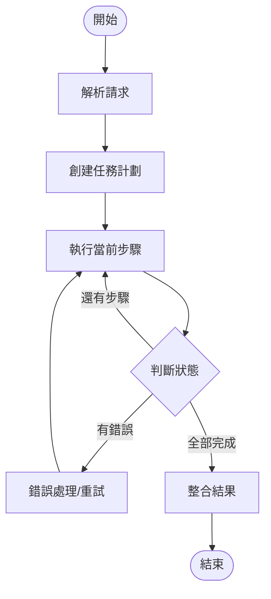
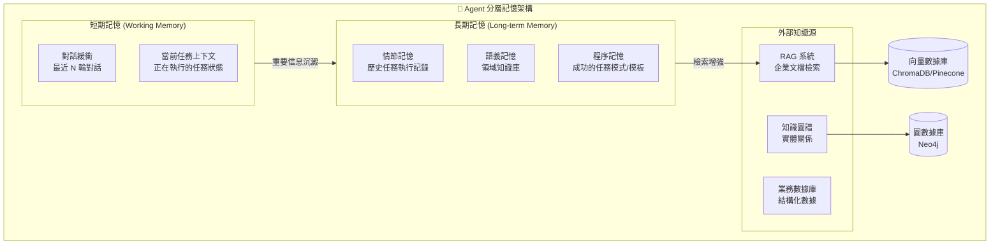

# 第三章：AI Native 的基石 — Agent 的智能與協同

> 「一個 Agent 的智能程度，不取決於它背後的模型有多大，而取決於我們如何設計它的認知架構、協同模式與記憶機制。」

第二章定義了平台的骨架 — 各組件的角色與關係。本章要解決的是「靈魂」問題：如何讓 Agent 真正具備智能，如何讓多個 Agent 有效協同，以及如何確保 Agent 的行為可信、安全、可控。這些問題的答案，構成了 AI Native 的技術基石。

---

## 3.1 Agent 的認知層：賦予智能

### 3.1.1 LLM 選型：五維度權衡

LLM 是 Agent 的「推理引擎」，選型需要在以下五個維度間權衡：

| 維度 | 雲端 API（GPT-5, Claude Opus 4, Gemini 3） | 本地部署（Llama 4, Qwen 3, Mistral Large 3） |
|------|------|------|
| **推理能力** | 最強，GPT-5 與 Claude Opus 4 在複雜推理任務表現優異 | 中等到良好，Llama 4 Scout 與 Qwen 3 235B 已接近雲端水平 |
| **成本** | 按 token 計費，大規模使用成本高 | 硬體投資為主，邊際成本低 |
| **數據隱私** | 數據離開企業環境 | 數據完全在企業內部 |
| **延遲** | 網絡延遲 + API 排隊，通常 1-3 秒 | 本地推理，通常 0.5-2 秒 |
| **可用性** | 依賴外部服務 SLA<sup>[1]</sup> | 自主可控 |

<sup>[1]</sup> **SLA（Service Level Agreement，服務等級協議）** 是服務提供商對可用性、延遲、吞吐量等指標的書面承諾。例如 Anthropic 的 Claude API SLA 承諾月度正常運行時間 ≥ 99.9%，意味著全年停機不超過約 8.76 小時。選擇雲端 API 時，應仔細審閱其 SLA 條款，並評估 SLA 違約時的補償機制（如服務抵免）。當 SLA 不滿足業務連續性要求時，可透過多提供商冗餘（如同時接入 Claude 與 GPT-5）來降低單點故障風險。

**本書的選型建議（2026 年更新）**：

對於企業內部平台，我們建議採用**混合策略**：

- **CCA（中央協調 Agent）**：使用最強的雲端模型（如 GPT-5 或 Claude Opus 4），因為其推理質量直接決定任務分解與調度的正確性，且調用頻率相對較低（每個用戶請求一次）。
- **Specialized Agents**：使用本地部署的開源模型（如 Llama 4 Scout/Maverick 或 Qwen 3 235B），因為其任務相對明確，調用頻率高，且數據隱私要求更強。2026 年開源模型性能已大幅提升，Llama 4 Scout 僅 17B active 參數即可媲美更大模型。
- **開發與測試環境**：使用 Ollama 本地運行較小模型（Qwen 3 8B 或 Phi-4），實現零成本快速迭代。

```python
# LLM 配置示例（混合策略 - 2026 年更新）
LLM_CONFIG = {
    "cca": {
        "provider": "anthropic",
        "model": "claude-opus-4-20250514",
        "max_tokens": 8192,
        "temperature": 0.1,  # 低溫度確保決策穩定性
    },
    "specialized_agents": {
        "provider": "ollama",
        "model": "llama4-scout",
        "base_url": "http://ollama-service:11434",
        "temperature": 0.3,
    },
    "dev_fallback": {
        "provider": "ollama",
        "model": "qwen3:8b",
        "base_url": "http://localhost:11434",
    }
}
```

### 3.1.2 Prompt Engineering for Agents

Prompt Engineering 是 Agent 設計中最被低估但影響最大的環節。對於企業級 Agent，我們需要超越簡單的指令提示，採用結構化的 Prompt 架構。

**CCA 的系統提示（System Prompt）架構**：

```
你是一個企業級 AI Native Agent Platform 的中央協調 Agent（CCA）。

## 你的角色
你負責理解用戶的業務請求，將其分解為可執行的子任務，並調度合適的
Specialized Agent 來完成這些任務。

## 你可用的 Agent
{available_agents_with_capabilities}

## 你的決策流程
1. 首先，理解用戶請求的核心意圖
2. 識別請求中的關鍵實體（人名、部門、時間、資源等）
3. 如果關鍵信息缺失，向用戶提出澄清問題
4. 將任務分解為子任務序列
5. 為每個子任務選擇最合適的 Agent
6. 輸出結構化的任務計劃

## 約束條件
- 你不直接執行任何業務操作
- 你的每個決策都必須輸出推理過程（用於審計）
- 當信心度低於 0.7 時，必須向用戶確認
- 涉及敏感操作（刪除、權限變更）時，必須要求用戶明確確認

## 輸出格式
始終以 JSON 格式輸出你的任務計劃：
{
  "intent": "...",
  "confidence": 0.0-1.0,
  "clarification_needed": ["..."],
  "task_plan": [
    {
      "step": 1,
      "action": "...",
      "agent": "...",
      "inputs": {...},
      "depends_on": []
    }
  ]
}
```

**Chain-of-Thought (CoT) 在任務分解中的應用**：

對於複雜請求，CCA 使用 CoT 進行顯式推理：

```
用戶請求：「市場部下週有 3 個新員工入職，幫他們把 IT 帳號都開好」

CCA 的 CoT 推理過程：
1. 這個請求涉及「批量 IT 帳號創建」
2. 我需要先從 HR 系統獲取下週入職的市場部員工列表
3. 對每個員工，需要：創建 AD 帳號 → 配置權限 → 發送歡迎郵件
4. 由於是 3 個員工，子任務可以並行執行（每個員工的操作相互獨立）
5. 但我需要先確認：是否有標準的入職 IT 配置模板？還是每個員工的權限不同？
6. 決策：先查詢 HR 系統獲取員工列表，再為每個員工並行啟動 IT 帳號創建流程
```

### 3.1.3 Tool Use 與 Function Calling

Tool Use 讓 Agent 能夠調用外部 API 完成實際操作。在企業場景中，Tool 的設計需要特別注意：

```python
from pydantic import BaseModel, Field
from typing import Optional
import httpx

# 使用 Pydantic 定義工具的輸入 Schema
class CreateADAccountInput(BaseModel):
    username: str = Field(description="用戶登錄名，格式為 pinyin")
    display_name: str = Field(description="顯示名稱")
    department: str = Field(description="所屬部門")
    groups: list[str] = Field(default=[], description="要加入的安全組")
    manager_email: Optional[str] = Field(default=None)

class CreateADAccountOutput(BaseModel):
    success: bool
    account_id: Optional[str] = None
    email: Optional[str] = None
    error_message: Optional[str] = None

async def create_ad_account(input: CreateADAccountInput) -> CreateADAccountOutput:
    """在 Active Directory 中創建用戶帳號

    這個工具封裝了對企業 AD 系統的 API 調用。
    包含完整的錯誤處理與重試邏輯。
    """
    try:
        async with httpx.AsyncClient() as client:
            response = await client.post(
                "https://ad-api.company.internal/v1/accounts",
                json=input.model_dump(),
                timeout=30.0,
                headers={"Authorization": f"Bearer {get_ad_api_token()}"}
            )
            response.raise_for_status()
            result = response.json()
            return CreateADAccountOutput(
                success=True,
                account_id=result["account_id"],
                email=result["email"]
            )
    except httpx.HTTPStatusError as e:
        return CreateADAccountOutput(
            success=False,
            error_message=f"AD API 錯誤: {e.response.status_code} - {e.response.text}"
        )
    except Exception as e:
        return CreateADAccountOutput(
            success=False,
            error_message=f"未預期錯誤: {str(e)}"
        )
```

**Tool 設計的企業級原則**：

1. **冪等性**：同一個工具被重複調用（由於重試），結果不應產生副作用
2. **錯誤透明**：工具返回結構化的錯誤信息，讓 Agent 能理解失敗原因並決定下一步
3. **超時控制**：每個工具調用都有明確的超時，防止 Agent 無限等待
4. **權限最小化**：每個工具只擁有完成其任務所需的最小權限

### 3.1.4 Letta Agent 的實際創建

前面章節介紹了 Letta 的概念，這裡展示如何用 Letta SDK 實際創建一個 Specialized Agent：

```python
from letta import Agent, Tool
from letta.schemas.message import Message

# 定義 IT Agent 的工具集
@Tool
def create_ad_account(username: str, department: str, role: str) -> dict:
    """在 Active Directory 中創建新用戶帳號。

    Args:
        username: 用戶登錄名（拼音格式）
        department: 所屬部門
        role: 職位角色
    Returns:
        包含 account_id 和 email 的字典
    """
    # 實際實現會調用 AD API
    return {
        "account_id": f"AD-{username}",
        "email": f"{username}@company.com",
        "status": "created"
    }

@Tool
def query_employee_info(employee_name: str) -> dict:
    """從 HR 系統查詢員工基本信息"""
    # 實際實現會調用 HR API
    return {"name": employee_name, "department": "市場部", "role": "產品經理"}

# 定義 IT Agent 的系統提示
IT_AGENT_SYSTEM_PROMPT = """你是企業 AI 平台的 IT 操作 Agent。

## 你的職責
- 為新員工創建 IT 帳號（Active Directory）
- 配置部門權限與安全組
- 發送歡迎郵件與登錄指南

## 約束
- 你只能操作特定部門的員工（市場部、技術部、產品部）
- 你不能刪除任何帳號
- 每次操作後必須返回結構化結果

## 記憶管理
- 記錄每次創建的帳號信息（用於審計）
- 記憶已知的權限模板（避免重複查詢）
"""

# 創建 IT Agent 實例
it_agent = Agent(
    name="IT Operations Agent",
    system=IT_AGENT_SYSTEM_PROMPT,
    tools=[create_ad_account, query_employee_info],
    # Letta 的分層記憶配置
    memory_limit=50,  # 主記憶保留最近 50 條消息
    archival_memory=True,  # 啟用歸檔記憶（長期記憶）
    # 持久化配置（存儲在 PostgreSQL）
    persistence_config={
        "type": "postgres",
        "host": "postgres-service",
        "port": 5432,
        "database": "letta_agents",
        "table_prefix": "it_agent_"
    }
)

# 使用 Agent 處理請求
async def handle_it_request(request: str) -> dict:
    """CCA 調用 IT Agent 的入口函數"""
    response = await it_agent.step(
        user_message=Message(
            role="user",
            content=request
        ),
        # 限制最大步驟數，防止無限循環
        max_steps=10
    )
    return {
        "agent": "it-agent-v1",
        "response": response.content,
        "tool_calls": response.tool_calls,
        "usage": response.usage
    }
```

**Letta 的關鍵特性在此場景中的價值**：

| 特性 | 實際效果 |
|------|----------|
| **狀態持久化** | IT Agent 重啟後，之前的對話上下文和任務進度不丟失 |
| **分層記憶** | 主記憶保留當前任務上下文，歸檔記憶保存歷史操作記錄 |
| **工具自動註冊** | `@Tool` 裝飾器自動生成工具的 JSON Schema，供 LLM 使用 |
| **步數限制** | `max_steps=10` 防止 Agent 陷入無限循環 |

### 3.1.5 Agent 質量評估與持續改進

企業級 Agent 不僅需要「能跑」，還需要「跑得好」。我們建議建立以下評估體系：

**核心評估指標**：

| 指標類別 | 具體指標 | 計算方式 | 目標值 |
|----------|----------|----------|--------|
| **任務完成率** | 首次成功率（First-pass Success Rate） | 無需人工干預即成功的任務比例 | > 85% |
| | 最終成功率（Eventual Success Rate） | 包含重試後成功的任務比例 | > 95% |
| **效率指標** | 平均端到端延遲 | 從用戶請求到結果返回的時間 | < 30 秒 |
| | 平均 LLM 調用次數 | 每個任務平均需要的 LLM 推理次數 | < 5 次 |
| **質量指標** | 幻覺率 | Agent 輸出中包含虛假信息的比例 | < 5% |
| | 意圖識別準確率 | CCA 正確理解用戶意圖的比例 | > 90% |
| **安全指標** | 越權操作次數 | Agent 執行了超出權限範圍的操作 | 0 |
| | 審計完整性 | 所有操作都有完整審計記錄的比例 | 100% |

**評估框架代碼示例**：

```python
from dataclasses import dataclass
from datetime import datetime

@dataclass
class AgentEvaluation:
    """Agent 執行結果的評估記錄"""
    task_id: str
    agent_id: str
    intent: str
    success: bool
    first_pass: bool  # 是否無需人工干預
    latency_ms: int
    llm_calls: int
    tool_calls: int
    hallucination_detected: bool = False
    permission_violation: bool = False
    audit_complete: bool = True

class AgentEvaluator:
    """Agent 質量評估器"""

    def __init__(self):
        self.evaluations: list[AgentEvaluation] = []

    def record(self, evaluation: AgentEvaluation):
        self.evaluations.append(evaluation)

    def get_metrics(self, agent_id: str, window_hours: int = 24) -> dict:
        """計算指定時間窗口內的評估指標"""
        cutoff = datetime.now().timestamp() - window_hours * 3600
        recent = [e for e in self.evaluations
                  if e.agent_id == agent_id]  # 簡化：省略時間過濾

        if not recent:
            return {"error": "no data"}

        total = len(recent)
        return {
            "total_tasks": total,
            "first_pass_rate": sum(1 for e in recent if e.first_pass) / total,
            "eventual_success_rate": sum(1 for e in recent if e.success) / total,
            "avg_latency_ms": sum(e.latency_ms for e in recent) / total,
            "avg_llm_calls": sum(e.llm_calls for e in recent) / total,
            "hallucination_rate": sum(1 for e in recent if e.hallucination_detected) / total,
            "permission_violations": sum(1 for e in recent if e.permission_violation),
            "audit_completeness": sum(1 for e in recent if e.audit_complete) / total,
        }
```

**幻覺偵測的實踐方法**：

上表中「幻覺率」是最難自動化衡量的指標。以下三種方法可以組合使用：

| 方法 | 原理 | 優點 | 缺點 |
|------|------|------|------|
| **事實比對（Grounding Check）** | 將 Agent 輸出與知識庫（RAG 檢索結果）逐條比對，找出無據可查的陳述 | 自動化程度高，可即時攔截 | 只能偵測「無來源」的幻覺，無法發現「有來源但曲解」的幻覺 |
| **LLM-as-Judge** | 用另一個 LLM（或同一個 LLM 的獨立調用）審查 Agent 輸出的事實正確性 | 能偵測邏輯矛盾和曲解 | 成本翻倍，且 Judge 本身也可能出錯 |
| **人工抽樣審計** | 隨機抽取 5-10% 的 Agent 任務結果，由領域專家標記正確性 | 金標準，可發現自動化方法遺漏的問題 | 成本高、延遲大，無法即時攔截 |

實際建議：**以「事實比對」為第一道防線（即時攔截），「LLM-as-Judge」為第二道防線（批次審查），「人工抽樣」為校準手段（每月調整前兩道防線的閾值）**。

**自動化審計流程**：

在企業環境中，公平性和偏見審計不應依賴人工抽查，而應建構自動化的反事實測試（Counterfactual Testing）管線：

```python
import json
from datetime import datetime

@dataclass
class AuditScenario:
    """反事實測試場景 — 同一請求，僅替換人員標識"""
    task_type: str                # 測試的任務類型（如 "create_account"）
    original: dict                # 原始請求參數
    counterfactual: dict          # 替換後的請求參數（僅改姓名/部門等非功能欄位）
    expected_outcome: str         # 預期結果應完全一致

class AutomatedAuditor:
    """自動化公平性審計器"""

    def __init__(self, agent_executor):
        self.executor = agent_executor
        self.audit_log: list[dict] = []

    async def run_counterfactual_test(self, scenario: AuditScenario) -> dict:
        """執行一組反事實測試"""
        # 執行原始場景
        result_a = await self.executor(scenario.original)
        # 執行反事實場景（僅改變人員標識）
        result_b = await self.executor(scenario.counterfactual)

        # 比較兩者是否一致
        is_consistent = self._compare_results(result_a, result_b)

        record = {
            "timestamp": datetime.now().isoformat(),
            "task_type": scenario.task_type,
            "consistent": is_consistent,
            "original_result": result_a,
            "counterfactual_result": result_b,
        }
        self.audit_log.append(record)
        return record

    def _compare_results(self, a: dict, b: dict) -> bool:
        """比較兩個結果是否語義一致（忽略人員標識）"""
        # 比較結構和核心字段，忽略姓名等標識欄位
        keys_to_compare = [k for k in a.keys() if k not in ("name", "employee_id")]
        return all(a.get(k) == b.get(k) for k in keys_to_compare)

    def generate_audit_report(self) -> dict:
        """生成審計報告"""
        total = len(self.audit_log)
        inconsistencies = [r for r in self.audit_log if not r["consistent"]]
        return {
            "total_scenarios": total,
            "inconsistencies": len(inconsistencies),
            "fairness_score": 1 - len(inconsistencies) / total if total > 0 else 1.0,
            "details": inconsistencies,
        }
```

**持續改進閉環**：

評估體系建立後，關鍵在於形成「衡量 → 分析 → 改進 → 驗證」的閉環：

| 階段 | 動作 | 頻率 |
|------|------|------|
| **衡量** | 收集指標數據，寫入時序數據庫（Prometheus） | 即時（每個任務） |
| **分析** | 每週回顧指標趨勢，識別劣化信號（如幻覺率上升、延遲增長） | 每週 |
| **改進** | 根據分析結果調整 Prompt、RAG 召回策略、權限規則或工作流 | 按需 |
| **驗證** | 改進後用 A/B 測試或金標準數據集驗證效果 | 每次改進後 |

一個常見的改進入口是**失敗案例分析**：從「最終成功但首次失敗」的任務中提取模式 — 是 Prompt 不夠明確？是 RAG 沒有召回相關知識？還是 Agent 之間的通信出了問題？這些模式化的失敗原因直接指向具體的改進方向。

---

## 3.2 Agent 協同模式與工作流編排

### 3.2.1 協同模式對比

多 Agent 系統的協同模式有多種，各有適用場景：

| 模式 | 說明 | 優點 | 缺點 | 適用場景 |
|------|------|------|------|----------|
| **Plan-and-Execute** | CCA 規劃完整計劃，Agent 依次執行 | 可控性強，易於審計 | 計劃可能不適應執行中的變化 | 流程明確的標準任務 |
| **ReAct** | Agent 邊推理邊行動，動態調整 | 靈活性高，能處理意外情況 | 可控性較低，可能偏離目標 | 探索性、非標準化任務 |
| **Hierarchical** | 多層 Agent 逐層分解任務 | 適合超複雜任務 | 延遲高，通信開銷大 | 跨多個領域的大型項目 |
| **Debate/Consensus** | 多個 Agent 討論直至達成共識 | 決策質量高 | 成本高，速度慢 | 高風險決策（如審批） |

本平台主要採用 **Plan-and-Execute** 作為核心模式，輔以 **ReAct** 處理執行中的異常情況。

### 3.2.2 LangGraph 工作流編排

LangGraph 是 LangChain 生態中專門用於 Agent 工作流編排的框架，其核心概念是**狀態機（State Machine）**：

```python
from langgraph.graph import StateGraph, END
from typing import TypedDict, Annotated
import operator

# 定義工作流狀態
class OnboardingState(TypedDict):
    """新員工入職工作流的狀態"""
    request: str                          # 原始請求
    employee_info: dict                   # 員工信息
    task_plan: list[dict]                 # 任務計劃
    current_step: int                     # 當前執行步驟
    results: Annotated[list, operator.add] # 累積結果（使用 add 合併）
    errors: list[str]                     # 錯誤列表
    status: str                           # 整體狀態

# 定義節點（Node）：每個節點是一個處理步驟
async def parse_request(state: OnboardingState) -> OnboardingState:
    """解析用戶請求，提取員工信息"""
    # 調用 LLM 解析請求
    employee_info = await llm_extract_employee_info(state["request"])
    return {**state, "employee_info": employee_info, "current_step": 0}

async def create_task_plan(state: OnboardingState) -> OnboardingState:
    """基於員工信息，創建任務計劃"""
    plan = await llm_create_plan(state["employee_info"])
    return {**state, "task_plan": plan, "current_step": 0}

async def execute_step(state: OnboardingState) -> OnboardingState:
    """執行當前步驟"""
    step = state["task_plan"][state["current_step"]]
    result = await dispatch_to_agent(step)
    return {
        **state,
        "results": [result],
        "current_step": state["current_step"] + 1
    }

async def handle_error(state: OnboardingState) -> OnboardingState:
    """處理錯誤：重試或降級"""
    # 實現重試邏輯
    pass

# 定義條件邊（Edge）：決定下一步走向
def should_continue(state: OnboardingState) -> str:
    """判斷是否繼續執行"""
    if state["errors"]:
        return "error_handler"
    if state["current_step"] >= len(state["task_plan"]):
        return "finalize"
    return "execute"

async def finalize(state: OnboardingState) -> OnboardingState:
    """整合結果，生成最終響應"""
    summary = await llm_summarize_results(state["results"])
    return {**state, "status": "completed"}

# 構建工作流圖
workflow = StateGraph(OnboardingState)
workflow.add_node("parse", parse_request)
workflow.add_node("plan", create_task_plan)
workflow.add_node("execute", execute_step)
workflow.add_node("error_handler", handle_error)
workflow.add_node("finalize", finalize)

workflow.set_entry_point("parse")
workflow.add_edge("parse", "plan")
workflow.add_edge("plan", "execute")
workflow.add_conditional_edges("execute", should_continue, {
    "execute": "execute",      # 繼續執行下一步
    "error_handler": "error_handler",
    "finalize": "finalize"
})
workflow.add_edge("error_handler", "execute")  # 錯誤處理後重試
workflow.add_edge("finalize", END)

# 編譯為可執行的工作流
app = workflow.compile()
```



上圖展示了 LangGraph 的 Plan-and-Execute（規劃-執行）工作流模式。這是 AI Agent 處理複雜多步驟任務的核心範式——先生成計劃，再逐步執行，遇到錯誤時動態調整。

**五個節點的逐一拆解**

| 節點 | 類型 | 發生了什麼 | 設計要點 |
|------|------|-----------|---------|
| **解析請求** | 處理 | 接收用戶的自然語言輸入，提取關鍵意圖（誰、做什麼、約束條件） | 這是進入工作流的第一道關卡，確保後續步驟建立在正確的理解之上 |
| **創建任務計劃** | 規劃 | LLM 將用戶意圖分解為有序的執行步驟，每個步驟指定要調用的 Agent 和預期輸出 | 計劃是**可中斷的**——用戶可以在執行前審查和修改計劃，這是 Human-in-the-Loop 的關鍵觸點 |
| **執行當前步驟** | 執行 | 按照計劃順序調用對應的 Agent（HR Agent、IT Agent 等），每個步驟的輸出作為下一步的輸入 | 執行過程支持**並行**——無依賴關係的步驟可以同時執行，提升整體效率 |
| **判斷狀態** | 路由 | 檢查當前步驟的執行結果：成功 → 繼續下一步；失敗 → 進入錯誤處理；全部完成 → 整合結果 | 這是工作流的「十字路口」——三種分支路徑決定了接下來的走向 |
| **錯誤處理/重試** | 恢復 | 分析失敗原因，決定重試策略（更換參數、降級執行、人工介入），然後重新回到執行節點 | 錯誤處理不是簡單的 `try/catch`——它可能觸發整個計劃的動態調整 |

**工作流的兩條關鍵路徑**

| 路徑 | 觸發條件 | 行為 | 典型場景 |
|------|---------|------|---------|
| **正常路徑** | `Check → 還有步驟 → Execute` | 循環執行，直到所有步驟完成 | 創建帳號 → 配置權限 → 發送通知，三步順利完成 |
| **錯誤恢復路徑** | `Check → 有錯誤 → ErrorHandler → Execute` | 分析失敗原因，調整後重試 | 創建帳號時發現用戶名已存在，生成替代用戶名後重試 |

**與下方 ReAct 模式的關係**

Plan-and-Execute 是**計劃驅動**的——先有計劃再執行。而 ReAct（見 §3.2.3）是**反應驅動**的——每一步都根據當前觀察動態決策。在本平台中，兩者不是互斥的，而是**分層協作**的：

- **第一層（Plan-and-Execute）**：CCA 生成整體計劃，決定「做什麼」和「按什麼順序做」
- **第二層（ReAct）**：每個 Agent 在執行具體步驟時，遇到意外情況切換到 ReAct 模式動態應對

這種分層設計使得系統既具備全局規劃能力，又保留了局部靈活性。

### 3.2.3 ReAct 模式的異常處理

當 Plan-and-Execute 的預定計劃遇到意外情況時，Agent 切換到 ReAct 模式動態應對：

```
計劃：為張小明創建 IT 帳號 → 配置權限 → 發送郵件

執行中：
[Thought] AD 帳號創建失敗，錯誤信息是「用戶名 zhangxm 已存在」
[Observation] 系統中已有一個同名用戶
[Thought] 我需要生成一個替代用戶名，比如 zhangxm2 或 zhangxiaoming
[Action] 調用工具 check_username_availability("zhangxiaoming")
[Observation] 用戶名 zhangxiaoming 可用
[Thought] 使用 zhangxiaoming 作為替代用戶名繼續執行
[Action] 調用工具 create_ad_account(username="zhangxiaoming", ...)
```

---

## 3.3 Agent 的記憶與知識獲取

### 3.3.1 記憶架構

Agent 的記憶分為多個層次，形成分層記憶架構：



上圖展示了 AI Agent 的分層記憶架構，這是 Agent 能夠「記住過去、理解現在、預測未來」的基礎。記憶系統分為三個層次：短期記憶處理當前任務，長期記憶沉澱經驗，外部知識源提供海量上下文。

**三層記憶系統的逐一拆解**

| 層次 | 存儲類型 | 包含組件 | 生命周期 | 核心價值 |
|------|---------|---------|---------|---------|
| **短期記憶（Working Memory）** | Agent 內存 | 對話緩衝（最近 N 輪對話）、當前任務上下文（正在執行的任務狀態） | 單次會話（分鐘~小時） | 保持對話連貫性，讓 Agent 知道「我們剛才在說什麼」以及「現在正在做什麼」 |
| **長期記憶（Long-term Memory）** | PostgreSQL | 情節記憶（歷史任務執行記錄）、語義記憶（領域知識庫）、程序記憶（成功的任務模式/模板） | 永久（定期清理） | 沉澱經驗，讓 Agent 能從過去的成功/失敗中學習 |
| **外部知識源** | 各類數據庫 | RAG 系統（企業文檔檢索）、知識圖譜（實體關係）、業務數據庫（結構化數據） | 持久化 | 提供海量上下文，突破 LLM 的上下文窗口限制 |

**記憶之間的流動關係**

圖中箭頭揭示了記憶的單向流動規律：

- **短期 → 長期（「重要信息沉澱」）**：當 Agent 在對話中獲得了關鍵信息（如用戶偏好、任務經驗），這些信息會被「沉澱」到長期記憶中，確保未來的對話也能訪問到
- **長期 → 外部知識源（「檢索增強」）**：長期記憶存儲的知識量有限，RAG 系統作為擴展，提供對海量企業文檔的語義檢索能力

**程序記憶的特殊價值**

長期記憶中的「程序記憶」（Procedural Memory）是最容易被忽視但最有價值的部分。它存儲的不是「事實」，而是「做事的方法」：

| 記憶類型 | 存儲內容 | 使用場景 | 舉例 |
|---------|---------|---------|------|
| 情節記憶 | 「上週為張小明創建過 IT 帳號」 | 審計、回溯 | 查詢歷史操作記錄 |
| 語義記憶 | 「IT 帳號必須包含部門代碼」 | 知識問答 | 回答「公司 IT 帳號命名規範是什麼」 |
| **程序記憶** | 「創建 IT 帳號的標準流程是：查 HR → 建帳號 → 配權限 → 發通知」 | **任務執行** | 當接到新的帳號創建請求時，直接復用這個已驗證的流程模板 |

程序記憶使得 Agent 不需要每次都「從零開始」規劃任務——它可以從歷史成功的執行模式中提取模板，大幅提升任務執行的效率和準確性。

每種記憶類型解決不同的問題，選擇取決於「信息的存留時間」和「使用方式」：

| 記憶類型 | 存留時間 | 存儲位置 | 典型用途 | 本平台的實現 |
|----------|----------|----------|----------|-------------|
| **短期記憶（對話緩衝）** | 單次對話（分鐘~小時） | Agent 內存 | 保持當前對話的上下文連貫性 | Letta 的 `memory_limit` 設定（保留最近 N 輪） |
| **短期記憶（任務上下文）** | 單次任務（分鐘~天） | Agent 內存 | 跟蹤多步驟任務的執行進度 | LangGraph 的 State 對象 |
| **情節記憶** | 永久（定期清理） | PostgreSQL | 記錄歷史任務的完整過程，用於審計和模式學習 | Letta 的 archival memory |
| **語義記憶** | 永久（按需更新） | 向量數據庫 | 檢索領域知識（政策、SOP、FAQ） | RAG 系統（ChromaDB） |
| **程序記憶** | 永久（版本化） | 文件系統 + DB | 積累成功的任務模板，提高未來執行效率 | Letta 的 archival memory + Prompt 動態注入 |

一個實用的判斷標準：**如果信息需要跨對話保留，就放入長期記憶；如果信息需要被精確檢索，就放入語義記憶（向量數據庫）；如果信息是「做事的經驗」，就放入程序記憶**。

### 3.3.2 RAG：檢索增強生成

**什麼是 RAG？**

RAG（Retrieval-Augmented Generation，檢索增強生成）是一種結合「檢索」和「生成」的技術架構。簡單來說：LLM 本身只知道自己訓練數據中的知識，對企業內部的政策、SOP、最新資料一無所知。RAG 讓 LLM 在回答問題之前，先從企業文檔中檢索相關內容，再將檢索結果作為上下文注入 Prompt，讓 LLM 基於這些「有據可查」的資料來生成回答。

**RAG 與 LLM 的關係**：

```
傳統 LLM 調用：
  用戶提問 → LLM（僅依賴自身訓練知識）→ 回答（可能過時或不準確）

RAG 增強後：
  用戶提問 → 向量檢索（從企業文檔中找相關片段）→ LLM（基於檢索結果生成）→ 回答（有據可查、可溯源）
```

核心思想：**不要讓 LLM 憑空回答，而是先給它「參考資料」**。這解決了三個企業級痛點：（1）LLM 不知道企業內部信息；（2）LLM 可能產生幻覺（編造事實）；（3）回答無法追溯到具體來源。

**如何構建一個 Agent 專用的 RAG 系統**：

構建過程分為兩個階段 — 離線的「索引建立」和在線的「檢索生成」：

| 階段 | 步驟 | 說明 |
|------|------|------|
| **離線：索引建立** | 1. 文檔收集 | 收集 HR 政策、IT SOP、FAQ 等文檔（PDF、Markdown、Word） |
| | 2. 文檔切分 | 將長文檔切分為 500-1000 字的片段（chunk），確保每個片段語義完整 |
| | 3. 向量化 | 用 Embedding 模型（如 `text-embedding-3-small`）將文本片段轉為向量 |
| | 4. 存入向量數據庫 | 將向量與原始文本一起存入 ChromaDB，建立索引 |
| **在線：檢索生成** | 1. 查詢向量化 | 將用戶問題轉為向量 |
| | 2. 相似度檢索 | 在向量數據庫中找出最相關的 Top-K 個文檔片段 |
| | 3. 上下文注入 | 將檢索到的片段拼入 Prompt 的上下文區塊 |
| | 4. LLM 生成 | LLM 基於檢索結果生成回答，每個關鍵陳述可追溯到具體文檔 |

以下是一個面向 Agent 的 RAG 實現：

```python
from llama_index.core import VectorStoreIndex, SimpleDirectoryReader
from llama_index.core.retrievers import VectorIndexRetriever
from llama_index.core.query_engine import RetrieverQueryEngine

class AgentKnowledgeBase:
    """Agent 的知識庫，基於 RAG 實現"""

    def __init__(self, docs_path: str, collection_name: str):
        # 載入企業文檔（SOP、政策手冊、FAQ 等）
        documents = SimpleDirectoryReader(docs_path).load_data()

        # 建立向量索引
        self.index = VectorStoreIndex.from_documents(documents)

        # 創建檢索器
        self.retriever = VectorIndexRetriever(
            index=self.index,
            similarity_top_k=5,  # 檢索最相關的 5 個文檔片段
        )

        # 創建查詢引擎
        self.query_engine = RetrieverQueryEngine(retriever=self.retriever)

    async def query(self, question: str, context: dict = None) -> str:
        """查詢知識庫，返回相關信息"""
        # 將上下文信息融入查詢
        if context:
            enriched_query = f"上下文：{context}\n問題：{question}"
        else:
            enriched_query = question

        response = self.query_engine.query(enriched_query)
        return str(response)

# 使用示例
hr_kb = AgentKnowledgeBase(
    docs_path="./knowledge/hr_policies/",
    collection_name="hr_knowledge"
)

# IT Agent 在創建帳號前，查詢權限配置規範
result = await hr_kb.query(
    "市場部產品經理需要哪些系統權限？",
    context={"department": "市場部", "role": "產品經理"}
)
```

### 3.3.3 記憶的企業級考量

| 考量 | 說明 | 實現策略 |
|------|------|----------|
| **數據隔離** | 不同部門的知識不應互相洩漏 | 向量數據庫按部門分區 |
| **時效性** | 政策變更後，舊知識應被更新 | 文檔版本管理 + 定期重建索引 |
| **權限控制** | Agent 只能檢索其權限範圍內的知識 | 檢索時加入權限過濾 |
| **審計** | 記錄 Agent 檢索了哪些知識 | RAG 查詢日誌 |

---

## 3.4 Agent 的可信度、安全與倫理考量

這一節直接對應 CMU AIEBoK 的「AI System Trustworthiness」領域，是企業級 AI 平台不可迴避的話題。

### 3.4.1 魯棒性：處理 LLM 的幻覺與不確定性

LLM 的「幻覺」（Hallucination）是企業級應用的最大風險之一。我們採用多層防禦策略：

**第一層：輸出驗證**
```python
async def validate_task_plan(plan: dict) -> tuple[bool, str]:
    """驗證 CCA 生成的任務計劃是否合法"""
    # 檢查引用的 Agent 是否存在
    for step in plan.get("task_plan", []):
        agent_id = step.get("agent")
        if not await agent_registry.exists(agent_id):
            return False, f"計劃引用了不存在的 Agent: {agent_id}"

    # 檢查輸入參數是否符合 Agent 的 Schema
    for step in plan.get("task_plan", []):
        agent = await agent_registry.get(step["agent"])
        if not agent.validate_input(step["action"], step["inputs"]):
            return False, f"步驟 {step['step']} 的輸入不符合 Agent Schema"

    # 檢查依賴關係是否有循環
    if has_circular_dependency(plan["task_plan"]):
        return False, "任務計劃存在循環依賴"

    return True, "驗證通過"
```

**第二層：信心度門檻**
CCA 的每個決策都附帶信心度評分，低於門檻時觸發人工確認：
```python
CONFIDENCE_THRESHOLD = 0.75

if plan["confidence"] < CONFIDENCE_THRESHOLD:
    return {
        "action": "request_human_confirmation",
        "reason": f"信心度 {plan['confidence']:.2f} 低於門檻 {CONFIDENCE_THRESHOLD}",
        "plan": plan,
        "suggestion": "請確認以下任務計劃是否正確"
    }
```

**第三層：沙箱執行**
高風險操作先在模擬環境中驗證：
```python
HIGH_RISK_ACTIONS = ["delete_account", "modify_permissions", "bulk_update"]

if action in HIGH_RISK_ACTIONS:
    # 先在沙箱中執行
    sandbox_result = await sandbox_execute(action, inputs)
    if not sandbox_result.success:
        return {"action": "abort", "reason": sandbox_result.error}
```

### 3.4.2 安全邊界：Agent 權限控制

Agent 的權限控制借鑑 RBAC（Role-Based Access Control）模型，但針對 Agent 特性進行了擴展：

```yaml
# agent_permissions.yaml
agent_id: it-agent-v1
role: it_operations
permissions:
  - resource: active_directory
    actions: [create_account, reset_password, query_user]
    constraints:
      - "department in ['市場部', '技術部', '產品部']"  # 只能操作特定部門
      - "not action in ['delete_account']"             # 不能刪除帳號

  - resource: email_system
    actions: [send_email]
    constraints:
      - "template in ['welcome', 'password_reset']"    # 只能使用預定模板

  - resource: hr_database
    actions: [query_employee]
    constraints:
      - "fields in ['name', 'department', 'role', 'email']"  # 只能查詢特定字段
```

### 3.4.3 透明度與可解釋性

每個 Agent 的決策都必須可追溯。審計日誌的結構：

```json
{
  "audit_id": "aud-20260721-001",
  "timestamp": "2026-07-21T10:30:00Z",
  "request_id": "req-abc-123",
  "user": {"id": "hr-manager-01", "role": "hr_manager"},
  "agent": {"id": "cca-v2", "type": "central_coordinator"},
  "decision": {
    "type": "task_dispatch",
    "reasoning": "用戶請求創建IT帳號，識別為it_operations類任務，需要HR信息，因此先調度HR Agent獲取員工數據",
    "confidence": 0.92,
    "alternatives_considered": ["直接調度IT Agent", "先用戶確認部門信息"]
  },
  "action": {
    "type": "mcp_send",
    "target_agent": "hr-agent-v1",
    "payload_summary": "查詢張小明的部門和職位信息"
  },
  "outcome": {
    "status": "success",
    "latency_ms": 1250,
    "result_summary": "返回員工信息：張小明，市場部，產品經理"
  }
}
```

### 3.4.4 公平性與偏見

在企業場景中，Agent 的公平性主要體現在：

- **服務一致性**：不同部門、不同職級的員工發起類似請求時，Agent 應給予一致質量的服務
- **語言公平**：對中英文混合輸入的處理能力一致
- **避免刻板印象**：在涉及人員相關決策時，不應基於性別、年齡等因素產生偏見

實踐建議：定期對 Agent 的決策進行公平性審計，使用**反事實測試（Counterfactual Testing）**驗證：保持請求內容不變，僅替換員工的姓名、部門等標識信息，觀察 Agent 的決策和輸出是否保持一致。例如，將「為張小明創建帳號」和「為 John Smith 創建帳號」輸入同一個 Agent，比較兩者的處理流程和結果是否相同。

---

## 本章小結

本章深入了 Agent 的「智能」核心：

- **認知層**：LLM 混合策略（CCA 用雲端強模型，Specialized Agents 用本地開源模型）、結構化 Prompt 架構、企業級 Tool Use 設計
- **協同模式**：Plan-and-Execute 為主、ReAct 為輔的混合協同模式，通過 LangGraph 實現狀態機驅動的工作流編排
- **記憶機制**：分層記憶架構（短期 + 長期 + 外部知識源），RAG 作為主要的知識獲取機制
- **可信度**：多層防禦應對幻覺、RBAC 擴展的 Agent 權限控制、完整的審計追溯、公平性考量

這些機制共同構成了 AI Native 的技術基石 — 讓 Agent 不僅「能做」，而且「做得對、做得穩、做得可信」。

在下一章中，我們將轉向基礎設施層面，探討支撐這個智能平台的雲原生技術棧 — Kubernetes、Istio、OpenTelemetry 的選型理由與實踐指南。

---

## 延伸閱讀

### LLM Agent 設計
1. **《Building LLM Apps for Production》** — Chip Huyen. 涵蓋 Prompt Engineering、RAG、Agent 設計的生產級指南。
2. **ReAct: Synergizing Reasoning and Acting in Language Models** — Yao et al., 2022. ReAct 模式的原始論文。
3. **Tree of Thoughts: Deliberate Problem Solving with Large Language Models** — Yao et al., 2023. ToT 推理模式。

### RAG 與知識管理
4. **《Retrieval-Augmented Generation for Knowledge-Intensive NLP Tasks》** — Lewis et al., 2020. RAG 的原始論文。
5. **LlamaIndex Documentation** — https://docs.llamaindex.ai/ — RAG 實現的權威文檔。

### AI 安全與可信
6. **《Concrete Problems in AI Safety》** — Amodei et al., 2016. AI 安全問題的經典論文。
7. **NIST AI Risk Management Framework** — https://www.nist.gov/itl/ai-risk-management-framework — AI 風險管理的官方框架。
8. **LangGraph Documentation** — https://langchain-ai.github.io/langgraph/ — LangGraph 工作流編排的官方文檔。
