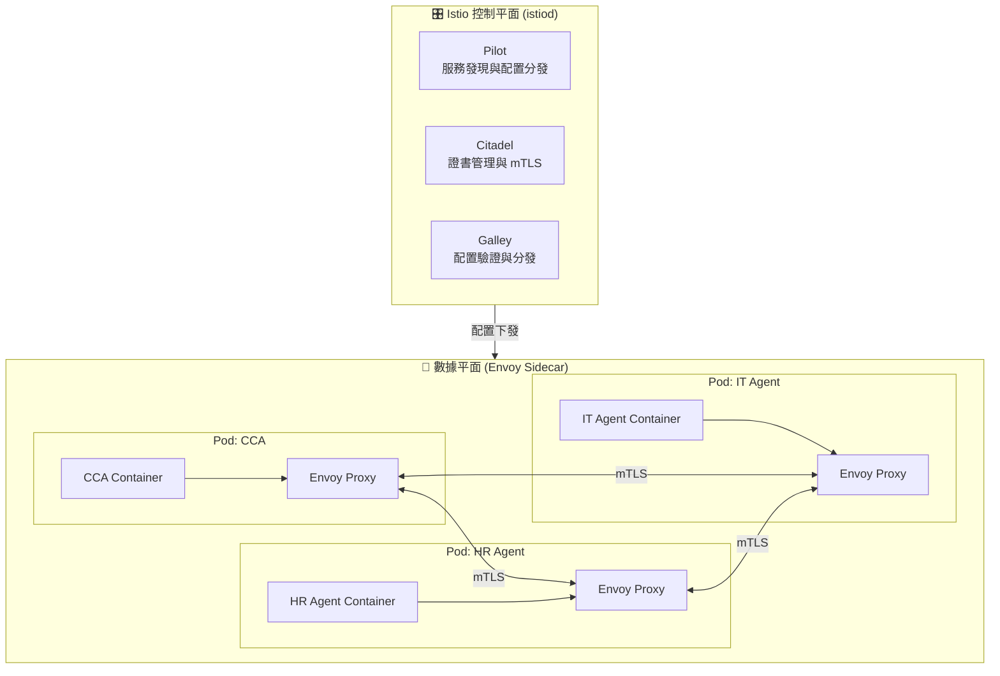
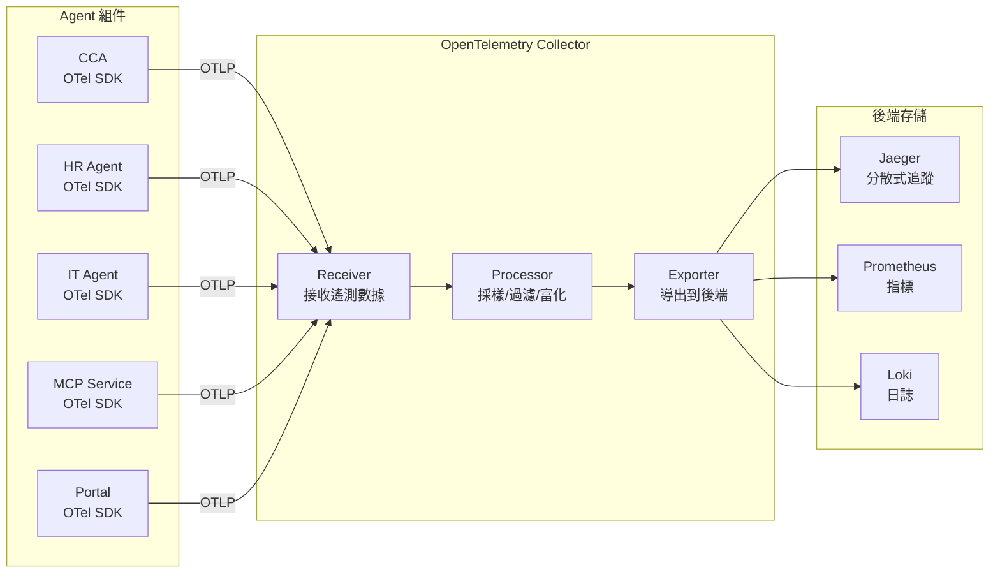
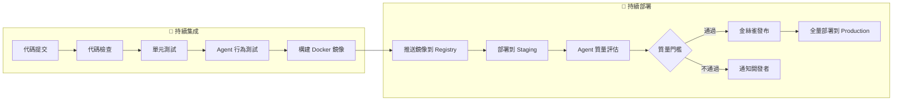

# 第四章：雲原生技術棧的選擇與理由

> 「選擇 Kubernetes 不是因為它簡單，而是因為它把『正確的事情』變成了『默認的事情』。我們選擇成熟的複雜性，而非簡陋的簡單性。」

本章將詳細闡述支撐 AI Native Agent Platform 的雲原生技術棧。這些技術共同構成了平台的「地基」：Kubernetes 提供容器編排與資源管理，Istio 提供服務間通信的安全與流量控制，OpenTelemetry 提供統一的可觀察性標準。我們選擇這些技術不是因為它們最簡單，而是因為它們最成熟、最可靠，且都是 CNCF（Cloud Native Computing Foundation）生態的核心項目。

---

## 4.1 容器化與 Kubernetes：平台部署的標準

### 4.1.1 Docker 容器化：Agent 的標準化交付

每個 Agent（CCA 和 Specialized Agents）都被打包為獨立的 Docker 容器。容器化帶來的核心價值：

- **環境一致性**：開發、測試、生產環境完全一致
- **依賴隔離**：每個 Agent 的依賴（Python 版本、庫版本）互不影響
- **快速部署**：從代碼到運行的時間最小化
- **資源限制**：每個 Agent 的 CPU/內存使用可精確控制

**Agent 的 Dockerfile 最佳實踐**：

```dockerfile
# cca-agent/Dockerfile
# 使用多階段構建，減小最終鏡像體積
FROM python:3.11-slim as builder

WORKDIR /app

# 安裝依賴
COPY requirements.txt .
RUN pip install --no-cache-dir --user -r requirements.txt

# 最終運行鏡像
FROM python:3.11-slim

WORKDIR /app

# 從 builder 階段複製已安裝的依賴
COPY --from=builder /root/.local /root/.local
ENV PATH=/root/.local/bin:$PATH

# 複製應用代碼
COPY src/ ./src/

# 安全：不使用 root 運行
RUN useradd -m -u 1000 agent && chown -R agent:agent /app
USER agent

# 健康檢查
HEALTHCHECK --interval=30s --timeout=10s --retries=3 \
  CMD python -c "import httpx; httpx.get('http://localhost:8080/health')"

# 暴露端口
EXPOSE 8080

# 啟動命令
CMD ["python", "-m", "src.main"]
```

### 4.1.2 Kubernetes 核心概念

Kubernetes（K8s）是一個容器編排平台，管理容器化應用的部署、擴展與運維。對於 Agent Platform，以下核心概念至關重要：

| 概念 | 說明 | 在 Agent Platform 中的應用 |
|------|------|---------------------------|
| **Pod** | 最小部署單元，包含一個或多個容器 | 每個 Agent 實例運行在一個 Pod 中 |
| **Deployment** | 管理 Pod 的副本數與更新策略 | 確保 Agent 始終有 N 個副本運行 |
| **Service** | 為 Pod 提供穩定的網絡端點 | Agent 之間通過 Service 名互相訪問 |
| **ConfigMap** | 非機密配置數據 | Agent 的 LLM 配置、MCP 服務地址 |
| **Secret** | 機密數據（加密存儲） | API 密鑰、數據庫密碼 |
| **Namespace** | 邏輯隔離的虛擬集群 | 按環境隔離（dev/staging/prod） |
| **HPA** | Horizontal Pod Autoscaler | 根據負載自動擴展 Agent 副本數 |
| **StatefulSet** | 有狀態應用的管理 | MCP Service 的持久化存儲 |

### 4.1.3 Kubernetes 在 Agent Platform 中的關鍵應用

**（1）Agent 部署與副本管理**

```yaml
# k8s/cca-agent.yaml
apiVersion: apps/v1
kind: Deployment
metadata:
  name: cca-agent
  namespace: ai-platform
  labels:
    app: cca-agent
    component: platform-core
spec:
  replicas: 3  # 生產環境運行 3 個副本
  selector:
    matchLabels:
      app: cca-agent
  template:
    metadata:
      labels:
        app: cca-agent
      annotations:
        sidecar.istio.io/inject: "true"  # 自動注入 Istio Sidecar
    spec:
      containers:
      - name: cca-agent
        image: registry.company.com/ai-platform/cca-agent:v0.1.0
        ports:
        - containerPort: 8080
        env:
        - name: LLM_PROVIDER
          valueFrom:
            configMapKeyRef:
              name: platform-config
              key: llm_provider
        - name: ANTHROPIC_API_KEY
          valueFrom:
            secretKeyRef:
              name: llm-secrets
              key: anthropic-api-key
        - name: MCP_SERVICE_URL
          value: "mcp-service:50051"
        resources:
          requests:
            memory: "512Mi"
            cpu: "250m"
          limits:
            memory: "2Gi"
            cpu: "1000m"
        livenessProbe:
          httpGet:
            path: /health
            port: 8080
          initialDelaySeconds: 15
          periodSeconds: 20
        readinessProbe:
          httpGet:
            path: /ready
            port: 8080
          initialDelaySeconds: 5
          periodSeconds: 10
---
apiVersion: v1
kind: Service
metadata:
  name: cca-agent
  namespace: ai-platform
spec:
  selector:
    app: cca-agent
  ports:
  - port: 80
    targetPort: 8080
```

**（2）自動擴展（HPA）**

```yaml
# k8s/cca-hpa.yaml
apiVersion: autoscaling/v2
kind: HorizontalPodAutoscaler
metadata:
  name: cca-agent-hpa
  namespace: ai-platform
spec:
  scaleTargetRef:
    apiVersion: apps/v1
    kind: Deployment
    name: cca-agent
  minReplicas: 2
  maxReplicas: 10
  metrics:
  - type: Resource
    resource:
      name: cpu
      target:
        type: Utilization
        averageUtilization: 70
  - type: Resource
    resource:
      name: memory
      target:
        type: Utilization
        averageUtilization: 80
```

**（3）為什麼選擇 Kubernetes 而非更簡單的方案**

| 方案 | 優點 | 缺點 | 適用場景 |
|------|------|------|----------|
| **Docker Compose** | 極其簡單，本地開發友好 | 無自動擴展、無服務發現、無滾動更新 | 本地開發與測試 |
| **Kubernetes** | 功能最全面，生態最成熟 | 學習曲線陡峭，運維複雜 | 生產環境、企業級部署 |
| **Nomad** | 比 K8s 簡單，支持多種工作負載 | 生態較小，社區規模不及 K8s | 中小規模部署 |
| **Serverless (Knative)** | 按需擴展到零，成本最優 | 冷啟動延遲，不適合長時間運行的 Agent | 事件驅動的輕量任務 |

**我們的選擇邏輯**：Kubernetes 的學習曲線確實陡峭，但它提供了 Agent Platform 所需的所有核心能力 — 自動擴展、服務發現、滾動更新、健康檢查。對於企業級平台，這些能力不是「可有可無」，而是「必須具備」。我們將在第八章詳細講解 K8s 的實踐，並推薦學習資源幫助讀者克服學習曲線。

### 4.1.4 推薦學習資源

對於 Kubernetes 初學者，推薦以下學習路徑：

1. **入門**：《Kubernetes Up & Running》(3rd Edition) — Kelsey Hightower et al., O'Reilly Media. 由 Kubernetes 創始人之一撰寫，最佳入門書。
2. **深入**：《Kubernetes in Action》(2nd Edition) — Marko Lukša, Manning. 深入理解 K8s 內部機制。
3. **實踐**：Kubernetes 官方文檔的 Interactive Tutorials — https://kubernetes.io/docs/tutorials/
4. **本地開發**：使用 Minikube 或 Kind 搭建本地集群進行實踐。

---

## 4.2 服務網格 Istio：賦能微服務的強大工具

### 4.2.1 為什麼需要服務網格

當平台中的 Agent 數量增長到 10 個以上時，以下問題變得突出：

- Agent 之間的通信如何加密？（每個 Agent 自己實現 TLS 嗎？）
- 如何實現金絲雀發布（先讓 5% 的流量到新版本 Agent）？
- 如何實現熔斷（當某個 Agent 響應變慢時，防止連鎖故障）？
- 如何統一收集所有 Agent 間通信的遙測數據？

這些問題的共同特點是：它們是**所有服務都需要的橫切關注點**，但與業務邏輯無關。服務網格（Service Mesh）將這些關注點從應用代碼中剝離，下沉到基礎設施層。

### 4.2.2 Istio 架構



**核心機制**：每個 Pod 中除了運行 Agent 的容器外，還運行一個 **Envoy Proxy** 容器（Sidecar）。所有進出 Pod 的網絡流量都經過 Envoy，由 Envoy 實現加密、路由、負載均衡、遙測收集。Agent 的應用代碼完全不需要處理這些問題。

### 4.2.3 Istio 的核心功能在 Agent Platform 中的應用

**（1）mTLS（雙向 TLS）加密**

默認情況下，Istio 可以為所有服務間通信自動啟用 mTLS：

```yaml
# istio/peer-authentication.yaml
apiVersion: security.istio.io/v1beta1
kind: PeerAuthentication
metadata:
  name: default
  namespace: ai-platform
spec:
  mtls:
    mode: STRICT  # 強制所有服務間通信使用 mTLS
```

這意味著 CCA 與 HR Agent 之間的所有通信都自動加密，無需修改任何應用代碼。

**（2）流量管理：金絲雀發布**

當我們要更新 IT Agent 到新版本時，可以先用少量流量驗證：

```yaml
# istio/it-agent-canary.yaml
apiVersion: networking.istio.io/v1beta1
kind: VirtualService
metadata:
  name: it-agent
  namespace: ai-platform
spec:
  hosts:
  - it-agent
  http:
  - route:
    - destination:
        host: it-agent
        subset: v1
      weight: 90    # 90% 流量到舊版本
    - destination:
        host: it-agent
        subset: v2
      weight: 10    # 10% 流量到新版本
---
apiVersion: networking.istio.io/v1beta1
kind: DestinationRule
metadata:
  name: it-agent
  namespace: ai-platform
spec:
  host: it-agent
  subsets:
  - name: v1
    labels:
      version: v1
  - name: v2
    labels:
      version: v2
```

**（3）熔斷與故障恢復**

```yaml
apiVersion: networking.istio.io/v1beta1
kind: DestinationRule
metadata:
  name: hr-agent-circuit-breaker
  namespace: ai-platform
spec:
  host: hr-agent
  trafficPolicy:
    connectionPool:
      http:
        http1MaxPendingRequests: 50
        maxRequestsPerConnection: 10
    outlierDetection:
      consecutive5xxErrors: 3
      interval: 30s
      baseEjectionTime: 60s
      maxEjectionPercent: 50
```

當 HR Agent 連續返回 3 次 5xx 錯誤時，Istio 自動將其從負載均衡池中剔除 60 秒，防止連鎖故障。

### 4.2.4 Istio 的複雜性與權衡

Istio 是強大但複雜的工具。以下情況可以考慮不使用 Istio：

- Agent 數量少於 5 個
- 團隊沒有 Kubernetes 運維經驗
- 對 mTLS 和精細流量管理沒有硬性要求

**替代方案**：Linkerd（更輕量的服務網格）、Cilium（基於 eBPF 的高性能方案）。

### 4.2.5 推薦學習資源

1. **《Istio in Action》** — Christian Posta & Rinor Maloku, Manning. Istio 的權威指南。
2. **Istio 官方文檔** — https://istio.io/latest/docs/ — 內容詳盡，含大量示例。
3. **《Service Mesh Patterns》** — Lee Calcote & Nic Jackson. 服務網格的模式語言。

---

## 4.3 OpenTelemetry：統一的遙測標準

### 4.3.1 為什麼需要 OpenTelemetry

在 AI Native Agent Platform 中，一個用戶請求可能經過：

```
Portal → CCA → MCP Service → HR Agent → Data Layer
                     ↘→ IT Agent → External API
```

要理解這個請求為什麼花了 8 秒，我們需要知道：
- CCA 的 LLM 推理花了多少時間？
- MCP Service 的消息路由花了多少時間？
- HR Agent 的數據庫查詢花了多少時間？
- IT Agent 的外部 API 調用花了多少時間？

這就是 **分散式追蹤（Distributed Tracing）** 要解決的問題。OpenTelemetry（OTel）是 CNCF 的統一遙測標準，提供 Trace、Metrics、Logs 的統一採集框架。

### 4.3.2 OpenTelemetry 架構



### 4.3.3 三大遙測信號

**（1）Trace（追蹤）**

記錄一個請求經過所有組件的完整路徑：

```
Trace ID: abc123
├── Span: Portal.handle_request (50ms)
│   └── Span: CCA.process (7500ms)
│       ├── Span: CCA.llm_reasoning (3000ms)
│       ├── Span: MCP.send_context (100ms)
│       │   └── Span: HRAgent.query_employee (2000ms)
│       │       └── Span: DB.query (800ms)
│       ├── Span: MCP.send_context (100ms)
│       │   └── Span: ITAgent.create_account (1500ms)
│       │       └── Span: ADAPI.create (1200ms)
│       └── Span: CCA.integrate_results (800ms)
```

**（2）Metrics（指標）**

持續採集的數值型指標：

```python
from opentelemetry import metrics

meter = metrics.get_meter("cca-agent")

# 計數器：處理的請求總數
request_counter = meter.create_counter(
    name="cca.requests.total",
    description="CCA 處理的請求總數",
    unit="1"
)

# 直方圖：LLM 推理延遲分佈
llm_latency = meter.create_histogram(
    name="cca.llm.latency_ms",
    description="LLM 推理延遲",
    unit="ms"
)

# 儀表：當前活躍任務數
active_tasks = meter.create_up_down_counter(
    name="cca.active_tasks",
    description="當前活躍任務數",
    unit="1"
)
```

**（3）Logs（日誌）**

結構化日誌，與 Trace 關聯：

```python
import logging
from opentelemetry import trace

logger = logging.getLogger("cca-agent")

async def process_request(request_id: str, user_input: str):
    tracer = trace.get_tracer("cca-agent")
    with tracer.start_as_current_span("process_request") as span:
        span.set_attribute("request_id", request_id)
        span.set_attribute("user_input_length", len(user_input))

        logger.info(
            "Processing user request",
            extra={
                "request_id": request_id,
                "trace_id": span.get_span_context().trace_id,
            }
        )
        # ... 處理邏輯 ...
```

### 4.3.4 OTel Collector 配置

```yaml
# observability/otel-collector/config.yaml
receivers:
  otlp:
    protocols:
      grpc:
        endpoint: 0.0.0.0:4317
      http:
        endpoint: 0.0.0.0:4318

processors:
  batch:
    timeout: 10s
    send_batch_size: 1024
  memory_limiter:
    check_interval: 1s
    limit_percentage: 75

exporters:
  # 追蹤數據導出到 Jaeger
  otlp/jaeger:
    endpoint: jaeger-collector:4317
    tls:
      insecure: true

  # 指標數據導出到 Prometheus
  prometheus:
    endpoint: 0.0.0.0:8889

  # 日誌數據導出到 Loki
  loki:
    endpoint: http://loki:3100/loki/api/v1/push

service:
  pipelines:
    traces:
      receivers: [otlp]
      processors: [memory_limiter, batch]
      exporters: [otlp/jaeger]
    metrics:
      receivers: [otlp]
      processors: [memory_limiter, batch]
      exporters: [prometheus]
    logs:
      receivers: [otlp]
      processors: [memory_limiter, batch]
      exporters: [loki]
```

### 4.3.5 推薦學習資源

1. **OpenTelemetry 官方文檔** — https://opentelemetry.io/docs/ — 完整的規範與教程。
2. **《Observability Engineering》** — Charity Majors et al., O'Reilly Media. 可觀察性工程的權威著作。
3. **《Distributed Tracing in Practice》** — Austin Parker et al., O'Reilly Media. 分散式追蹤的實踐指南。

---

## 4.4 開源工具棧總覽與選型理由

### 4.4.1 完整技術棧

| 層級 | 技術 | 用途 | 授權 | 為什麼選擇 |
|------|------|------|------|-----------|
| **Agent 框架** | Letta | Agent 定義與生命週期 | Apache 2.0 | 狀態持久化，記憶管理，社區活躍 |
| **工作流編排** | LangGraph | Agent 工作流狀態機 | MIT | LangChain 生態，狀態機模型直觀 |
| **LLM 推理** | Ollama | 本地 LLM 運行 | MIT | 零成本，數據隱私，快速迭代 |
| **通信協議** | gRPC + Protobuf | MCP 服務實現 | Apache 2.0 | 高性能，類型安全，跨語言 |
| **消息隊列** | NATS | 異步消息傳遞 | Apache 2.0 | 輕量，高吞吐，雲原生 |
| **容器編排** | Kubernetes | 部署與資源管理 | Apache 2.0 | 行業標準，功能最全面 |
| **服務網格** | Istio | 服務間安全與流量管理 | Apache 2.0 | 企業級 mTLS，流量控制 |
| **遙測標準** | OpenTelemetry | Trace/Metrics/Logs | Apache 2.0 | CNCF 標準，廠商無關 |
| **指標監控** | Prometheus | 指標存儲與告警 | Apache 2.0 | 雲原生監控標準 |
| **可視化** | Grafana | 儀表板與可視化 | AGPL | 功能強大，插件豐富 |
| **日誌聚合** | Loki | 日誌存儲與查詢 | AGPL | 與 Grafana 深度集成，成本低 |
| **分散式追蹤** | Jaeger | Trace 存儲與分析 | Apache 2.0 | CNCF 項目，Uber 開源 |
| **Portal Frontend** | Next.js 14 + shadcn/ui | 現代化 React 框架，SSR/SSG | MIT | 生態豐富，性能優異 |
| **Portal Backend** | FastAPI | 異步 Python Web 框架 | MIT | 與 Python Agent 無縫集成 |
| **向量數據庫** | ChromaDB | RAG 向量存儲 | Apache 2.0 | 輕量級，易於嵌入 |

### 4.4.2 免費雲端替代方案

對於沒有本地 Kubernetes 集群的團隊，以下免費雲端方案可用於學習與 POC：

| 雲端供應商 | 免費層級 | 適用場景 |
|-----------|---------|---------|
| **Oracle Cloud Free Tier** | 4 OCPU + 24GB RAM（ARM）永久免費 | 運行小型 K8s 集群（k3s） |
| **Google Cloud Free Tier** | $300 試用金 + 每月免費配額 | GKE Autopilot 免費額度 |
| **Azure Free Account** | $200 試用金 + 12 個月免費服務 | AKS 免費控制平面 |
| **Civo** | $250 試用金 | K3s 託管集群 |
| **本地方案** | Minikube / Kind / k3d | 開發與測試 |

### 4.4.3 決策矩陣

在面對技術選型時，我們建議使用以下決策矩陣：

```
評估維度（權重）：
├── 功能匹配度（30%）：是否滿足核心需求？
├── 社區活躍度（20%）：GitHub Stars、最近 commit、Issue 響應速度
├── 授權合規性（15%）：MIT/Apache 2.0 優先，避免 GPL 污染
├── 學習曲線（15%）：團隊現有技能匹配度
├── 生態成熟度（10%）：文檔質量、第三方集成、書籍資源
└── 長期維護（10%）：背後組織的可持續性（CNCF > 大公司 > 個人）
```

---

## 4.5 NATS：高性能消息隊列

### 4.5.1 為什麼需要消息隊列

MCP Service 使用 gRPC 進行同步的上下文傳遞，但在以下場景中，異步消息隊列更為合適：

- **事件通知**：Agent 完成任務後廣播事件（如「IT 賬號已創建」），多個訂閱者（CCA、審計系統、通知系統）同時接收
- **流量削峰**：當大量用戶同時發起請求時，消息隊列緩衝峰值流量
- **解耦**：Agent 不需要知道消費者的網絡地址

### 4.5.2 NATS 核心概念

NATS 是一個輕量級、高性能的雲原生消息系統：

| 特性 | 說明 |
|------|------|
| **Subject-Based Routing** | 基於主題的消息路由，類似 MQTT 的 topic |
| **Core NATS** | 無持久化的即時消息，適合實時事件 |
| **JetStream** | 持久化消息流，支持消費確認與重放 |
| **Queue Groups** | 負載均衡，同一組內只有一個消費者收到消息 |

### 4.5.3 在 Agent Platform 中的應用

```python
import nats

# Agent 發布事件
async def publish_task_completed(nc, task_id: str, result: dict):
    """任務完成後發布事件"""
    await nc.publish(
        "platform.task.completed",
        json.dumps({
            "task_id": task_id,
            "agent_id": "it-agent-v1",
            "result": result,
            "timestamp": datetime.now().isoformat()
        }).encode()
    )

# CCA 訂閱事件
async def subscribe_task_events(nc):
    """CCA 訂閱所有任務事件"""
    async def handler(msg):
        event = json.loads(msg.data.decode())
        print(f"Task {event['task_id']} completed by {event['agent_id']}")

    await nc.subscribe("platform.task.*", cb=handler)
```

### 4.5.4 推薦學習資源

1. **《NATS in Action》** — 了解 NATS 核心概念。
2. **NATS 官方文檔** — https://docs.nats.io/ — JetStream、安全配置等。

---

## 4.6 Helm Charts：Kubernetes 應用打包

### 4.6.1 為什麼需要 Helm

直接管理多個 Kubernetes YAML 文件（Deployment、Service、ConfigMap、HPA 等）在組件增多時變得不可維護。Helm 是 K8s 的「包管理器」，將相關的 K8s 資源打包為一個可安裝、可升級、可回滾的 Chart。

### 4.6.2 Agent Platform 的 Helm Chart 結構

```
ai-platform-chart/
├── Chart.yaml              # Chart 元信息
├── values.yaml             # 默認配置值
├── values-dev.yaml         # 開發環境配置
├── values-prod.yaml        # 生產環境配置
├── templates/
│   ├── cca-agent/
│   │   ├── deployment.yaml
│   │   ├── service.yaml
│   │   └── hpa.yaml
│   ├── hr-agent/
│   │   ├── deployment.yaml
│   │   └── service.yaml
│   ├── it-agent/
│   │   ├── deployment.yaml
│   │   └── service.yaml
│   ├── mcp-service/
│   │   ├── deployment.yaml
│   │   ├── service.yaml
│   │   └── configmap.yaml
│   ├── portal/
│   │   ├── deployment.yaml
│   │   └── service.yaml
│   └── _helpers.tpl        # 模板輔助函數
```

### 4.6.3 Helm Values 示例

```yaml
# values.yaml
global:
  namespace: ai-platform
  imageRegistry: registry.company.com/ai-platform

cca:
  replicaCount: 2
  image:
    tag: v0.1.0
  resources:
    requests:
      memory: "512Mi"
      cpu: "250m"
    limits:
      memory: "2Gi"
      cpu: "1000m"
  llm:
    provider: anthropic
    model: claude-3-5-sonnet-20241022

hrAgent:
  replicaCount: 1
  image:
    tag: v0.1.0
  resources:
    requests:
      memory: "256Mi"
      cpu: "100m"

mcpService:
  replicaCount: 2
  image:
    tag: v0.1.0
  resources:
    requests:
      memory: "256Mi"
      cpu: "100m"

observability:
  otelCollector:
    endpoint: "otel-collector:4317"
```

安裝命令：

```bash
# 開發環境
helm install ai-platform ./ai-platform-chart -f values-dev.yaml

# 生產環境
helm install ai-platform ./ai-platform-chart -f values-prod.yaml

# 升級
helm upgrade ai-platform ./ai-platform-chart -f values-prod.yaml
```

---

## 4.7 CI/CD Pipeline 基礎

### 4.7.1 Agent 的持續交付流程

Agent 的 CI/CD 與傳統微服務有顯著差異 — 除了代碼測試，還需要驗證 Agent 的「行為質量」：



### 4.7.2 Agent 行為測試

傳統的單元測試不夠 — 我們需要驗證 Agent 在真實場景中的行為：

```python
# tests/test_it_agent_behavior.py
import pytest

@pytest.mark.asyncio
async def test_create_account_for_new_hire(it_agent):
    """測試 IT Agent 正確處理新員工賬號創建"""
    result = await it_agent.step(
        user_message="為市場部新入職的張小明創建 IT 賬號"
    )

    # 驗證 Agent 調用了正確的工具
    assert any(tc.name == "create_ad_account" for tc in result.tool_calls)

    # 驗證參數合理性
    create_call = next(tc for tc in result.tool_calls if tc.name == "create_ad_account")
    assert "zhangxm" in create_call.args["username"]
    assert create_call.args["department"] == "市場部"

    # 驗證回覆包含必要信息
    assert "賬號" in result.content or "account" in result.content.lower()

@pytest.mark.asyncio
async def test_agent_rejects_unauthorized_action(it_agent):
    """測試 IT Agent 拒絕越權操作"""
    result = await it_agent.step(
        user_message="刪除財務部李四的 AD 賬號"
    )

    # Agent 應該拒絕刪除操作
    assert "無法" in result.content or "不允許" in result.content or "cannot" in result.content.lower()
    assert not any(tc.name == "delete_account" for tc in result.tool_calls)
```

### 4.7.3 推薦學習資源

1. **《Continuous Delivery》** — Jez Humble & David Farley. 持續交付的經典著作。
2. **ArgoCD Documentation** — https://argo-cd.readthedocs.io/ — K8s GitOps 持續部署工具。
3. **GitHub Actions Documentation** — https://docs.github.com/en/actions — CI/CD 自動化。

---

## 本章小結

本章完成了 AI Native Agent Platform 的基礎設施藍圖：

- **Kubernetes**：容器編排的事實標準，提供 Agent 部署、自動擴展、健康管理的完整能力。學習曲線陡峭但值得投資。
- **Istio**：服務網格，將 mTLS、流量管理、熔斷等橫切關注點從應用代碼剝離到基礎設施層。
- **OpenTelemetry**：統一的遙測標準，實現 Trace/Metrics/Logs 的統一採集與關聯，是平台可觀察性的基石。
- **NATS**：輕量級高性能消息隊列，支持事件廣播、流量削峰、Agent 間異步通信。
- **Helm Charts**：K8s 應用打包工具，將多個 K8s 資源統一管理，支持多環境配置與版本化部署。
- **CI/CD Pipeline**：Agent 的持續交付不僅包含代碼測試，還包含 Agent 行為測試與質量評估。
- **完整技術棧**：16 個核心技術，全部為 MIT 或 Apache 2.0 授權的開源項目，無授權風險。
- **免費雲端方案**：Oracle Cloud Free Tier、Google Cloud Free Tier 等可用於學習與 POC。

至此，我們完成了階段一（藍圖構建）的全部內容。從下一章開始，我們將進入階段二（細節深耕），逐一深入每個組件的實現細節 — 從 CCA 的 LLM Prompt 設計開始。

---

## 延伸閱讀

### Kubernetes
1. **《Kubernetes Up & Running》(3rd Edition)** — Kelsey Hightower, Brendan Burns, Joe Beda. K8s 創始人撰寫的最佳入門書。
2. **《Kubernetes in Action》(2nd Edition)** — Marko Lukša. 深入理解 K8s 內部機制的權威著作。
3. **《Production Kubernetes》** — Josh Rosso et al., O'Reilly Media. 生產環境 K8s 運維指南。

### 服務網格
4. **《Istio in Action》** — Christian Posta & Rinor Maloku, Manning. Istio 的完整指南。
5. **《Service Mesh Patterns》** — Lee Calcote & Nic Jackson. 服務網格設計模式。

### 可觀察性
6. **《Observability Engineering》** — Charity Majors, Liz Fong-Jones, George Miranda. 可觀察性工程的方法論。
7. **《Distributed Tracing in Practice》** — Austin Parker, Daniel Spoonhower, Jonathan Mace, Ben Sigelman, Rebecca Isaacs. 分散式追蹤實踐。

### 雲原生
8. **《Cloud Native Patterns》** — Cornelia Davis, Manning. 雲原生架構模式。
9. **CNCF Annual Survey** — https://www.cncf.io/reports/ — 了解雲原生技術採用趨勢。

### 消息隊列與打包
10. **NATS 官方文檔** — https://docs.nats.io/ — NATS 核心概念與 JetStream。
11. **《Helm Best Practices》** — Helm 官方文檔 — https://helm.sh/docs/chart_best_practices/ — Helm Chart 設計最佳實踐。

### CI/CD
12. **《Continuous Delivery》** — Jez Humble & David Farley. 持續交付的經典著作。
13. **ArgoCD Documentation** — https://argo-cd.readthedocs.io/ — K8s GitOps 持續部署。
