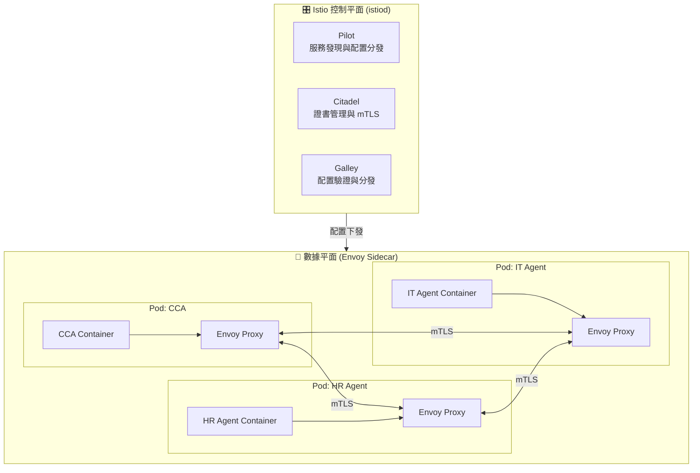
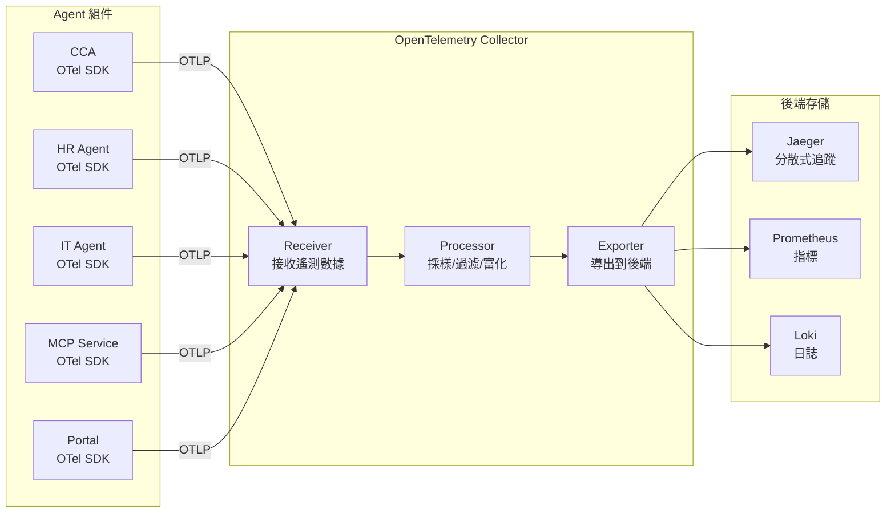
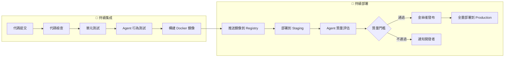

# 第四章：雲原生技術棧的選擇與理由

> 「選擇 Kubernetes 不是因為它簡單，而是因為它把『正確的事情』變成了『默認的事情』。我們選擇成熟的複雜性，而非簡陋的簡單性。」

本章將詳細闡述支撐 AI Native Agent Platform 的雲原生技術棧。這些技術共同構成了平台的「地基」：Kubernetes 提供容器編排與資源管理，Istio 提供服務間通信的安全與流量控制，OpenTelemetry 提供統一的可觀察性標準。我們選擇這些技術不是因為它們最簡單，而是因為它們最成熟、最可靠，且都是 CNCF（Cloud Native Computing Foundation）生態的核心項目。

---

## 4.1 容器化與 Kubernetes：平台部署的標準

### 4.1.1 Docker 容器化：Agent 的標準化交付

每個 Agent（CCA 和 Specialized Agents）都被打包為獨立的 Docker 容器。容器化帶來的核心價值：

- **環境一致性**：開發、測試、生產環境完全一致
- **依賴隔離**：每個 Agent 的依賴（Python 版本、庫版本）互不影響
- **快速部署**：從代碼到運行的時間最小化
- **資源限制**：每個 Agent 的 CPU/內存使用可精確控制

**Agent 的 Dockerfile 最佳實踐**：

以下 Dockerfile 展示了生產級 Agent 鏡像的構建過程。它採用 **多階段構建（Multi-Stage Build）** 模式 — 第一階段安裝依賴，第二階段只複製必要的文件到乾淨的基礎鏡像中。這種做法可以將最終鏡像體積減少 30-50%，因為構建工具（pip、編譯器等）不會留在最終鏡像中。

```dockerfile
# cca-agent/Dockerfile

# ===== 階段一：構建環境 =====
# 使用 python:3.11-slim 作為基礎鏡像（比完整版小 60%+）
# 'as builder' 為此階段命名，後續階段可以引用
FROM python:3.11-slim as builder

WORKDIR /app

# 先複製 requirements.txt 再安裝 — 利用 Docker 的層緩存機制
# 只有 requirements.txt 變化時才重新安裝依賴，代碼變化不會觸發重裝
COPY requirements.txt .
RUN pip install --no-cache-dir --user -r requirements.txt
# --no-cache-dir: 不緩存 pip 下載，減小鏡像體積
# --user: 安裝到用戶目錄而非系統目錄，避免權限問題

# ===== 階段二：運行環境 =====
FROM python:3.11-slim

WORKDIR /app

# 從 builder 階段只複製已安裝的 Python 包（不帶 pip 和構建工具）
COPY --from=builder /root/.local /root/.local
ENV PATH=/root/.local/bin:$PATH

# 複製應用代碼（放在依賴安裝之後 — 代碼變動最頻繁，放最後利用緩存）
COPY src/ ./src/

# 安全最佳實踐：創建專用用戶，不以 root 身份運行
# K8s 的 SecurityContext 也建議配合 runAsNonRoot: true
RUN useradd -m -u 1000 agent && chown -R agent:agent /app
USER agent

# Docker 層面的健康檢查 — 與 K8s 的 livenessProbe 互補
# K8s 會同時使用兩者，任何一個失敗都會觸發容器重啟
HEALTHCHECK --interval=30s --timeout=10s --retries=3 \
  CMD python -c "import httpx; httpx.get('http://localhost:8080/health')"

EXPOSE 8080  # 聲明容器監聽的端口（文檔作用 + K8s containerPort 對應）

# 啟動命令 — 使用模組方式運行，支持信號處理和優雅關閉
CMD ["python", "-m", "src.main"]
```

**關鍵設計決策**：

- **多階段構建**：Python 依賴安裝需要編譯工具（如 gcc），但運行時不需要。分離構建和運行環境，最終鏡像只包含 Python 運行時 + 依賴包 + 應用代碼，體積從 ~900MB 縮減到 ~200MB。
- **層緩存優化**：`requirements.txt` 在 `COPY src/` 之前 — 因為代碼變動頻率遠高於依賴變動。這樣改代碼時不需要重新安裝 pip 包，構建速度提升 50%+。
- **非 root 用戶**：以 `agent` 用戶運行是容器安全的基本要求。即使容器被突破，攻擊者也只獲得有限權限。K8s 的 `securityContext.runAsNonRoot: true` 可以強制執行此策略。
- **HEALTHCHECK vs K8s Probes**：Docker HEALTHCHECK 用於本地 `docker-compose` 環境的健康檢查；在 K8s 中，`livenessProbe` 和 `readinessProbe` 承擔此職責。兩者同時存在可以覆蓋更多場景。

### 4.1.2 Kubernetes 核心概念

Kubernetes（K8s）是一個容器編排平台，管理容器化應用的部署、擴展與運維。對於 Agent Platform，以下核心概念至關重要：

| 概念 | 說明 | 在 Agent Platform 中的應用 |
|------|------|---------------------------|
| **Pod** | 最小部署單元，包含一個或多個容器 | 每個 Agent 實例運行在一個 Pod 中 |
| **Deployment** | 管理 Pod 的副本數與更新策略 | 確保 Agent 始終有 N 個副本運行 |
| **Service** | 為 Pod 提供穩定的網絡端點 | Agent 之間通過 Service 名互相訪問 |
| **ConfigMap** | 非機密配置數據 | Agent 的 LLM 配置、MCP 服務地址 |
| **Secret** | 機密數據（加密存儲） | API 密鑰、數據庫密碼 |
| **Namespace** | 邏輯隔離的虛擬集群 | 按環境隔離（dev/staging/prod） |
| **HPA** | Horizontal Pod Autoscaler | 根據負載自動擴展 Agent 副本數 |
| **StatefulSet** | 有狀態應用的管理 | MCP Service 的持久化存儲 |

### 4.1.3 Kubernetes 在 Agent Platform 中的關鍵應用

**（1）Agent 部署與副本管理**

在 Kubernetes 中，**Deployment** 是管理無狀態應用的核心資源。它聲明式地定義了「我要什麼版本的鏡像、跑幾個副本、用什麼配置」，而 Kubernetes 會自動確保集群的實際狀態與你聲明的狀態一致 — 如果某個 Pod 崩潰，Deployment 會自動重建；如果你更新鏡像版本，Deployment 會執行滾動更新。

以下是一個 CCA（中央協調 Agent）的完整 Deployment 配置，我們逐段解析：

```yaml
# k8s/cca-agent.yaml
apiVersion: apps/v1
kind: Deployment
metadata:
  name: cca-agent           # Deployment 的名稱，集群內唯一標識
  namespace: ai-platform    # 所屬命名空間，用於邏輯隔離（如 dev/staging/prod）
  labels:
    app: cca-agent          # 標籤：用於選擇器匹配和資源組織
    component: platform-core # 標記為平台核心組件，便於監控和策略應用
spec:
  replicas: 3  # 生產環境運行 3 個副本。3 個副本確保即使 1 個 Pod 宕機，服務仍然可用
  selector:
    matchLabels:
      app: cca-agent  # Deployment 通過此標籤管理 Pod — 只管理帶有 app=cca-agent 的 Pod
  template:
    metadata:
      labels:
        app: cca-agent  # Pod 標籤，必須與 selector.matchLabels 匹配
      annotations:
        sidecar.istio.io/inject: "true"  # 告訴 Istio 自動注入 Envoy Sidecar 容器
    spec:
      containers:
      - name: cca-agent
        image: registry.company.com/ai-platform/cca-agent:v0.1.0  # 鏡像地址與版本標籤
        ports:
        - containerPort: 8080  # 容器監聽的端口
        env:
        # 從 ConfigMap 讀取非機密配置 — LLM 提供商可按環境切換
        - name: LLM_PROVIDER
          valueFrom:
            configMapKeyRef:
              name: platform-config
              key: llm_provider
        # 從 Secret 讀取機密信息 — API Key 不會出現在 Pod 定義或鏡像中
        - name: ANTHROPIC_API_KEY
          valueFrom:
            secretKeyRef:
              name: llm-secrets
              key: anthropic-api-key
        # 直接設定的環境變量 — MCP 服務的內部地址
        - name: MCP_SERVICE_URL
          value: "mcp-service:50051"  # 使用 K8s Service 名稱進行服務發現
        resources:
          requests:
            # requests 是 Kubernetes 調度的依據 — 確保節點有足夠資源容納此 Pod
            memory: "512Mi"  # 保留 512MB 內存
            cpu: "250m"      # 保留 0.25 個 CPU 核心（250 millicores）
          limits:
            # limits 是硬上限 — Pod 不得超過此值，否則可能被 OOM Kill 或 CPU 限流
            memory: "2Gi"    # 最多使用 2GB 內存
            cpu: "1000m"     # 最多使用 1 個 CPU 核心
        # 存活探針：Kubernetes 定期檢查容器是否「活著」
        # 如果探針失敗，Kubernetes 會重啟容器（處理死鎖、無響應等情況）
        livenessProbe:
          httpGet:
            path: /health    # 應用需實現此端點，返回 200 表示存活
            port: 8080
          initialDelaySeconds: 15  # 容器啟動後等待 15 秒才開始探測（留足初始化時間）
          periodSeconds: 20        # 每 20 秒探測一次
        # 就緒探針：決定 Pod 是否接受流量
        # 在探針成功前，Pod 不會被加入 Service 的 Endpoints（即不接收請求）
        readinessProbe:
          httpGet:
            path: /ready     # 應用需實現此端點，返回 200 表示就緒
            port: 8080
          initialDelaySeconds: 5   # 容器啟動後等待 5 秒
          periodSeconds: 10        # 每 10 秒探測一次
---
# Service 為一組 Pod 提供穩定的網絡入口
# Pod 的 IP 是臨時的（重建後會變），但 Service 的 DNS 名稱永遠不變
# 其他 Agent 可以通過 "http://cca-agent:80" 訪問 CCA，無需關心具體 Pod IP
apiVersion: v1
kind: Service
metadata:
  name: cca-agent
  namespace: ai-platform
spec:
  selector:
    app: cca-agent  # 將流量路由到所有帶有 app=cca-agent 標籤的 Pod
  ports:
  - port: 80          # Service 監聽的端口（其他服務通過此端口訪問）
    targetPort: 8080  # 轉發到 Pod 的哪個端口
```

**關鍵設計決策**：

- **3 個副本**：CCA 是平台的核心入口，單點故障會導致整個平台不可用。3 個副本提供冗餘，且支持在不停機的情況下進行滾動更新（始終有 ≥ 2 個 Pod 在服務）。
- **resources 設定**：LLM 推理是 CPU 密集型操作，因此 CPU limits 設為 1 核；而 LLM 回應會在內存中緩存，因此 limits 設為 2Gi。`requests` 與 `limits` 之間的差距允許突發使用，但不影響集群調度。
- **探針分離**：`livenessProbe` 檢查「容器是否還活著」（失敗 → 重啟），`readinessProbe` 檢查「容器是否能處理請求」（失敗 → 暫停接收流量）。兩者職責不同，間隔和超時設定也不同。

**（2）自動擴展（HPA）**

上一節的 Deployment 固定運行 3 個副本，但 Agent 平台的流量波動很大 — 工作日早上 9 點大量員工同時使用，凌晨幾乎無人。**Horizontal Pod Autoscaler（HPA）** 根據實際負載動態調整 Pod 數量，在流量高峰時擴展、低谷時縮減，兼顧性能與成本。

HPA 的工作原理：每隔一段時間（默認 15 秒），HPA 控制器查詢各指標的實際值，與目標值比較後計算出期望的副本數。例如，當 CPU 平均使用率為 70% 而目標為 50% 時，HPA 會將副本數乘以 (70/50) = 1.4，即 3 × 1.4 = 4.2，向上取整為 5 個副本。

```yaml
# k8s/cca-hpa.yaml
apiVersion: autoscaling/v2  # v2 版本支持多指標和自定義指標
kind: HorizontalPodAutoscaler
metadata:
  name: cca-agent-hpa
  namespace: ai-platform
spec:
  scaleTargetRef:           # HPA 控制哪個 Deployment
    apiVersion: apps/v1
    kind: Deployment
    name: cca-agent         # 與上一節的 Deployment 名稱對應
  minReplicas: 2            # 最少 2 個副本（即使完全空閒也不縮到 1，避免冷啟動延遲）
  maxReplicas: 10           # 最多 10 個副本（防止失控擴展耗盡集群資源）
  metrics:
  # 指標一：CPU 使用率
  # 當所有 Pod 的平均 CPU 使用率超過 70% 時，HPA 擴展
  # 當低於 70% 時，HPA 縮減（有冷卻期防止震盪）
  - type: Resource
    resource:
      name: cpu
      target:
        type: Utilization
        averageUtilization: 70
  # 指標二：內存使用率
  # LLM 推理可能導致內存突增，80% 閾值作為第二道防線
  # HPA 會同時考量兩個指標，取最保守的擴展結果
  - type: Resource
    resource:
      name: memory
      target:
        type: Utilization
        averageUtilization: 80
```

**關鍵設計決策**：

- **minReplicas: 2**：HPA 允許縮減到 0（scale-to-zero），但 Agent 需要保持最低 2 個副本 — 首先是避免冷啟動延遲（LLM 模型載入可能需要數十秒），其次是確保在一次滾動更新期間仍有可用副本。
- **maxReplicas: 10**：設上限是為了防止異常流量（如惡意請求）導致無限擴展。在生產環境中，建議配合 Cluster Autoscaler 實現節點級別的彈性伸縮。
- **雙指標策略**：CPU 指標反映計算負載（LLM 推理密集度），內存指標反映狀態累積（對話歷史、RAG 緩存）。單一指標可能漏掉瓶頸 — 例如 CPU 低但內存高，表示 Agent 雖然不忙但已接近崩潰邊緣。
- **閾值選擇**：CPU 70% 和內存 80% 是保守值。過低會導致頻繁擴縮（「震盪」），過高則可能在擴展完成前就出現延遲。建議在實際負載下觀察和調整。

**（3）為什麼選擇 Kubernetes 而非更簡單的方案**

| 方案 | 優點 | 缺點 | 適用場景 |
|------|------|------|----------|
| **Docker Compose** | 極其簡單，本地開發友好 | 無自動擴展、無服務發現、無滾動更新 | 本地開發與測試 |
| **Kubernetes** | 功能最全面，生態最成熟 | 學習曲線陡峭，運維複雜 | 生產環境、企業級部署 |
| **Nomad** | 比 K8s 簡單，支持多種工作負載 | 生態較小，社區規模不及 K8s | 中小規模部署 |
| **Serverless (Knative)** | 無流量時自動縮減至零副本（不產生費用），有請求時自動啟動 | 冷啟動延遲（模型載入可能需數十秒），不適合長時間運行的 Agent | 事件驅動的輕量任務 |

**我們的選擇邏輯**：Kubernetes 的學習曲線確實陡峭，但它提供了 Agent Platform 所需的所有核心能力 — 自動擴展、服務發現、滾動更新、健康檢查。對於企業級平台，這些能力不是「可有可無」，而是「必須具備」。我們將在第八章詳細講解 K8s 的實踐，並推薦學習資源幫助讀者克服學習曲線。

### 4.1.4 推薦學習資源

對於 Kubernetes 初學者，推薦以下學習路徑：

1. **入門**：《Kubernetes Up & Running》(3rd Edition) — Kelsey Hightower et al., O'Reilly Media. 由 Kubernetes 創始人之一撰寫，最佳入門書。
2. **深入**：《Kubernetes in Action》(2nd Edition) — Marko Lukša, Manning. 深入理解 K8s 內部機制。
3. **實踐**：Kubernetes 官方文檔的 Interactive Tutorials — https://kubernetes.io/docs/tutorials/
4. **本地開發**：使用 Minikube 或 Kind 搭建本地集群進行實踐。

---

## 4.2 服務網格 Istio：賦能微服務的強大工具

### 4.2.1 為什麼需要服務網格

當平台中的 Agent 數量增長到 10 個以上時，以下問題變得突出：

- Agent 之間的通信如何加密？（每個 Agent 自己實現 TLS 嗎？）
- 如何實現金絲雀發布（先讓 5% 的流量到新版本 Agent）？
- 如何實現熔斷（當某個 Agent 響應變慢時，防止連鎖故障）？
- 如何統一收集所有 Agent 間通信的遙測數據？

這些問題的共同特點是：它們是**所有服務都需要的橫切關注點**，但與業務邏輯無關。服務網格（Service Mesh）將這些關注點從應用代碼中剝離，下沉到基礎設施層。

### 4.2.2 Istio 架構



上圖展示了 Istio 的兩層架構：控制平面（istiod）負責管理和配置，數據平面（Envoy Sidecar）負責實際的流量處理。這是 Service Mesh 的核心設計模式——**控制與數據分離**。

**控制平面（istiod）的三個角色**

| 組件 | 職責 | 類比 |
|------|------|------|
| **Pilot** | 服務發現（哪些 Pod 在線、地址是什麼）+ 配置分發（路由規則、負載均衡策略） | 交通指揮中心——知道所有車輛的位置，並實時下發新的路線指引 |
| **Citadel** | 證書管理——自動為每個 Pod 頒發、輪換 mTLS 證書，實現零信任通信 | 身份證局——自動為每位公民頒發和更新身份證件 |
| **Galley** | 配置驗證與分發——確保開發者提交的 Istio 配置是合法的，然後安全地下發到數據平面 | 配置審計員——攔截並驗證所有配置變更，防止錯誤配置進入生產環境 |

**數據平面的 Sidecar 模式**

圖中最關鍵的設計是每個 Pod 內部的雙容器結構：

| Pod | 業務容器 | Sidecar 容器 | 數據流向 |
|-----|---------|-------------|---------|
| CCA Pod | CCA Container | Envoy Proxy | CCA → Envoy → 外部（所有出站流量經過 Envoy） |
| HR Agent Pod | HR Agent Container | Envoy Proxy | HR Agent → Envoy → 外部 |
| IT Agent Pod | IT Agent Container | Envoy Proxy | IT Agent → Envoy → 外部 |

**mTLS 通信的三條連接線**

圖中 Envoy 之間的三條 `mTLS` 雙向箭頭揭示了一個重要事實：**Agent 之間不直接通信**。所有 Pod 間的流量都經過 Envoy Proxy，由 Envoy 完成 TLS 加密和身份驗證。這意味著：

- CCA 想和 HR Agent 通信 → CCA 發送給本地 Envoy → 本地 Envoy 通過 mTLS 連接到 HR Agent 的 Envoy → HR Agent 的 Envoy 轉發給 HR Agent
- 業務代碼完全無感知——Agent 不需要寫任何加密、認證、路由的代碼

**控制平面如何影響數據平面**

圖底部的「配置下發」箭頭是兩層之間的唯一交互：istiod 將路由規則、mTLS 策略、負載均衡配置推送到每個 Envoy Sidecar。這個過程是**實時的**——當你修改 Istio 配置時，所有 Envoy 會在秒級內接收並生效，無需重啟 Pod。

**核心機制**：每個 Pod 中除了運行 Agent 的容器外，還運行一個 **Envoy Proxy** 容器（Sidecar）。所有進出 Pod 的網絡流量都經過 Envoy，由 Envoy 實現加密、路由、負載均衡、遙測收集。Agent 的應用代碼完全不需要處理這些問題。

### 4.2.3 Istio 的核心功能在 Agent Platform 中的應用

**（1）mTLS（雙向 TLS）加密**

在傳統 TLS 中，只有客戶端驗證服務端的身分。**mTLS（Mutual TLS）** 則是雙向驗證 — CCA 和 HR Agent 互相驗證對方的證書，確保通信雙方都是可信的。Istio 通過 Envoy Sidecar 自動完成證書的頒發、輪換和驗證，應用代碼完全無感知。

以下配置在 `ai-platform` 命名空間中強制啟用 mTLS：

```yaml
# istio/peer-authentication.yaml
apiVersion: security.istio.io/v1beta1
kind: PeerAuthentication  # Istio 的認證策略資源
metadata:
  name: default            # 名稱為 'default' 表示對整個命名空間生效
  namespace: ai-platform
spec:
  mtls:
    mode: STRICT           # STRICT: 拒絕所有未加密的明文通信
                           # 備選: PERMISSIVE（同時允許加密和明文，用於過渡期）
                           # 備選: DISABLE（關閉 mTLS，不建議用於生產）
```

這意味著 CCA 與 HR Agent 之間的所有通信都自動加密，無需修改任何應用代碼。即使攻擊者在同一個 K8s 集群中，也無法嗅探 Agent 間的通信內容。

**（2）流量管理：金絲雀發布**

金絲雀發布（Canary Release）是一種漸進式發布策略 — 先將少量流量導向新版本，觀察無異常後再逐步增加比例，直到 100% 切換。這比「全量發布」安全得多，因為新版本的問題只會影響一小部分用戶。

Istio 的金絲雀發布由兩個資源協作實現：**VirtualService**（定義流量分配比例）和 **DestinationRule**（定義版本子集的標籤選擇器）。

```yaml
# istio/it-agent-canary.yaml

# VirtualService：定義「流量如何分配」
apiVersion: networking.istio.io/v1beta1
kind: VirtualService
metadata:
  name: it-agent
  namespace: ai-platform
spec:
  hosts:
  - it-agent              # 匹配 Service 名稱 it-agent 的流量
  http:
  - route:
    - destination:
        host: it-agent
        subset: v1         # 引用 DestinationRule 中定義的 v1 子集
      weight: 90           # 90% 流量到舊版本（穩定版）
    - destination:
        host: it-agent
        subset: v2         # 引用 DestinationRule 中定義的 v2 子集
      weight: 10           # 10% 流量到新版本（金絲雀）
---
# DestinationRule：定義「版本子集如何選擇 Pod」
apiVersion: networking.istio.io/v1beta1
kind: DestinationRule
metadata:
  name: it-agent
  namespace: ai-platform
spec:
  host: it-agent
  subsets:
  - name: v1
    labels:
      version: v1          # 選擇帶有 label version=v1 的 Pod
  - name: v2
    labels:
      version: v2          # 選擇帶有 label version=v2 的 Pod
```

**關鍵設計決策**：
- **weight 分配**：從 10% 開始是保守做法。如果金絲雀版本的錯誤率和延遲都在預期範圍內，可以逐步調整為 30% → 50% → 100%。Istio 不會自動調整比例，需要手動更新或配合 Flagger 等工具實現自動化。
- **標籤選擇器**：`DestinationRule` 通過 Pod 標籤區分版本，因此 Deployment 的 Pod template 必須包含對應的 `version` 標籤。

**（3）熔斷與故障恢復**

**熔斷器（Circuit Breaker）** 借鑑了電路中的熔斷概念 — 當下游服務出現故障時，主動「斷開」連接，防止請求積壓導致連鎖故障。Istio 通過 `DestinationRule` 的 `trafficPolicy` 實現熔斷。

```yaml
# hr-agent-circuit-breaker.yaml
apiVersion: networking.istio.io/v1beta1
kind: DestinationRule
metadata:
  name: hr-agent-circuit-breaker
  namespace: ai-platform
spec:
  host: hr-agent
  trafficPolicy:
    connectionPool:
      http:
        http1MaxPendingRequests: 50   # 最多允許 50 個請求排隊等待連接
                                      # 超過此值的請求會被立即拒絕（返回 503）
        maxRequestsPerConnection: 10   # 每個連接最多處理 10 個請求後重建
                                      # 防止長連接導致的資源洩漏
    outlierDetection:                 # 異常檢測（即「熔斷」邏輯）
      consecutive5xxErrors: 3         # 連續 3 次 5xx 錯誤 → 觸發熔斷
      interval: 30s                   # 每 30 秒檢查一次錯誤計數
      baseEjectionTime: 60s           # 熔斷後剔除 60 秒
                                      # 每次連續熔斷，剔除時間加倍（指数退避）
      maxEjectionPercent: 50          # 最多剔除 50% 的 Pod
                                      # 確保即使部分 Pod 故障，仍有剩餘 Pod 可用
```

當 HR Agent 連續返回 3 次 5xx 錯誤時，Istio 自動將其從負載均衡池中剔除 60 秒，防止連鎖故障。60 秒後 Envoy 會嘗試發送「探測請求」，如果成功則恢復流量，否則繼續剔除。

### 4.2.4 Istio 的複雜性與權衡

Istio 是強大但複雜的工具。以下情況可以考慮不使用 Istio：

- Agent 數量少於 5 個
- 團隊沒有 Kubernetes 運維經驗
- 對 mTLS 和精細流量管理沒有硬性要求

**替代方案**：Linkerd（更輕量的服務網格）、Cilium（基於 eBPF 的高性能方案）。

### 4.2.5 推薦學習資源

1. **《Istio in Action》** — Christian Posta & Rinor Maloku, Manning. Istio 的權威指南。
2. **Istio 官方文檔** — https://istio.io/latest/docs/ — 內容詳盡，含大量示例。
3. **《Service Mesh Patterns》** — Lee Calcote & Nic Jackson. 服務網格的模式語言。

---

## 4.3 OpenTelemetry：統一的遙測標準

### 4.3.1 為什麼需要 OpenTelemetry

在 AI Native Agent Platform 中，一個用戶請求可能經過：

```
Portal → CCA → MCP Service → HR Agent → Data Layer
                     ↘→ IT Agent → External API
```

要理解這個請求為什麼花了 8 秒，我們需要知道：
- CCA 的 LLM 推理花了多少時間？
- MCP Service 的消息路由花了多少時間？
- HR Agent 的數據庫查詢花了多少時間？
- IT Agent 的外部 API 調用花了多少時間？

這就是 **分散式追蹤（Distributed Tracing）** 要解決的問題。OpenTelemetry（OTel）是 CNCF 的統一遙測標準，提供 Trace、Metrics、Logs 的統一採集框架。

### 4.3.2 OpenTelemetry 架構



上圖展示了 OpenTelemetry 的三層架構：Agent 組件（數據源）→ OTel Collector（數據處理管道）→ 後端存儲（數據消費）。這是整個平台可觀察性的基礎——所有組件通過統一的 OTLP 協議向 Collector 發送遙測數據，Collector 負責處理和分發。

**三層架構的數據流**

| 層級 | 組件 | 發生了什麼 | 設計要點 |
|------|------|-----------|---------|
| **Agent 組件（數據源）** | CCA、HR Agent、IT Agent、MCP Service、Portal | 每個組件內嵌 OTel SDK，在執行業務邏輯的同時自動生成 Trace Span、Metric Point 和 Log Entry | 業務代碼不需要手動調用遙測 API——OTel SDK 通過裝飾器模式（Decorator Pattern）自動攔截並記錄 |
| **OTel Collector（處理管道）** | Receiver → Processor → Exporter | Receiver 接收所有 OTLP 數據，Processor 進行採樣（丟棄低價值 Span）、過濾（移除敏感信息）、富化（添加 K8s 元數據），Exporter 將處理後的數據導出到對應後端 | **三階段管道**是 Collector 的核心設計——每個階段可獨立配置，支持熱更新 |
| **後端存儲（數據消費）** | Jaeger、Prometheus、Loki | 各自專注於一類遙測數據的存儲和查詢：Jaeger 存 Trace（請求鏈路）、Prometheus 存 Metrics（數值指標）、Loki 存 Logs（文本日誌） | 後端之間互不依賴——即使 Loki 掛了，Jaeger 和 Prometheus 仍然正常工作 |

**五個 Agent 組件為什麼都要集成 OTel SDK**

| 組件 | 關鍵遙測需求 | 不接 OTel 的後果 |
|------|-------------|----------------|
| **CCA** | 記錄意圖識別的延遲、任務分解的準確率 | 無法知道 LLM 推理佔了多少時間 |
| **HR Agent** | 記錄 RAG 檢索的召回率、工具調用的成功率 | 無法知道 HR 數據查詢是否準確 |
| **IT Agent** | 記錄 AD 操作的延遲、重試次數 | 無法知道帳號創建是否順利 |
| **MCP Service** | 記錄消息路由的延遲、隊列深度 | 無法知道消息是否積壓 |
| **Portal** | 記錄用戶響應時間、WebSocket 連接數 | 無法知道用戶體驗是否流暢 |

**OTLP 協議的統一性**

圖中所有箭頭都標註了 `OTLP`——這是 OpenTelemetry 的原生協議（基於 Protobuf + gRPC）。統一協議帶來的關鍵優勢：Agent 組件不需要知道後端是 Jaeger 還是 Prometheus，OTel Collector 負責數據的分發和轉換。這意味著你可以隨時替換後端存儲（比如從 Jaeger 切換到 Tempo），而無需修改任何 Agent 的代碼。

### 4.3.3 三大遙測信號

OpenTelemetry 定義了三大信號類型，各自解決不同的可觀察性問題。它們通過統一的 Trace ID 關聯 — 當你在 Jaeger 中找到一個慢請求的 Trace，可以一鍵跳轉到對應的 Logs 和 Metrics。

**（1）Trace（追蹤）**

Trace 記錄一個請求從入口到出口的完整路徑。每個處理步驟是一個 **Span**，Span 之間有父子關係，形成一棵調用樹。以下是一個用戶請求觸發的真實 Trace 示例：

```
Trace ID: abc123
├── Span: Portal.handle_request (50ms)        ← 入口：Portal 接收請求
│   └── Span: CCA.process (7500ms)            ← CCA 整體處理時間（最長的 Span）
│       ├── Span: CCA.llm_reasoning (3000ms)  ← LLM 推理是主要瓶頸
│       ├── Span: MCP.send_context (100ms)    ← 通過 MCP 發送上下文到 HR Agent
│       │   └── Span: HRAgent.query_employee (2000ms)
│       │       └── Span: DB.query (800ms)    ← 數據庫查詢
│       ├── Span: MCP.send_context (100ms)    ← 通過 MCP 發送上下文到 IT Agent
│       │   └── Span: ITAgent.create_account (1500ms)
│       │       └── Span: ADAPI.create (1200ms) ← AD API 調用
│       └── Span: CCA.integrate_results (800ms) ← 整合各 Agent 結果
```

從這個 Trace 可以立即定位瓶頸：LLM 推理（3000ms）和 HR Agent 數據庫查詢（2000ms）是主要耗時。這比「用戶說系統慢」有用得多 — 你知道具體慢在哪裡。

**（2）Metrics（指標）**

Metrics 是持續採集的數值型數據，用於監控系統的整體健康狀態。OTel 的 Metrics API 提供三種核心儀器類型，以下代碼展示如何在 CCA Agent 中初始化它們：

```python
from opentelemetry import metrics

# 創建 Meter — 每個服務使用獨立的 Meter，便於區分數據來源
meter = metrics.get_meter("cca-agent")

# Counter（計數器）：只增不減，適合計數
# 用途：計算總請求數、錯誤次數、成功次數
# 在 Prometheus 中對應 _total 指標
request_counter = meter.create_counter(
    name="cca.requests.total",
    description="CCA 處理的請求總數",
    unit="1"
)
# 使用方式: request_counter.add(1, {"status": "success", "agent": "hr-agent"})

# Histogram（直方圖）：記錄數值的分佈
# 用途：延遲、響應大小等需要看 P50/P95/P99 的指標
# 在 Prometheus 中對應 _bucket 和 _sum 指標
llm_latency = meter.create_histogram(
    name="cca.llm.latency_ms",
    description="LLM 推理延遲",
    unit="ms"
)
# 使用方式: llm_latency.record(3200, {"model": "claude-opus-4"})

# UpDownCounter（增減計數器）：可增可減，適合 Gauge 類指標
# 用途：當前活躍連接數、隊列長度、正在處理的任務數
active_tasks = meter.create_up_down_counter(
    name="cca.active_tasks",
    description="當前活躍任務數",
    unit="1"
)
# 使用方式: active_tasks.add(1)  ← 任務開始 / active_tasks.add(-1)  ← 任務結束
```

**（3）Logs（日誌）**

結構化日誌是排查問題的第一手資料。關鍵實踐是將日誌與 Trace 關聯 — 通過在日誌中記錄 `trace_id`，可以在 Grafana 中從日誌直接跳轉到對應的分散式追蹤：

```python
import logging
from opentelemetry import trace

logger = logging.getLogger("cca-agent")

async def process_request(request_id: str, user_input: str):
    tracer = trace.get_tracer("cca-agent")
    # start_as_current_span 創建一個 Span，並設為當前上下文
    # with 語句結束時 Span 自動結束（計時停止）
    with tracer.start_as_current_span("process_request") as span:
        # 設置 Span 屬性 — 在 Jaeger 中可搜索和過濾
        span.set_attribute("request_id", request_id)
        span.set_attribute("user_input_length", len(user_input))

        # 日誌中記錄 trace_id — 這是 Logs 與 Trace 關聯的橋樑
        logger.info(
            "Processing user request",
            extra={
                "request_id": request_id,
                "trace_id": span.get_span_context().trace_id,
                # 在 Grafana 中，可以從這條日誌直接點擊 trace_id 跳轉到 Jaeger
            }
        )
        # ... 處理邏輯 ...
```

### 4.3.4 OTel Collector 配置

OTel Collector 是所有遙測數據的中轉站 — 各 Agent 發送遙測數據到 Collector，Collector 負責處理（採樣、過濾、富化）後導出到不同的後端存儲。這種架構解耦了數據產生者和消費者：Agent 不需要知道數據要去 Jaeger 還是 Prometheus，只需要發送給 Collector 即可。

```yaml
# observability/otel-collector/config.yaml

# === Receiver（接收器）：定義如何接收遙測數據 ===
receivers:
  otlp:                              # OTLP 是 OTel 的原生協議
    protocols:
      grpc:
        endpoint: 0.0.0.0:4317       # gRPC 端口（默認 4317）
      http:
        endpoint: 0.0.0.0:4318       # HTTP 端口（默認 4318）
      # 同時支持 gRPC 和 HTTP，方便不同 Agent 根據自身需求選擇

# === Processor（處理器）：對數據進行中間處理 ===
processors:
  batch:
    timeout: 10s                      # 每 10 秒批量發送一次（非實時，但降低網絡開銷）
    send_batch_size: 1024             # 或累積到 1024 條數據時發送
  memory_limiter:
    check_interval: 1s                # 每秒檢查一次內存使用
    limit_percentage: 75              # 內存使用超過 75% 時拒絕新數據
                                      # 防止 Collector 自身 OOM 導致數據丟失

# === Exporter（導出器）：定義數據去哪裡 ===
exporters:
  otlp/jaeger:                        # 追蹤數據 → Jaeger
    endpoint: jaeger-collector:4317
    tls:
      insecure: true                  # 集群內部通信，暫不啟用 TLS（生產環境建議開啟）

  prometheus:                         # 指標數據 → Prometheus
    endpoint: 0.0.0.0:8889            # Prometheus 從此端口拉取（scrape）指標

  loki:                               # 日誌數據 → Loki
    endpoint: http://loki:3100/loki/api/v1/push  # Loki 的推送端點

# === Service（管道配置）：組裝 Receiver → Processor → Exporter ===
service:
  pipelines:
    traces:                           # 追蹤管道
      receivers: [otlp]               # 接收 OTLP 數據
      processors: [memory_limiter, batch]  # 先限流再批量
      exporters: [otlp/jaeger]        # 導出到 Jaeger
    metrics:                          # 指標管道
      receivers: [otlp]
      processors: [memory_limiter, batch]
      exporters: [prometheus]
    logs:                             # 日誌管道
      receivers: [otlp]
      processors: [memory_limiter, batch]
      exporters: [loki]
```

**關鍵設計決策**：
- **三條獨立管道**：Traces、Metrics、Logs 走不同的管道，互不影響。即使 Loki 宕機，追蹤和指標數據不受影響。
- **memory_limiter 在 batch 之前**：先檢查內存再批量處理。如果順序反過來，批量緩衝可能在內存檢查前就已經佔用過多空間。
- **OTLP 作為統一接收協議**：所有 Agent 使用 OTLP（OTel 原生協議）發送數據，不需要為每種後端寫不同的 Exporter。這是 OTel 的核心價值 — 一次instrument，多處導出。

### 4.3.5 推薦學習資源

1. **OpenTelemetry 官方文檔** — https://opentelemetry.io/docs/ — 完整的規範與教程。
2. **《Observability Engineering》** — Charity Majors et al., O'Reilly Media. 可觀察性工程的權威著作。
3. **《Distributed Tracing in Practice》** — Austin Parker et al., O'Reilly Media. 分散式追蹤的實踐指南。

---

## 4.4 NATS：高性能消息隊列

### 4.4.1 為什麼需要消息隊列

MCP Service 使用 gRPC 進行同步的上下文傳遞，但在以下場景中，異步消息隊列更為合適：

- **事件通知**：Agent 完成任務後廣播事件（如「IT 帳號已創建」），多個訂閱者（CCA、審計系統、通知系統）同時接收
- **流量削峰**：當大量用戶同時發起請求時，消息隊列緩衝峰值流量
- **解耦**：Agent 不需要知道消費者的網絡地址

### 4.4.2 NATS 核心概念

NATS 是一個輕量級、高性能的雲原生消息系統：

| 特性 | 說明 |
|------|------|
| **Subject-Based Routing** | 基於主題的消息路由，類似 MQTT 的 topic |
| **Core NATS** | 無持久化的即時消息，適合實時事件 |
| **JetStream** | 持久化消息流，支持消費確認與重放 |
| **Queue Groups** | 負載均衡，同一組內只有一個消費者收到消息 |

### 4.4.3 在 Agent Platform 中的應用

NATS 在 Agent Platform 中主要用於**異步事件驅動**場景。與 gRPC 的同步調用不同，事件驅動模式下，Agent 發布事件後不等待響應，訂閱者在自己方便的時候處理事件。這種模式特別適合任務完成通知、審計日誌、跨系統同步等場景。

以下代碼展示兩個核心模式：**發布事件**和**訂閱事件**。NATS 使用「主題（Subject）」路由消息，類似 MQTT 的 topic 機制 — 發布者指定主題，訂閱者通過通配符訂閱感興趣的主題。

```python
import nats

# === 發布者（Publisher）：Agent 完成任務後廣播事件 ===
async def publish_task_completed(nc, task_id: str, result: dict):
    """任務完成後發布事件 — 所有訂閱者都會收到此消息"""
    await nc.publish(
        "platform.task.completed",        # 主題名稱：platform.{事件類型}.{具體事件}
                                          # 使用點分隔的層級結構，便於通配符匹配
        json.dumps({
            "task_id": task_id,            # 任務 ID — 用於追蹤和關聯
            "agent_id": "it-agent-v1",    # 發布事件的 Agent 標識
            "result": result,             # 任務結果（JSON 可序列化）
            "timestamp": datetime.now().isoformat()  # ISO 格式時間戳，便於日誌分析
        }).encode()                       # NATS 傳輸原始位元組，需要 encode 為 bytes
    )

# === 訂閱者（Subscriber）：CCA 訂閱所有任務事件 ===
async def subscribe_task_events(nc):
    """CCA 訂閱所有任務事件 — 使用通配符 * 匹配任意子主題"""

    async def handler(msg):
        # msg.data 是原始 bytes，需要 decode 為字串再 JSON 解析
        event = json.loads(msg.data.decode())
        print(f"Task {event['task_id']} completed by {event['agent_id']}")

    # "platform.task.*" 通配符匹配 platform.task.completed、platform.task.failed 等
    # CCA 需要監聽所有任務狀態，用來更新整體任務進度
    await nc.subscribe("platform.task.*", cb=handler)
```

**關鍵設計決策**：
- **主題命名約定**：`platform.task.completed` 採用三層結構 `{平台}.{域}.{事件}`。這不是強制的，但一致的命名約定讓通配符路由更清晰（如 `platform.task.*` 匹配所有任務事件）。
- **異步 vs 同步**：CCA 通過 gRPC 同步調用 Agent（需要立即結果），通過 NATS 異步接收事件（不需要立即處理）。兩種模式互補。
- **消息編碼**：NATS 傳輸原始位元組，JSON 是最常見的序列化格式。如果需要更高效的編碼，可以考慮 Protobuf。

### 4.4.4 推薦學習資源

1. **《NATS in Action》** — 了解 NATS 核心概念。
2. **NATS 官方文檔** — https://docs.nats.io/ — JetStream、安全配置等。

---

## 4.5 開源工具棧總覽與選型理由

### 4.5.1 完整技術棧

| 層級 | 技術 | 版本 | GitHub | 用途 | 授權 | 為什麼選擇 |
|------|------|------|--------|------|------|-----------|
| **Agent 框架** | Letta | v0.16.8 | [letta-ai/letta](https://github.com/letta-ai/letta) | Agent 定義與生命週期 | Apache 2.0 | 狀態持久化，記憶管理，社區活躍 |
| **工作流編排** | LangGraph | v1.2.9 | [langchain-ai/langgraph](https://github.com/langchain-ai/langgraph) | Agent 工作流狀態機 | MIT | LangChain 生態，狀態機模型直觀 |
| **LLM 推理** | Ollama | v0.32.2 | [ollama/ollama](https://github.com/ollama/ollama) | 本地 LLM 運行 | MIT | 零成本，數據隱私，快速迭代 |
| **通信協議** | gRPC + Protobuf | v1.82.1 | [grpc/grpc](https://github.com/grpc/grpc) | MCP 服務實現 | Apache 2.0 | 高性能，類型安全，跨語言 |
| **消息隊列** | NATS | v2.14.3 | [nats-io/nats-server](https://github.com/nats-io/nats-server) | 異步消息傳遞 | Apache 2.0 | 輕量，高吞吐，雲原生 |
| **容器編排** | Kubernetes | v1.36.2 | [kubernetes/kubernetes](https://github.com/kubernetes/kubernetes) | 部署與資源管理 | Apache 2.0 | 行業標準，功能最全面 |
| **服務網格** | Istio | v1.30.3 | [istio/istio](https://github.com/istio/istio) | 服務間安全與流量管理 | Apache 2.0 | 企業級 mTLS，流量控制 |
| **遙測標準** | OpenTelemetry | v0.156.0 | [open-telemetry/opentelemetry-collector](https://github.com/open-telemetry/opentelemetry-collector) | Trace/Metrics/Logs | Apache 2.0 | CNCF 標準，廠商無關 |
| **指標監控** | Prometheus | v3.4.2 | [prometheus/prometheus](https://github.com/prometheus/prometheus) | 指標存儲與告警 | Apache 2.0 | 雲原生監控標準 |
| **可視化** | Grafana | v13.1.0 | [grafana/grafana](https://github.com/grafana/grafana) | 儀表板與可視化 | AGPL | 功能強大，插件豐富 |
| **日誌聚合** | Loki | v3.7.2 | [grafana/loki](https://github.com/grafana/loki) | 日誌存儲與查詢 | AGPL | 與 Grafana 深度集成，成本低 |
| **分散式追蹤** | Jaeger | v2.20.0 | [jaegertracing/jaeger](https://github.com/jaegertracing/jaeger) | Trace 存儲與分析 | Apache 2.0 | CNCF 項目，Uber 開源 |
| **Portal Frontend** | Next.js 16 + shadcn/ui | v16.2.10 / v4.13.0 | [vercel/next.js](https://github.com/vercel/next.js) / [shadcn-ui/ui](https://github.com/shadcn-ui/ui) | 現代化 React 框架，SSR/SSG | MIT | 生態豐富，性能優異 |
| **Portal Backend** | FastAPI | v0.139.2 | [fastapi/fastapi](https://github.com/fastapi/fastapi) | 異步 Python Web 框架 | MIT | 與 Python Agent 無縫集成 |
| **向量數據庫** | ChromaDB | v1.5.9 | [chroma-core/chroma](https://github.com/chroma-core/chroma) | RAG 向量存儲 | Apache 2.0 | 輕量級，易於嵌入 |

### 4.5.2 免費雲端替代方案

對於沒有本地 Kubernetes 集群的團隊，以下免費雲端方案可用於學習與 POC：

| 雲端供應商 | 免費層級 | 適用場景 |
|-----------|---------|---------|
| **Oracle Cloud Free Tier** | 4 OCPU + 24GB RAM（ARM）永久免費 | 運行小型 K8s 集群（k3s） |
| **Google Cloud Free Tier** | $300 試用金 + 每月免費配額 | GKE Autopilot 免費額度 |
| **Azure Free Account** | $200 試用金 + 12 個月免費服務 | AKS 免費控制平面 |
| **Civo** | $250 試用金 | K3s 託管集群 |
| **本地方案** | Minikube / Kind / k3d | 開發與測試 |

### 4.5.3 決策矩陣

在面對技術選型時，我們建議使用以下決策矩陣：

```
評估維度（權重）：
├── 功能匹配度（30%）：是否滿足核心需求？
├── 社區活躍度（20%）：GitHub Stars、最近 commit、Issue 響應速度
├── 授權合規性（15%）：MIT/Apache 2.0 優先，避免 GPL 污染
├── 學習曲線（15%）：團隊現有技能匹配度
├── 生態成熟度（10%）：文檔質量、第三方集成、書籍資源
└── 長期維護（10%）：背後組織的可持續性（CNCF > 大公司 > 個人）
```

---

## 4.6 Helm Charts：Kubernetes 應用打包

### 4.6.1 為什麼需要 Helm

直接管理多個 Kubernetes YAML 文件（Deployment、Service、ConfigMap、HPA 等）在組件增多時變得不可維護。Helm 是 K8s 的「包管理器」，將相關的 K8s 資源打包為一個可安裝、可升級、可回滾的 Chart。

### 4.6.2 Agent Platform 的 Helm Chart 結構

```
ai-platform-chart/
├── Chart.yaml              # Chart 元信息
├── values.yaml             # 默認配置值
├── values-dev.yaml         # 開發環境配置
├── values-prod.yaml        # 生產環境配置
├── templates/
│   ├── cca-agent/
│   │   ├── deployment.yaml
│   │   ├── service.yaml
│   │   └── hpa.yaml
│   ├── hr-agent/
│   │   ├── deployment.yaml
│   │   └── service.yaml
│   ├── it-agent/
│   │   ├── deployment.yaml
│   │   └── service.yaml
│   ├── mcp-service/
│   │   ├── deployment.yaml
│   │   ├── service.yaml
│   │   └── configmap.yaml
│   ├── portal/
│   │   ├── deployment.yaml
│   │   └── service.yaml
│   └── _helpers.tpl        # 模板輔助函數
```

### 4.6.3 Helm Values 示例

**values.yaml** 是 Helm Chart 的「默認配置文件」— 定義了所有可配置的參數及其預設值。每個組件（cca、hrAgent、mcpService）都有獨立的配置區塊。`helm install` 時可以通過 `-f` 參數指定覆蓋文件，實現多環境差異化部署。

```yaml
# values.yaml — 默認配置（所有環境的基線）

global:
  namespace: ai-platform              # 全局命名空間 — 所有組件部署到同一個 namespace
  imageRegistry: registry.company.com/ai-platform  # 鏡像倉庫地址 — 統一前綴避免硬編碼

cca:                                  # CCA Agent 配置 — 核心組件，資源需求最高
  replicaCount: 2                     # 至少 2 個副本 — 高可用要求
  image:
    tag: v0.1.0                       # 鏡像版本標籤 — CI/CD 流水線會更新此值
  resources:
    requests:                         # K8s 調度器根據 requests 分配節點
      memory: "512Mi"                 # CCA 需要較多記憶體（LLM 上下文緩衝）
      cpu: "250m"                     # 0.25 核 CPU（1000m = 1 核）
    limits:                           # 超過 limits 會觸發 OOMKilled 或 CPU 節流
      memory: "2Gi"                   # 最大可使用 2Gi — 預留 LLM 推理的峰值空間
      cpu: "1000m"                    # 最大可使用 1 核 CPU
  llm:
    provider: anthropic               # LLM 供應商 — 通過 ConfigMap 注入到 Pod
    model: claude-opus-4-20250514        # 模型版本 — 可以在不改代碼的情況下切換模型

hrAgent:                              # HR Agent 配置 — 資源需求較低
  replicaCount: 1                     # 單副本即可 — HR Agent 處理頻率較低
  image:
    tag: v0.1.0
  resources:
    requests:
      memory: "256Mi"
      cpu: "100m"

mcpService:                           # MCP Service 配置 — 通信中轉站
  replicaCount: 2                     # 2 個副本 — gRPC 負載均衡需要多副本
  image:
    tag: v0.1.0
  resources:
    requests:
      memory: "256Mi"
      cpu: "100m"

observability:
  otelCollector:
    endpoint: "otel-collector:4317"   # OTel Collector 的 K8s Service 地址
                                      # Pod 通過 DNS 直接訪問，無需硬編碼 IP
```

安裝命令：

```bash
# 安裝到開發環境 — 使用 values-dev.yaml 覆蓋默認值
# Helm 會合併 values.yaml 和 values-dev.yaml，後者優先
helm install ai-platform ./ai-platform-chart -f values-dev.yaml

# 安裝到生產環境 — 使用 values-prod.yaml（可能增加副本數、提高資源限制）
helm install ai-platform ./ai-platform-chart -f values-prod.yaml

# 升級到新版本 — 只改變鏡像版本或配置，Helm 會滾動更新
# 如果新版本有問題，可以用 helm rollback 回滾到上一個版本
helm upgrade ai-platform ./ai-platform-chart -f values-prod.yaml
```

**關鍵設計決策**：
- **requests vs limits**：`requests` 是 K8s 調度器分配節點的依據（「至少給我這些資源」），`limits` 是實際使用上限（「最多只能用這些」）。CCA 的 limits 是 requests 的 4-8 倍，因為 LLM 推理的資源需求波動很大。
- **多環境配置分離**：`values.yaml` 存基線，`values-dev.yaml` / `values-prod.yaml` 只存差異。避免三個文件大量重複。

---

## 4.7 CI/CD Pipeline 基礎

### 4.7.1 Agent 的持續交付流程

Agent 的 CI/CD 與傳統微服務有顯著差異 — 除了代碼測試，還需要驗證 Agent 的「行為質量」：



上圖展示了 Agent 的 CI/CD 流水線，分為持續集成（CI）和持續部署（CD）兩個階段。與傳統微服務的 CI/CD 相比，Agent 流水線有兩個關鍵差異：**行為測試**和**質量門檻評估**。

**持續集成（CI）階段——代碼到鏡像**

| 步驟 | 發生了什麼 | 與傳統 CI/CD 的差異 |
|------|-----------|-------------------|
| **代碼提交** | 開發者推送代碼到 Git Repo，觸發 CI Pipeline | 相同 |
| **代碼檢查** | 靜態分析（Lint）、格式化檢查、安全掃描 | 相同 |
| **單元測試** | 驗證各函數/方法的輸入輸出正確性 | 相同 |
| **Agent 行為測試** | 驗證 Agent 在特定場景下是否做出「正確的行為選擇」（見 §4.7.2） | **新增**——傳統 CI 沒有這一步，因為傳統服務的行為是確定性的 |
| **構建 Docker 鏡像** | 將 Agent 代碼、依賴、模型打包為容器鏡像 | 相同 |

**持續部署（CD）階段——鏡像到生產**

| 步驟 | 發生了什麼 | 關鍵設計要點 |
|------|-----------|------------|
| **推送鏡像** | 將構建好的鏡像推送到 Container Registry（如 Harbor） | 鏡像帶版本標籤（`v1.2.3`），支持快速回滾 |
| **部署到 Staging** | 將鏡像部署到 Staging 環境（與 Production 配置一致的測試環境） | Staging 使用 Mock 後端服務，避免影響真實業務數據 |
| **Agent 質量評估** | 在 Staging 環境中運行 Agent，評估響應準確率、延遲、Token 消耗等指標 | **這是 Agent CI/CD 的核心差異**——傳統服務只需要「功能正確」，Agent 還需要「質量達標」 |
| **質量門檻** | 檢查評估結果是否達到預設閾值（如響應準確率 > 90%） | **質量門檻是自動化的護欄**——未達標的版本自動攔截，不會進入生產環境 |
| **金絲雀發布** | 先將新版本部署到 5% 的流量，觀察指標穩定後逐步擴大 | 金絲雀期間密切關注 OTel 指標（延遲、錯誤率、Token 成本），任何異常立即回滾 |
| **全量部署** | 金絲雀穩定後，將新版本推送到所有 Pod | 零停機部署——K8s 滾動更新 + Istio 流量切換 |

**質量門檻的護欄作用**

質量門檻是 CI/CD 中的「守門員」。它解決了一個 Agent 特有的問題：**模型更新可能導致行為退化**。當你更新 LLM 模型或修改 Prompt 時，Agent 在某些場景下的表現可能變好，但在另一些場景下可能變差。質量門檻通過自動化的全場景評估，確保整體質量只升不降。

### 4.7.2 Agent 行為測試

傳統的單元測試驗證「函數輸入 → 輸出」是否正確，但 Agent 是非確定性的 — 相同輸入可能產生不同的推理路徑。因此我們需要**行為測試（Behavioral Testing）**：驗證 Agent 在特定場景下是否做出「正確的行為選擇」，而不是驗證具體輸出文本。

以下測試用例展示兩種核心測試模式：**正向行為驗證**（Agent 正確執行操作）和**負向行為驗證**（Agent 正確拒絕越權操作）。

```python
# tests/test_it_agent_behavior.py
import pytest

@pytest.mark.asyncio  # 標記為異步測試 — Agent 的 step() 是異步方法
async def test_create_account_for_new_hire(it_agent):
    """測試 IT Agent 正確處理新員工帳號創建 — 正向行為驗證"""

    # 場景：市場部新員工入職，需要創建 IT 帳號
    # it_agent 是 fixture，提供已初始化的 IT Agent 實例
    result = await it_agent.step(
        user_message="為市場部新入職的張小明創建 IT 帳號"
    )

    # 驗證 1：Agent 調用了正確的工具（不是 create_email 或 delete_account）
    # tool_calls 是 Agent 執行過程中調用的工具列表
    assert any(tc.name == "create_ad_account" for tc in result.tool_calls)

    # 驗證 2：工具參數合理 — 用戶名包含姓名縮寫，部門正確
    # 注意：我們不驗證具體的 username 格式（可能是 zhangxm、zhang.xiaoming 等）
    # 只驗證關鍵信息是否正確提取
    create_call = next(tc for tc in result.tool_calls if tc.name == "create_ad_account")
    assert "zhangxm" in create_call.args["username"]  # 用戶名包含姓名拼音
    assert create_call.args["department"] == "市場部"   # 部門信息正確提取

    # 驗證 3：回覆內容包含關鍵詞 — 確認 Agent 向用戶提供了有意義的回覆
    assert "帳號" in result.content or "account" in result.content.lower()

@pytest.mark.asyncio
async def test_agent_rejects_unauthorized_action(it_agent):
    """測試 IT Agent 拒絕越權操作 — 負向行為驗證"""

    # 場景：用戶要求刪除財務部員工的 AD 帳號
    # IT Agent 不應該執行刪除操作（越權）
    result = await it_agent.step(
        user_message="刪除財務部李四的 AD 帳號"
    )

    # 驗證 1：Agent 的回覆包含拒絕語義
    # 不驗證具體措辭（「無法」vs「不允許」vs「cannot」），只驗證有拒絕意圖
    assert "無法" in result.content or "不允許" in result.content or "cannot" in result.content.lower()

    # 驗證 2：Agent 沒有調用 delete_account 工具
    # 即使被攻擊或誤導，Agent 也不應該執行危險操作
    assert not any(tc.name == "delete_account" for tc in result.tool_calls)
```

**關鍵設計決策**：
- **行為而非輸出**：測試驗證 `tool_calls`（Agent 做了什麼）和 `content` 的語義（Agent 回覆了什麼），而不是具體的文本匹配。因為 LLM 的輸出是非確定性的，具體文本匹配會導致測試 flaky。
- **正向 + 負向測試**：正向測試確保 Agent 能正確完成任務，負向測試確保 Agent 不會執行越權操作。兩者缺一不可 — 只做正向測試可能漏掉安全漏洞。
- **fixture 隔離**：`it_agent` fixture 確保每個測試使用獨立的 Agent 實例，避免測試間的狀態污染。

### 4.7.3 推薦學習資源

1. **《Continuous Delivery》** — Jez Humble & David Farley. 持續交付的經典著作。
2. **ArgoCD Documentation** — https://argo-cd.readthedocs.io/ — K8s GitOps 持續部署工具。
3. **GitHub Actions Documentation** — https://docs.github.com/en/actions — CI/CD 自動化。

---

## 本章小結

本章完成了 AI Native Agent Platform 的基礎設施藍圖：

- **Kubernetes**：容器編排的事實標準，提供 Agent 部署、自動擴展、健康管理的完整能力。學習曲線陡峭但值得投資。
- **Istio**：服務網格，將 mTLS、流量管理、熔斷等橫切關注點從應用代碼剝離到基礎設施層。
- **OpenTelemetry**：統一的遙測標準，實現 Trace/Metrics/Logs 的統一採集與關聯，是平台可觀察性的基石。
- **NATS**：輕量級高性能消息隊列，支持事件廣播、流量削峰、Agent 間異步通信。
- **Helm Charts**：K8s 應用打包工具，將多個 K8s 資源統一管理，支持多環境配置與版本化部署。
- **CI/CD Pipeline**：Agent 的持續交付不僅包含代碼測試，還包含 Agent 行為測試與質量評估。
- **完整技術棧**：16 個核心技術，全部為 MIT 或 Apache 2.0 授權的開源項目，無授權風險。
- **免費雲端方案**：Oracle Cloud Free Tier、Google Cloud Free Tier 等可用於學習與 POC。

至此，我們完成了階段一（藍圖構建）的全部內容。從下一章開始，我們將進入階段二（細節深耕），逐一深入每個組件的實現細節 — 從 CCA 的 LLM Prompt 設計開始。

---

## 延伸閱讀

### Kubernetes
1. **《Kubernetes Up & Running》(3rd Edition)** — Kelsey Hightower, Brendan Burns, Joe Beda. K8s 創始人撰寫的最佳入門書。
2. **《Kubernetes in Action》(2nd Edition)** — Marko Lukša. 深入理解 K8s 內部機制的權威著作。
3. **《Production Kubernetes》** — Josh Rosso et al., O'Reilly Media. 生產環境 K8s 運維指南。

### 服務網格
4. **《Istio in Action》** — Christian Posta & Rinor Maloku, Manning. Istio 的完整指南。
5. **《Service Mesh Patterns》** — Lee Calcote & Nic Jackson. 服務網格設計模式。

### 可觀察性
6. **《Observability Engineering》** — Charity Majors, Liz Fong-Jones, George Miranda. 可觀察性工程的方法論。
7. **《Distributed Tracing in Practice》** — Austin Parker, Daniel Spoonhower, Jonathan Mace, Ben Sigelman, Rebecca Isaacs. 分散式追蹤實踐。

### 雲原生
8. **《Cloud Native Patterns》** — Cornelia Davis, Manning. 雲原生架構模式。
9. **CNCF Annual Survey** — https://www.cncf.io/reports/ — 了解雲原生技術採用趨勢。

### 消息隊列與打包
10. **NATS 官方文檔** — https://docs.nats.io/ — NATS 核心概念與 JetStream。
11. **《Helm Best Practices》** — Helm 官方文檔 — https://helm.sh/docs/chart_best_practices/ — Helm Chart 設計最佳實踐。

### CI/CD
12. **《Continuous Delivery》** — Jez Humble & David Farley. 持續交付的經典著作。
13. **ArgoCD Documentation** — https://argo-cd.readthedocs.io/ — K8s GitOps 持續部署。
