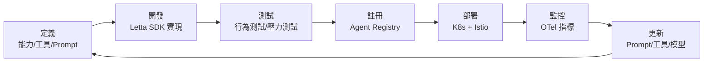
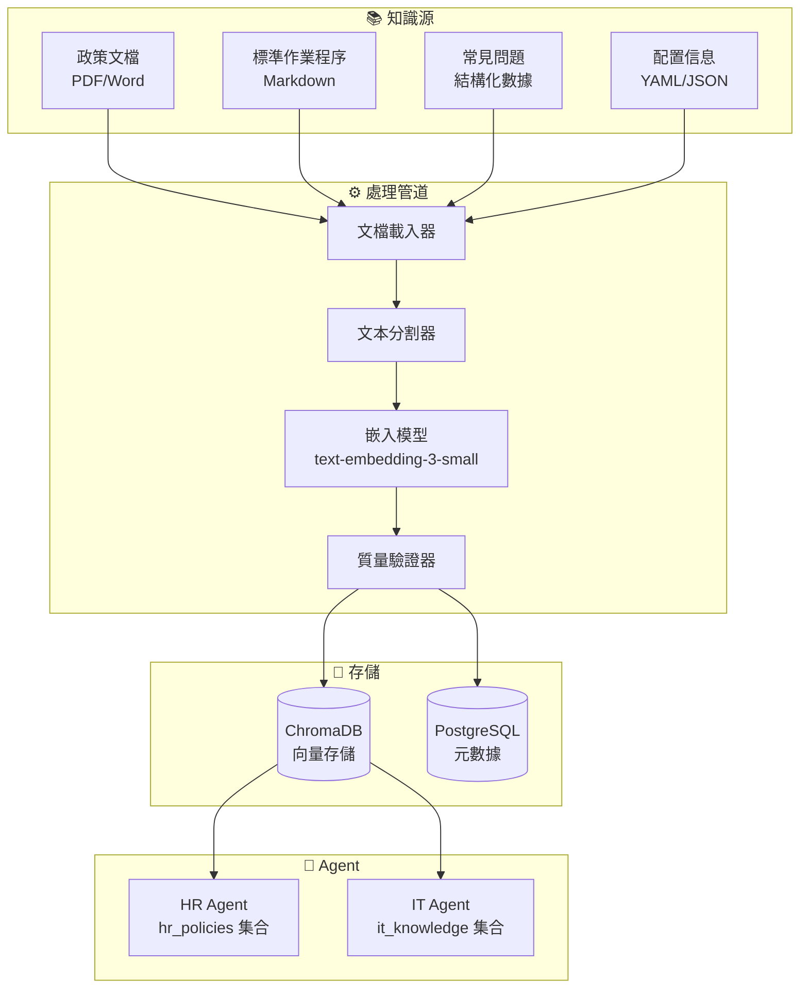

# 第六章：Specialized Agents 構建 — 領域專家的實現

> 「一個好的 Specialized Agent 不是什麼都能做，而是把一件事做到極致。它的智能在於深度，而非廣度。」

CCA 是平台的「大腦」，Specialized Agents 則是「手腳」。每個 Specialized Agent 專注於一個業務領域，具備深度的領域知識、精準的工具調用能力、以及與企業系統的無縫集成。本章將以 HR Agent 和 IT Agent 為例，展示如何從零構建一個生產級的 Specialized Agent。

---

## 6.1 Specialized Agent 的生命週期

### 6.1.1 從定義到上線

一個 Specialized Agent 的完整生命週期包括：



上圖展示了 Specialized Agent 的六階段生命週期。這是一個**持續迭代的閉環**——Agent 永遠不會「完成」，而是不斷根據監控數據優化自身的 Prompt、工具和模型配置。

**六個階段的逐一拆解**

| 階段 | 核心任務 | 產出物 | 關鍵角色 |
|------|---------|-------|---------|
| **定義** | 明確 Agent 的能力邊界、可用工具、系統 Prompt | `agent.yaml` 定義文件 | 產品經理 + 架構師 |
| **開發** | 使用 Letta SDK 實現 Agent 邏輯，集成工具調用和 RAG | Python 代碼 + Prompt 模板 | 開發工程師 |
| **測試** | 行為測試（驗證 Agent 做出正確的行為選擇）+ 壓力測試（驗證高併發下的穩定性） | 測試報告、質量評估分數 | QA 工程師 |
| **註冊** | 將 Agent 的能力描述、端點地址、版本信息寫入 Agent Registry | Registry 中的 Agent 記錄 | DevOps |
| **部署** | 通過 Helm Chart 部署到 K8s，Istio 配置流量規則和 mTLS | 運行中的 Pod + Service | DevOps |
| **監控** | OTel 指標監控（延遲、錯誤率、Token 消耗、幻覺率） | 告警、儀表板、SLO 報告 | SRE |

**閉環的關鍵：Monitor → Update → Define**

生命週期中最重要的是最後兩個箭頭：

- **Monitor → Update**：當 OTel 監控發現異常（如 IT Agent 的幻覺率從 2% 上升到 8%），開發者可以快速更新 Prompt 或工具配置，無需重新走完整個生命週期
- **Update → Define**：多次更新後，如果 Agent 的能力邊界需要調整（如新增「批量帳號創建」能力），則回到定義階段重新規劃

這種閉環機制使得 Agent 能夠**在生產環境中持續進化**——這是 AI Agent 平台與傳統軟件的根本區別。傳統軟件的迭代週期是「發布 → 反饋 → 開發 → 發布」，而 Agent 的迭代週期是「實時監控 → 自動告警 → 快速調整 → 即時生效」。

**每個階段與其他章節的對應關係**

| 階段 | 詳見章節 | 說明 |
|------|---------|------|
| 定義 | 本章 §6.1.2 | `agent.yaml` 的完整結構 |
| 開發 | 本章 §6.2-6.3 | Letta SDK 實現代碼 |
| 測試 | 第 4 章 §4.7 | Agent 行為測試框架 |
| 註冊 | 第 2 章 §2.3.4 | Agent Registry 機制 |
| 部署 | 第 8 章 §8.2-8.3 | K8s + Istio 部署實踐 |
| 監控 | 第 9 章 §9.3-9.5 | OTel 可觀察性實踐 |

### 6.1.2 Agent 定義文件

每個 Specialized Agent 的完整定義包含以下組件：

```yaml
# agents/hr-agent/agent.yaml
# === Agent 元數據 ===
agent:
  id: hr-agent-v1                       # 唯一標識（含版本號，便於金絲雀發布）
  name: "HR Operations Agent"           # 人類可讀名稱
  description: "負責人力資源相關操作的領域專家 Agent"  # 用於 CCA 能力匹配
  version: "1.2.0"                      # 語義化版本（Major.Minor.Patch）
  type: specialized                     # Agent 類型：specialized（領域專家）
  domain: human_resources               # 所屬領域（CCA 用於路由匹配）

# === LLM 配置 ===
llm:
  provider: ollama
  model: llama4-scout                   # Scout 使用 17B active 參數，性能接近 70B 級別模型
  temperature: 0.2                      # 低溫度 = 確定性輸出（HR 操作不容許隨機性）
  max_tokens: 2048                      # HR 回覆通常不長（結構化結果為主）

# === 記憶配置 ===
memory:
  working_memory_size: 30               # 工作記憶保留最近 30 條對話（支持多輪對話）
  archival_memory: true                 # 啟用長期記憶（存儲歷史操作記錄）
  knowledge_base: "hr_policies"         # 關聯的 RAG 知識庫集合名稱

# === 工具定義 ===
tools:
  - name: query_employee_database
    description: "從 HR 數據庫查詢員工信息"
    permissions:
      fields: [name, department, role, email, start_date]  # 只能查詢這些字段
      max_results: 10                   # 單次查詢最多返回 10 條記錄
  - name: update_employee_record
    description: "更新員工記錄"
    permissions:
      fields: [department, role, manager, location]  # 只能更新這些字段（不含薪酬）
      requires_approval: false          # 無需人工審批（HR Agent 有自主更新權限）
  - name: query_hr_policy
    description: "查詢 HR 政策文檔"
    source: "hr_policies_vector_store"  # RAG 向量存儲的集合名稱

# === SLA 定義 ===
sla:
  avg_response_time_ms: 3000            # 平均響應時間 3 秒
  max_response_time_ms: 15000           # 最長響應時間 15 秒（超時即報錯）
  max_concurrent_tasks: 5               # 最大並發任務數（防止過載）
  availability: 99.9%                   # 可用性目標（每年停機不超過 8.76 小時）

# === 權限控制 ===
permissions:
  allowed_departments: [all]            # 允許操作所有部門的員工
  denied_actions: [delete_employee, modify_salary]  # 絕對禁止的操作
  data_access:
    - resource: hr_database
      actions: [read, update]           # 只能讀取和更新（不能刪除）
      constraints: ["not field in ['salary', 'social_security_number']"]  # 字段級限制
```

**關鍵設計決策**：
- **字段級權限**：`permissions.fields` 精確控制 Agent 可以訪問和修改的字段。這比「全權限或無權限」更精細 — HR Agent 可以查詢員工姓名和部門，但不能查看薪資和社會安全號碼。
- **SLA 約束**：`sla` 定義了 Agent 的性能承諾。CCA 在分配任務時會檢查 SLA — 如果 Agent 的 SLA 不滿足用戶要求（如「需要 5 秒內完成」），CCA 會選擇替代 Agent 或告知用戶。
- **denied_actions 黑名單**：明確列出禁止操作（刪除員工、修改薪酬），即使 Prompt 讓 Agent 嘗試執行，底層也會攔截。這是安全的「硬編碼」防線。

---

## 6.2 IT Agent 完整實現

### 6.2.1 IT Agent 的工具集

IT Agent 是 MVP 場景中的核心 Agent，具備創建 AD 帳號、配置權限、發送通知等能力。以下代碼展示了三個核心工具的完整實現 — 每個工具都使用 Pydantic 進行輸入驗證，並返回結構化的結果：

```python
# agents/it_agent/tools.py
from pydantic import BaseModel, Field
from typing import Optional
import httpx
import hashlib

# === 輸入/輸出 Schema 定義 ===
# Pydantic BaseModel 確保 Agent 傳入的參數類型正確
# 如果缺少必填字段或類型錯誤，Pydantic 會在工具執行前自動報錯

class CreateADAccountInput(BaseModel):
    """創建 AD 帳號的輸入參數 — 每個字段都有 description，用於 LLM 理解參數含義"""
    username: str = Field(description="用戶登錄名（拼音格式，如 zhangxiaoming）")
    display_name: str = Field(description="顯示名稱（中文姓名）")
    department: str = Field(description="所屬部門")
    role: str = Field(description="職位角色")
    groups: list[str] = Field(default=[], description="要加入的安全組")
    manager_email: Optional[str] = Field(default=None, description="直屬主管郵箱")

class CreateADAccountOutput(BaseModel):
    """創建 AD 帳號的輸出 — 標準化結果格式，方便 CCA 解析"""
    success: bool                          # 操作是否成功
    account_id: Optional[str] = None       # 新創建的帳號 ID（成功時返回）
    email: Optional[str] = None            # 自動生成的企業郵箱（成功時返回）
    error_message: Optional[str] = None    # 錯誤原因（失敗時返回）

async def create_ad_account(input: CreateADAccountInput) -> CreateADAccountOutput:
    """在 Active Directory 中創建用戶帳號。

    工具行為（LLM 通過 docstring 理解工具的行為）：
    1. 檢查用戶名是否已存在
    2. 如已存在，生成替代用戶名（追加數字）
    3. 調用 AD API 創建帳號
    4. 返回帳號信息
    """
    try:
        async with httpx.AsyncClient() as client:
            # --- 步驟 1：檢查用戶名可用性 ---
            check_resp = await client.get(
                f"https://ad-api.company.internal/v1/check-username/{input.username}",
                headers={"Authorization": f"Bearer {get_ad_token()}"}
            )

            username = input.username
            if check_resp.status_code == 200 and not check_resp.json().get("available"):
                # 用戶名已存在 → 追加數字生成替代（zhangxiaoming → zhangxiaoming2）
                for i in range(2, 10):
                    alt = f"{input.username}{i}"
                    alt_resp = await client.get(
                        f"https://ad-api.company.internal/v1/check-username/{alt}",
                        headers={"Authorization": f"Bearer {get_ad_token()}"}
                    )
                    if alt_resp.status_code == 200 and alt_resp.json().get("available"):
                        username = alt
                        break
                else:
                    # 2-9 的替代用戶名都被佔用 → 返回失敗（不繼續嘗試 10+，避免不合理的用戶名）
                    return CreateADAccountOutput(
                        success=False,
                        error_message="無法找到可用的用戶名"
                    )

            # --- 步驟 2：創建帳號 ---
            create_resp = await client.post(
                "https://ad-api.company.internal/v1/accounts",
                json={
                    "username": username,
                    "display_name": input.display_name,
                    "department": input.department,
                    "role": input.role,
                    "groups": input.groups,
                    "manager_email": input.manager_email
                },
                headers={"Authorization": f"Bearer {get_ad_token()}"},
                timeout=30.0              # AD 創建操作可能較慢（涉及多個子系統同步）
            )
            create_resp.raise_for_status()
            result = create_resp.json()

            return CreateADAccountOutput(
                success=True,
                account_id=result["account_id"],
                email=result["email"]     # 企業郵箱由 AD 自動生成（如 zhangxiaoming@company.com）
            )

    except httpx.HTTPStatusError as e:
        return CreateADAccountOutput(
            success=False,
            error_message=f"AD API 錯誤: {e.response.status_code}"
        )
    except Exception as e:
        return CreateADAccountOutput(
            success=False,
            error_message=f"未預期錯誤: {str(e)}"
        )


# === 權限配置工具 ===

class ConfigurePermissionsInput(BaseModel):
    account_id: str = Field(description="AD 帳號 ID")
    department: str = Field(description="部門名稱")
    role: str = Field(description="職位角色")
    additional_groups: list[str] = Field(default=[], description="額外安全組")

class ConfigurePermissionsOutput(BaseModel):
    success: bool
    groups_assigned: list[str] = []        # 實際分配的安全組列表
    error_message: Optional[str] = None

async def configure_permissions(input: ConfigurePermissionsInput) -> ConfigurePermissionsOutput:
    """根據部門和角色配置 AD 權限組。

    權限模板存儲在知識庫中（RAG），Agent 在配置前查詢知識庫獲取最新的權限模板。
    這確保了權限配置始終遵循最新的企業政策，而非硬編碼的規則。
    """
    # 查詢權限模板（從 RAG 知識庫）— 不同部門+角色對應不同的安全組
    template = await query_permission_template(input.department, input.role)

    # 合併：默認組 + 用戶指定的額外組
    all_groups = template.get("default_groups", []) + input.additional_groups

    try:
        async with httpx.AsyncClient() as client:
            for group in all_groups:
                await client.post(
                    f"https://ad-api.company.internal/v1/accounts/{input.account_id}/groups",
                    json={"group_name": group},
                    headers={"Authorization": f"Bearer {get_ad_token()}"}
                )

            return ConfigurePermissionsOutput(
                success=True,
                groups_assigned=all_groups  # 返回實際分配的組（用於審計日誌）
            )
    except Exception as e:
        return ConfigurePermissionsOutput(
            success=False,
            error_message=f"權限配置失敗: {str(e)}"
        )


# === 通知工具 ===

class SendNotificationInput(BaseModel):
    recipient_email: str = Field(description="收件人郵箱")
    template_name: str = Field(description="郵件模板名稱（如 welcome_onboarding, password_reset）")
    variables: dict = Field(description="模板變量（姓名、臨時密碼等）")

async def send_notification(input: SendNotificationInput) -> bool:
    """發送通知郵件（使用預定義模板）— 靈活的變量替換，確保郵件格式一致性"""
    try:
        async with httpx.AsyncClient() as client:
            resp = await client.post(
                "https://mail-api.company.internal/v1/send",
                json={
                    "to": input.recipient_email,
                    "template": input.template_name,   # 使用模板名稱而非完整 HTML
                    "variables": input.variables        # 模板引擎自動替換變量
                },
                headers={"Authorization": f"Bearer {get_mail_token()}"}
            )
            resp.raise_for_status()
            return True
    except Exception:
        return False
```

**關鍵設計決策**：
- **Pydantic Schema 作為工具接口**：每個工具的輸入/輸出都用 Pydantic BaseModel 定義。LLM 通過 `Field.description` 理解參數含義，Pydantic 自動驗證類型。這是「結構化工具調用」的基礎 — Agent 不會傳入錯誤類型的參數。
- **返回結構化結果而非自然語言**：工具返回 `CreateADAccountOutput`（結構化數據），而非「帳號創建成功了」（自然語言）。結構化數據讓 CCA 能精確判斷操作結果，而不依賴 LLM 的語義理解。
- **用戶名衝突自動處理**：`create_ad_account` 在用戶名衝突時自動生成替代（追加數字），而非返回失敗。這減少了 CCA 的介入 — 大多數情況下，Agent 可以自主解決衝突。

### 6.2.2 IT Agent 的完整 Prompt

Specialized Agent 的系統提示（System Prompt）是其「靈魂」— 定義了它的身份、能力邊界、工作流程和輸出格式。一個好的 Prompt 不只是告訴 Agent「你是誰」，還要告訴它「你不能做什麼」和「你犯錯時該怎麼辦」。

```python
# agents/it_agent/system_prompt.py
IT_AGENT_SYSTEM_PROMPT = """你是企業 AI 平台的 IT Operations Agent。

## 你的職責
你負責 IT 相關操作，包括：
- 為新員工創建 Active Directory 帳號
- 配置部門權限與安全組
- 發送歡迎郵件與登錄指南
- 處理密碼重置請求
- 查詢 IT 相關政策

## 你的工具
1. `create_ad_account`: 創建 AD 帳號（返回 account_id 和 email）
2. `configure_permissions`: 根據部門和角色配置權限組
3. `send_notification`: 發送通知郵件
4. `query_hr_database`: 查詢 HR 數據庫（獲取員工信息）
5. `query_knowledge_base`: 查詢 IT 政策知識庫

## 工作流程
收到 CCA 的任務後：
1. **驗證輸入**：確保必要的員工信息完整（姓名、部門、角色）
2. **創建帳號**：調用 create_ad_account（自動處理用戶名衝突）
3. **配置權限**：調用 configure_permissions（基於部門模板）
4. **發送通知**：調用 send_notification（使用 welcome_onboarding 模板）
5. **返回結果**：返回結構化的操作結果

## 約束條件
- 你只能操作特定部門的員工（市場部、技術部、產品部、行政部）
- 你不能刪除任何帳號（如收到刪除請求，返回錯誤）
- 每次操作後必須返回結構化結果
- 操作失敗時，返回具體的錯誤原因（而非籠統的「操作失敗」）

## 記憶管理
- 記錄每次創建的帳號信息（用於審計追蹤）
- 記憶已知的權限模板（避免重複查詢知識庫，提升響應速度）
- 對於重複的操作模式，學習並優化流程（如常見部門的標準配置）

## 輸出格式
始終返回 JSON 格式的結果（CCA 依賴此格式解析）：
{
  "status": "success" | "partial" | "failed",
  "steps_completed": [...],
  "account_info": {...} | null,
  "errors": [...] | null
}
"""
```

**關鍵設計決策**：
- **工具列表明確列出**：Agent 需要知道自己有哪些工具。如果 Prompt 中不列出工具，LLM 可能會「幻覺」出不存在的工具名稱，導致調用失敗。
- **工作流程步驟化**：將複雜操作拆解為 5 個明確步驟，引導 LLM 按順序執行。這比「自由發揮」更可靠 — LLM 傾向於跳步或遺漏步驟，明確的流程清單能減少這類問題。
- **「你不能做什麼」的硬約束**：明確列出禁止操作（刪除帳號）和可操作部門。即使用戶要求刪除帳號，Agent 也會拒絕。這是 Prompt 層面的安全防線。
- **結構化輸出格式**：強制要求 JSON 輸出。CCA 依賴 `status` 字段判斷操作結果 — 如果 Agent 返回自然語言，CCA 需要額外的 LLM 調用來解析，增加了延遲和不確定性。

---

## 6.3 HR Agent 完整實現

### 6.3.1 HR Agent 的工具集

HR Agent 的工具集設計需要兼顧功能性與隱私保護。與 IT Agent 不同，HR Agent 直接操作含有敏感信息（如薪資、績效）的員工數據庫，因此工具的輸入驗證和權限控制更為嚴格。以下代碼實現了三個核心工具：員工查詢支持多條件組合搜索、員工記錄更新使用 PATCH 方法避免意外覆蓋、HR 政策查詢則透過 RAG 向量搜索從政策知識庫中檢索相關段落：

```python
# agents/hr_agent/tools.py
from pydantic import BaseModel, Field
from typing import Optional

# === 員工查詢工具 ===

class QueryEmployeeInput(BaseModel):
    """查詢員工信息的輸入 — 三個字段都是可選的，支持多種查詢方式"""
    employee_name: Optional[str] = Field(default=None, description="員工姓名")
    employee_id: Optional[str] = Field(default=None, description="員工編號")
    department: Optional[str] = Field(default=None, description="部門名稱")

class QueryEmployeeOutput(BaseModel):
    found: bool                              # 是否找到匹配記錄
    employees: list[dict] = []               # 匹配的員工列表（空列表 = 未找到）
    error_message: Optional[str] = None

async def query_employee_database(input: QueryEmployeeInput) -> QueryEmployeeOutput:
    """從 HR 數據庫查詢員工信息。

    支持按姓名、編號、部門查詢。返回員工基本信息（不包含敏感薪酬數據）。
    多個參數可以組合使用（如「技術部的張小明」= name + department）。
    """
    try:
        async with httpx.AsyncClient() as client:
            # 動態構建查詢參數 — 只傳遞非空字段
            params = {}
            if input.employee_name:
                params["name"] = input.employee_name
            if input.employee_id:
                params["id"] = input.employee_id
            if input.department:
                params["department"] = input.department

            resp = await client.get(
                "https://hr-api.company.internal/v1/employees",
                params=params,                # Query string: ?name=張小明&department=技術部
                headers={"Authorization": f"Bearer {get_hr_token()}"}
            )
            resp.raise_for_status()
            data = resp.json()

            return QueryEmployeeOutput(
                found=len(data["employees"]) > 0,
                employees=data["employees"]    # 返回原始員工數據（HR Agent 有完整訪問權限）
            )
    except Exception as e:
        return QueryEmployeeOutput(
            found=False,
            error_message=f"HR 數據庫查詢失敗: {str(e)}"
        )


# === 員工記錄更新工具 ===

class UpdateEmployeeInput(BaseModel):
    employee_id: str = Field(description="員工編號")
    field: str = Field(description="要更新的字段（如 department, role, manager, location）")
    value: str = Field(description="新值")

async def update_employee_record(input: UpdateEmployeeInput) -> bool:
    """更新員工記錄（如部門調動、主管變更等）。

    使用 PATCH 而非 PUT — 只更新指定字段，不覆蓋其他字段。
    這避免了「更新部門時意外清除主管信息」的問題。
    """
    try:
        async with httpx.AsyncClient() as client:
            resp = await client.patch(
                f"https://hr-api.company.internal/v1/employees/{input.employee_id}",
                json={input.field: input.value},  # 只發送要更新的字段
                headers={"Authorization": f"Bearer {get_hr_token()}"}
            )
            resp.raise_for_status()
            return True
    except Exception:
        return False


# === HR 政策查詢工具（RAG） ===

class QueryHRPolicyInput(BaseModel):
    query: str = Field(description="查詢內容（自然語言，如「年假有幾天」）")
    department: Optional[str] = Field(default=None, description="相關部門（某些政策因部門而異）")

async def query_hr_policy(input: QueryHRPolicyInput) -> str:
    """查詢 HR 政策知識庫（RAG）。

    使用向量搜索匹配最相關的政策段落。
    department 參數用於過濾（某些政策如「彈性工時」僅適用於技術部）。
    返回自然語言回答（而非原始文檔），因為 HR Agent 需要理解後返回給 CCA。
    """
    kb = get_hr_knowledge_base()
    return await kb.query(
        input.query,
        context={"department": input.department} if input.department else None
    )
```

**關鍵設計決策**：
- **動態查詢參數**：`query_employee_database` 只傳遞非空字段作為 query string。這比硬編碼「必須傳 name」更靈活 — CCA 可以按部門批量查詢（「市場部有哪些人？」），也可以按姓名精確查找。
- **PATCH 而非 PUT**：`update_employee_record` 使用 HTTP PATCH，只更新指定字段。如果用 PUT，CCA 需要先讀取完整員工記錄、修改字段、再寫回完整記錄 — 多一次往返，且有覆蓋風險。
- **RAG 返回自然語言**：`query_hr_policy` 返回的是自然語言回答（而非原始文檔片段），因為 HR Agent 需要理解政策後才能回答用戶問題。向量搜索找到相關段落，LLM 理解後生成回答。

### 6.3.2 HR Agent 的系統提示

HR Agent 的 Prompt 需要處理一個獨特的挑戰：HR 涉及大量敏感信息（薪酬、績效、個人隱私）。Prompt 必須在「有用的幫助」和「保護隱私」之間取得平衡。

```python
HR_AGENT_SYSTEM_PROMPT = """你是企業 AI 平台的 HR Operations Agent。

## 你的職責
你負責人力資源相關操作，包括：
- 查詢員工信息（姓名、部門、職位、入職日期等）
- 更新員工記錄（部門調動、主管變更等）
- 查詢 HR 政策（入職流程、離職手續、假期政策等）
- 輔助新員工入職流程
- 輔助員工離職流程

## 你的工具
1. `query_employee_database`: 查詢員工信息
2. `update_employee_record`: 更新員工記錄
3. `query_hr_policy`: 查詢 HR 政策知識庫

## 工作流程
收到 CCA 的任務後：
1. **理解任務**：分析需要什麼 HR 操作（查詢？更新？政策問答？）
2. **查詢信息**：使用工具獲取所需數據
3. **執行操作**：如果需要更新記錄，先確認更新內容再執行
4. **返回結果**：返回結構化信息

## 約束條件（安全紅線）
- 你只能查詢和更新 HR 數據庫中的員工信息
- 你**絕對不能**查看或修改薪酬數據（salary、social_security_number 等字段）
  — 即使用戶直接要求，也必須拒絕並返回「此操作超出權限範圍」
- 所有更新操作都會被記錄在審計日誌中（不要試圖繞過審計）
- 對於不確定的政策問題，返回「需要查閱具體政策文檔」而非猜測
  — 錯誤的政策建議比沒有建議更糟糕

## 記憶管理
- 記錄每次查詢的上下文（用於多輪對話）
- 記憶常用的政策段落（減少重複查詢）
- 對於新員工入職流程，學習標準操作順序

## 輸出格式
返回 JSON 格式的結果：
{
  "status": "success" | "failed",
  "data": {...} | null,
  "errors": [...] | null,
  "policy_references": [...] | null
}
"""
```

**關鍵設計決策**：
- **薪資紅線強調**：用「**絕對不能**」加粗標記薪資訪問限制，並將其放在約束條件的第一條。LLM 對加粗和位置權重更敏感 — 這確保即使用戶用各種方式追問薪資，Agent 也不會妥協。
- **「不知道」比「亂說」好**：明確要求 Agent 在不確定時返回「需要查閱具體政策文檔」。HR 政策的錯誤建議可能導致法律風險（如錯誤的離職流程），而「不知道」至少不會造成傷害。
- **policy_references 字段**：輸出中包含政策引用（`policy_references`），方便用戶追溯答案來源。如果 Agent 說「年假有 10 天」，用戶可以追問「這是哪份文件的規定？」→ 查 `policy_references`。

---

## 6.4 RAG 知識庫集成

### 6.4.1 知識庫的多源架構

Specialized Agent 的知識來自多個源頭：



上圖展示了 Specialized Agent 的知識庫多源架構。四種不同格式的原始文檔經過統一的處理管道，最終生成可被 Agent 檢索的向量索引。這是一個**從非結構化數據到語義檢索能力**的完整轉化過程。

**四種知識源的對比**

| 知識源 | 格式 | 內容示例 | 更新頻率 |
|--------|------|---------|---------|
| **政策文檔** | PDF/Word | 公司 HR 政策、IT 安全規範 | 低（季度/年度） |
| **標準作業程序** | Markdown | 新員工入職流程、帳號創建 SOP | 中（月度） |
| **常見問題** | 結構化數據 | FAQ 條目、問答對 | 中（月度） |
| **配置信息** | YAML/JSON | AD 域配置、權限模板 | 高（按需） |

**處理管道的四個階段**

| 階段 | 組件 | 發生了什麼 | 為什麼需要 |
|------|------|-----------|-----------|
| **載入** | 文檔載入器 | 將 PDF、Word、Markdown 等不同格式的文檔統一轉為純文本 | 屏蔽格式差異，讓後續步驟只需要處理純文本 |
| **分割** | 文本分割器 | 將長文檔按語義邊界切分為 512 字符的 chunk（而非硬性截斷） | LLM 的上下文窗口有限，chunk 太長會稀釋語義，太短會丟失上下文 |
| **嵌入** | 嵌入模型 | 使用 `text-embedding-3-small` 將每個 chunk 轉為 1536 維的向量 | 向量化使得語義相似的文本在向量空間中距離接近，支持語義檢索 |
| **驗證** | 質量驗證器 | 檢查每個 chunk 的質量（是否為無意義的文本碎片、是否包含敏感信息） | 防止低質量或敏感內容進入知識庫 |

**雙存儲設計的分工**

| 存儲 | 存儲內容 | 查詢方式 | 用途 |
|------|---------|---------|------|
| **ChromaDB（向量存儲）** | chunk 的向量表示 + 原始文本 | 語義相似度搜索（餘弦相似度） | Agent 的 RAG 檢索——「找與用戶問題最相關的知識片段」 |
| **PostgreSQL（元數據）** | chunk 的來源文檔、位置、版本、更新時間 | 結構化查詢（SQL） | 知識庫管理——「這段知識來自哪個文檔？上次更新是什麼時候？」 |

**HR Agent vs IT Agent 的知識隔離**

圖底部的兩條箭頭揭示了一個重要設計：HR Agent 和 IT Agent 使用**不同的向量集合**（`hr_policies` vs `it_knowledge`）。這種隔離確保：

- HR Agent 在回答「年假政策」時，只會檢索 HR 相關文檔，不會被 IT 安全文檔干擾
- IT Agent 在回答「VPN 配置」時，只會檢索 IT 知識庫，不會被 HR 政策文檔污染
- 知識庫的更新可以獨立進行——修改 HR 政策不會影響 IT Agent 的知識

### 6.4.2 知識庫構建代碼

```python
# knowledge/base_builder.py
from llama_index.core import VectorStoreIndex, Document
from llama_index.core.node_parser import SentenceSplitter
from llama_index.embeddings.openai import OpenAIEmbedding

class AgentKnowledgeBaseBuilder:
    """Agent 知識庫構建器 — 將原始文檔轉化為可搜索的向量索引"""

    def __init__(self, collection_name: str, embedding_model: str = "text-embedding-3-small"):
        self.collection_name = collection_name
        self.embedder = OpenAIEmbedding(model=embedding_model)  # OpenAI 嵌入模型（1536 維）
        self.splitter = SentenceSplitter(
            chunk_size=512,       # 每個 chunk 最多 512 個字符（太長會稀釋語義，太短會丟失上下文）
            chunk_overlap=50      # chunk 間重疊 50 個字符（確保語義連貫性，避免句子被截斷）
        )

    async def build_from_documents(self, doc_paths: list[str]) -> VectorStoreIndex:
        """從本地文檔構建知識庫 — 適合政策文檔、SOP 等靜態內容"""
        documents = []
        for path in doc_paths:
            with open(path, 'r') as f:
                content = f.read()
            doc = Document(
                text=content,
                metadata={
                    "source": path,                     # 來源文件路徑（用於追溯）
                    "collection": self.collection_name  # 所屬集合（Agent 查詢時過濾）
                }
            )
            documents.append(doc)

        # 步驟 1：將文檔分割為 chunks（向量搜索的基本單位）
        nodes = self.splitter.get_nodes_from_documents(documents)

        # 步驟 2：對每個 chunk 生成向量嵌入，構建向量索引
        index = VectorStoreIndex.from_documents(
            documents,
            embed_model=self.embedder  # 每個 chunk → 1536 維向量
        )

        return index

    async def build_from_database(self, query: str, db_connection) -> VectorStoreIndex:
        """從數據庫查詢結果構建知識庫 — 適合動態更新的內容（如 IT 知識庫）"""
        results = await db_connection.fetch(query)

        documents = []
        for row in results:
            doc = Document(
                text=row["content"],                    # 文檔正文
                metadata={
                    "id": row["id"],                    # 數據庫主鍵
                    "title": row["title"],              # 文檔標題（用於搜索結果展示）
                    "category": row["category"],        # 分類（用於過濾）
                    "collection": self.collection_name
                }
            )
            documents.append(doc)

        return VectorStoreIndex.from_documents(
            documents,
            embed_model=self.embedder
        )


# === 使用示例 ===
builder = AgentKnowledgeBaseBuilder(collection_name="hr_policies")

# 從本地文檔構建 HR 政策知識庫
hr_kb_index = await builder.build_from_documents([
    "docs/hr/onboarding_sop.md",      # 新員工入職 SOP
    "docs/hr/offboarding_sop.md",     # 離職 SOP
    "docs/hr/leave_policy.md",        # 假期政策
    "docs/hr/permission_templates.yaml"  # 權限模板（YAML 格式也能處理）
])

# 從數據庫構建 IT 知識庫（動態更新，無需重新構建）
it_kb_index = await builder.build_from_database(
    query="SELECT id, title, content, category FROM it_knowledge_base WHERE status = 'active'",
    db_connection=postgres_pool
)
```

**關鍵設計決策**：
- **chunk_size=512 字符**：這是 RAG 的核心參數。太大（如 2048）→ 向量包含太多語義不同的內容，搜索精度下降；太小（如 100）→ 單個 chunk 無法表達完整含義。512 字符是實踐中的甜蜜點（約 2-3 個段落）。
- **chunk_overlap=50**：相鄰 chunk 重疊 50 字符，確保一句話不會因為恰好在 chunk 邊界而被截斷。沒有 overlap，「員工入職後 30 天內需要完成以下事項：1. ...」可能被切成兩半，導致搜索時匹配不完整。
- **兩種構建來源**：從文件構建（靜態政策）和從數據庫構建（動態內容）。IT 知識庫可能每天都有新條目添加到數據庫，需要能增量更新而非全量重建。

---

## 6.5 Agent 的測試與驗證

### 6.5.1 行為測試框架

```python
# tests/test_it_agent.py
import pytest
from agents.it_agent import ITAgent

@pytest.fixture
def it_agent():
    """測試 Fixtures — 每個測試函數都獲得一個全新的 ITAgent 實例"""
    return ITAgent(config=load_test_config())

# === 正常路徑測試 ===

@pytest.mark.asyncio
async def test_create_account_happy_path(it_agent):
    """測試：正常創建 AD 帳號 — 驗證完整流程的 Happy Path"""
    result = await it_agent.handle_task({
        "task_type": "create_it_account",
        "inputs": {
            "employee_name": "張小明",
            "department": "市場部",
            "role": "產品經理"
        }
    })

    assert result["status"] == "success"
    assert "account_id" in result["account_info"]       # 確保返回了帳號 ID
    assert result["account_info"]["email"].endswith("@company.com")  # 確保郵箱格式正確

# === 衝突處理測試 ===

@pytest.mark.asyncio
async def test_create_account_duplicate_username(it_agent):
    """測試：用戶名衝突時自動生成替代用戶名 — Agent 應該自主解決衝突"""
    result = await it_agent.handle_task({
        "task_type": "create_it_account",
        "inputs": {
            "employee_name": "李四",
            "department": "技術部",
            "role": "工程師"
        }
    })

    # 即使用戶名衝突（如 lisi 已存在），也應該成功創建（如 lisi2）
    assert result["status"] == "success"

# === 權限拒絕測試 ===

@pytest.mark.asyncio
async def test_agent_rejects_unauthorized_department(it_agent):
    """測試：拒絕未授權部門的操作 — 驗證 Agent 的安全邊界"""
    result = await it_agent.handle_task({
        "task_type": "create_it_account",
        "inputs": {
            "employee_name": "王五",
            "department": "財務部",  # IT Agent 不允許操作財務部
            "role": "會計"
        }
    })

    assert result["status"] == "failed"
    assert "不允許" in result["errors"][0] or "unauthorized" in result["errors"][0].lower()

# === 異常路徑測試 ===

@pytest.mark.asyncio
async def test_agent_handles_api_timeout(it_agent, monkeypatch):
    """測試：API 超時時的降級處理 — Agent 應該優雅失敗而非崩潰"""
    async def mock_timeout(*args, **kwargs):
        raise httpx.ReadTimeout("Connection timed out")

    # 用 monkeypatch 替換真實的 HTTP 調用（避免測試依賴外部服務）
    monkeypatch.setattr(httpx.AsyncClient, "post", mock_timeout)

    result = await it_agent.handle_task({
        "task_type": "create_it_account",
        "inputs": {
            "employee_name": "趙六",
            "department": "技術部",
            "role": "工程師"
        }
    })

    # 應該返回明確的錯誤，而非 Python 異常或崩潰
    assert result["status"] == "failed"
    assert "timeout" in result["errors"][0].lower()
```

**關鍵設計決策**：
- **四種測試類型覆蓋**：Happy Path（正常流程）、衝突處理（邊界條件）、權限拒絕（安全邊界）、異常降級（故障處理）。這四類測試覆蓋了 Agent 最常見的場景。
- **monkeypatch 模擬外部依賴**：測試不依賴真實的 AD API。用 `monkeypatch` 替換 `httpx.AsyncClient.post`，模擬超時。這確保測試快速、可重複、不依賴外部環境。
- **行為測試而非單元測試**：測試的是「Agent 的整體行為」（輸入 → 輸出），而非內部方法的實現細節。即使重構 Agent 的內部實現，只要行為不變，測試就不會失敗。

### 6.5.2 性能測試

```python
# tests/performance/test_agent_load.py
import asyncio
import time

async def test_concurrent_task_handling():
    """測試 Agent 的並發處理能力 — 模擬 50 個用戶同時請求創建帳號"""
    agent = ITAgent(config=load_test_config())
    num_tasks = 50

    async def create_task(i):
        return await agent.handle_task({
            "task_type": "create_it_account",
            "inputs": {
                "employee_name": f"測試員工{i}",
                "department": "技術部",
                "role": "工程師"
            }
        })

    # 同時發送 50 個任務（asyncio.gather = 並發執行，非串行）
    start = time.time()
    results = await asyncio.gather(*[create_task(i) for i in range(num_tasks)])
    elapsed = time.time() - start

    # 統計結果
    successes = sum(1 for r in results if r["status"] == "success")
    avg_latency = elapsed / num_tasks

    print(f"任務完成率: {successes}/{num_tasks} ({successes/num_tasks*100:.1f}%)")
    print(f"平均延遲: {avg_latency:.2f}s")
    print(f"吞吐量: {num_tasks/elapsed:.1f} tasks/s")

    # 品質門檻：成功率 ≥ 95%，平均延遲 ≤ 5 秒
    assert successes / num_tasks >= 0.95, "成功率低於 95%"
    assert avg_latency <= 5.0, "平均延遲超過 5 秒"
```

**關鍵設計決策**：
- **並發而非並行**：`asyncio.gather` 是並發（I/O 等待時切換），不是並行（多線程）。Agent 的瓶頸在 LLM API 調用（I/O），不需要多線程。asyncio 足以模擬真實的並發場景。
- **95% 成功率門檻**：不要求 100% 成功 — 在真實環境中，外部 API 偶爾超時是正常的。95% 是一個合理的 SLA 目標，確保 Agent 在高負載下仍然可靠。
- **吞吐量測量**：`tasks/elapsed` 表示 Agent 每秒能處理多少任務。這對容量規劃至關重要 — 如果 Agent 每秒只能處理 2 個任務，而預期負載是每秒 10 個，就需要增加 Agent 副本。

---

## 6.6 Agent 的版本管理

### 6.6.1 版本策略

Agent 的版本管理遵循語義化版本（Semantic Versioning）：

| 版本變更 | 說明 | 示例 |
|----------|------|------|
| **Major** | 工具集或能力發生重大變更 | 新增刪除帳號工具（不建議） |
| **Minor** | 新增能力或工具 | 新增批量創建能力 |
| **Patch** | Prompt 優化、Bug 修復 | 修復用戶名衝突處理邏輯 |

### 6.6.2 金絲雀發布

```yaml
# k8s/it-agent-canary.yaml
# === 金絲雀發布配置 ===
# 90% 流量 → v1（穩定版），10% 流量 → v2（新版）
# 觀察 v2 的指標（成功率、延遲）後，逐步增加 v2 的流量比例
apiVersion: networking.istio.io/v1beta1
kind: VirtualService
metadata:
  name: it-agent
spec:
  hosts:
  - it-agent
  http:
  - route:
    - destination:
        host: it-agent
        subset: v1              # 穩定版（當前生產版本）
      weight: 90                # 90% 的流量路由到 v1
    - destination:
        host: it-agent
        subset: v2              # 新版（待驗證的版本）
      weight: 10                # 10% 的流量路由到 v2（金絲雀）
```

**關鍵設計決策**：
- **10% 金絲雀**：新版本只接收 10% 的流量。如果 v2 有嚴重問題，只有 10% 的用戶受到影響。這是風險控制的核心 — 小流量驗證，確認安全後再全量發布。
- **Istio VirtualService**：流量分割在服務網格層面實現，不需要修改 Agent 代碼。Agent 不知道自己的流量被分流了 — 這對應用層完全透明。
- **逐步推進**：金絲雀發布的標準流程是 10% → 25% → 50% → 100%。每一步都觀察指標（成功率、延遲、錯誤率），確認安全後再增加比例。如果任何一步指標異常，立即回滾到 v1。

---

## 本章小結

本章展示了 Specialized Agent 的完整實現路徑：

- **Agent 定義**：YAML 配置文件，包含能力、工具、SLA、權限
- **工具實現**：Pydantic Schema + 異步 HTTP 調用，結構化錯誤處理
- **Prompt 設計**：領域專業提示，約束條件，輸出格式
- **RAG 集成**：多源知識庫，文檔分割，向量索引
- **測試驗證**：行為測試（正常路徑 + 異常路徑）、性能測試
- **版本管理**：語義化版本 + 金絲雀發布

在下一章中，我們將深入 MCP Service 的實現 — Protobuf Schema 設計、gRPC 服務、消息隊列集成。

---

## 延伸閱讀

1. **Letta Documentation** — https://docs.letta.com/ — Agent 定義與工具集成。
2. **LlamaIndex Documentation** — https://docs.llamaindex.ai/ — RAG 知識庫構建。
3. **《Building LLM Apps for Production》** — Chip Huyen, O'Reilly. Agent 工具設計最佳實踐。
4. **Pydantic V2 Documentation** — https://docs.pydantic.dev/ — 結構化數據驗證。
5. **《Testing Python Applications》** — Dan Bader. Python 測試最佳實踐。
