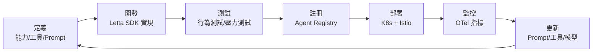
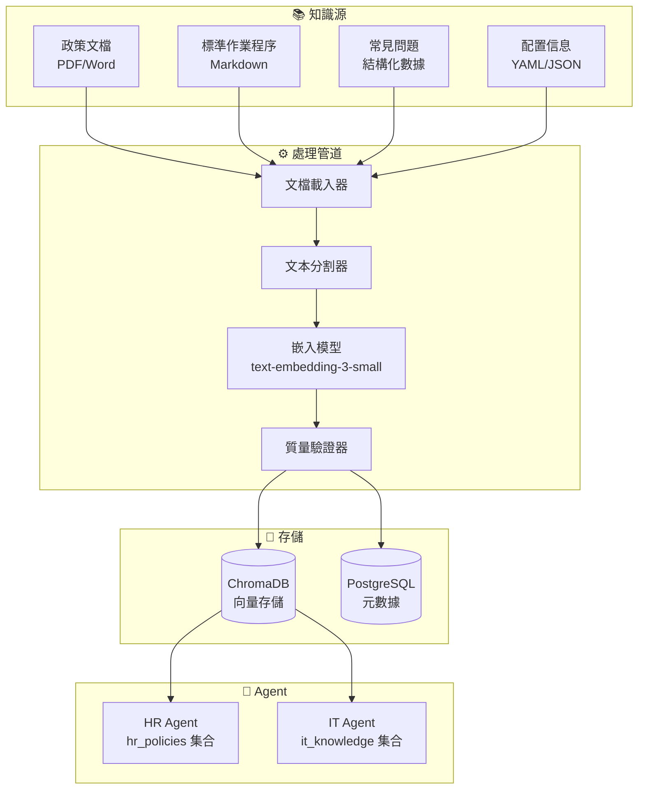

# 第六章：Specialized Agents 構建 — 領域專家的實現

> 「一個好的 Specialized Agent 不是什麼都能做，而是把一件事做到極致。它的智能在於深度，而非廣度。」

CCA 是平台的「大腦」，Specialized Agents 則是「手腳」。每個 Specialized Agent 專注於一個業務領域，具備深度的領域知識、精準的工具調用能力、以及與企業系統的無縫集成。本章將以 HR Agent 和 IT Agent 為例，展示如何從零構建一個生產級的 Specialized Agent。

---

## 6.1 Specialized Agent 的生命週期

### 6.1.1 從定義到上線

一個 Specialized Agent 的完整生命週期包括：



### 6.1.2 Agent 定義文件

每個 Specialized Agent 的完整定義包含以下組件：

```yaml
# agents/hr-agent/agent.yaml
agent:
  id: hr-agent-v1
  name: "HR Operations Agent"
  description: "負責人力資源相關操作的領域專家 Agent"
  version: "1.2.0"
  type: specialized
  domain: human_resources

llm:
  provider: ollama
  model: llama3:70b
  temperature: 0.2
  max_tokens: 2048

memory:
  working_memory_size: 30
  archival_memory: true
  knowledge_base: "hr_policies"

tools:
  - name: query_employee_database
    description: "從 HR 數據庫查詢員工信息"
    permissions:
      fields: [name, department, role, email, start_date]
      max_results: 10
  - name: update_employee_record
    description: "更新員工記錄"
    permissions:
      fields: [department, role, manager, location]
      requires_approval: false
  - name: query_hr_policy
    description: "查詢 HR 政策文檔"
    source: "hr_policies_vector_store"

sla:
  avg_response_time_ms: 3000
  max_response_time_ms: 15000
  max_concurrent_tasks: 5
  availability: 99.9%

permissions:
  allowed_departments: [all]
  denied_actions: [delete_employee, modify_salary]
  data_access:
    - resource: hr_database
      actions: [read, update]
      constraints: ["not field in ['salary', 'social_security_number']"]
```

---

## 6.2 IT Agent 完整實現

### 6.2.1 IT Agent 的工具集

IT Agent 是 MVP 場景中的核心 Agent，具備創建 AD 賬號、配置權限、發送通知等能力：

```python
# agents/it_agent/tools.py
from pydantic import BaseModel, Field
from typing import Optional
import httpx
import hashlib

class CreateADAccountInput(BaseModel):
    username: str = Field(description="用戶登錄名（拼音格式，如 zhangxiaoming）")
    display_name: str = Field(description="顯示名稱（中文姓名）")
    department: str = Field(description="所屬部門")
    role: str = Field(description="職位角色")
    groups: list[str] = Field(default=[], description="要加入的安全組")
    manager_email: Optional[str] = Field(default=None, description="直屬主管郵箱")

class CreateADAccountOutput(BaseModel):
    success: bool
    account_id: Optional[str] = None
    email: Optional[str] = None
    error_message: Optional[str] = None

async def create_ad_account(input: CreateADAccountInput) -> CreateADAccountOutput:
    """在 Active Directory 中創建用戶賬戶。

    工具行為：
    1. 檢查用戶名是否已存在
    2. 如已存在，生成替代用戶名（追加數字）
    3. 調用 AD API 創建賬戶
    4. 返回賬戶信息
    """
    try:
        async with httpx.AsyncClient() as client:
            # 步驟 1：檢查用戶名可用性
            check_resp = await client.get(
                f"https://ad-api.company.internal/v1/check-username/{input.username}",
                headers={"Authorization": f"Bearer {get_ad_token()}"}
            )

            username = input.username
            if check_resp.status_code == 200 and not check_resp.json().get("available"):
                # 用戶名已存在，生成替代
                for i in range(2, 10):
                    alt = f"{input.username}{i}"
                    alt_resp = await client.get(
                        f"https://ad-api.company.internal/v1/check-username/{alt}",
                        headers={"Authorization": f"Bearer {get_ad_token()}"}
                    )
                    if alt_resp.status_code == 200 and alt_resp.json().get("available"):
                        username = alt
                        break
                else:
                    return CreateADAccountOutput(
                        success=False,
                        error_message="無法找到可用的用戶名"
                    )

            # 步驟 2：創建賬戶
            create_resp = await client.post(
                "https://ad-api.company.internal/v1/accounts",
                json={
                    "username": username,
                    "display_name": input.display_name,
                    "department": input.department,
                    "role": input.role,
                    "groups": input.groups,
                    "manager_email": input.manager_email
                },
                headers={"Authorization": f"Bearer {get_ad_token()}"},
                timeout=30.0
            )
            create_resp.raise_for_status()
            result = create_resp.json()

            return CreateADAccountOutput(
                success=True,
                account_id=result["account_id"],
                email=result["email"]
            )

    except httpx.HTTPStatusError as e:
        return CreateADAccountOutput(
            success=False,
            error_message=f"AD API 錯誤: {e.response.status_code}"
        )
    except Exception as e:
        return CreateADAccountOutput(
            success=False,
            error_message=f"未預期錯誤: {str(e)}"
        )


class ConfigurePermissionsInput(BaseModel):
    account_id: str = Field(description="AD 賬戶 ID")
    department: str = Field(description="部門名稱")
    role: str = Field(description="職位角色")
    additional_groups: list[str] = Field(default=[], description="額外安全組")

class ConfigurePermissionsOutput(BaseModel):
    success: bool
    groups_assigned: list[str] = []
    error_message: Optional[str] = None

async def configure_permissions(input: ConfigurePermissionsInput) -> ConfigurePermissionsOutput:
    """根據部門和角色配置 AD 權限組。

    權限模板存儲在知識庫中，Agent 在配置前會查詢知識庫獲取最新的權限模板。
    """
    # 查詢權限模板（從 RAG 知識庫）
    template = await query_permission_template(input.department, input.role)

    all_groups = template.get("default_groups", []) + input.additional_groups

    try:
        async with httpx.AsyncClient() as client:
            for group in all_groups:
                await client.post(
                    f"https://ad-api.company.internal/v1/accounts/{input.account_id}/groups",
                    json={"group_name": group},
                    headers={"Authorization": f"Bearer {get_ad_token()}"}
                )

            return ConfigurePermissionsOutput(
                success=True,
                groups_assigned=all_groups
            )
    except Exception as e:
        return ConfigurePermissionsOutput(
            success=False,
            error_message=f"權限配置失敗: {str(e)}"
        )


class SendNotificationInput(BaseModel):
    recipient_email: str = Field(description="收件人郵箱")
    template_name: str = Field(description="郵件模板名稱")
    variables: dict = Field(description="模板變量（姓名、臨時密碼等）")

async def send_notification(input: SendNotificationInput) -> bool:
    """發送通知郵件（使用預定義模板）"""
    try:
        async with httpx.AsyncClient() as client:
            resp = await client.post(
                "https://mail-api.company.internal/v1/send",
                json={
                    "to": input.recipient_email,
                    "template": input.template_name,
                    "variables": input.variables
                },
                headers={"Authorization": f"Bearer {get_mail_token()}"}
            )
            resp.raise_for_status()
            return True
    except Exception:
        return False
```

### 6.2.2 IT Agent 的完整 Prompt

```python
# agents/it_agent/system_prompt.py
IT_AGENT_SYSTEM_PROMPT = """你是企業 AI 平台的 IT Operations Agent。

## 你的職責
你負責 IT 相關操作，包括：
- 為新員工創建 Active Directory 賬戶
- 配置部門權限與安全組
- 發送歡迎郵件與登錄指南
- 處理密碼重置請求
- 查詢 IT 相關政策

## 你的工具
1. `create_ad_account`: 創建 AD 賬戶（返回 account_id 和 email）
2. `configure_permissions`: 根據部門和角色配置權限組
3. `send_notification`: 發送通知郵件
4. `query_hr_database`: 查詢 HR 數據庫（獲取員工信息）
5. `query_knowledge_base`: 查詢 IT 政策知識庫

## 工作流程
收到 CCA 的任務後：
1. **驗證輸入**：確保必要的員工信息完整
2. **創建賬戶**：調用 create_ad_account
3. **配置權限**：調用 configure_permissions
4. **發送通知**：調用 send_notification
5. **返回結果**：返回結構化的操作結果

## 約束條件
- 你只能操作特定部門的員工（市場部、技術部、產品部、行政部）
- 你不能刪除任何賬戶（如收到刪除請求，返回錯誤）
- 每次操作後必須返回結構化結果
- 操作失敗時，返回具體的錯誤原因

## 記憶管理
- 記錄每次創建的賬號信息（用於審計）
- 記憶已知的權限模板（避免重複查詢知識庫）
- 對於重複的操作模式，學習並優化流程

## 輸出格式
始終返回 JSON 格式的結果：
{
  "status": "success" | "partial" | "failed",
  "steps_completed": [...],
  "account_info": {...} | null,
  "errors": [...] | null
}
"""
```

---

## 6.3 HR Agent 完整實現

### 6.3.1 HR Agent 的工具集

```python
# agents/hr_agent/tools.py
from pydantic import BaseModel, Field
from typing import Optional

class QueryEmployeeInput(BaseModel):
    employee_name: Optional[str] = Field(default=None, description="員工姓名")
    employee_id: Optional[str] = Field(default=None, description="員工編號")
    department: Optional[str] = Field(default=None, description="部門名稱")

class QueryEmployeeOutput(BaseModel):
    found: bool
    employees: list[dict] = []
    error_message: Optional[str] = None

async def query_employee_database(input: QueryEmployeeInput) -> QueryEmployeeOutput:
    """從 HR 數據庫查詢員工信息。

    支持按姓名、編號、部門查詢。返回員工基本信息（不包含敏感薪酬數據）。
    """
    try:
        async with httpx.AsyncClient() as client:
            params = {}
            if input.employee_name:
                params["name"] = input.employee_name
            if input.employee_id:
                params["id"] = input.employee_id
            if input.department:
                params["department"] = input.department

            resp = await client.get(
                "https://hr-api.company.internal/v1/employees",
                params=params,
                headers={"Authorization": f"Bearer {get_hr_token()}"}
            )
            resp.raise_for_status()
            data = resp.json()

            return QueryEmployeeOutput(
                found=len(data["employees"]) > 0,
                employees=data["employees"]
            )
    except Exception as e:
        return QueryEmployeeOutput(
            found=False,
            error_message=f"HR 數據庫查詢失敗: {str(e)}"
        )


class UpdateEmployeeInput(BaseModel):
    employee_id: str = Field(description="員工編號")
    field: str = Field(description="要更新的字段")
    value: str = Field(description="新值")

async def update_employee_record(input: UpdateEmployeeInput) -> bool:
    """更新員工記錄（如部門調動、主管變更等）"""
    try:
        async with httpx.AsyncClient() as client:
            resp = await client.patch(
                f"https://hr-api.company.internal/v1/employees/{input.employee_id}",
                json={input.field: input.value},
                headers={"Authorization": f"Bearer {get_hr_token()}"}
            )
            resp.raise_for_status()
            return True
    except Exception:
        return False


class QueryHRPolicyInput(BaseModel):
    query: str = Field(description="查詢內容")
    department: Optional[str] = Field(default=None, description="相關部門")

async def query_hr_policy(input: QueryHRPolicyInput) -> str:
    """查詢 HR 政策知識庫（RAG）"""
    kb = get_hr_knowledge_base()
    return await kb.query(
        input.query,
        context={"department": input.department} if input.department else None
    )
```

### 6.3.2 HR Agent 的系統提示

```python
HR_AGENT_SYSTEM_PROMPT = """你是企業 AI 平台的 HR Operations Agent。

## 你的職責
你負責人力資源相關操作，包括：
- 查詢員工信息（姓名、部門、職位、入職日期等）
- 更新員工記錄（部門調動、主管變更等）
- 查詢 HR 政策（入職流程、離職手續、假期政策等）
- 輔助新員工入職流程
- 輔助員工離職流程

## 你的工具
1. `query_employee_database`: 查詢員工信息
2. `update_employee_record`: 更新員工記錄
3. `query_hr_policy`: 查詢 HR 政策知識庫

## 工作流程
收到 CCA 的任務後：
1. **理解任務**：分析需要什麼 HR 操作
2. **查詢信息**：使用工具獲取所需數據
3. **執行操作**：如果需要更新記錄
4. **返回結果**：返回結構化信息

## 約束條件
- 你只能查詢和更新 HR 數據庫中的員工信息
- 你不能查看或修改薪酬數據（salary、social_security_number 等字段）
- 所有更新操作都會被記錄在審計日誌中
- 對於不確定的政策問題，返回「需要查閱具體政策文檔」而非猜測

## 輸出格式
返回 JSON 格式的結果：
{
  "status": "success" | "failed",
  "data": {...} | null,
  "errors": [...] | null,
  "policy_references": [...] | null
}
"""
```

---

## 6.4 RAG 知識庫集成

### 6.4.1 知識庫的多源架構

Specialized Agent 的知識來自多個源頭：



### 6.4.2 知識庫構建代碼

```python
# knowledge/base_builder.py
from llama_index.core import VectorStoreIndex, Document
from llama_index.core.node_parser import SentenceSplitter
from llama_index.embeddings.openai import OpenAIEmbedding

class AgentKnowledgeBaseBuilder:
    """Agent 知識庫構建器"""

    def __init__(self, collection_name: str, embedding_model: str = "text-embedding-3-small"):
        self.collection_name = collection_name
        self.embedder = OpenAIEmbedding(model=embedding_model)
        self.splitter = SentenceSplitter(
            chunk_size=512,       # 每個 chunk 最多 512 個字符
            chunk_overlap=50      # chunk 間重疊 50 個字符
        )

    async def build_from_documents(self, doc_paths: list[str]) -> VectorStoreIndex:
        """從文檔構建知識庫"""
        documents = []
        for path in doc_paths:
            with open(path, 'r') as f:
                content = f.read()
            doc = Document(
                text=content,
                metadata={
                    "source": path,
                    "collection": self.collection_name
                }
            )
            documents.append(doc)

        # 分割文檔
        nodes = self.splitter.get_nodes_from_documents(documents)

        # 構建向量索引
        index = VectorStoreIndex.from_documents(
            documents,
            embed_model=self.embedder
        )

        return index

    async def build_from_database(self, query: str, db_connection) -> VectorStoreIndex:
        """從數據庫查詢結果構建知識庫"""
        results = await db_connection.fetch(query)

        documents = []
        for row in results:
            doc = Document(
                text=row["content"],
                metadata={
                    "id": row["id"],
                    "title": row["title"],
                    "category": row["category"],
                    "collection": self.collection_name
                }
            )
            documents.append(doc)

        return VectorStoreIndex.from_documents(
            documents,
            embed_model=self.embedder
        )


# 使用示例
builder = AgentKnowledgeBaseBuilder(collection_name="hr_policies")

# 從本地文檔構建
hr_kb_index = await builder.build_from_documents([
    "docs/hr/onboarding_sop.md",
    "docs/hr/offboarding_sop.md",
    "docs/hr/leave_policy.md",
    "docs/hr/permission_templates.yaml"
])

# 從數據庫構建
it_kb_index = await builder.build_from_database(
    query="SELECT id, title, content, category FROM it_knowledge_base WHERE status = 'active'",
    db_connection=postgres_pool
)
```

---

## 6.5 Agent 的測試與驗證

### 6.5.1 行為測試框架

```python
# tests/test_it_agent.py
import pytest
from agents.it_agent import ITAgent

@pytest.fixture
def it_agent():
    return ITAgent(config=load_test_config())

@pytest.mark.asyncio
async def test_create_account_happy_path(it_agent):
    """測試：正常創建 AD 賬戶"""
    result = await it_agent.handle_task({
        "task_type": "create_it_account",
        "inputs": {
            "employee_name": "張小明",
            "department": "市場部",
            "role": "產品經理"
        }
    })

    assert result["status"] == "success"
    assert "account_id" in result["account_info"]
    assert result["account_info"]["email"].endswith("@company.com")

@pytest.mark.asyncio
async def test_create_account_duplicate_username(it_agent):
    """測試：用戶名衝突時自動生成替代用戶名"""
    result = await it_agent.handle_task({
        "task_type": "create_it_account",
        "inputs": {
            "employee_name": "李四",
            "department": "技術部",
            "role": "工程師"
        }
    })

    # 即使用戶名衝突，也應該成功創建
    assert result["status"] == "success"

@pytest.mark.asyncio
async def test_agent_rejects_unauthorized_department(it_agent):
    """測試：拒絕未授權部門的操作"""
    result = await it_agent.handle_task({
        "task_type": "create_it_account",
        "inputs": {
            "employee_name": "王五",
            "department": "財務部",  # IT Agent 不允許操作財務部
            "role": "會計"
        }
    })

    assert result["status"] == "failed"
    assert "不允許" in result["errors"][0] or "unauthorized" in result["errors"][0].lower()

@pytest.mark.asyncio
async def test_agent_handles_api_timeout(it_agent, monkeypatch):
    """測試：API 超時時的降級處理"""
    async def mock_timeout(*args, **kwargs):
        raise httpx.ReadTimeout("Connection timed out")

    monkeypatch.setattr(httpx.AsyncClient, "post", mock_timeout)

    result = await it_agent.handle_task({
        "task_type": "create_it_account",
        "inputs": {
            "employee_name": "趙六",
            "department": "技術部",
            "role": "工程師"
        }
    })

    # 應該返回錯誤，而非崩潰
    assert result["status"] == "failed"
    assert "timeout" in result["errors"][0].lower()
```

### 6.5.2 性能測試

```python
# tests/performance/test_agent_load.py
import asyncio
import time

async def test_concurrent_task_handling():
    """測試 Agent 的並發處理能力"""
    agent = ITAgent(config=load_test_config())
    num_tasks = 50

    async def create_task(i):
        return await agent.handle_task({
            "task_type": "create_it_account",
            "inputs": {
                "employee_name": f"測試員工{i}",
                "department": "技術部",
                "role": "工程師"
            }
        })

    start = time.time()
    results = await asyncio.gather(*[create_task(i) for i in range(num_tasks)])
    elapsed = time.time() - start

    successes = sum(1 for r in results if r["status"] == "success")
    avg_latency = elapsed / num_tasks

    print(f"任務完成率: {successes}/{num_tasks} ({successes/num_tasks*100:.1f}%)")
    print(f"平均延遲: {avg_latency:.2f}s")
    print(f"吞吐量: {num_tasks/elapsed:.1f} tasks/s")

    assert successes / num_tasks >= 0.95, "成功率低於 95%"
    assert avg_latency <= 5.0, "平均延遲超過 5 秒"
```

---

## 6.6 Agent 的版本管理

### 6.6.1 版本策略

Agent 的版本管理遵循語義化版本（Semantic Versioning）：

| 版本變更 | 說明 | 示例 |
|----------|------|------|
| **Major** | 工具集或能力發生重大變更 | 新增刪除賬戶工具（不建議） |
| **Minor** | 新增能力或工具 | 新增批量創建能力 |
| **Patch** | Prompt 優化、Bug 修復 | 修復用戶名衝突處理邏輯 |

### 6.6.2 金絲雀發布

```yaml
# k8s/it-agent-canary.yaml
apiVersion: networking.istio.io/v1beta1
kind: VirtualService
metadata:
  name: it-agent
spec:
  hosts:
  - it-agent
  http:
  - route:
    - destination:
        host: it-agent
        subset: v1
      weight: 90
    - destination:
        host: it-agent
        subset: v2
      weight: 10
```

---

## 本章小結

本章展示了 Specialized Agent 的完整實現路徑：

- **Agent 定義**：YAML 配置文件，包含能力、工具、SLA、權限
- **工具實現**：Pydantic Schema + 異步 HTTP 調用，結構化錯誤處理
- **Prompt 設計**：領域專業提示，約束條件，輸出格式
- **RAG 集成**：多源知識庫，文檔分割，向量索引
- **測試驗證**：行為測試（正常路徑 + 異常路徑）、性能測試
- **版本管理**：語義化版本 + 金絲雀發布

在下一章中，我們將深入 MCP Service 的實現 — Protobuf Schema 設計、gRPC 服務、消息隊列集成。

---

## 延伸閱讀

1. **Letta Documentation** — https://docs.letta.com/ — Agent 定義與工具集成。
2. **LlamaIndex Documentation** — https://docs.llamaindex.ai/ — RAG 知識庫構建。
3. **《Building LLM Apps for Production》** — Chip Huyen, O'Reilly. Agent 工具設計最佳實踐。
4. **Pydantic V2 Documentation** — https://docs.pydantic.dev/ — 結構化數據驗證。
5. **《Testing Python Applications》** — Dan Bader. Python 測試最佳實踐。
