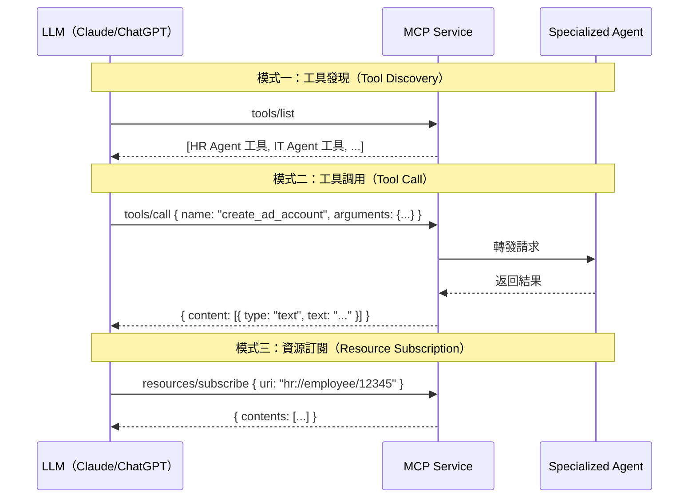
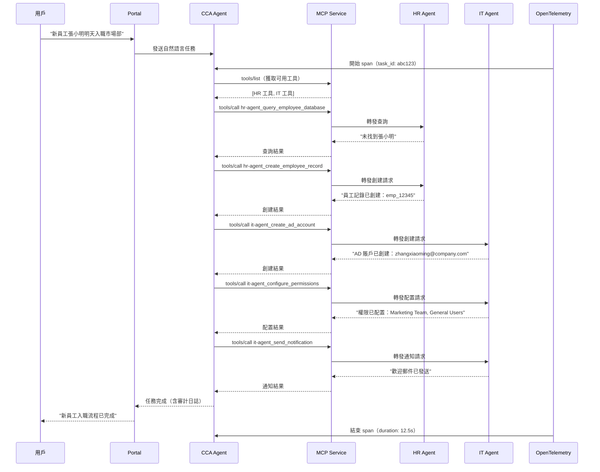

# 第七章：MCP Service 詳解 — 多 Agent 協同的核心引擎

> 「CCA 是大腦，Specialized Agents 是手腳，MCP Service 是神經系統 — 它讓所有組件協同運作。」

MCP Service 是 CCA 與 Specialized Agents 之間的通信中樞。它基於 Model Context Protocol（Anthropic 開源協議），將 Agent 能力以標準化的 Tool Definition 暴露出來，讓 LLM 能通過 JSON-RPC 調用企業能力。本章將展示如何從零構建 MCP Service。

---

## 7.1 MCP 協議深度解析

### 7.1.1 MCP 的通信模型

MCP 基於 JSON-RPC 2.0 協議，支持三種通信模式：



### 7.1.2 JSON-RPC 消息格式

```json
// 請求：調用 IT Agent 創建賬戶
{
  "jsonrpc": "2.0",
  "id": 1,
  "method": "tools/call",
  "params": {
    "name": "create_it_account",
    "arguments": {
      "employee_name": "張小明",
      "department": "市場部",
      "role": "產品經理"
    }
  }
}

// 響應：成功
{
  "jsonrpc": "2.0",
  "id": 1,
  "result": {
    "content": [
      {
        "type": "text",
        "text": "已成功為張小明創建 IT 賬戶。賬號：zhangxiaoming@company.com，臨時密碼：Temp@123456。請提醒用戶首次登錄後修改密碼。"
      }
    ],
    "isError": false
  }
}

// 響應：失敗
{
  "jsonrpc": "2.0",
  "id": 1,
  "result": {
    "content": [
      {
        "type": "text",
        "text": "賬戶創建失敗：市場部（Marketing）不在 IT Agent 的授權部門列表中。錯誤代碼：DEPT_UNAUTHORIZED"
      }
    ],
    "isError": true
  }
}
```

---

## 7.2 MCP Service 核心實現

### 7.2.1 服務架構

```python
# mcp_service/app.py
from fastapi import FastAPI, HTTPException
from pydantic import BaseModel
from typing import Any, Optional
import uuid
import logging

app = FastAPI(title="MCP Service", version="2.0.0")
logger = logging.getLogger("mcp_service")


class JSONRPCRequest(BaseModel):
    jsonrpc: str = "2.0"
    id: str
    method: str
    params: dict = {}

class JSONRPCResponse(BaseModel):
    jsonrpc: str = "2.0"
    id: str
    result: Optional[dict] = None
    error: Optional[dict] = None


class MCPService:
    """MCP 服務核心類"""

    def __init__(self):
        self.registry = AgentRegistry()
        self.audit_logger = AuditLogger()
        self.rate_limiter = RateLimiter()

    async def handle_request(self, request: JSONRPCRequest) -> JSONRPCResponse:
        """處理 JSON-RPC 請求"""
        # 計量計費
        client_id = request.params.get("_client_id", "unknown")
        if not await self.rate_limiter.check_limit(client_id):
            return JSONRPCResponse(
                id=request.id,
                error={"code": -32001, "message": "Rate limit exceeded"}
            )

        # 方法路由
        method = request.method
        if method == "tools/list":
            result = await self.handle_tools_list(request.params)
        elif method == "tools/call":
            result = await self.handle_tools_call(request.params)
        elif method == "resources/read":
            result = await self.handle_resources_read(request.params)
        elif method == "resources/subscribe":
            result = await self.handle_resources_subscribe(request.params)
        else:
            return JSONRPCResponse(
                id=request.id,
                error={"code": -32601, "message": f"Method not found: {method}"}
            )

        return JSONRPCResponse(id=request.id, result=result)


mcp = MCPService()


@app.post("/mcp")
async def mcp_endpoint(request: JSONRPCRequest):
    return await mcp.handle_request(request)
```

### 7.2.2 工具發現（tools/list）

```python
# mcp_service/tools_list.py
async def handle_tools_list(self, params: dict) -> dict:
    """返回所有已註冊的 Agent 工具"""
    tools = []

    for agent in self.registry.get_all_agents():
        for tool in agent.tools:
            tools.append({
                "name": f"{agent.id}_{tool.name}",
                "description": tool.description,
                "inputSchema": tool.input_schema,
                "annotations": {
                    "agent_id": agent.id,
                    "domain": agent.domain,
                    "avg_response_time_ms": agent.sla.avg_response_time_ms,
                    "permissions": tool.permissions
                }
            })

    return {"tools": tools}
```

返回的工具列表示例：

```json
{
  "tools": [
    {
      "name": "hr-agent_query_employee_database",
      "description": "從 HR 數據庫查詢員工信息",
      "inputSchema": {
        "type": "object",
        "properties": {
          "employee_name": {"type": "string", "description": "員工姓名"},
          "department": {"type": "string", "description": "部門名稱"}
        }
      },
      "annotations": {
        "agent_id": "hr-agent-v1",
        "domain": "human_resources",
        "avg_response_time_ms": 2000,
        "permissions": {"fields": ["name", "department", "role", "email"]}
      }
    },
    {
      "name": "it-agent_create_ad_account",
      "description": "在 Active Directory 中創建用戶賬戶",
      "inputSchema": {
        "type": "object",
        "properties": {
          "username": {"type": "string", "description": "用戶登錄名"},
          "display_name": {"type": "string", "description": "顯示名稱"},
          "department": {"type": "string", "description": "所屬部門"},
          "role": {"type": "string", "description": "職位角色"}
        },
        "required": ["username", "display_name", "department", "role"]
      },
      "annotations": {
        "agent_id": "it-agent-v1",
        "domain": "information_technology",
        "avg_response_time_ms": 3000,
        "permissions": {"allowed_departments": ["市場部", "技術部", "產品部", "行政部"]}
      }
    }
  ]
}
```

### 7.2.3 工具調用（tools/call）

```python
# mcp_service/tools_call.py
async def handle_tools_call(self, params: dict) -> dict:
    """調用指定的 Agent 工具"""
    tool_name = params.get("name", "")
    arguments = params.get("arguments", {})

    # 解析工具名稱，找到對應的 Agent
    agent_id, tool_name = self._parse_tool_name(tool_name)
    agent = self.registry.get_agent(agent_id)

    if not agent:
        return {
            "content": [{"type": "text", "text": f"未找到 Agent: {agent_id}"}],
            "isError": True
        }

    # 權限檢查
    if not self._check_permissions(agent, arguments):
        return {
            "content": [{"type": "text", "text": f"權限不足：當前客戶端不允許調用 {tool_name}"}],
            "isError": True
        }

    # 調用 Agent
    start_time = time.time()
    try:
        result = await agent.call_tool(tool_name, arguments)
        duration_ms = (time.time() - start_time) * 1000

        # 審計日誌
        self.audit_logger.log_tool_call(
            agent_id=agent_id,
            tool_name=tool_name,
            arguments=arguments,
            result=result,
            duration_ms=duration_ms
        )

        return {
            "content": [{"type": "text", "text": str(result)}],
            "isError": False
        }
    except Exception as e:
        logger.error(f"工具調用失敗: {agent_id}/{tool_name}: {e}")
        return {
            "content": [{"type": "text", "text": f"工具調用失敗: {str(e)}"}],
            "isError": True
        }
```

---

## 7.3 CCA 與 MCP 的協同流程

### 7.3.1 完整任務執行序列



### 7.3.2 CCA 的工具調用邏輯

```python
# cca/tool_executor.py
from opentelemetry import trace

tracer = trace.get_tracer("cca.tool_executor")

class ToolExecutor:
    """CCA 的工具調用執行器"""

    def __init__(self, mcp_client: MCPClient):
        self.mcp = mcp_client

    async def execute_plan(self, plan: list[ToolCall]) -> list[ToolResult]:
        """執行工具調用計劃"""
        results = []

        for call in plan:
            with tracer.start_as_current_span(f"tool.{call.tool_name}") as span:
                span.set_attribute("tool.name", call.tool_name)
                span.set_attribute("tool.agent", call.agent_id)

                # 調用 MCP
                result = await self.mcp.call_tool(
                    name=call.tool_name,
                    arguments=call.arguments
                )

                # 記錄結果到 span
                span.set_attribute("tool.success", not result.is_error)
                span.set_attribute("tool.duration_ms", result.duration_ms)

                results.append(result)

                # 如果某個工具失敗，檢查是否需要降級
                if result.is_error:
                    should_continue = await self._handle_tool_failure(call, result)
                    if not should_continue:
                        break

        return results

    async def _handle_tool_failure(self, call: ToolCall, result: ToolResult) -> bool:
        """處理工具調用失敗"""
        # 記錄失敗
        logger.warning(f"工具調用失敗: {call.tool_name}: {result.error}")

        # 檢查是否有降級方案
        fallback = self._get_fallback(call.tool_name)
        if fallback:
            logger.info(f"使用降級方案: {fallback.name}")
            result = await self.mcp.call_tool(
                name=fallback.name,
                arguments=call.arguments
            )
            return True

        return False
```

---

## 7.4 消息隊列集成

### 7.4.1 為什麼需要消息隊列

在高並發場景下，同步的 MCP 調用可能導致瓶頸。引入消息隊列可以：

- **解耦**：CCA 和 Specialized Agents 獨立擴縮容
- **削峰**：高併發時緩衝請求
- **可靠性**：消息持久化，避免丟失
- **可觀測性**：消息追蹤，端到端可視化

### 7.4.2 NATS JetStream 集成

```python
# mcp_service/message_queue.py
import nats
import json
import asyncio

class MCPMessageQueue:
    """基於 NATS JetStream 的 MCP 消息隊列"""

    def __init__(self, nats_url: str = "nats://nats.nats:4222"):
        self.nc = None
        self.js = None
        self.nats_url = nats_url

    async def connect(self):
        self.nc = await nats.connect(self.nats_url)
        self.js = self.nc.jetstream()

        # 創建 Stream
        await self.js.add_stream(
            name="mcp_requests",
            subjects=["mcp.>"],
            retention="limits",
            max_msgs=1000000,
            storage="file"
        )

        await self.js.add_stream(
            name="mcp_responses",
            subjects=["mcp.response.>"],
            retention="limits",
            max_msgs=1000000,
            storage="file"
        )

    async def publish_tool_call(self, agent_id: str, tool_name: str, arguments: dict) -> str:
        """發布工具調用請求"""
        request_id = str(uuid.uuid4())
        subject = f"mcp.{agent_id}.{tool_name}"

        message = {
            "request_id": request_id,
            "tool_name": tool_name,
            "arguments": arguments,
            "timestamp": datetime.utcnow().isoformat()
        }

        await self.js.publish(subject, json.dumps(message).encode())
        return request_id

    async def subscribe_to_tool_calls(self, agent_id: str, handler):
        """訂閱工具調用請求"""
        subject = f"mcp.{agent_id}.>"

        async def message_handler(msg):
            data = json.loads(msg.data.decode())
            result = await handler(data)
            # 回覆結果
            await msg.reply(json.dumps(result).encode())

        await self.js.subscribe(subject, cb=message_handler)
```

---

## 7.5 可觀測性集成

### 7.5.1 OpenTelemetry Span 設計

```python
# mcp_service/otel_integration.py
from opentelemetry import trace
from opentelemetry.sdk.trace import TracerProvider
from opentelemetry.sdk.trace.export import BatchSpanProcessor

tracer_provider = TracerProvider()
tracer_provider.add_span_processor(BatchSpanProcessor(OTLPExporter()))
trace.set_tracer_provider(tracer_provider)

tracer = trace.get_tracer("mcp-service")


class MCPTracer:
    """MCP 服務的 OpenTelemetry 跟蹤"""

    @staticmethod
    def trace_tool_call(tool_name: str, agent_id: str):
        """跟蹤工具調用"""
        return tracer.start_as_current_span(
            f"mcp.tool.{tool_name}",
            attributes={
                "mcp.tool.name": tool_name,
                "mcp.agent.id": agent_id,
                "mcp.protocol": "json-rpc-2.0"
            }
        )

    @staticmethod
    def trace_agent_call(agent_id: str, operation: str):
        """跟蹤 Agent 調用"""
        return tracer.start_as_current_span(
            f"mcp.agent.{agent_id}.{operation}",
            attributes={
                "mcp.agent.id": agent_id,
                "mcp.operation": operation
            }
        )
```

### 7.5.2 指標收集

```python
# mcp_service/metrics.py
from opentelemetry.metrics import get_meter

meter = get_meter("mcp-service")

# 工具調用計數
tool_call_counter = meter.create_counter(
    "mcp.tool.calls",
    description="MCP 工具調用次數",
    unit="1"
)

# 工具調用延遲
tool_call_histogram = meter.create_histogram(
    "mcp.tool.duration",
    description="MCP 工具調用延遲",
    unit="ms"
)

# 併發連接數
active_connections = meter.create_up_down_counter(
    "mcp.connections.active",
    description="MCP 服務活躍連接數",
    unit="1"
)
```

---

## 7.6 MCP 的安全設計

### 7.6.1 認證與授權

```python
# mcp_service/auth.py
from fastapi import Depends, HTTPException
from fastapi.security import HTTPBearer

security = HTTPBearer()

class MCPAuthMiddleware:
    """MCP 服務認證中間件"""

    def __init__(self):
        self.api_keys = load_api_keys_from_vault()

    async def authenticate(self, token: str = Depends(security)):
        """驗證 API Key"""
        api_key = token.credentials

        if api_key not in self.api_keys:
            raise HTTPException(status_code=401, detail="Invalid API key")

        client_info = self.api_keys[api_key]
        return {
            "client_id": client_info["client_id"],
            "client_name": client_info["client_name"],
            "allowed_agents": client_info["allowed_agents"],
            "rate_limit": client_info["rate_limit"]
        }

    async def authorize(self, client: dict, tool_name: str) -> bool:
        """檢查客戶端是否有權限調用指定工具"""
        agent_id = tool_name.split("_")[0]
        return agent_id in client["allowed_agents"]
```

---

## 7.7 SSE 串流即時回應

### 7.7.1 為什麼需要 SSE

LLM 工具調用通常耗時較長（3-30 秒）。使用 SSE（Server-Sent Events）可以讓 CCA 即時獲取工具執行進度，而非等待整個操作完成後才返回。

### 7.7.2 SSE 端點實現

```python
# mcp_service/sse_handler.py
from fastapi import FastAPI, Request
from fastapi.responses import StreamingResponse
import asyncio
import json
import uuid

app = FastAPI()


@app.post("/mcp/stream")
async def mcp_stream_endpoint(request: Request):
    """MCP SSE 串流端點"""
    body = await request.json()
    request_id = str(uuid.uuid4())
    tool_name = body.get("name", "")
    arguments = body.get("arguments", {})

    async def event_generator():
        """生成 SSE 事件流"""
        # 1. 開始事件
        yield f"data: {json.dumps({'type': 'started', 'request_id': request_id, 'tool': tool_name})}\n\n"

        # 2. 解析工具名稱，找到 Agent
        agent_id, tool = _parse_tool_name(tool_name)
        agent = registry.get_agent(agent_id)

        if not agent:
            yield f"data: {json.dumps({'type': 'error', 'error': f'Agent not found: {agent_id}'})}\n\n"
            return

        # 3. 發布工具調用到 NATS
        nats_request_id = await mq.publish_tool_call(agent_id, tool, arguments)
        yield f"data: {json.dumps({'type': 'dispatched', 'nats_request_id': nats_request_id})}\n\n"

        # 4. 等待回覆（帶超時）
        try:
            response = await asyncio.wait_for(
                mq.wait_for_response(nats_request_id),
                timeout=60.0
            )

            # 5. 進度事件
            if "progress" in response:
                yield f"data: {json.dumps({'type': 'progress', 'data': response['progress']})}\n\n"

            # 6. 完成事件
            yield f"data: {json.dumps({'type': 'completed', 'result': response['result']})}\n\n"

        except asyncio.TimeoutError:
            yield f"data: {json.dumps({'type': 'error', 'error': 'Tool call timeout after 60s'})}\n\n"

        # 7. 結束事件
        yield f"data: {json.dumps({'type': 'done', 'request_id': request_id})}\n\n"

    return StreamingResponse(
        event_generator(),
        media_type="text/event-stream",
        headers={
            "Cache-Control": "no-cache",
            "Connection": "keep-alive",
            "X-Accel-Buffering": "no"  # 禁用 Nginx 緩衝
        }
    )
```

### 7.7.3 CCA 端 SSE 消費

```python
# cca/mcp_sse_client.py
import httpx
import json

class MCPSSEClient:
    """CCA 的 SSE 客戶端"""

    async def call_tool_streaming(self, tool_name: str, arguments: dict) -> AsyncGenerator[dict, None]:
        """串流調用 MCP 工具"""
        async with httpx.AsyncClient() as client:
            async with client.stream(
                "POST",
                f"{self.mcp_url}/mcp/stream",
                json={"name": tool_name, "arguments": arguments},
                timeout=60.0
            ) as response:
                async for line in response.aiter_lines():
                    if line.startswith("data: "):
                        event = json.loads(line[6:])
                        yield event

    async def execute_tool_with_progress(self, tool_name: str, arguments: dict) -> dict:
        """執行工具並追蹤進度"""
        with tracer.start_as_current_span(f"tool.{tool_name}") as span:
            final_result = None

            async for event in self.call_tool_streaming(tool_name, arguments):
                if event["type"] == "started":
                    span.set_attribute("mcp.request_id", event["request_id"])

                elif event["type"] == "progress":
                    # 更新 Span 進度
                    span.add_event("tool.progress", {"data": str(event["data"])})

                elif event["type"] == "completed":
                    final_result = event["result"]
                    span.set_attribute("tool.success", True)

                elif event["type"] == "error":
                    span.set_attribute("tool.success", False)
                    span.set_attribute("tool.error", event["error"])
                    return {"error": event["error"], "isError": True}

            return final_result or {"error": "No result received", "isError": True}
```

---

## 7.8 熔斷器模式（Circuit Breaker）

### 7.8.1 熔斷器實現

```python
# mcp_service/circuit_breaker.py
import asyncio
import time
from enum import Enum

class CircuitState(Enum):
    CLOSED = "closed"      # 正常運行
    OPEN = "open"          # 熔斷中
    HALF_OPEN = "half_open"  # 嘗試恢復


class CircuitBreaker:
    """熔斷器：防止失敗的 Agent 調用拖垮整體系統"""

    def __init__(
        self,
        agent_id: str,
        failure_threshold: int = 5,
        recovery_timeout: float = 30.0,
        half_open_max_calls: int = 3
    ):
        self.agent_id = agent_id
        self.failure_threshold = failure_threshold
        self.recovery_timeout = recovery_timeout
        self.half_open_max_calls = half_open_max_calls

        self.state = CircuitState.CLOSED
        self.failure_count = 0
        self.success_count = 0
        self.last_failure_time = 0.0
        self.half_open_calls = 0

    async def call(self, func, *args, **kwargs):
        """通過熔斷器執行調用"""
        if self.state == CircuitState.OPEN:
            if time.time() - self.last_failure_time > self.recovery_timeout:
                self.state = CircuitState.HALF_OPEN
                self.half_open_calls = 0
                logger.info(f"Circuit breaker {self.agent_id}: OPEN → HALF_OPEN")
            else:
                raise CircuitBreakerOpenError(
                    f"Circuit breaker OPEN for {self.agent_id}. "
                    f"Retry after {self.recovery_timeout}s"
                )

        if self.state == CircuitState.HALF_OPEN:
            if self.half_open_calls >= self.half_open_max_calls:
                raise CircuitBreakerOpenError(
                    f"Circuit breaker HALF_OPEN limit reached for {self.agent_id}"
                )
            self.half_open_calls += 1

        try:
            result = await func(*args, **kwargs)
            self._on_success()
            return result
        except Exception as e:
            self._on_failure()
            raise

    def _on_success(self):
        if self.state == CircuitState.HALF_OPEN:
            self.success_count += 1
            if self.success_count >= self.half_open_max_calls:
                self.state = CircuitState.CLOSED
                self.failure_count = 0
                self.success_count = 0
                logger.info(f"Circuit breaker {self.agent_id}: HALF_OPEN → CLOSED")
        else:
            self.failure_count = 0

    def _on_failure(self):
        self.failure_count += 1
        self.last_failure_time = time.time()

        if self.state == CircuitState.HALF_OPEN:
            self.state = CircuitState.OPEN
            logger.warning(f"Circuit breaker {self.agent_id}: HALF_OPEN → OPEN")
        elif self.failure_count >= self.failure_threshold:
            self.state = CircuitState.OPEN
            logger.warning(
                f"Circuit breaker {self.agent_id}: CLOSED → OPEN "
                f"(failures: {self.failure_count})"
            )


class CircuitBreakerOpenError(Exception):
    pass
```

### 7.8.2 熔斷器在 MCP Service 中的使用

```python
# mcp_service/breaker_integration.py
class MCPServiceWithBreaker:
    def __init__(self):
        self.breakers: dict[str, CircuitBreaker] = {}
        self.registry = AgentRegistry()

    def get_breaker(self, agent_id: str) -> CircuitBreaker:
        if agent_id not in self.breakers:
            self.breakers[agent_id] = CircuitBreaker(
                agent_id=agent_id,
                failure_threshold=5,
                recovery_timeout=30.0
            )
        return self.breakers[agent_id]

    async def call_tool_with_breaker(self, agent_id: str, tool_name: str, arguments: dict) -> dict:
        breaker = self.get_breaker(agent_id)

        try:
            result = await breaker.call(
                self._raw_tool_call, agent_id, tool_name, arguments
            )
            return {"content": [{"type": "text", "text": str(result)}], "isError": False}

        except CircuitBreakerOpenError as e:
            # 降級：返回友好錯誤，建議用戶稍後重試
            return {
                "content": [{"type": "text", "text": f"服務暫時不可用（{agent_id}）：{str(e)}。請稍後重試。"}],
                "isError": True,
                "_metadata": {"circuit_breaker": "open", "agent_id": agent_id}
            }

    async def _raw_tool_call(self, agent_id: str, tool_name: str, arguments: dict):
        agent = self.registry.get_agent(agent_id)
        if not agent:
            raise ValueError(f"Agent not found: {agent_id}")
        return await agent.call_tool(tool_name, arguments)
```

---

## 7.9 工具版本管理

### 7.9.1 工具版本策略

隨著 Agent 進化，工具的接口（參數、返回值）可能發生變化。MCP Service 需要支持多版本工具共存：

```yaml
# tool_versions.yaml
tools:
  create_ad_account:
    versions:
      v1:
        description: "在 AD 中創建用戶賬戶（基礎版）"
        schema:
          type: object
          properties:
            username: {type: string}
            display_name: {type: string}
          required: [username, display_name]
        agent: it-agent-v1
        status: deprecated  # 即將下線

      v2:
        description: "在 AD 中創建用戶賬戶（增強版，支持 MFA）"
        schema:
          type: object
          properties:
            username: {type: string}
            display_name: {type: string}
            department: {type: string}
            enable_mfa: {type: boolean, default: false}
          required: [username, display_name, department]
        agent: it-agent-v2
        status: active  # 當前活躍版本

      v3:
        description: "在 AD 中創建用戶賬戶（實驗版，支持 SCIM）"
        schema:
          type: object
          properties:
            username: {type: string}
            display_name: {type: string}
            department: {type: string}
            enable_mfa: {type: boolean, default: false}
            scim_provision: {type: boolean, default: false}
          required: [username, display_name, department]
        agent: it-agent-v2
        status: beta  # 測試中
```

### 7.9.2 版本路由實現

```python
# mcp_service/version_router.py
class ToolVersionRouter:
    """工具版本路由"""

    def __init__(self):
        self.versions: dict[str, dict] = {}  # tool_name → {v1: {...}, v2: {...}}
        self.default_version: dict[str, str] = {}  # tool_name → "v2"

    def register_tool_version(self, tool_name: str, version: str, config: dict):
        """註冊工具版本"""
        if tool_name not in self.versions:
            self.versions[tool_name] = {}
        self.versions[tool_name][version] = config

    def set_default(self, tool_name: str, version: str):
        """設置默認版本"""
        self.default_version[tool_name] = version

    def resolve_tool(self, tool_name: str, version: str = None) -> tuple[str, dict]:
        """解析工具版本，返回 (resolved_name, config)"""
        if tool_name not in self.versions:
            raise ValueError(f"Unknown tool: {tool_name}")

        available = self.versions[tool_name]

        if version:
            if version not in available:
                raise ValueError(f"Tool {tool_name} version {version} not found. Available: {list(available.keys())}")
            return f"{tool_name}:{version}", available[version]

        # 使用默認版本
        default = self.default_version.get(tool_name)
        if default and default in available:
            return f"{tool_name}:{default}", available[default]

        # 回退到最新版本
        latest = max(available.keys())
        return f"{tool_name}:{latest}", available[latest]

    def deprecate_version(self, tool_name: str, version: str):
        """棄用某個版本"""
        if tool_name in self.versions and version in self.versions[tool_name]:
            self.versions[tool_name][version]["status"] = "deprecated"
            logger.warning(f"Tool {tool_name}:{version} marked as deprecated")

    def get_tools_list(self) -> list[dict]:
        """返回所有活躍版本的工具列表"""
        tools = []
        for tool_name, versions in self.versions.items():
            for ver, config in versions.items():
                if config.get("status") != "deprecated":
                    tools.append({
                        "name": f"{tool_name}:{ver}",
                        "description": config["description"],
                        "inputSchema": config["schema"],
                        "annotations": {
                            "version": ver,
                            "status": config.get("status", "active"),
                            "agent": config.get("agent"),
                            "is_default": self.default_version.get(tool_name) == ver
                        }
                    })
        return tools
```

---

## 本章小結

本章展示了 MCP Service 的完整實現：

- **協議規範**：JSON-RPC 2.0 消息格式，工具發現/調用/訂閱
- **核心服務**：FastAPI 實現，方法路由，計量計費
- **工具管理**：動態工具註冊，權限檢查，降級處理
- **消息隊列**：NATS JetStream，異步通信，高可用
- **SSE 串流**：即時進度反饋，長時間操作可追蹤
- **熔斷器**：防止失敗 Agent 拖垮系統，自動降級與恢復
- **工具版本管理**：多版本共存、版本路由、灰度切換
- **可觀測性**：OpenTelemetry Span，指標收集
- **安全設計**：API Key 認證，角色授權

MCP Service 是平台的通信中樞，它的穩定性和性能直接影響整個平台的表現。在下一章中，我們將展示如何將這些組件部署到 Kubernetes 雲原生環境。

> **新興標準展望**：多 Agent 協同領域正逐步走向標準化。IETF 的 MACP（Multi-Agent Collaboration Protocol） Internet-Draft 正在定義 Agent 註冊、能力發現與安全交互的規範。未來，本章實現的 MCP Service 可進一步整合 MACP，實現跨組織、跨平台的 Agent 協同能力。

---

## 延伸閱讀

1. **MCP Specification** — https://modelcontextprotocol.io/ — Anthropic 官方協議文檔。
2. **NATS Documentation** — https://docs.nats.io/ — NATS JetStream 消息隊列。
3. **OpenTelemetry Specification** — https://opentelemetry.io/docs/specs/ — 可觀測性標準。
4. **Martin Fowler: Circuit Breaker** — https://martinfowler.com/bliki/CircuitBreaker.html — 熔斷器模式。
5. **《Designing Data-Intensive Applications》** — Martin Kleppmann. 分佈式系統設計經典。
6. **《gRPC: Up and Running》** — Kasun Indrasiri, Prabath Siriwardana, O'Reilly. RPC 框架實戰。
