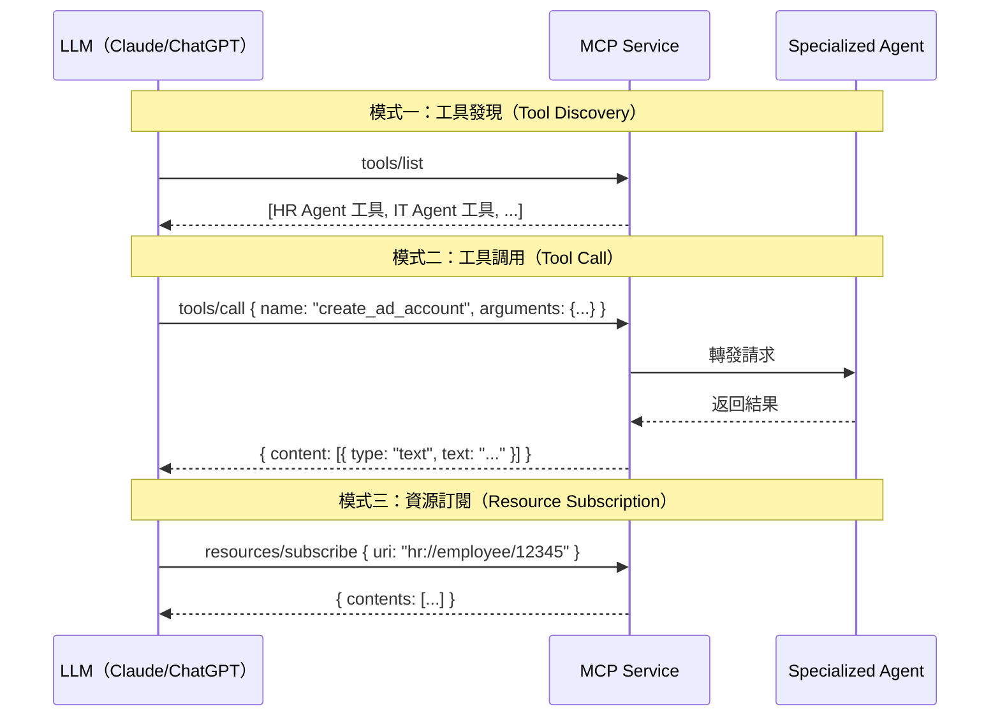

# 第七章：MCP Service 詳解 — 多 Agent 協同的核心引擎

> 「CCA 是大腦，Specialized Agents 是手腳，MCP Service 是神經系統 — 它讓所有組件協同運作。」

MCP Service 是 CCA 與 Specialized Agents 之間的通信中樞。它基於 Model Context Protocol（Anthropic 開源協議），將 Agent 能力以標準化的 Tool Definition 暴露出來，讓 LLM 能通過 JSON-RPC 調用企業能力。本章將展示如何從零構建 MCP Service。

---

## 7.1 MCP 協議深度解析

### 7.1.1 MCP 的通信模型

MCP 基於 JSON-RPC 2.0 協議，支持三種通信模式：



上圖展示了 MCP 協議的三種核心通信模式。這三種模式並非平級並列，而是構成了一個完整的工具生命週期：**發現** → **調用** → **訂閱**。LLM 先知道有什麼工具可用，再決定調用哪個工具，最後可以持續追蹤工具操作的後續變化。

#### 模式一：工具發現（Tool Discovery）

```
LLM ──tools/list──→ MCP Service ──→ 返回所有已註冊工具的 Schema
LLM ←── [HR Agent 工具清單, IT Agent 工具清單, ...] ── MCP Service
```

| 項目 | 說明 |
|------|------|
| **觸發時機** | 對話開始時、工具清單變更時、或 LLM 需要重新確認可用工具時 |
| **方法** | `tools/list` |
| **返回內容** | 所有已註冊工具的名稱、描述、參數 Schema（JSON Schema 格式） |
| **核心價值** | LLM 不需要預先知道有哪些工具——它通過這個調用「看見」所有可用能力，然後根據用戶意圖自主決定調用哪個工具 |

**工具發現的實際運作**：當 CCA 收到用戶請求「幫張小明開通 IT 帳號」時，CCA 的 LLM 首先調用 `tools/list`，MCP Service 返回所有已註冊工具：

```json
{
  "tools": [
    {
      "name": "hr_agent_query_employee",
      "description": "查詢員工基本資料，返回姓名、部門、職位、入職日期",
      "inputSchema": {
        "type": "object",
        "properties": {
          "employee_id": { "type": "string", "description": "員工編號" }
        },
        "required": ["employee_id"]
      }
    },
    {
      "name": "it_agent_create_account",
      "description": "為新員工創建 IT 帳號，包括 Email、AD 帳號、臨時密碼",
      "inputSchema": {
        "type": "object",
        "properties": {
          "employee_name": { "type": "string" },
          "department": { "type": "string" },
          "role": { "type": "string" }
        },
        "required": ["employee_name", "department", "role"]
      }
    },
    {
      "name": "it_agent_reset_password",
      "description": "重置員工 IT 帳號密碼，生成新臨時密碼並發送通知",
      "inputSchema": {
        "type": "object",
        "properties": {
          "employee_id": { "type": "string" }
        },
        "required": ["employee_id"]
      }
    }
  ]
}
```

LLM 拿到這個清單後，結合用戶意圖「幫張小明開通 IT 帳號」，自主判斷需要先查詢員工資料（`hr_agent_query_employee`），再創建帳號（`it_agent_create_account`）——這個「理解意圖 → 選擇工具」的決策完全由 LLM 完成，MCP Service 只負責提供工具清單。

#### 模式二：工具調用（Tool Call）

```
LLM ──tools/call {name, arguments}──→ MCP Service ──轉發──→ Specialized Agent
LLM ←── {content: [{type: "text", text: "..."}]} ── MCP Service ←── 處理結果
```

| 項目 | 說明 |
|------|------|
| **觸發時機** | LLM 決定需要執行某個具體操作時 |
| **方法** | `tools/call` |
| **參數** | `name`（工具名稱）+ `arguments`（工具參數，對應 inputSchema） |
| **返回內容** | `content` 數組（支持 text/image/resource 多種類型）+ `isError` 標誌 |
| **核心價值** | 將 LLM 的「意圖」轉化為「行動」——這是 AI 從「能說」到「能做」的關鍵橋梁 |

**工具調用的完整生命週期**：以「創建 IT 帳號」為例，一次工具調用經歷以下階段：

```
階段 1：CCA 的 LLM 決定調用 it_agent_create_account
    ↓
階段 2：CCA 發送 tools/call 請求到 MCP Service
    ↓
階段 3：MCP Service 根據工具名稱路由到 IT Agent（通過 gRPC）
    ↓
階段 4：IT Agent 執行實際操作（調用 AD API 創建帳號）
    ↓
階段 5：IT Agent 返回結果到 MCP Service
    ↓
階段 6：MCP Service 格式化為 MCP 標準格式返回給 CCA
    ↓
階段 7：CCA 的 LLM 拿到結果，決定下一步（如發送通知給用戶）
```

每個階段都可能失敗：階段 3 可能路由到錯誤的 Agent、階段 4 可能 AD API 超時、階段 6 可能格式化錯誤。MCP Service 在中間層負責錯誤轉換和重試邏輯，確保 LLM 看到的永遠是標準化的 `content` + `isError` 格式。

#### 模式三：資源訂閱（Resource Subscription）

```
LLM ──resources/subscribe {uri}──→ MCP Service
LLM ←── {contents: [...]} ── MCP Service（初始快照）
    ... 隨後當資源變更時 ...
LLM ←── {contents: [...]} ── MCP Service（變更通知，主動推送）
```

| 項目 | 說明 |
|------|------|
| **觸發時機** | LLM 需要持續追蹤某個實體的狀態變化時（如員工入職流程進度） |
| **方法** | `resources/subscribe` |
| **參數** | `uri`（資源標識符，如 `hr://employee/12345`） |
| **返回內容** | 初始資源快照 + 後續變更的主動推送 |
| **核心價值** | 將「一次性的工具調用」升級為「持續的狀態感知」——Agent 可以被動接收外部變化，而非反覆輪詢 |

**資源訂閱 vs 工具調用的關鍵區別**：

| 維度 | 工具調用 (Tool Call) | 資源訂閱 (Resource Subscription) |
|------|---------------------|----------------------------------|
| **通信方向** | 請求-響應（同步） | 訂閱-推送（異步） |
| **數據流** | LLM 主動拉取 | MCP Service 主動推送 |
| **時機** | 一次性 | 持續性 |
| **典型場景** | 創建帳號、查詢資料 | 追蹤入職流程進度、監聽新任務到達 |
| **效率** | 每次需要 LLM 發起請求 | 資源變更時自動通知，無需輪詢 |

**資源訂閱的實際運作場景**：當 HR Agent 創建了新員工資料後，CCA 可能需要追蹤「入職流程是否完成」。CCA 訂閱 `hr://onboarding/12345`，初始返回當前狀態 `{status: "pending_ad_account"}`。當 IT Agent 完成帳號創建後，MCP Service 主動推送 `{status: "ad_account_created", ...}`。CCA 的 LLM 看到狀態變化，自動決定下一步操作（如通知用戶帳號已開通）。

#### 三種模式的協同關係

在實際的企業場景中，三種模式通常按以下順序協同工作：

```
1. 工具發現：CCA 啟動時調用 tools/list，獲取所有可用工具
   ↓
2. 用戶發送請求：「幫新員工張小明辦理入職」
   ↓
3. 工具調用：CCA 依次調用 hr_agent_query_employee → it_agent_create_account
   ↓
4. 資源訂閱：CCA 訂閱 hr://onboarding/12345，追蹤入職流程進度
   ↓
5. 推送更新：IT Agent 完成帳號創建 → MCP Service 推送狀態變化
   ↓
6. 工具調用：CCA 根據狀態變化，調用 hr_agent_send_welcome_email
```

這種「發現 → 調用 → 訂閱」的三段式設計，讓 MCP 成為一個完整的 Agent 能力中介層：LLM 不需要知道底層有多少個 Agent、每個 Agent 用什麼語言實現、通信協議是什麼——它只需要與 MCP Service 的統一介面交互。

### 7.1.2 JSON-RPC 消息格式

以下展示了 MCP 通信中最常見的三種 JSON-RPC 消息：工具調用請求、成功響應和失敗響應。每個消息都包含 `jsonrpc` 版本標識和用於匹配請求與響應的 `id` 字段，而 `isError` 標誌則將業務層面的成敗與 HTTP 狀態碼分離開來：

```json
// === 請求：調用 IT Agent 創建帳號 ===
// MCP 通信基於 JSON-RPC 2.0 標準格式
{
  "jsonrpc": "2.0",                       // 協議版本（固定值）
  "id": 1,                                 // 請求 ID（用於匹配響應 — 一個 id 對應一個 result）
  "method": "tools/call",                  // 方法名：工具調用（與 tools/list、resources/read 並列）
  "params": {
    "name": "create_it_account",           // 工具名稱（格式：{agent_id}_{tool_name}）
    "arguments": {
      "employee_name": "張小明",            // 工具參數（對應 Pydantic Schema 定義的字段）
      "department": "市場部",
      "role": "產品經理"
    }
  }
}

// === 響應：成功 ===
// 成功時 result 包含 content（MCP 標準格式）和 isError 標誌
{
  "jsonrpc": "2.0",
  "id": 1,                                 // 同一個 id — 客戶端通過它匹配請求與響應
  "result": {
    "content": [
      {
        "type": "text",                    // content 是數組，支持多種類型（text、image 等）
        "text": "已成功為張小明創建 IT 帳號。帳號：zhangxiaoming@company.com，臨時密碼：Temp@123456。請提醒用戶首次登錄後修改密碼。"
      }
    ],
    "isError": false                       // false = 成功；true = 失敗（與 HTTP 狀態碼分離）
  }
}

// === 響應：失敗 ===
// 失敗時 isError=true，text 中包含錯誤原因和錯誤代碼
{
  "jsonrpc": "2.0",
  "id": 1,
  "result": {
    "content": [
      {
        "type": "text",
        "text": "帳號創建失敗：市場部（Marketing）不在 IT Agent 的授權部門列表中。錯誤代碼：DEPT_UNAUTHORIZED"
      }
    ],
    "isError": true                        // MCP 用 isError 標誌失敗，而非 HTTP 狀態碼
  }
}
```

**關鍵設計決策**：
- **JSON-RPC 2.0 而非 REST**：MCP 選擇 JSON-RPC 而非 REST API，因為工具調用是「動作」（RPC）而非「資源操作」（CRUD）。`tools/call` 是一個 RPC 方法，不需要映射到 HTTP 動詞（GET/POST/PUT/DELETE）。
- **isError 與 HTTP 200 分離**：即使工具執行失敗，HTTP 響應仍然是 200（因為 MCP 協議本身處理成功/失敗）。這與 REST API 不同 — REST 中 4xx/5xx 表示失敗，而 MCP 用 `isError` 字段。這種分離讓錯誤處理更精細（如「部分成功」場景）。
- **content 數組格式**：`content` 是一個數組，支持多種類型（text、image、resource）。這為未來擴展預留了空間 — 如 Agent 返回一張圖片（如權限配置截圖），可以用 `{"type": "image", "data": "base64..."}`。

---

## 7.2 MCP Service 核心實現

### 7.2.1 服務架構

MCP Service 的核心是一個 FastAPI 應用，負責接收 JSON-RPC 諸求、路由到對應的處理器、並整合限流和審計日誌等企業級能力。以下代碼實現了 `MCPService` 類和 HTTP 端點：在請求進入時先經過限流檢查，然後根據 `method` 字段分發到 `tools/list`、`tools/call`、`resources/read` 或 `resources/subscribe` 四個處理器之一：

```python
"""
MCP Service 核心實現 —— 企業級 MCP Server 範例
==========================================================
職責：
1. 暴露 /mcp 端點（HTTP + JSON-RPC 2.0）
2. 管理 Agent Registry（Agent 註冊/註銷）
3. 處理 4 種核心方法：tools/list, tools/call, resources/read, resources/subscribe
4. 整合限流（Rate Limiter）和審計日誌（Audit Logger）
"""
# mcp_service/app.py
from fastapi import FastAPI, HTTPException
from pydantic import BaseModel
from typing import Any, Optional
import uuid
import logging

app = FastAPI(title="MCP Service", version="2.0.0")
logger = logging.getLogger("mcp_service")


# ====== 數據模型 ======
class JSONRPCRequest(BaseModel):
    """JSON-RPC 2.0 請求 —— 所有 MCP 通信的統一入口格式"""
    jsonrpc: str = "2.0"                    # 協議版本（固定值）
    id: str                                 # 請求 ID（客戶端用於匹配響應）
    method: str                             # 方法名：tools/list, tools/call, resources/read 等
    params: dict = {}                       # 方法參數（結構由 method 決定）

class JSONRPCResponse(BaseModel):
    """JSON-RPC 2.0 響應 —— 成功返回 result，失敗返回 error"""
    jsonrpc: str = "2.0"
    id: str                                 # 與請求相同的 id
    result: Optional[dict] = None           # 成功時返回結果
    error: Optional[dict] = None            # 失敗時返回 {code, message}


# ====== MCP Service 核心 ======
class MCPService:
    """MCP Server 的核心類 —— 整合 Agent Registry、審計日誌、限流"""

    def __init__(self):
        self.registry = AgentRegistry()     # Agent 注册中心：管理所有已註冊的 Agent
        self.audit_logger = AuditLogger()   # 審計日誌：記錄所有工具調用（合規需求）
        self.rate_limiter = RateLimiter()   # 限流器：防止 Agent 被過度調用（每個 client_id 獨立計數）

    async def handle_request(self, request: JSONRPCRequest) -> JSONRPCResponse:
        """統一請求路由 —— 先限流檢查，再按 method 分發到對應處理器"""
        # 第一道防線：限流 —— 企業場景中防止某個 Agent 消費過多資源
        client_id = request.params.get("_client_id", "unknown")
        if not await self.rate_limiter.check_limit(client_id):
            return JSONRPCResponse(
                id=request.id,
                error={"code": -32001, "message": "Rate limit exceeded"}
            )  # 自定義錯誤碼：-32001 = 限流（非 JSON-RPC 標準）

        # 方法路由：根據 method 名稱分發到對應處理器
        method = request.method
        if method == "tools/list":
            result = await self.handle_tools_list(request.params)
        elif method == "tools/call":
            result = await self.handle_tools_call(request.params)
        elif method == "resources/read":
            result = await self.handle_resources_read(request.params)
        elif method == "resources/subscribe":
            result = await self.handle_resources_subscribe(request.params)
        else:
            return JSONRPCResponse(
                id=request.id,
                error={"code": -32601, "message": f"Method not found: {method}"}
            )  # -32601 = JSON-RPC 標準錯誤碼：Method not found

        return JSONRPCResponse(id=request.id, result=result)


# ====== 全局實例 + HTTP 端點 ======
mcp = MCPService()                          # 全局單例（生產環境中需要改為 lifespan 管理）


@app.post("/mcp")
async def mcp_endpoint(request: JSONRPCRequest):
    """MCP 統一入口 —— 所有 JSON-RPC 請求都通過此端點"""
    return await mcp.handle_request(request)  # FastAPI 自動序列化為 JSON
```

**關鍵設計決策**：
- **限流放在路由之前**：`rate_limiter.check_limit()` 在方法路由之前執行，確保即使路由邏輯有 bug，限流仍然生效。這是「安全前置」原則 — 防禦層越靠近入口，越難繞過。
- **限流粒度 = client_id**：每個 Agent（或 CCA）作為獨立的 client_id 進行限流，防止某個 Agent 消耗過多資源。企業場景中，一個失控的 Agent 可能發起數千次 tools/call，影響其他 Agent 的 SLA。
- **_client_id 在 params 中**：`_client_id` 通過 params 傳遞（帶下劃線前綴表示元數據），而非 HTTP Header。這是因為 MCP 協議是 JSON-RPC over HTTP，客戶端可能不控制 HTTP Header（如通過消息隊列轉發）。
- **全局單例的局限**：當前 `mcp = MCPService()` 是全局單例，在多進程/多 Pod 場景下需要改為 lifespan 管理（uvicorn 的 --workers 或 Kubernetes 多副本）。審計日誌和限流器需要外置到 Redis（限流）和 Kafka（審計）。

### 7.2.2 工具發現（tools/list）

工具發現是 MCP 協議的基礎能力 — CCA 啟動時調用 `tools/list`，獲取所有已註冊 Agent 的工具列表。每個工具包含名稱、描述、輸入 Schema 和路由元數據（Agent ID、業務域、SLA、權限範圍）。CCA 的 LLM 根據這些信息決定「這個任務應該交給哪個 Agent」：

```python
# mcp_service/tools_list.py
async def handle_tools_list(self, params: dict) -> dict:
    """
    工具發現 —— 返回所有已註冊 Agent 的工具列表
    ================================================================
    CCA 啟動時調用此方法，獲取每個 Agent 能做什麼。
    CCA 的 LLM 根據返回的工具列表，決定「這個任務應該交給哪個 Agent」。
    """
    tools = []

    # 遍歷所有已註冊 Agent，展平其工具列表
    # 結果格式遵循 MCP 標準：每個工具包含 name, description, inputSchema
    for agent in self.registry.get_all_agents():
        for tool in agent.tools:
            tools.append({
                # 工具命名格式：{agent_id}_{tool_name}
                # 這確保跨 Agent 工具名唯一（兩個 Agent 不可能有相同的 agent_id）
                "name": f"{agent.id}_{tool.name}",
                "description": tool.description,       # LLM 用此字段理解工具用途
                "inputSchema": tool.input_schema,      # JSON Schema（LLM 用此字段生成參數）
                "annotations": {
                    # annotations 是 MCP 擴展字段（非標準），
                    # 用於向 CCA 提供路由決策的元數據
                    "agent_id": agent.id,              # 哪個 Agent 擁有此工具
                    "domain": agent.domain,            # 業務域（如 human_resources）
                    "avg_response_time_ms": agent.sla.avg_response_time_ms,  # SLA 指標
                    "permissions": tool.permissions    # 權限範圍（如允許查詢的字段）
                }
            })

    return {"tools": tools}
```

**關鍵設計決策**：
- **工具命名 `{agent_id}_{tool_name}`**：跨 Agent 全局唯一命名確保 CCA 的 LLM 不會混淆不同 Agent 的同名工具（如兩 Agent 都有 `query` 工具）。MCP 協議本身不強制命名規則，此格式是企業層面的約定。
- **`annotations` 企業擴展**：MCP 標準的 `tools/list` 響應只包含 `name`、`description`、`inputSchema`。`annotations` 是非標準擴展，用於向 CCA 提供路由決策的元數據（Agent ID、業務域、SLA、權限）。這比讓 CCA 自行推斷更可靠。
- **`avg_response_time_ms` SLA 指標**：CCA 可以用此字段做「最快響應」路由——當多個 Agent 有相似能力時，選擇 SLA 更好的 Agent。這類似 CDN 的邊緣節點選擇策略。

返回的工具列表示例：

```json
// === tools/list 響應示例 ===
// CCA 收到此響應後，將工具列表注入 Prompt，讓 LLM 決定路由
{
  "tools": [
    {
      "name": "hr-agent_query_employee_database",
      // ↑ 命名格式：{agent_id}_{tool_name}，確保全局唯一
      "description": "從 HR 數據庫查詢員工信息",
      // ↑ LLM 根據 description 理解工具用途，決定是否路由到此工具
      "inputSchema": {
        "type": "object",
        "properties": {
          "employee_name": {"type": "string", "description": "員工姓名"},
          "department": {"type": "string", "description": "部門名稱"}
        }
      },
      // ↑ JSON Schema 格式 —— LLM 根據此定義生成符合要求的參數
      "annotations": {
        // ↓ annotations 是 CCA 路由決策的關鍵元數據（非 MCP 標準，企業擴展）
        "agent_id": "hr-agent-v1",
        "domain": "human_resources",
        "avg_response_time_ms": 2000,
        // ↑ SLA 指標 —— CCA 可據此選擇響應更快的 Agent（如多個 Agent 有相似工具）
        "permissions": {"fields": ["name", "department", "role", "email"]}
        // ↑ 權限範圍 —— 限制此工具能查詢的字段（最小權限原則）
      }
    },
    {
      "name": "it-agent_create_ad_account",
      "description": "在 Active Directory 中創建用戶帳號",
      "inputSchema": {
        "type": "object",
        "properties": {
          "username": {"type": "string", "description": "用戶登錄名"},
          "display_name": {"type": "string", "description": "顯示名稱"},
          "department": {"type": "string", "description": "所屬部門"},
          "role": {"type": "string", "description": "職位角色"}
        },
        "required": ["username", "display_name", "department", "role"]
        // ↑ required 字段 —— LLM 必須生成這些參數，否則工具調用會失敗
      },
      "annotations": {
        "agent_id": "it-agent-v1",
        "domain": "information_technology",
        "avg_response_time_ms": 3000,
        "permissions": {"allowed_departments": ["市場部", "技術部", "產品部", "行政部"]}
        // ↑ allowed_departments —— 此工具只能為這些部門創建帳號（RBAC 權限控制）
      }
    }
  ]
}
```

**關鍵設計決策**：
- **兩工具的參數差異**：`hr-agent_query_employee_database` 只需 `employee_name` + `department`（查詢），而 `it-agent_create_ad_account` 需要 4 個 `required` 參數（寫入操作需要更多信息）。required 字段的嚴格程度反映了操作的「破壞性」——寫入操作比查詢更謹慎。
- **`permissions` 差異化設計**：HR 工具的 `fields` 限制可查詢的字段（姓名、部門、角色、邮箱），IT 工具的 `allowed_departments` 限制可操作的部門。兩種權限模型體現了「最小權限原則」的不同維度——數據列級別 vs 業務範圍級別。
- **SLA 差異**：HR 查詢 2 秒 vs IT 創建 3 秒。CCA 可以在 Prompt 中將 SLA 信息傳遞給用戶（「IT 帳號創建大約需要 3 秒」），提升用戶體驗的可預期性。

### 7.2.3 工具調用（tools/call）

工具調用是 MCP 協議中最核心的方法 — CCA 透過 `tools/call` 觸發 Agent 執行具體操作。以下代碼實現了完整的調用流程：先從工具名中解析出 Agent ID，再進行權限檢查，最後異步調用 Agent 並將結果記錄到審計日誌。整個流程分為「解析 → 權限 → 調用 → 審計」四個階段，每層職責單一：

```python
# mcp_service/tools_call.py
async def handle_tools_call(self, params: dict) -> dict:
    """
    工具調用 —— CCA 通過 MCP 調用 Agent 的具體工具
    ================================================================
    流程：解析工具名 → 找到 Agent → 權限檢查 → 調用 → 審計日誌
    這是 MCP 協議中最核心的方法，所有 Agent 能力都通過此方法暴露。
    """
    tool_name = params.get("name", "")
    arguments = params.get("arguments", {})

    # 第一步：解析工具名稱（格式：{agent_id}_{tool_name}）
    # 例如 "it-agent_create_ad_account" → agent_id="it-agent", tool_name="create_ad_account"
    agent_id, tool_name = self._parse_tool_name(tool_name)
    agent = self.registry.get_agent(agent_id)

    if not agent:
        return {
            "content": [{"type": "text", "text": f"未找到 Agent: {agent_id}"}],
            "isError": True                    # MCP 標準格式：content + isError
        }

    # 第二步：權限檢查 —— 在調用 Agent 之前驗證調用方是否有權限
    # 這是企業級 MCP 的關鍵差異：不僅驗證工具是否存在，還驗證「誰可以調用」
    if not self._check_permissions(agent, arguments):
        return {
            "content": [{"type": "text", "text": f"權限不足：當前客戶端不允許調用 {tool_name}"}],
            "isError": True
        }

    # 第三步：調用 Agent 並計時
    start_time = time.time()
    try:
        result = await agent.call_tool(tool_name, arguments)  # 異步調用（支持長時間運行）
        duration_ms = (time.time() - start_time) * 1000

        # 第四步：審計日誌 —— 記錄每次工具調用（合規需求 + 效能分析）
        # 每條記錄包含：誰（agent_id）、做什麼（tool_name）、輸入（arguments）、
        # 結果（result）、耗時（duration_ms）
        self.audit_logger.log_tool_call(
            agent_id=agent_id,
            tool_name=tool_name,
            arguments=arguments,
            result=result,
            duration_ms=duration_ms          # 效能指標：用於 SLA 監控
        )

        return {
            "content": [{"type": "text", "text": str(result)}],
            "isError": False
        }
    except Exception as e:
        logger.error(f"工具調用失敗: {agent_id}/{tool_name}: {e}")
        return {
            "content": [{"type": "text", "text": f"工具調用失敗: {str(e)}"}],
            "isError": True                    # 失敗時返回錯誤信息（CCA 可據此重試或路由到其他 Agent）
        }
```

**關鍵設計決策**：
- **三層防禦（解析 → 權限 → 調用）**：`_parse_tool_name` 防止工具名注入（如 `../../admin/delete_user`），`_check_permissions` 防止越權調用（如 HR Agent 的工具被 IT Agent 調用）。這種分層設計讓每層職責單一、易於測試。
- **工具名 = 路由鍵**：`{agent_id}_{tool_name}` 格式將路由信息編碼在工具名中，而非分開傳遞。這簡化了 MCP 協議（一個字段同時承載路由和調用），但也帶來了長度限制問題（Agent ID 不能太長）。
- **審計日誌的雙重用途**：不僅用於合規（「誰在什麼時候做了什麼」），還用於效能監控（`duration_ms` 可對比 SLA 指標，觸發告警）。審計日誌應寫入 Kafka 而非本地文件，確保高吞吐和持久化。

---

## 7.3 CCA 與 MCP 的協同流程

### 7.3.1 完整任務執行序列


上圖展示了「新員工入職」這個企業級場景的完整端到端序列——從用戶發出自然語言指令，到所有 Agent 協同完成多步操作，再到結果回傳給用戶。這不只是 MCP 協議的展示，而是整個 AI Agent Platform 的協同縮影。以下逐一拆解每個關鍵階段。

#### 整體流程結構

整個序列可以分為 **六個階段**，每個階段對應一個明確的職責邊界：

| 階段 | 參與者 | 職責 | 關鍵動作 |
|------|--------|------|---------|
| ① 任務接收 | User → Portal → CCA | 自然語言 → 結構化任務 | Portal 轉發、CCA 啟動 Span |
| ② 工具發現 | CCA ↔ MCP | 確認可用工具清單 | `tools/list` |
| ③ 前置查詢 | CCA → MCP → HR | 查詢員工是否存在 | `hr-agent_query_employee_database` |
| ④ 串行執行 | CCA → MCP → HR/IT | 依序執行 4 個工具調用 | 創建記錄 → 創建帳號 → 配置權限 → 發送通知 |
| ⑤ 結果回傳 | CCA → Portal → User | 彙整結果 + 審計日誌 | 任務完成確認 |
| ⑥ 追蹤收尾 | OTel | 記錄端到端耗時 | Span 結束，duration: 12.5s |

#### 關鍵設計決策一：為什麼「查詢」必須在「創建」之前？

序列中 CCA 先調用 `hr-agent_query_employee_database` 查詢張小明是否已存在，再決定是否創建。這是 **幂等性設計** 的體現：

```
如果跳過查詢直接創建：
  → 重複請求會導致「張小明」被創建兩次（emp_12345 和 emp_12346）
  → IT Agent 也會創建兩個 AD 帳號
  → 數據不一致，需要人工修復

先查詢再創建：
  → 查到已存在 → 跳過創建，直接進入下一步
  → 查到不存在 → 執行創建
  → 多次觸發同一請求的結果一致
```

這也是 CCA 作為「中央協調者」的核心價值——它不只是機械地執行工具調用，而是根據前一步的結果**動態決策**下一步該做什麼。如果 `query_employee` 返回「已存在」，CCA 可能跳過創建步驟，直接進入權限配置。

#### 關鍵設計決策二：為什麼是串行而非並行？

圖中的四個工具調用（創建記錄 → 創建帳號 → 配置權限 → 發送通知）是**嚴格串行**的，原因是存在**數據依賴鏈**：

```
hr-agent_create_employee_record
  ↓ 返回 emp_12345（員工 ID）
it-agent_create_ad_account
  ↓ 需要 emp_12345 作為輸入，返回 zhangxiaoming@company.com（帳號）
it-agent_configure_permissions
  ↓ 需要 AD 帳號作為輸入，配置 Marketing Team 權限
it-agent_send_notification
  ↓ 需要 AD 帳號和 Email 作為輸入，發送歡迎郵件
```

每個步驟的輸出是下一個步驟的輸入。如果並行執行「創建帳號」和「配置權限」，配置權限時 AD 帳號可能尚未創建完成，導致失敗。

**但也有可以並行的場景**：如果兩個操作之間沒有數據依賴（例如「查詢 HR 資料」和「查詢 IT 帳號狀態」），CCA 可以用 `asyncio.gather` 並行調用，將端到端延遲從串行的 N×T 降低到 max(T1, T2, ...)。這在 7.3.2 的代碼中已有體現。

#### 關鍵設計決策三：MCP Service 的「轉發」角色

圖中每次工具調用都經過 MCP Service「轉發」到 Agent，而非 CCA 直接調用 Agent。這是**解耦**的關鍵：

```
如果 CCA 直接調用 Agent：
  → CCA 需要知道每個 Agent 的地址、協議、認證方式
  → 新增 Agent 時必須修改 CCA 代碼
  → CCA 同時承擔「協調」和「通信」兩種職責

通過 MCP Service 轉發：
  → CCA 只與 MCP Service 一個端點交互（統一介面）
  → Agent 的地址、協議、認證方式由 MCP Service 管理
  → 新增 Agent 只需在 MCP Service 註冊，CCA 無感知
  → MCP Service 可以統一處理限流、重試、熔斷、審計
```

MCP Service 在此序列中是一個**透明代理**——它不改變請求/響應的內容，但增加了企業級能力（限流、重試、審計日誌、熔斷器）。

#### 關鍵設計決策四：OpenTelemetry 的 Span 開始與結束

圖中 OTel 在 CCA 接收任務時**開始 Span**，在任務完成後**結束 Span**，記錄了 `task_id: abc123` 和 `duration: 12.5s`。這是**分散式追蹤**的核心：

```
Span 結構：
  Task Span (12.5s)
    ├─ tool.hr-agent_query_employee_database (0.8s)
    ├─ tool.hr-agent_create_employee_record (1.2s)
    ├─ tool.it-agent_create_ad_account (2.1s)
    ├─ tool.it-agent_configure_permissions (1.8s)
    └─ tool.it-agent_send_notification (3.2s)
```

每個工具調用在 7.3.2 的代碼中都有獨立的子 Span，與父 Span 通過 `trace_id` 關聯。當任務失敗時（如 AD 帳號創建超時），工程師可以在 Jaeger 中輸入 `task_id: abc123`，立即看到完整的調用鏈——哪個步驟失敗、耗時多少、錯誤信息是什麼。沒有這個追蹤機制，排查「入職流程為什麼失敗」需要人工翻閱多個服務的日誌。

#### 關鍵設計決策五：為什麼「發送通知」是最後一步？

序列的最後一個工具調用是 `it-agent_send_notification`（發送歡迎郵件）。將通知放在最後而非中間，是因為：

1. **通知的不可逆性**：郵件一旦發送無法撤回。如果在「創建帳號」後立即發送通知，但「配置權限」失敗，用戶會收到帳號信息但無法登入——這是糟糕的體驗。
2. **通知的完整性**：歡迎郵件通常包含帳號、臨時密碼、登入指南等完整信息，這些信息需要所有前置步驟完成後才能確定。
3. **失敗的影響範圍**：如果通知失敗（如郵件服務暫時不可用），不影響帳號和權限的創建結果。CCA 可以將通知標記為「待重試」，而不阻塞整個入職流程。

#### 端到端耗時分析

圖中標註了 `duration: 12.5s`，這是從 CCA 接收任務到完成所有工具調用的總耗時。分解如下：

| 步驟 | 預估耗時 | 瓶頸原因 |
|------|---------|---------|
| tools/list | ~0.1s | MCP Service 返回工具清單（快取） |
| query_employee | ~0.8s | HR Agent 查詢資料庫 |
| create_employee_record | ~1.2s | HR Agent 寫入資料庫 + 事務提交 |
| create_ad_account | ~2.1s | IT Agent 調用 AD API（外部服務，延遲最高） |
| configure_permissions | ~1.8s | IT Agent 調用 AD API（需要等帳號創建完成） |
| send_notification | ~3.2s | IT Agent 調用郵件服務（SMTP/SES 延遲） |
| **總計** | **~12.5s** | 串行執行，無法重疊 |

**瓶頸在外部服務調用**：AD API 和郵件服務是外部系統，延遲不可控。如果將「配置權限」和「發送通知」改為並行（兩者之間無數據依賴），總耗時可從 12.5s 降至 ~9.3s。

### 7.3.2 CCA 的工具調用邏輯

```python
"""
CCA 工具調用執行器 —— 串行執行工具調用計劃
==========================================
CCA 的 LLM 生成的工具調用計劃（有序列表）由本組件執行。
每次調用都帶 OpenTelemetry Span，實現端到端追蹤。
"""
# cca/tool_executor.py
from opentelemetry import trace

tracer = trace.get_tracer("cca.tool_executor")

class ToolExecutor:
    """CCA 的工具調用執行器 —— 串行執行工具調用計劃"""

    def __init__(self, mcp_client: MCPClient):
        self.mcp = mcp_client                # MCP 客戶端（封裝對 MCP Service 的 HTTP 調用）

    async def execute_plan(self, plan: list[ToolCall]) -> list[ToolResult]:
        """
        執行工具調用計劃
        ============================================================
        plan 是 CCA 的 LLM 生成的有序工具列表。
        例如：[query_hr, create_it_account, send_notification]
        
        當前是串行執行（await），生產環境可改為並行（asyncio.gather），
        但需要注意工具之間的依賴關係（如「先查詢員工，再創建帳號」）。
        """
        results = []

        for call in plan:
            # 每個工具調用創建一個獨立的 Span（OpenTelemetry 追蹤單元）
            # Span 名稱格式：tool.{工具名}（如 tool.it-agent_create_ad_account）
            with tracer.start_as_current_span(f"tool.{call.tool_name}") as span:
                # 設置 Span 屬性（用於 Jaeger/Grafana 顯示和搜索）
                span.set_attribute("tool.name", call.tool_name)
                span.set_attribute("tool.agent", call.agent_id)

                # 通過 MCP 客戶端調用 Agent 的工具
                result = await self.mcp.call_tool(
                    name=call.tool_name,
                    arguments=call.arguments
                )

                # 記錄結果到 Span（成功/失敗 + 耗時）
                span.set_attribute("tool.success", not result.is_error)
                span.set_attribute("tool.duration_ms", result.duration_ms)

                results.append(result)

                # 工具失敗時的降級策略：決定是否繼續執行後續工具
                if result.is_error:
                    should_continue = await self._handle_tool_failure(call, result)
                    if not should_continue:
                        break                # 終止整個計劃（如關鍵工具失敗）

        return results

    async def _handle_tool_failure(self, call: ToolCall, result: ToolResult) -> bool:
        """處理工具調用失敗 —— 返回 True = 繼續執行，False = 終止計劃"""
        logger.warning(f"工具調用失敗: {call.tool_name}: {result.error}")

        # 檢查是否有降級方案（fallback tool）
        fallback = self._get_fallback(call.tool_name)
        if fallback:
            logger.info(f"使用降級方案: {fallback.name}")
            result = await self.mcp.call_tool(
                name=fallback.name,
                arguments=call.arguments
            )
            return True                     # 降級成功，繼續執行後續工具

        return False                        # 無降級方案，終止整個計劃
```

**關鍵設計決策**：
- **串行 vs 並行執行**：當前 `for call in plan` 是串行執行，簡單可靠但延遲累加。改為 `asyncio.gather` 並行可大幅降低延遲，但需要處理工具間的依賴關係（如工具 B 的參數來自工具 A 的結果）。建議初期保持串行，待 SLA 分析後再優化。
- **降級（Fallback）策略**：`_get_fallback` 查找替代工具（如 `create_ad_account` 失敗時嘗試 `create_ad_account_v2`），而非直接失敗。這提高了整體成功率，但降級工具的行為可能不完全等價（如 v2 支持 MFA 但 v1 不支持），需要在 SLA 中明確定義。
- **Span 屬性設計**：`tool.name`、`tool.agent`、`tool.success`、`tool.duration_ms` 四個屬性足以在 Jaeger 中按工具名/Agent/成敗/延遲篩選和排序，滿足 90% 的排錯需求。

---

## 7.4 消息隊列集成

### 7.4.1 為什麼需要消息隊列

在高並發場景下，同步的 MCP 調用可能導致瓶頸。引入消息隊列可以：

- **解耦**：CCA 和 Specialized Agents 獨立擴縮容
- **削峰**：高併發時緩衝請求
- **可靠性**：消息持久化，避免丟失
- **可觀測性**：消息追蹤，端到端可視化

### 7.4.2 NATS JetStream 集成

```python
"""
MCP 消息隊列 —— 基於 NATS JetStream 的異步通信
==========================================================
職責：
1. 發布工具調用請求（CCA → Agent 方向）
2. 訂閱工具調用請求（Agent 端接收）
3. 回覆結果（Agent → CCA 方向）
4. 消息持久化（JetStream Stream + File Storage）

NATS JetStream vs 普通 NATS：
- 普通 NATS：「發後即忘」，消息不持久化，消費者離線時消息丟失
- JetStream：消息持久化到磁盤，支持消費者離線後重新消費（ack 機制）
"""
# mcp_service/message_queue.py
import nats
import json
import asyncio

class MCPMessageQueue:
    """基於 NATS JetStream 的 MCP 消息隊列"""

    def __init__(self, nats_url: str = "nats://nats.nats:4222"):
        self.nc = None                      # NATS 連接（底層 TCP 連接）
        self.js = None                      # JetStream 上下文（持久化消息的 API 入口）
        self.nats_url = nats_url

    async def connect(self):
        """連接 NATS 並創建 Stream"""
        self.nc = await nats.connect(self.nats_url)
        self.js = self.nc.jetstream()

        # 創建 Request Stream（CCA → Agent 方向）
        # Subject 通配符 "mcp.>" 匹配所有以 mcp. 開頭的消息
        # 例如：mcp.it-agent.create_ad_account、mcp.hr-agent.query_employee
        await self.js.add_stream(
            name="mcp_requests",
            subjects=["mcp.>"],             # ">" 是 NATS 通配符（匹配一級或多級）
            retention="limits",             # 保留策略：limits = 按數量/大小限制
            max_msgs=1000000,               # 最多保留 100 萬條消息
            storage="file"                  # 文件持久化（vs memory：重啟後消息不丟失）
        )

        # 創建 Response Stream（Agent → CCA 方向）
        await self.js.add_stream(
            name="mcp_responses",
            subjects=["mcp.response.>"],    # 響應消息使用 response. 子域（避免與請求衝突）
            retention="limits",
            max_msgs=1000000,
            storage="file"
        )

    async def publish_tool_call(self, agent_id: str, tool_name: str, arguments: dict) -> str:
        """
        發布工具調用請求（CCA → Agent 方向）
        ============================================================
        Subject 格式：mcp.{agent_id}.{tool_name}
        例如：mcp.it-agent.create_ad_account
        
        返回 request_id（用於後續等待響應時匹配）。
        """
        request_id = str(uuid.uuid4())      # 全局唯一 ID（UUID v4，概率碰撞 ≈ 0）
        subject = f"mcp.{agent_id}.{tool_name}"

        message = {
            "request_id": request_id,       # 用於匹配響應（一個 request 對應一個 response）
            "tool_name": tool_name,
            "arguments": arguments,
            "timestamp": datetime.utcnow().isoformat()  # ISO 8601 格式（便於日誌分析）
        }

        await self.js.publish(subject, json.dumps(message).encode())  # bytes 格式（NATS 要求）
        return request_id

    async def subscribe_to_tool_calls(self, agent_id: str, handler):
        """
        訂閱工具調用請求（Agent 端接收）
        ============================================================
        Agent 啟動時調用此方法，開始監聽屬於自己的工具調用。
        Subject 通配符：mcp.{agent_id}.> 匹配所有工具調用。
        
        收到消息後調用 handler 處理，結果通過 msg.reply() 回覆。
        NATS 的 reply 機制自動路由到發送方的 reply subject。
        """
        subject = f"mcp.{agent_id}.>"

        async def message_handler(msg):
            data = json.loads(msg.data.decode())  # 反序列化 JSON 消息
            result = await handler(data)           # 調用 Agent 的工具處理器

            # 通過 NATS 內建的 reply 機制回覆結果
            # 這比單獨發布到 response stream 更簡單（NATS 自動路由）
            await msg.reply(json.dumps(result).encode())

        await self.js.subscribe(subject, cb=message_handler)  # cb = 回調函數
```

**關鍵設計決策**：
- **Request/Response 分離的 Stream**：`mcp_requests` 和 `mcp_responses` 是兩個獨立的 Stream。這避免了請求和響應消息在同一流中混雜，也便於分別配置保留策略（如響應消息保留更久用於審計）。
- **NATS Subject 通配符路由**：`mcp.>` 通配符讓 Agent 只需訂閱 `mcp.{自己的ID}.>` 就能收到所有屬於自己的工具調用，無需為每個工具單獨訂閱。這簡化了 Agent 的啟動配置。
- **msg.reply() vs 獨立 publish**：Agent 用 `msg.reply()` 回覆而非 `publish` 到 response stream。`reply()` 更簡單（NATS 自動路由），但缺點是回覆者不知道回覆是否到達（無 ack）。生產環境建議改為 publish 到 response stream + request_id 匹配。

---

## 7.5 可觀測性集成

### 7.5.1 OpenTelemetry Span 設計

```python
"""
MCP OpenTelemetry 追蹤 —— 為每次工具調用和 Agent 調用創建 Span
==========================================================
Span 層次結構（示例）：
  mcp.tool.it-agent_create_ad_account        ← 工具調用 Span（CCA 視角）
    mcp.agent.it-agent-v1.execute            ← Agent 執行 Span（Agent 視角）
      db.query SELECT * FROM users            ← 數據庫查詢 Span
"""
# mcp_service/otel_integration.py
from opentelemetry import trace
from opentelemetry.sdk.trace import TracerProvider
from opentelemetry.sdk.trace.export import BatchSpanProcessor

# 初始化 TracerProvider —— 全局唯一，負責收集和導出所有 Span
tracer_provider = TracerProvider()
# BatchSpanProcessor 批量導出 Span（而非逐條），降低對性能的影響
tracer_provider.add_span_processor(BatchSpanProcessor(OTLPExporter()))
# OTLPExporter 將 Span 導出到 Jaeger/Tempo（通過 OTLP 協議）
trace.set_tracer_provider(tracer_provider)

tracer = trace.get_tracer("mcp-service")    # Tracer 名稱（在 Jaeger 中顯示為 Service Name）


class MCPTracer:
    """MCP 服務的 OpenTelemetry 追蹤 —— 封裝 Span 創建邏輯"""

    @staticmethod
    def trace_tool_call(tool_name: str, agent_id: str):
        """
        跟蹤工具調用 —— 創建 Span 並設置屬性
        ============================================================
        Span 名稱格式：mcp.tool.{工具名}
        屬性用於 Jaeger 顯示和搜索（如按 agent_id 篩選）。
        """
        return tracer.start_as_current_span(
            f"mcp.tool.{tool_name}",
            attributes={
                "mcp.tool.name": tool_name,         # 工具名稱（如 it-agent_create_ad_account）
                "mcp.agent.id": agent_id,            # Agent ID（如 it-agent-v1）
                "mcp.protocol": "json-rpc-2.0"       # 協議版本（便於區分不同通信方式）
            }
        )

    @staticmethod
    def trace_agent_call(agent_id: str, operation: str):
        """
        跟蹤 Agent 調用 —— 創建子 Span
        ============================================================
        Span 名稱格式：mcp.agent.{agent_id}.{operation}
        嵌套在 trace_tool_call 的 Span 內部（形成父子關係）。
        """
        return tracer.start_as_current_span(
            f"mcp.agent.{agent_id}.{operation}",
            attributes={
                "mcp.agent.id": agent_id,            # Agent ID
                "mcp.operation": operation            # 操作類型（如 execute、query）
            }
        )
```

**關鍵設計決策**：
- **Span 命名層次**：`mcp.tool.{tool_name}`（MCP 層）→ `mcp.agent.{agent_id}.{operation}`（Agent 層）→ 數據庫 Span（基礎設施層）。這種命名層次讓 Jaeger 的 Span 樹自然反映請求流向，無需額外配置。
- **BatchSpanProcessor**：批量導出 Span（而非逐條），減少網絡開銷。默認批量大小 2048 條，超時 5 秒。在高吞吐場景下，批量導出可降低 90% 的導出開銷。
- **屬性命名約定**：`mcp.` 前綴區分 MCP 層屬性與 Agent 層屬性（如 `mcp.tool.name` vs `agent.tool.name`）。這避免了屬性名衝突，也便於 Jaeger 中按前綴篩選。

### 7.5.2 指標收集

```python
"""
MCP 指標收集 —— 三個核心指標覆蓋工具調用的數量、延遲、活躍連接
================================================================
這三個指標是最小可用的 MCP 監控集：
- 調用次數（counter）：按工具名/Agent/狀態分組 → 告警規則：錯誤率 > 5%
- 調用延遲（histogram）：計算 P50/P95/P99 → 告警規則：P95 > SLA 閾值
- 活躍連接（up_down_counter）：實時連接數 → 告警規則：連接數 > Pod 限制
"""
# mcp_service/metrics.py
from opentelemetry.metrics import get_meter

meter = get_meter("mcp-service")            # Meter 名稱（在 Prometheus 中顯示為指標前綴）

# 調用次數計數器 —— 只增不減（monotonic counter）
# 標籤（labels）：tool_name, agent_id, status（success/failure）
tool_call_counter = meter.create_counter(
    "mcp.tool.calls",                       # Prometheus 指標名：mcp_tool_calls_total
    description="MCP 工具調用次數",
    unit="1"                                # 單位：次數（計數器單位為 "1"）
)

# 調用延遲直方圖 —— 自動計算 P50/P95/P99 分位數
# 分桶（buckets）：默認 [5, 10, 25, 50, 100, 250, 500, 1000] ms
tool_call_histogram = meter.create_histogram(
    "mcp.tool.duration",                    # Prometheus 指標名：mcp_tool_duration_milliseconds
    description="MCP 工具調用延遲",
    unit="ms"                               # 單位：毫秒
)

# 活躍連接數 —— 可增可減（up_down_counter）
# 增：新連接建立時 +1；減：連接關閉時 -1
active_connections = meter.create_up_down_counter(
    "mcp.connections.active",               # Prometheus 指標名：mcp_connections_active
    description="MCP 服務活躍連接數",
    unit="1"                                # 單位：連接數
)
```

**關鍵設計決策**：
- **Counter vs Histogram vs UpDownCounter**：三種指標類型各有用途 — Counter 用於累計數量（如總請求數），Histogram 用於分佈（如延遲分位數），UpDownCounter 用於瞬時值（如活躍連接）。選擇錯誤會導致 Prometheus 查詢困難（如用 Histogram 計算總數會很慢）。
- **標籤設計（Labels）**：`tool_name`、`agent_id`、`status` 三個標籤足以覆蓋 90% 的查詢場景（如「IT Agent 的 create_ad_account 工具錯誤率是多少？」）。標籤值不能過多（>1000 會導致 Prometheus 內存爆炸），需要定期審計標籤基數。
- **Prometheus 指標命名約定**：`mcp.tool.calls` 在 Prometheus 中會變成 `mcp_tool_calls_total`（dots → underscores，自動加 `_total` 後綴）。這遵循 Prometheus 命名規範。

---

## 7.6 MCP 的安全設計

### 7.6.1 認證與授權

```python
"""
MCP 認證與授權中間件 —— 企業級安全的第一道防線
==============================================
職責：
1. 認證（Authentication）：驗證「你是誰」（API Key 驗證）
2. 授權（Authorization）：驗證「你能做什麼」（Agent 級別 RBAC）
3. 機密管理：API Key 從 Vault 讀取（非硬編碼）
"""
# mcp_service/auth.py
from fastapi import Depends, HTTPException
from fastapi.security import HTTPBearer

security = HTTPBearer()                     # FastAPI 內建的 Bearer Token 提取器
                                            # 自動從 Authorization: Bearer <token> 提取

class MCPAuthMiddleware:
    """MCP 服務認證中間件 —— 整合 Vault + RBAC"""

    def __init__(self):
        # API Key 從 HashiCorp Vault 讀取（非硬編碼在代碼或環境變數中）
        # Vault 提供：版本控制、自動輪換、審計日誌、最小權限訪問
        self.api_keys = load_api_keys_from_vault()

    async def authenticate(self, token: str = Depends(security)):
        """
        認證 —— 驗證 API Key 有效性
        ============================================================
        通過 FastAPI Depends 自動注入：請求到達 → 提取 Bearer Token → 驗證
        
        返回客戶端信息（含允許訪問的 Agent 列表），供後續 authorize 使用。
        """
        api_key = token.credentials           # HTTPBearer 提取的原始 token

        if api_key not in self.api_keys:
            raise HTTPException(status_code=401, detail="Invalid API key")
            # 401 Unauthorized —— 不泄露「Key 是否存在」的信息（防暴力破解）

        client_info = self.api_keys[api_key]
        return {
            "client_id": client_info["client_id"],           # 客戶端唯一標識
            "client_name": client_info["client_name"],       # 人類可讀名稱（用於日誌）
            "allowed_agents": client_info["allowed_agents"], # RBAC：允許訪問的 Agent 列表
            "rate_limit": client_info["rate_limit"]          # 每個客戶端的限流閾值
        }

    async def authorize(self, client: dict, tool_name: str) -> bool:
        """
        授權 —— 檢查客戶端是否有權限調用指定工具
        ============================================================
        授權粒度：Agent 級別（非工具級別）
        例如：允許訪問 "it-agent" → 可調用 it-agent 的所有工具
        
        tool_name 格式：{agent_id}_{tool_name}
        通過 split("_")[0] 提取 agent_id（注意：此實現假設 agent_id 不含下劃線）
        """
        agent_id = tool_name.split("_")[0]
        return agent_id in client["allowed_agents"]  # O(1) 查找（set）
```

**關鍵設計決策**：
- **Vault 而非環境變數**：API Key 存儲在 HashiCorp Vault 中，好處是：(1) 版本控制 — 可回滾到舊 Key；(2) 自動輪換 — 設定 TTL 後自動過期；(3) 審計日誌 — 每次讀取都有記錄；(4) 最小權限 — 不同服務只能讀取自己需要的 Key。
- **認證與授權分離**：`authenticate`（你是誰）和 `authorize`（你能做什麼）是兩個獨立步驟。這允許同一個客戶端有不同的授權範圍（如 CCA 可以訪問所有 Agent，而 HR Agent 只能訪問 HR 相關工具）。
- **Agent 級別而非工具級別授權**：授權粒度是 Agent（如 "it-agent"）而非單個工具。這簡化了管理（不需要為每個工具配置權限），但也意味著允許訪問某個 Agent 就能調用它的所有工具（包括高權限工具如 delete_user）。

---

## 7.7 SSE 串流即時回應

### 7.7.1 為什麼需要 SSE

LLM 工具調用通常耗時較長（3-30 秒）。使用 SSE（Server-Sent Events）可以讓 CCA 即時獲取工具執行進度，而非等待整個操作完成後才返回。

### 7.7.2 SSE 端點實現

```python
"""
MCP SSE 串流端點 —— 讓 CCA 即時獲取工具執行進度
==========================================================
SSE（Server-Sent Events）vs WebSocket：
- SSE：單向（Server → Client），基於 HTTP，簡單可靠，適合進度通知
- WebSocket：雙向，需要額外協議升級，適合聊天場景

MCP 選擇 SSE 的原因：工具調用是「請求-進度-結果」模式，不需要雙向通信。
"""
# mcp_service/sse_handler.py
from fastapi import FastAPI, Request
from fastapi.responses import StreamingResponse
import asyncio
import json
import uuid

app = FastAPI()


@app.post("/mcp/stream")
async def mcp_stream_endpoint(request: Request):
    """
    MCP SSE 串流端點 —— 返回 SSE 事件流（而非一次性 JSON 響應）
    ============================================================
    事件流程：started → dispatched → progress* → completed/error → done
    CCA 可以在任何時刻切斷連接（如超時），Agent 繼續執行但結果被丟棄。
    """
    body = await request.json()
    request_id = str(uuid.uuid4())          # 全局唯一 ID（用於日誌追蹤和客戶端匹配）
    tool_name = body.get("name", "")
    arguments = body.get("arguments", {})

    async def event_generator():
        """
        SSE 事件生成器 —— yield 每個事件為 SSE 格式
        ============================================================
        SSE 格式：data: {JSON}\n\n
        每個事件包含 type 字段（started/dispatched/progress/completed/error/done）
        """
        # 事件 1：開始 —— 告訴 CCA「我收到請求了」
        yield f"data: {json.dumps({'type': 'started', 'request_id': request_id, 'tool': tool_name})}\n\n"

        # 解析工具名稱，找到對應的 Agent
        agent_id, tool = _parse_tool_name(tool_name)
        agent = registry.get_agent(agent_id)

        if not agent:
            yield f"data: {json.dumps({'type': 'error', 'error': f'Agent not found: {agent_id}'})}\n\n"
            return                          # 早返回：避免後續代碼執行

        # 事件 2：已分發 —— 工具調用已發送到 NATS（異步，不等結果）
        nats_request_id = await mq.publish_tool_call(agent_id, tool, arguments)
        yield f"data: {json.dumps({'type': 'dispatched', 'nats_request_id': nats_request_id})}\n\n"

        # 等待 Agent 回覆（帶 60 秒超時）
        try:
            response = await asyncio.wait_for(
                mq.wait_for_response(nats_request_id),
                timeout=60.0                # 防止 Agent 無響應導致連接永久佔用
            )

            # 事件 3：進度（可選）—— Agent 可以發送中間進度
            if "progress" in response:
                yield f"data: {json.dumps({'type': 'progress', 'data': response['progress']})}\n\n"

            # 事件 4：完成 —— 工具執行成功
            yield f"data: {json.dumps({'type': 'completed', 'result': response['result']})}\n\n"

        except asyncio.TimeoutError:
            # 事件 4'：超時錯誤 —— 60 秒內 Agent 未回覆
            yield f"data: {json.dumps({'type': 'error', 'error': 'Tool call timeout after 60s'})}\n\n"

        # 事件 5：結束 —— 無論成功或失敗，都發送 done 事件
        yield f"data: {json.dumps({'type': 'done', 'request_id': request_id})}\n\n"

    return StreamingResponse(
        event_generator(),
        media_type="text/event-stream",    # SSE 標準 MIME 類型
        headers={
            "Cache-Control": "no-cache",    # 禁用緩存（SSE 必須）
            "Connection": "keep-alive",     # 保持 TCP 連接（SSE 必須）
            "X-Accel-Buffering": "no"       # 禁用 Nginx 緩衝（否則事件會被批量發送）
        }
    )
```

**關鍵設計決策**：
- **事件類型設計（6 種）**：`started`（收到）→ `dispatched`（已分發）→ `progress`（進度）→ `completed`/`error`（結果）→ `done`（結束）。這種分層事件讓 CCA 能精確追蹤每個階段，而非只看到最終結果。
- **Nginx X-Accel-Buffering**：默認 Nginx 會緩衝 SSE 響應（等待攒夠一定數據再發送），導致事件延遲。`X-Accel-Buffering: no` 強制 Nginx 逐條轉發，確保事件即時到達 CCA。
- **60 秒超時**：`asyncio.wait_for(timeout=60.0)` 防止 Agent 無響應時連接永久佔用。超時後返回 error 事件，CCA 可據此重試或降級。

### 7.7.3 CCA 端 SSE 消費

```python
# cca/mcp_sse_client.py —— CCA 端的 MCP SSE 客戶端
# ================================================================
# 與 7.7.2 的 SSE Server 配對使用。CCA 透過此客戶端即時接收工具進度，
# 而非傳統的「發送請求 → 阻塞等待 → 拿到結果」。
import httpx
import json


class MCPSSEClient:
    """
    CCA 的 SSE 客戶端 —— 串流消費 MCP 工具調用事件
    ================================================================
    與普通 HTTP 客戶端的關鍵區別：
    - 普通：response = await client.post(url)  # 一次性拿到完整結果
    - SSE：async for event in client.stream(url)  # 逐個事件接收
    """

    async def call_tool_streaming(
        self, tool_name: str, arguments: dict
    ) -> AsyncGenerator[dict, None]:
        """
        串流調用 MCP 工具 —— yield 每個 SSE 事件
        ============================================================
        使用 httpx 的 stream() 而非 post()，建立持久 HTTP 連接。
        連接保持開放，直到 Server 發送「done」事件或超時。
        """
        async with httpx.AsyncClient() as client:
            async with client.stream(
                "POST",
                f"{self.mcp_url}/mcp/stream",     # 對應 7.7.2 的 /mcp/stream 端點
                json={"name": tool_name, "arguments": arguments},
                timeout=60.0                        # 與 Server 端超時對齊
            ) as response:
                async for line in response.aiter_lines():
                    if line.startswith("data: "):
                        # SSE 協議格式：每行 "data: {JSON}\n\n"
                        event = json.loads(line[6:])   # 去掉 "data: " 前綴（6 字元）
                        yield event

    async def execute_tool_with_progress(
        self, tool_name: str, arguments: dict
    ) -> dict:
        """
        執行工具並追蹤進度 —— 將 SSE 事件映射到 OpenTelemetry Span
        ============================================================
        核心價值：CCA 不只知道「工具成功/失敗」，還能看到「進度百分比」。
        這讓 CCA 可以在進度卡住時做出決策（如提示用戶等待、觸發超時）。
        """
        with tracer.start_as_current_span(f"tool.{tool_name}") as span:
            final_result = None

            async for event in self.call_tool_streaming(tool_name, arguments):
                if event["type"] == "started":
                    # 將 MCP request_id 記錄到 Span（用於跨系統日誌關聯）
                    span.set_attribute("mcp.request_id", event["request_id"])

                elif event["type"] == "progress":
                    # 將進度信息作為 Span Event 記錄（不覆蓋 Span 狀態）
                    span.add_event("tool.progress", {"data": str(event["data"])})

                elif event["type"] == "completed":
                    final_result = event["result"]
                    span.set_attribute("tool.success", True)

                elif event["type"] == "error":
                    # 提前返回：error 後 Server 會發 done，但我們不需要再等
                    span.set_attribute("tool.success", False)
                    span.set_attribute("tool.error", event["error"])
                    return {"error": event["error"], "isError": True}

            return final_result or {"error": "No result received", "isError": True}
```

**關鍵設計決策**：
- **httpx `stream()` vs `post()`**：`post()` 會緩衝整個響應體再返回，SSE 事件全部堆在內存裡；`stream()` 建立持久連接，逐行讀取（`aiter_lines()`），記憶體佔用恆定為 O(1)。
- **SSE 事件到 OTel Span 的映射**：`started` → 設置 Span 屬性、`progress` → 添加 Span Event、`completed`/`error` → 設置 Span 狀態。這種映射讓 SSE 進度可被 Grafana 可視化，CCA 的工具調用延遲一目了然。
- **提前返回策略**：收到 `error` 事件後立即返回，不等 `done` 事件。因為 Server 端的 `done` 是格式完整性保證（確保 SSE 流正確關閉），對 CCA 業務邏輯無意義。

---

## 7.8 熔斷器模式（Circuit Breaker）

### 7.8.1 熔斷器實現

```python
# mcp_service/circuit_breaker.py —— 熔斷器核心實現
# ================================================================
# 三態模型：CLOSED（正常）→ OPEN（熔斷）→ HALF_OPEN（嘗試恢復）
# 原理：連續失敗超過閾值 → 切斷請求（快速失敗）→ 冷卻後嘗試少量請求 → 成功則恢復
# 這比「每次重試都打到 Agent」更高效：避免無效重試消耗 Agent 資源和網路帶寬。
import asyncio
import time
from enum import Enum


class CircuitState(Enum):
    CLOSED = "closed"          # 正常運行：所有請求直接通過
    OPEN = "open"              # 熔斷中：所有請求直接拒絕（快速失敗）
    HALF_OPEN = "half_open"    # 嘗試恢復：允許有限數量的試探性請求


class CircuitBreaker:
    """
    熔斷器：防止失敗的 Agent 調用拖垮整體系統
    ================================================================
    核心參數：
    - failure_threshold: 5 次連續失敗觸發熔斷（容忍偶發錯誤）
    - recovery_timeout: 30 秒後嘗試恢復（給 Agent 足夠重啟時間）
    - half_open_max_calls: 3 次試探性調用（驗證 Agent 是否真的恢復）
    """

    def __init__(
        self,
        agent_id: str,
        failure_threshold: int = 5,       # 觸發熔斷的連續失敗次數
        recovery_timeout: float = 30.0,   # 熔斷後等待恢復的秒數
        half_open_max_calls: int = 3      # HALF_OPEN 階段的試探性調用次數
    ):
        self.agent_id = agent_id
        self.failure_threshold = failure_threshold
        self.recovery_timeout = recovery_timeout
        self.half_open_max_calls = half_open_max_calls

        self.state = CircuitState.CLOSED          # 初始狀態：正常運行
        self.failure_count = 0                     # 連續失敗計數（CLOSED 時累計）
        self.success_count = 0                     # HALF_OPEN 時的成功計數
        self.last_failure_time = 0.0               # 上次失敗時間戳（判斷冷卻期）
        self.half_open_calls = 0                   # HALF_OPEN 已發出的試探次數

    async def call(self, func, *args, **kwargs):
        """
        通過熔斷器執行調用 —— 狀態機在此
        ============================================================
        CLOSED → 正常執行
        OPEN → 先判斷冷卻期是否已過：
            已過 → 進入 HALF_OPEN（允許試探）
            未過 → 直接拋異常（快速失敗，不浪費網路資源）
        HALF_OPEN → 檢查試探次數上限，未滿才允許執行
        """
        if self.state == CircuitState.OPEN:
            if time.time() - self.last_failure_time > self.recovery_timeout:
                # 冷卻期已過：嘗試恢復
                self.state = CircuitState.HALF_OPEN
                self.half_open_calls = 0
                logger.info(f"Circuit breaker {self.agent_id}: OPEN → HALF_OPEN")
            else:
                # 冷卻期未過：快速失敗（毫秒級響應，不打到 Agent）
                raise CircuitBreakerOpenError(
                    f"Circuit breaker OPEN for {self.agent_id}. "
                    f"Retry after {self.recovery_timeout}s"
                )

        if self.state == CircuitState.HALF_OPEN:
            if self.half_open_calls >= self.half_open_max_calls:
                raise CircuitBreakerOpenError(
                    f"Circuit breaker HALF_OPEN limit reached for {self.agent_id}"
                )
            self.half_open_calls += 1

        try:
            result = await func(*args, **kwargs)
            self._on_success()
            return result
        except Exception as e:
            self._on_failure()
            raise

    def _on_success(self):
        """成功回調 —— HALF_OPEN 時累計成功，CLOSED 時重置失敗計數"""
        if self.state == CircuitState.HALF_OPEN:
            self.success_count += 1
            if self.success_count >= self.half_open_max_calls:
                # 恐怖谷測試通過：Agent 真的恢復了
                self.state = CircuitState.CLOSED
                self.failure_count = 0
                self.success_count = 0
                logger.info(f"Circuit breaker {self.agent_id}: HALF_OPEN → CLOSED")
        else:
            # CLOSED 時每次成功都重置計數（滑動窗口語義）
            self.failure_count = 0

    def _on_failure(self):
        """失敗回調 —— 累計失敗計數，達到閾值觸發熔斷"""
        self.failure_count += 1
        self.last_failure_time = time.time()

        if self.state == CircuitState.HALF_OPEN:
            # 試探失敗：立即回 OPEN（不等下次失敗）
            self.state = CircuitState.OPEN
            logger.warning(f"Circuit breaker {self.agent_id}: HALF_OPEN → OPEN")
        elif self.failure_count >= self.failure_threshold:
            # CLOSED 累計失敗達閾值：觸發熔斷
            self.state = CircuitState.OPEN
            logger.warning(
                f"Circuit breaker {self.agent_id}: CLOSED → OPEN "
                f"(failures: {self.failure_count})"
            )


class CircuitBreakerOpenError(Exception):
    """熔斷器開啟異常 —— 調用方應捕獲此異常進行降級處理"""
    pass
```

**關鍵設計決策**：
- **三態而非二態**：缺少 `HALF_OPEN` 的二態熔斷器在恢復時只能「全量恢復」或「永遠熔斷」。`HALF_OPEN` 允許有限試探（3 次），兼顧恢復速度和安全驗證。這是 Michael Nygard《Release It!》中的經典模式。
- **`_on_success` 在 CLOSED 時重置計數**：這實現了「滑動窗口」語義——只要有一段穩定成功期，之前的失敗計數歸零。避免「第 1 次失敗 → 第 100 次成功 → 第 2 次失敗就熔斷」的錯誤行為。
- **HALF_OPEN 失敗立即回 OPEN**：試探性調用一旦失敗，不需要再等 5 次才熔斷。因為試探本身已經代表「嘗試恢復」的決策，失敗就意味著恢復判斷有誤。
- **`CircuitBreakerOpenError` 帶重試等待時間**：異常消息包含 `Retry after 30s`，讓上層（CCA）可以構建「稍後重試」的用戶提示，而非籠統的「服務不可用」。

### 7.8.2 熔斷器在 MCP Service 中的使用

```python
# mcp_service/breaker_integration.py —— 將熔斷器融入 MCP Service 的實際調用路徑
# ================================================================
# 核心思想：每個 Agent 一個獨立的 CircuitBreaker 實例。
# 這意味著 hr-agent 宕機不會影響 it-agent 的工具調用。
# 這是「故障隔離」的具體實現——微服務架構的黃金法則。
class MCPServiceWithBreaker:
    def __init__(self):
        self.breakers: dict[str, CircuitBreaker] = {}  # agent_id → 獨立熔斷器
        self.registry = AgentRegistry()

    def get_breaker(self, agent_id: str) -> CircuitBreaker:
        """
        惰性初始化熔斷器 —— 只在第一次調用時創建
        ============================================================
        為什麼不用 __init__ 批量創建？
        因為 Agent 可能動態上下線，預先創建所有 Agent 的熔斷器會浪費內存。
        惰性初始化確保只有「被調用過的 Agent」才有熔斷器。
        """
        if agent_id not in self.breakers:
            self.breakers[agent_id] = CircuitBreaker(
                agent_id=agent_id,
                failure_threshold=5,         # 與 7.8.1 一致的參數
                recovery_timeout=30.0
            )
        return self.breakers[agent_id]

    async def call_tool_with_breaker(
        self, agent_id: str, tool_name: str, arguments: dict
    ) -> dict:
        """
        帶熔斷保護的工具調用 —— MCP Service 的主要入口
        ============================================================
        正常流程：breaker.call() → _raw_tool_call() → 返回結果
        熔斷時：breaker 直接拋 CircuitBreakerOpenError → 降級返回
        CCA 看不到熔斷器的存在（對 CCA 透明），只看到「成功」或「降級響應」。
        """
        breaker = self.get_breaker(agent_id)

        try:
            result = await breaker.call(
                self._raw_tool_call, agent_id, tool_name, arguments
            )
            return {"content": [{"type": "text", "text": str(result)}], "isError": False}

        except CircuitBreakerOpenError as e:
            # 降級策略：返回結構化錯誤，讓 CCA 可以構建用戶友好的提示
            return {
                "content": [
                    {
                        "type": "text",
                        "text": f"服務暫時不可用（{agent_id}）：{str(e)}。請稍後重試。"
                    }
                ],
                "isError": True,
                # _metadata 字段讓 CCA 知道「這是熔斷器導致的」而非「Agent 自身錯誤」
                # CCA 可以據此顯示「系統維護中」而非「工具執行失敗」
                "_metadata": {"circuit_breaker": "open", "agent_id": agent_id}
            }

    async def _raw_tool_call(self, agent_id: str, tool_name: str, arguments: dict):
        """
        無保護的原始工具調用 —— 由 breaker.call() 包裝後執行
        ============================================================
        注意：此方法的異常會被 breaker.call() 捕獲並計入失敗計數。
        確保只拋出「真正的失敗」（Agent 崩潰、超時），而非「業務邏輯錯誤」（參數無效）。
        """
        agent = self.registry.get_agent(agent_id)
        if not agent:
            raise ValueError(f"Agent not found: {agent_id}")
        return await agent.call_tool(tool_name, arguments)
```

**關鍵設計決策**：
- **每個 Agent 獨立熔斷器**：`breakers` 字典按 `agent_id` 隔離。hr-agent 宕機時其熔斷器打開，但 it-agent 的熔斷器仍為 CLOSED。這避免了「一個壞蘋果污染整籃」的級聯故障。
- **`_metadata` 降級標記**：CircuitBreakerOpenError 返回中帶 `_metadata: {"circuit_breaker": "open"}`，讓 CCA 區分「Agent 主動錯誤」和「基礎設施熔斷」。兩者的用戶提示完全不同：「工具執行失敗」vs「系統維護中」。
- **`_raw_tool_call` 分離**：將「無保護調用」與「熔斷器包裝」分開，確保熔斷邏輯可獨立測試。同時 `_raw_tool_call` 的異常會被 `breaker.call()` 捕獲——這是刻意的，因為任何異常都應該計入失敗計數。

---

## 7.9 工具版本管理

### 7.9.1 工具版本策略

隨著 Agent 進化，工具的接口（參數、返回值）可能發生變化。MCP Service 需要支持多版本工具共存：

```yaml
# tool_versions.yaml —— 工具多版本管理配置
# ================================================================
# 以 create_ad_account（IT 帳號創建）為例，展示三個版本共存的策略。
# 為什麼需要版本管理？
# - v1 已在生產環境使用，不能直接刪除（破壞向後兼容）
# - v2 新增 MFA 功能，是當前活躍版本（default）
# - v3 實驗性 SCIM 支持，僅供內部測試
# 類似 REST API 的版本管理，但用在 Agent 工具接口上。
tools:
  create_ad_account:
    versions:
      v1:
        description: "在 AD 中創建用戶帳號（基礎版）"
        schema:
          type: object
          properties:
            username: {type: string}
            display_name: {type: string}
          required: [username, display_name]       # v1 只需 2 個必填參數
        agent: it-agent-v1
        status: deprecated  # 即將下線：已有 v2/v3 取代

      v2:
        description: "在 AD 中創建用戶帳號（增強版，支持 MFA）"
        schema:
          type: object
          properties:
            username: {type: string}
            display_name: {type: string}
            department: {type: string}
            enable_mfa: {type: boolean, default: false}    # v2 新增：MFA 支持
          required: [username, display_name, department]   # v2 新增必填：department
        agent: it-agent-v2
        status: active  # 當前活躍版本：CCA 默認調用此版本

      v3:
        description: "在 AD 中創建用戶帳號（實驗版，支持 SCIM）"
        schema:
          type: object
          properties:
            username: {type: string}
            display_name: {type: string}
            department: {type: string}
            enable_mfa: {type: boolean, default: false}
            scim_provision: {type: boolean, default: false}  # v3 新增：SCIM 自動化配置
          required: [username, display_name, department]
        agent: it-agent-v2    # 注意：v3 仍使用 it-agent-v2（同 Agent，不同 Schema）
        status: beta  # 測試中：僅對特定 CCA 開放
```

**關鍵設計決策**：
- **Agent 與版本解耦**：v2 和 v3 共用 `it-agent-v2`，但 Schema 不同。這意味著「Agent 能力」和「工具接口版本」是兩個獨立維度。Agent 可以通過同一個 Agent 處理多個版本的工具調用，只需要內部路由到對應的處理邏輯。
- **`required` 字段的版本演進**：v1 只需 `username` + `display_name`，v2 新增必填 `department`。這是「向後兼容的破壞性變更」——v1 的調用方如果升級到 v2，必須補充 `department` 參數。版本路由機制確保 v1 調用方仍然路由到 v1 的 Schema。
- **`deprecated` → `beta` → `active` 三態**：不是簡單的「活躍/下線」二態。`beta` 狀態允許灰度測試（僅對特定 CCA 開放），避免實驗性功能直接暴露給所有調用方。

### 7.9.2 版本路由實現

版本路由器負責在多個工具版本之間進行解析：當 CCA 指定特定版本時直接路由，未指定時使用預設版本，預設版本不存在時回退到最新版本。以下代碼實現了 `ToolVersionRouter` 類，支持版本註冊、預設版本設定、版本棄用、以及返回所有活躍版本的工具列表供 `tools/list` 使用：

```python
# mcp_service/version_router.py
class ToolVersionRouter:
    """工具版本路由"""

    def __init__(self):
        self.versions: dict[str, dict] = {}  # tool_name → {v1: {...}, v2: {...}}
        self.default_version: dict[str, str] = {}  # tool_name → "v2"

    def register_tool_version(self, tool_name: str, version: str, config: dict):
        """註冊工具版本"""
        if tool_name not in self.versions:
            self.versions[tool_name] = {}
        self.versions[tool_name][version] = config

    def set_default(self, tool_name: str, version: str):
        """設置默認版本"""
        self.default_version[tool_name] = version

    def resolve_tool(self, tool_name: str, version: str = None) -> tuple[str, dict]:
        """解析工具版本，返回 (resolved_name, config)"""
        if tool_name not in self.versions:
            raise ValueError(f"Unknown tool: {tool_name}")

        available = self.versions[tool_name]

        if version:
            if version not in available:
                raise ValueError(f"Tool {tool_name} version {version} not found. Available: {list(available.keys())}")
            return f"{tool_name}:{version}", available[version]

        # 使用默認版本
        default = self.default_version.get(tool_name)
        if default and default in available:
            return f"{tool_name}:{default}", available[default]

        # 回退到最新版本
        latest = max(available.keys())
        return f"{tool_name}:{latest}", available[latest]

    def deprecate_version(self, tool_name: str, version: str):
        """棄用某個版本"""
        if tool_name in self.versions and version in self.versions[tool_name]:
            self.versions[tool_name][version]["status"] = "deprecated"
            logger.warning(f"Tool {tool_name}:{version} marked as deprecated")

    def get_tools_list(self) -> list[dict]:
        """返回所有活躍版本的工具列表"""
        tools = []
        for tool_name, versions in self.versions.items():
            for ver, config in versions.items():
                if config.get("status") != "deprecated":
                    tools.append({
                        "name": f"{tool_name}:{ver}",
                        "description": config["description"],
                        "inputSchema": config["schema"],
                        "annotations": {
                            "version": ver,
                            "status": config.get("status", "active"),
                            "agent": config.get("agent"),
                            "is_default": self.default_version.get(tool_name) == ver
                        }
                    })
        return tools
```

**關鍵設計決策**：
- **版本路由三級策略**：`resolve_tool()` 的查找順序是 明確指定版本 → 默認版本 → 最新版本（`max(versions.keys())`）。這確保：(1) CCA 可以精確指定版本；(2) 未指定時使用穩定版（`active`）；(3) 全新工具無需手動配置默認版本。
- **版本命名語義化**：工具名格式為 `tool_name:version`（如 `create_ad_account:v2`）。冒號分隔符讓 MCP 協議的 `tools/list` 響應中能同時暴露多版本，CCA 可以根據自身能力選擇合適版本。
- **`deprecated` 過濾**：`get_tools_list()` 自動排除 `deprecated` 版本，但不刪除配置。這確保已註冊的 CCA 調用方仍然可以路由到舊版本（向後兼容），而新 CCA 看不到已棄用版本（避免誤用）。
- **`is_default` 標記**：`annotations` 中的 `is_default` 字段讓 CCA 在工具列表中標記「推薦版本」，引導 LLM 選擇正確的工具版本，減少因版本錯誤導致的調用失敗。

---

## 本章小結

本章展示了 MCP Service 的完整實現：

- **協議規範**：JSON-RPC 2.0 消息格式，工具發現/調用/訂閱
- **核心服務**：FastAPI 實現，方法路由，計量計費
- **工具管理**：動態工具註冊，權限檢查，降級處理
- **消息隊列**：NATS JetStream，異步通信，高可用
- **SSE 串流**：即時進度反饋，長時間操作可追蹤
- **熔斷器**：防止失敗 Agent 拖垮系統，自動降級與恢復
- **工具版本管理**：多版本共存、版本路由、灰度切換
- **可觀測性**：OpenTelemetry Span，指標收集
- **安全設計**：API Key 認證，角色授權

MCP Service 是平台的通信中樞，它的穩定性和性能直接影響整個平台的表現。在下一章中，我們將展示如何將這些組件部署到 Kubernetes 雲原生環境。

> **新興標準展望**：多 Agent 協同領域正逐步走向標準化。IETF 的 MACP（Multi-Agent Collaboration Protocol） Internet-Draft 正在定義 Agent 註冊、能力發現與安全交互的規範。未來，本章實現的 MCP Service 可進一步整合 MACP，實現跨組織、跨平台的 Agent 協同能力。

---

## 延伸閱讀

1. **MCP Specification** — https://modelcontextprotocol.io/ — Anthropic 官方協議文檔。
2. **NATS Documentation** — https://docs.nats.io/ — NATS JetStream 消息隊列。
3. **OpenTelemetry Specification** — https://opentelemetry.io/docs/specs/ — 可觀測性標準。
4. **Martin Fowler: Circuit Breaker** — https://martinfowler.com/bliki/CircuitBreaker.html — 熔斷器模式。
5. **《Designing Data-Intensive Applications》** — Martin Kleppmann. 分佈式系統設計經典。
6. **《gRPC: Up and Running》** — Kasun Indrasiri, Prabath Siriwardana, O'Reilly. RPC 框架實戰。
