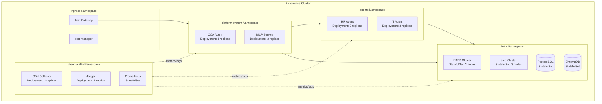

# 第八章：Kubernetes 雲原生部署 — 生產環境的基石

> 「在 K8s 上部署 AI Agent 平台，不是把 Docker 跑起來就完事 — 你需要考慮自動擴縮、健康檢查、密鑰管理、網絡策略，以及零停機更新。」

本章將展示如何將前面構建的 CCA、Specialized Agents、MCP Service 等組件部署到 Kubernetes 集群，實現生產級的可靠性和可擴展性。

---

## 8.1 集群架構設計

### 8.1.1 Namespace 隔離



上圖將整個 K8s 集群劃分為五個 Namespace，每個 Namespace 代表一個安全邊界和管理域。這種劃分並非隨意——它直接對應了 Zero Trust 架構中的「最小權限原則」：不同職責的組件被隔離在各自的 Namespace 中，通過 NetworkPolicy 和 Istio AuthorizationPolicy 嚴格控制跨 Namespace 的流量。

#### 各 Namespace 的職責與意義

| Namespace | 職責定位 | 包含組件 | 隔離原因 |
|-----------|---------|---------|---------|
| **`platform-system`** | 平台核心大腦 | CCA Agent (3 replicas)、MCP Service (3 replicas) | 這是整個 Agent 協同的中樞。CCA 負責意圖識別與任務分解，MCP Service 負責工具路由與 gRPC 通訊。它們是唯一面向用戶請求的組件，安全要求最高——任何入侵都意味著整個 Agent 生態系統被控制。因此單獨隔離，並通過 Istio 限制只有 `ingress` Namespace 的流量能到達。 |
| **`agents`** | 領域專家 Worker | HR Agent (2 replicas)、IT Agent (3 replicas) | 每個 Agent 是獨立的領域處理器，持有各自的敏感憑證（HR API Token、Active Directory API Token）。隔離後可以精確控制「CCA 能訪問哪些 Agent」、「Agent 之間能否互訪」。例如：HR Agent 不應有權限觸發 IT Agent 的操作。同一 Namespace 內的 Agent 共享 NetworkPolicy 基線，但每個 Agent 有獨立的 ServiceAccount。 |
| **`infra`** | 基礎設施數據層 | NATS (3 nodes)、etcd (3 nodes)、PostgreSQL、ChromaDB | 所有有狀態服務集中於此。這些組件存儲平台的核心數據——NATS 負責 Agent 間的消息路由，PostgreSQL 存儲任務狀態與審計日誌，ChromaDB 存儲 RAG 向量索引。它們絕不直接面向用戶，只接受來自 `platform-system` 和 `agents` 的受控連接。 |
| **`observability`** | 全域可觀測性 | OTel Collector (2 replicas)、Jaeger (1 replica)、Prometheus | 監控系統需要跨所有 Namespace 收集 metrics、traces 和 logs。獨立成 Namespace 的原因是：如果監控系統與業務組件混在同一 Namespace，它們會共享相同的 NetworkPolicy 限制——監控的「讀取」權限會被業務的「 deny-all」策略阻斷。獨立後可以為 `observability` 建立專用的跨 Namespace 抓取規則（見 8.9.3）。 |
| **`ingress`** | 流量入口與 TLS 終止 | Istio Gateway、cert-manager | 集群的唯一對外窗口。所有外部流量都從這裡進入，Istio Gateway 在此終止 TLS、執行 JWT 驗證、路由到對應的內部 Service。cert-manager 自動管理 TLS 證書的簽發與輪轉。隔離的目的是確保即使 Ingress 組件被攻破，攻擊者也無法直接訪問集群內部的 Pod。 |

#### 跨 Namespace 通信模式

圖中的箭頭代表了五種關鍵的通信模式：

- **實線箭頭**（`→`）：業務數據流。CCA 接收用戶請求後，通過 gRPC 調用 MCP Service（同 Namespace），MCP Service 再將具體任務路由到 HR/IT Agent（跨 Namespace），Agent 處理過程中需要讀寫 NATS/PostgreSQL/ChromaDB（跨 Namespace）。
- **虛線箭頭**（`-.-→`）：監控採集流。Prometheus 通過 ServiceMonitor 抓取各 Namespace 的 metrics 端點（:9090），OTel Collector 收集 distributed traces 和結構化 logs。這是被動的「拉取」模式，不會影響業務數據流。

#### 為什麼要拆分成五個而不是更多/更少？

- **更少（如合併成 2-3 個）**：安全邊界太粗。例如把 CCA 和 Agent 放同一 Namespace，NetworkPolicy 只能控制到 Namespace 級別，無法實現「CCA 能訪問 Agent 但 Agent 之間不能互訪」的精細控制。
- **更多（如每個 Agent 一個 Namespace）**：管理成本過高。每個 Namespace 都需要獨立的 ResourceQuota、NetworkPolicy、RBAC RoleBinding。對於 HR Agent 和 IT Agent 這類同等級的 Worker 組件，它們的安全需求和訪問模式完全相同，拆分帶來的管理開銷大於安全收益。

#### Namespace 與 RBAC 的配合

每個 Namespace 可以綁定獨立的 RBAC RoleBinding，實現更細粒度的權限控制：

```yaml
# 典型的 RBAC 分配：
# - platform-system:  ServiceAccount "cca-agent"  → 可讀寫 MCP Service
# - agents:           ServiceAccount "hr-agent"    → 只能讀寫 HR Agent 自身資源
# - agents:           ServiceAccount "it-agent"    → 只能讀寫 IT Agent 自身資源
# - observability:    ServiceAccount "prometheus"   → 跨 Namespace 讀取 metrics
# - infra:            限制只有 platform-system 和 agents 的 SA 能連接
```

這種「Namespace 隔離 + RBAC 最小權限 + NetworkPolicy 白名單」的三層防禦，確保即使某個 Pod 被入侵，攻擊面也被限制在該 Namespace 的最小範圍內。

### 8.1.2 資源配額與限制

在多租戶或多功能的 K8s 集群中，如果某個 Namespace 無限制地佔用 CPU 和記憶體，其他 Namespace 的服務將面臨資源飢餓。以下配置使用 ResourceQuota 和 LimitRange 兩個原生物件來解決這個問題：ResourceQuota 負責管控整個 Namespace 的資源總量上限，而 LimitRange 則定義單個 Pod/Container 的資源範圍（默認值與最大值），兩者配合形成「總量 + 個體」的雙重防線。

```yaml
# k8s/namespaces/platform-system/resource-quota.yaml
# ================================================================
# ResourceQuota：限制整個 Namespace 的資源總量上限
# 防止某個 Namespace（如平台核心）無限制擴張，擠佔其他 Namespace 的資源。
# LimitRange：限制單個 Pod/Container 的資源範圍（默認值 + 最大值）
# 兩者配合：ResourceQuota 管「總量」，LimitRange 管「個體」。
apiVersion: v1
kind: ResourceQuota
metadata:
  name: platform-quota
  namespace: platform-system
spec:
  hard:
    requests.cpu: "8"            # Namespace 總 CPU 請求上限 8 核
    requests.memory: 16Gi        # Namespace 總記憶體請求上限 16Gi
    limits.cpu: "16"             # Namespace 總 CPU 上限 16 核（突發容量）
    limits.memory: 32Gi          # Namespace 總記憶體上限 32Gi
    pods: "20"                   # 最多 20 個 Pod（防止失控的 ReplicaSet）
    services: "10"               # 最多 10 個 Service
    persistentvolumeclaims: "5"  # 最多 5 個 PVC

---
# k8s/namespaces/platform-system/limit-range.yaml
apiVersion: v1
kind: LimitRange
metadata:
  name: platform-limit-range
  namespace: platform-system
spec:
  limits:
  - type: Container
    default:                     # 未指定 resources 時的默認 limits
      cpu: "500m"                # 默認每容器最多 0.5 核 CPU
      memory: 512Mi              # 默認每容器最多 512Mi 記憶體
    defaultRequest:              # 未指定 resources 時的默認 requests
      cpu: "100m"                # 默認每容器請求 0.1 核 CPU
      memory: 256Mi              # 默認每容器請求 256Mi 記憶體
    max:                         # 單個容器允許的最大值（硬頂）
      cpu: "2"                   # 任何容器不得超過 2 核
      memory: 4Gi                # 任何容器不得超過 4Gi
```

**關鍵設計決策**：
- **ResourceQuota 的 requests vs limits**：`requests` 是調度器用的「預留份額」（確保節點有足夠資源），`limits` 是運行時的「硬頂」（超過會被 OOMKill）。requests 8 核 + limits 16 核 = 允許 burst 到 2 倍容量。
- **LimitRange 與 ResourceQuota 的關係**：未聲明 `resources` 的 Pod 會自動套用 LimitRange 的 `default` 值。這防止開發者忘記配置資源限制（常見失誤），ResourceQuota 則作為最後一道防線。

---

## 8.2 CCA Agent 的 K8s 部署

### 8.2.1 Deployment 配置

CCA 作為平台的中央協調大腦，是整個系統中配置最全面的 Deployment。以下 YAML 展示了一個生產級 CCA 部署的完整配置，包含多副本策略、安全上下文、雙通訊端口（HTTP + gRPC）、三層健康檢查探針、敏感配置走 Secret、配置文件走 ConfigMap、TLS 證書掛載等關鍵設定。

```yaml
# k8s/platform/cca-agent/deployment.yaml —— CCA Agent 的完整 Deployment 配置
# ================================================================
# CCA 是平台大腦，配置最全面：3 個副本、安全上下文、雙端口、健康檢查三探針、
# 敏感配置走 Secret、配置文件走 ConfigMap、TLS 證書掛載。
apiVersion: apps/v1
kind: Deployment
metadata:
  name: cca-agent
  namespace: platform-system       # 核心平台組件 → platform-system Namespace
  labels:
    app: cca-agent
    version: v1
spec:
  replicas: 3
  strategy:
    type: RollingUpdate            # 滾動更新：零停機部署
    rollingUpdate:
      maxUnavailable: 1            # 更新時最多 1 個 Pod 不可用（3 個中保留 2 個）
      maxSurge: 1                  # 更新時最多多啟動 1 個 Pod（最多 4 個同時運行）
  selector:
    matchLabels:
      app: cca-agent
  template:
    metadata:
      labels:
        app: cca-agent
        version: v1
    spec:
      serviceAccountName: cca-agent
      securityContext:
        runAsNonRoot: true          # 禁止以 root 身份運行（安全加固）
        runAsUser: 1000             # 以 UID 1000 運行
        fsGroup: 2000               # 掛載卷的群組 ID
      containers:
      - name: cca-agent
        image: registry.company.internal/ai-platform/cca-agent:1.0.0
        ports:
        - containerPort: 8080
          name: http                # HTTP API 端口（供 CCA ↔ Portal 通訊）
        - containerPort: 8081
          name: grpc                # gRPC 端口（供 CCA ↔ MCP Service 通訊）
        resources:
          requests:
            cpu: "500m"             # CCA 的 LLM 推理較重，需更多 CPU
            memory: "1Gi"           # LangGraph 狀態需要較多記憶體
          limits:
            cpu: "2"
            memory: "4Gi"
        env:
        - name: LOG_LEVEL
          value: "INFO"
        - name: NATS_URL
          value: "nats://nats.infra:4222"           # 跨 Namespace 通訊：platform → infra
        - name: MCP_SERVICE_URL
          value: "http://mcp-service.platform-system:8080"  # 同 Namespace 內通訊
        - name: LLM_PROVIDER
          value: "ollama"                              # 本地 LLM（無外部 API 依賴）
        - name: LLM_MODEL
          value: "llama4-scout"                        # Llama 4 Scout — 17B active 參數，性能接近 70B 級別
        - name: OLLAMA_BASE_URL
          value: "http://ollama.infra:11434"           # Ollama 在 infra Namespace
        - name: DB_HOST
          valueFrom:
            secretKeyRef:                              # 敏感配置走 Secret，不硬編碼
              name: cca-secrets
              key: db-host
        - name: DB_PASSWORD
          valueFrom:
            secretKeyRef:
              name: cca-secrets
              key: db-password
        - name: LITELLM_MASTER_KEY
          valueFrom:
            secretKeyRef:
              name: cca-secrets
              key: litellm-master-key
        volumeMounts:
        - name: config
          mountPath: /app/config
          readOnly: true            # 配置文件只讀掛載
        - name: tls-certs
          mountPath: /app/certs
          readOnly: true            # TLS 證書只讀掛載
        readinessProbe:             # 就緒探針：決定是否接受流量
          httpGet:
            path: /healthz
            port: 8080
          initialDelaySeconds: 10   # 啟動 10 秒後開始探測
          periodSeconds: 5          # 每 5 秒探測一次
          timeoutSeconds: 3
          failureThreshold: 3       # 連續 3 次失敗 → 標記為未就緒
        livenessProbe:              # 存活探針：決定是否重啟容器
          httpGet:
            path: /healthz
            port: 8080
          initialDelaySeconds: 30   # 給 LLM 載入模型更多時間
          periodSeconds: 10
          timeoutSeconds: 5
          failureThreshold: 3       # 連續 3 次失敗 → 重啟容器
        startupProbe:               # 啟動探針：防止慢啟動被 liveness 誤殺
          httpGet:
            path: /healthz
            port: 8080
          initialDelaySeconds: 5
          periodSeconds: 5
          failureThreshold: 30      # 最多允許 150 秒啟動（30 × 5s）
      volumes:
      - name: config
        configMap:
          name: cca-config          # 非敏感配置走 ConfigMap
      - name: tls-certs
        secret:
          secretName: cca-tls       # TLS 證書走 Secret
```

**關鍵設計決策**：
- **三探針策略**：`startupProbe` → `readinessProbe` → `livenessProbe` 的分層。LLM 載入 70B 模型可能需要 60-120 秒，`startupProbe` 的 `failureThreshold: 30` 給出 150 秒窗口，防止 `livenessProbe` 在啟動期間誤殺容器。
- **`runAsNonRoot: true`**：即使容器鏡像以 root 構建，K8s 層級強制以非 root 用戶運行。這是 Pod Security Standards 的 `restricted` 級別要求，防止容器逃逸時獲得 root 權限。
- **敏感配置三層分離**：`env` 中的 plain value（NATS_URL）→ `secretKeyRef`（DB_PASSWORD）→ `volumeMount`（TLS 證書）。按敏感程度選擇不同的 Secret 管理方式。

### 8.2.2 HPA 自動擴縮

CCA 的請求量會隨業務波動——工作日高峰時大量員工同時提交 IT 申請，深夜則幾乎為零。HorizontalPodAutoscaler（HPA）根據即時負載自動調整 Pod 副本數。以下配置採用 CPU、記憶體和自定義業務指標三個維度進行擴縮決策，並設定了不對稱的擴縮行為策略以兼顧響應速度與穩定性。

```yaml
# k8s/platform/cca-agent/hpa.yaml —— CCA Agent 的自動擴縮配置
# ================================================================
# 三維度指標擴縮：CPU（計算密集）+ Memory（LLM 推理）+ 自定義 Pods 指標（業務負載）
# 比純 CPU 擴縮更精準：LLM 推理可能 CPU 不高但記憶體壓力大，或任務數暴增但資源平穩。
apiVersion: autoscaling/v2
kind: HorizontalPodAutoscaler
metadata:
  name: cca-agent-hpa
  namespace: platform-system
spec:
  scaleTargetRef:
    apiVersion: apps/v1
    kind: Deployment
    name: cca-agent
  minReplicas: 3                     # 最少 3 個（高可用基線）
  maxReplicas: 20                    # 最多 20 個（成本控制上限）
  metrics:
  - type: Resource
    resource:
      name: cpu
      target:
        type: Utilization
        averageUtilization: 70        # CPU 平均使用率 > 70% 時觸發擴展
  - type: Resource
    resource:
      name: memory
      target:
        type: Utilization
        averageUtilization: 80        # 記憶體平均使用率 > 80% 時觸發擴展
  - type: Pods                        # 自定義業務指標
    pods:
      metric:
        name: active_tasks            # CCA 報告的活躍任務數
      target:
        type: AverageValue
        averageValue: "10"            # 每個 Pod 平均 > 10 個活躍任務時擴展
  behavior:
    scaleUp:
      stabilizationWindowSeconds: 60   # 擴展穩定窗口 60 秒（快速響應）
      policies:
      - type: Pods
        value: 2                       # 每 60 秒最多增加 2 個 Pod
        periodSeconds: 60
    scaleDown:
      stabilizationWindowSeconds: 300  # 縮減穩定窗口 300 秒（謹慎縮減）
      policies:
      - type: Percent
        value: 10                      # 每 60 秒最多縮減 10% 的 Pod
        periodSeconds: 60
```

**關鍵設計決策**：
- **擴縮不對稱策略**：`scaleUp` 穩定窗口 60 秒（快速響應突發流量），`scaleDown` 穩定窗口 300 秒（避免流量波動導致頻繁縮減/擴展的「抖動」）。這是 production-grade HPA 的標準配置。
- **`active_tasks` 自定義指標**：純 CPU/Memory 指標有延遲性（使用率上升時可能已經 overloaded）。`active_tasks` 是前導指標——任務數增加立即觸發擴展，無需等待 CPU 真的升高。
- **scaleDown 用 Percent 而非 Pods**：縮減 10% 是相對值，Pod 數量多時縮減快，少時縮減慢。避免在 3 個 Pod 時一次縮減 2 個導致服務中斷。

---

## 8.3 Specialized Agents 的部署

### 8.3.1 HR Agent 的 K8s 配置

HR Agent 部署在獨立的 `agents` Namespace 中，與 CCA 的 `platform-system` 做 Namespace 級別隔離。與 CCA 相比，HR Agent 的配置更為輕量：副本數更少（2 vs 3）、資源需求更低（512Mi vs 1Gi）、不需要 startupProbe（因為不載入大型 LLM 模型），但仍然需要對接 HR 系統 API 並透過 Secret 管理敏感的 API Token。

```yaml
# k8s/agents/hr-agent/deployment.yaml
# ================================================================
# HR Agent 部署在「agents」Namespace（與 CCA 的 platform-system 隔離）。
# 與 CCA 相比：副本數更少（2 vs 3）、資源更輕量（512Mi vs 1Gi）、
# 無 startupProbe（HR Agent 不需要載入大型 LLM 模型）。
apiVersion: apps/v1
kind: Deployment
metadata:
  name: hr-agent
  namespace: agents                    # Agent 組件統一在 agents Namespace
  labels:
    app: hr-agent
    domain: human_resources            # 域標籤：便於 Istio 按域篩選流量
spec:
  replicas: 2                          # HR 場景併發需求較低，2 副本足夠
  selector:
    matchLabels:
      app: hr-agent
  template:
    metadata:
      labels:
        app: hr-agent
        domain: human_resources
    spec:
      serviceAccountName: hr-agent     # 每個 Agent 獨立 ServiceAccount（最小權限）
      containers:
      - name: hr-agent
        image: registry.company.internal/ai-platform/hr-agent:1.2.0
        ports:
        - containerPort: 8080
        resources:
          requests:
            cpu: "300m"                # 比 CCA 輕量（HR 多為 API 調用，非 LLM 推理）
            memory: "512Mi"
          limits:
            cpu: "1"
            memory: "2Gi"
        env:
        - name: AGENT_ID
          value: "hr-agent-v1"
        - name: NATS_URL
          value: "nats://nats.infra:4222"     # 跨 Namespace：agents → infra
        - name: KNOWLEDGE_BASE_URL
          value: "http://chromadb.infra:8000"  # ChromaDB 向量數據庫（RAG 檢索用）
        - name: HR_API_URL                     # HR 系統 API（敏感，走 Secret）
          valueFrom:
            secretKeyRef:
              name: hr-agent-secrets
              key: hr-api-url
        - name: HR_API_TOKEN                   # HR API Token（敏感，走 Secret）
          valueFrom:
            secretKeyRef:
              name: hr-agent-secrets
              key: hr-api-token
        readinessProbe:
          httpGet:
            path: /healthz
            port: 8080
          initialDelaySeconds: 15      # 比 CCA 的 10s 稍長（Agent 啟動需初始化工具）
          periodSeconds: 5
        livenessProbe:
          httpGet:
            path: /healthz
            port: 8080
          initialDelaySeconds: 30
          periodSeconds: 10
```

**關鍵設計決策**：
- **Agent 獨立 ServiceAccount**：每個 Agent 有自己的 SA，Istio AuthorizationPolicy 可以精確控制「CCA 能訪問哪些 Agent」、「Agent 之間能否互訪」。如果共用一個 SA，安全策略粒度只能到 Namespace 級別。
- **`domain: human_resources` 標籤**：不只是組織用途——Istio 的 `VirtualService` 和 `AuthorizationPolicy` 可以用 `matchLabels: domain: human_resources` 按域批量管控，無需逐個 Agent 配置。
- **無 startupProbe**：Agent 的 MCP 工具初始化（RAG 連接、HR API 握手）通常在 5-10 秒內完成，`initialDelaySeconds: 30` 的 livenessProbe 已足夠，不需要額外的 startupProbe 開銷。

### 8.3.2 IT Agent 的 K8s 配置

IT Agent 與 HR Agent 的部署結構相似，但因 IT 場景（帳號創建、密碼重置、權限申請）的併發需求更高，副本數設為 3。其敏感配置對接的是 Active Directory API，需要更高的安全管控。以下配置展示了 IT Agent 與 HR Agent 的關鍵差異之處。

```yaml
# k8s/agents/it-agent/deployment.yaml
# ================================================================
# IT Agent 配置與 HR Agent 結構相同，但有差異：
# - 副本數 3（IT 場景併發更高：帳號創建、密碼重置、權限申請）
# - 敏感配置為 Active Directory API（而非 HR API）
# - 同樣部署在 agents Namespace，共享相同的安全邊界
apiVersion: apps/v1
kind: Deployment
metadata:
  name: it-agent
  namespace: agents
  labels:
    app: it-agent
    domain: information_technology    # 域標籤：IT 領域
spec:
  replicas: 3                          # IT 併發需求更高（多個用戶同時申請帳號）
  selector:
    matchLabels:
      app: it-agent
  template:
    metadata:
      labels:
        app: it-agent
        domain: information_technology
    spec:
      serviceAccountName: it-agent
      containers:
      - name: it-agent
        image: registry.company.internal/ai-platform/it-agent:1.0.0
        ports:
        - containerPort: 8080
        resources:
          requests:
            cpu: "300m"
            memory: "512Mi"
          limits:
            cpu: "1"
            memory: "2Gi"
        env:
        - name: AGENT_ID
          value: "it-agent-v1"
        - name: NATS_URL
          value: "nats://nats.infra:4222"
        - name: AD_API_URL             # Active Directory API（IT 帳號管理核心）
          valueFrom:
            secretKeyRef:
              name: it-agent-secrets
              key: ad-api-url
        - name: AD_API_TOKEN           # AD API Token（高權限：可創建/刪除帳號）
          valueFrom:
            secretKeyRef:
              name: it-agent-secrets
              key: ad-api-token
        readinessProbe:
          httpGet:
            path: /healthz
            port: 8080
          initialDelaySeconds: 15
          periodSeconds: 5
        livenessProbe:
          httpGet:
            path: /healthz
            port: 8080
          initialDelaySeconds: 30
          periodSeconds: 10
```

**關鍵設計決策**：
- **IT vs HR 副本數差異**：IT Agent `replicas: 3` > HR Agent `replicas: 2`。原因：IT 場景（帳號創建、密碼重置）的觸發頻率高於 HR 場景（休假查詢、政策問答），且 IT 操作通常有 SLA 時效要求（「30 分鐘內開通帳號」），需要更多副本保障並發。
- **AD API 權限管理**：`ad-api-token` 擁有 Active Directory 的高權限（可創建/禁用帳號）。這類 Token 的存取必須嚴格控制——只有 IT Agent 的 ServiceAccount 能讀取對應的 Secret，CCA 本身不能直接持有 AD 憑證。

---

## 8.4 密鑰管理

### 8.4.1 External Secrets Operator

External Secrets Operator 是 K8s 生態中最常用的密鑰管理方案之一，它通過 ExternalSecret 資源從外部密鑰存儲（如 HashiCorp Vault、AWS Secrets Manager）自動同步密鑰到 K8s 原生的 Secret 物件。以下配置展示了如何從 Vault 同步 IT Agent 所需的 API 憑證，實現密鑰的集中化管理和自動輪轉。

```yaml
# k8s/external-secrets/it-agent-secrets.yaml
# ================================================================
# ExternalSecret：從 HashiCorp Vault 自動同步密鑰到 K8s Secret。
# 核心價值：密鑰的「單一事實來源」在 Vault，不在 K8s etcd。
# K8s 只持有「快照」，定期與 Vault 同步，密鑰輪轉時自動更新。
apiVersion: external-secrets.io/v1beta1
kind: ExternalSecret
metadata:
  name: it-agent-secrets
  namespace: agents
spec:
  refreshInterval: 1h                 # 每小時從 Vault 重新同步（密鑰輪轉時自動生效）
  secretStoreRef:
    name: vault-backend               # 指向 Vault 的 ClusterSecretStore
    kind: ClusterSecretStore          # Cluster 級別：跨 Namespace 共享同一 Vault 後端
  target:
    name: it-agent-secrets            # 生成的 K8s Secret 名稱
    creationPolicy: Owner             # ExternalSecret 是 Secret 的 Owner（生命週期綁定）
  data:
  - secretKey: ad-api-url             # K8s Secret 中的 key 名
    remoteRef:
      key: ai-platform/it-agent/ad-api-url   # Vault 中的路徑
  - secretKey: ad-api-token
    remoteRef:
      key: ai-platform/it-agent/ad-api-token
  - secretKey: mail-api-token
    remoteRef:
      key: ai-platform/it-agent/mail-api-token
```

**關鍵設計決策**：
- **`refreshInterval: 1h`**：平衡安全性與性能。太短（如 1 分鐘）會增加 Vault 請求壓力；太長（如 24 小時）意味著密鑰輪轉後最多需要 1 小時才生效。1 小時是 production 常見的折衷值。
- **`ClusterSecretStore` vs `SecretStore`**：使用 `ClusterSecretStore` 允許跨 Namespace 引用同一個 Vault 後端。所有 Agent 都在 `agents` Namespace，但 Vault 管理員只需維護一個 Store 定義。
- **`creationPolicy: Owner`**：ExternalSecret 創建並「擁有」這個 K8s Secret。如果 ExternalSecret 被刪除，Secret 也自動清除。這避免了「Secret 殘留」的問題——不再使用的密鑰不會靜默地留在 etcd 中。

### 8.4.2 Secrets 加密存儲

SealedSecret 是 Bitnami 提供的加密方案，允許將 K8s Secret 加密後安全地提交到 Git 倉庫，實現 GitOps 工作流中的密鑰管理。與 External Secrets Operator 不同，SealedSecret 是「加密靜態存儲」方案，密鑰在提交前就被加密，只有目標集群的 sealed-secrets-controller 能解密。

```yaml
# k8s/sealed-secrets/it-agent-secrets.yaml
# ================================================================
# SealedSecret：Bitnami 的 GitOps 友好方案，將 Secret 加密後可安全提交到 Git。
# 與 ExternalSecret 的區別：SealedSecret 是「加密靜態存儲」，ExternalSecret 是「動態拉取」。
# 實踐中兩者常配合使用：SealedSecret 用於 GitOps 初始部署，ExternalSecret 用於運行時輪轉。
apiVersion: bitnami.com/v1alpha1
kind: SealedSecret
metadata:
  name: it-agent-secrets
  namespace: agents
spec:
  encryptedData:                     # 以下值是加密後的 Base64，非明文
    ad-api-url: AgBy3i4OJSWK+PiTySYZZA9rO43cGDEq...     # kubeseal 加密
    ad-api-token: AgBy3i4OJSWK+PiTySYZZA9rO43cGDEq...    # 只有集群的 sealed-secrets
    mail-api-token: AgBy3i4OJSWK+PiTySYZZA9rO43cGDEq...  # controller 能解密
```

**關鍵設計決策**：
- **GitOps 安全悖論**：Git 需要明文才能版本控制，Secret 不能明文存儲。SealedSecret 用 asymmetric encryption 解決——集群上的 `sealed-secrets-controller` 持有私鑰，開發者用公鑰加密後提交到 Git。只有目標集群能解密。
- **`encryptedData` vs `encryptedString`**：`encryptedData` 適用於 JSON value（支持二進制），`encryptedString` 適用於純字串。這裡 API URL 和 Token 都是字串，但用 `encryptedData` 是更通用的寫法。
- **與 ExternalSecret 的互補關係**：SealedSecret 解決「Secret 如何安全存入 Git」；ExternalSecret 解決「Secret 如何在運行時自動輪轉」。Production 環境建議：初始部署用 SealedSecret（GitOps 安全），運行時切換到 ExternalSecret（Vault 動態管理）。

---

## 8.5 網絡策略

### 8.5.1 Istio AuthorizationPolicy

Istio AuthorizationPolicy 是 Service Mesh 層級的零信任存取控制機制，允許以 L7 應用層的粒度定義「誰能訪問什麼服務」的規則。以下配置展示了如何限制特定 Agent 的入站流量來源，只允許來自 CCA 的合法請求，並在最後添加 deny-all 默認策略作為安全基線。

```yaml
# k8s/istio/authorization-policies.yaml
# ================================================================
# Istio AuthorizationPolicy：Service Mesh 層級的零信任存取控制。
# 不同於 K8s NetworkPolicy（L4 網絡層），AuthorizationPolicy 在 L7 應用層
# 控制「誰能用什麼方法訪問什麼路徑」，粒度更細。
apiVersion: security.istio.io/v1beta1
kind: AuthorizationPolicy
metadata:
  name: it-agent-policy
  namespace: agents
spec:
  selector:
    matchLabels:
      app: it-agent                   # 只作用於 it-agent Pod
  action: ALLOW                       # 白名單模式：顯式允許的才放行
  rules:
  - from:
    - source:
        namespaces: ["platform-system"]  # 只允許 platform-system 的 Pod 訪問
    to:
    - operation:
        methods: ["POST"]               # 只允許 POST 方法（MCP 協議用 POST）
        paths: ["/healthz", "/mcp"]     # 只允許健康檢查和 MCP 端點
    when:
    - key: request.auth.claims[iss]     # JWT 驗證：issuer 必須是公司 Auth 服務
      values: ["https://auth.company.internal"]

---
# 默認 deny-all 策略：未被上面的 ALLOW 規則匹配到的流量全部拒絕
apiVersion: security.istio.io/v1beta1
kind: AuthorizationPolicy
metadata:
  name: deny-all
  namespace: agents
spec:
  {}  # 空 spec = deny all。這是零信任的基石：先全部拒絕，再顯式開放
```

**關鍵設計決策**：
- **三重驗證**：這條策略同時驗證了①來源 Namespace（`platform-system`）②HTTP 方法+路徑（`POST /mcp`）③JWT Claims（issuer 驗證）。任何一項不匹配即拒絕。這是 defense-in-depth 的典型實踐。
- **`deny-all` 作為基線**：AuthorizationPolicy 的 `action: ALLOW` 是白名單——只有匹配的規則被允許。但同一個 Namespace 中如果沒有任何 ALLOW 規則也不會自動 deny all。顯式添加一個空 spec 的 deny-all 策略，確保「未被明確允許 = 拒絕」。
- **L7 vs L4 控制**：K8s NetworkPolicy（8.9 節）控制的是「能不能建立 TCP 連接」（L4）；Istio AuthorizationPolicy 控制的是「連接建立後，能用什麼 HTTP 方法訪問什麼路徑」（L7）。兩者配合：NetworkPolicy 擋掉不必要的端口，AuthorizationPolicy 擋掉不合法的請求。

---

## 8.6 Helm Charts

### 8.6.1 Chart 結構

Helm Chart 是 K8s 應用的打包和部署格式。對於包含多個微服務的 AI Agent 平台，合理的 Chart 結構至關重要——它決定了配置的複用性、部署的獨立性以及維護的便利性。以下目錄結構展示了三層分離的設計：核心業務 Chart、基礎設施 Chart 和監控 Chart 各自獨立。

```
# Helm Chart 目錄結構：三層分離的多組件部署架構
# ================================================================
charts/
├── ai-platform/                          # 主 Chart：Agent 平台核心
│   ├── Chart.yaml                        # Chart 元數據（版本、依賴）
│   ├── values.yaml                       # 默認配置值（可被 --values 覆蓋）
│   ├── templates/
│   │   ├── _helpers.tpl                  # Helm 模板輔助函數（統一命名規則）
│   │   ├── cca-agent/                    # CCA Agent 子 Chart
│   │   │   ├── deployment.yaml
│   │   │   ├── hpa.yaml
│   │   │   ├── service.yaml
│   │   │   └── servicemonitor.yaml       # Prometheus ServiceMonitor（自動抓指標）
│   │   ├── hr-agent/
│   │   │   ├── deployment.yaml
│   │   │   ├── hpa.yaml
│   │   │   └── service.yaml
│   │   ├── it-agent/
│   │   │   ├── deployment.yaml
│   │   │   ├── hpa.yaml
│   │   │   └── service.yaml
│   │   ├── mcp-service/
│   │   │   ├── deployment.yaml
│   │   │   ├── hpa.yaml
│   │   │   └── service.yaml
│   │   └── config/
│   │       ├── configmap.yaml            # 非敏感配置
│   │       └── secrets.yaml              # 敏感配置（或由 ExternalSecret 管理）
│   └── values.yaml
├── monitoring/                           # 監控 Chart（獨立部署）
│   ├── Chart.yaml
│   └── templates/
│       ├── prometheus/
│       ├── grafana/
│       └── jaeger/
└── infrastructure/                       # 基礎設施 Chart（NATS/DB/向量庫）
    ├── Chart.yaml
    └── templates/
        ├── nats/
        ├── chromadb/
        └── postgresql/
```

**關鍵設計決策**：
- **三層 Chart 分離**：`ai-platform`（業務）/ `monitoring`（觀測）/ `infrastructure`（基礎設施）各自獨立的 `Chart.yaml`。原因：infrastructure 穩定不變、monitoring 獨立升級、ai-platform 頻繁迭代。如果打包成單一 Chart，任何組件變更都會觸發全量部署。
- **`servicemonitor.yaml` 的位置**：只在 `cca-agent` 下有，其他 Agent 沒有。因為 CCA 是唯一的 API 入口，是唯一需要暴露 Prometheus 指標的組件；Agent 內部通訊走 NATS，不需要 ServiceMonitor。
- **`config/` 與 Agent 並列而非內嵌**：ConfigMap/Secrets 放在 templates 根目錄，所有 Agent 共享引用。避免每個 Agent 目錄下重複相同的 Secrets 定義。

### 8.6.2 Helm Values 示例

values.yaml 是 Helm Chart 的配置核心，定義了所有可自定義的參數及其默認值。以下示例展示了 AI Agent 平台的完整配置結構，包括全局設定（鏡像倉庫）、各個 Agent 的副本數和資源配額、Ingress 路由以及監控開關。這種集中式配置讓同一套 Chart 能適應開發、測試和生產等多種環境。

```yaml
# charts/ai-platform/values.yaml
# ================================================================
# Helm Values：整個平台的配置中心。`helm install -f custom-values.yaml` 可覆蓋任何值。
# 設計原則：只暴露「需要隨環境變化」的參數（副本數、鏡像版本、資源配額），
# 固定的配置（NetworkPolicy、RBAC）不放在 values.yaml 中。
global:
  imageRegistry: registry.company.internal/ai-platform  # 內部鏡像倉庫（安全掃描後推送）
  imagePullPolicy: IfNotPresent                         # 本地已有的鏡像不重新拉取

ccaAgent:
  enabled: true                       # 開關：可通過 --set ccaAgent.enabled=false 跳過部署
  replicaCount: 3
  image:
    repository: cca-agent
    tag: "1.0.0"                      # 版本與 CI/CD 流水線的 Git Tag 對齊
  resources:
    requests:
      cpu: "500m"
      memory: "1Gi"
    limits:
      cpu: "2"
      memory: "4Gi"
  hpa:
    enabled: true                     # 一鍵開啟/關閉 HPA（測試環境可關閉）
    minReplicas: 3
    maxReplicas: 20
    targetCPUUtilization: 70

hrAgent:
  enabled: true
  replicaCount: 2
  image:
    repository: hr-agent
    tag: "1.2.0"

itAgent:
  enabled: true
  replicaCount: 3
  image:
    repository: it-agent
    tag: "1.0.0"

mcpService:
  enabled: true
  replicaCount: 3
  image:
    repository: mcp-service
    tag: "2.0.0"

ingress:
  enabled: true
  className: istio                     # 使用 Istio Ingress Gateway
  hosts:
  - host: ai-platform.company.internal
    paths:
    - path: /
      pathType: Prefix

monitoring:
  enabled: true
  serviceMonitor:
    enabled: true
    interval: 15s                      # Prometheus 每 15 秒抓一次指標
```

**關鍵設計決策**：
- **`enabled` 開關**：每個組件都有 `enabled: true/false`。測試環境部署時可通過 `--set ccaAgent.enabled=false` 跳過 CCA，只測 Agent。這是 multi-env 部署的基礎。
- **`tag` 版本化**：每個組件的鏡像 tag 獨立管理（cca: 1.0.0, hr: 1.2.0, mcp: 2.0.0）。因為它們是不同團隊/頻率維護的，耦合版本會導致「改一個 Agent 必須重新部署全部」。
- **`ingress.className: istio`**：Istio Ingress Gateway 替代傳統 Nginx Ingress。的好處：Service Mesh 內的流量可以繼續走 Istio 的 mTLS 和 Observability，Ingress 到 Mesh 的邊界上不需要額外的轉換層。

---

## 8.7 零停機更新

### 8.7.1 滾動更新策略

K8s 的 RollingUpdate 是零停機部署的基礎策略，通過逐步替換舊版本 Pod 來實現平滑過渡。以下配置定義了更新過程中的 Pod 數量控制：`maxUnavailable` 決定每次更新時最多有多少 Pod 不可用，`maxSurge` 決定最多能超出期望副本數多少個 Pod，兩者配合確保服務在更新期間始終保持足夠的容量。

```yaml
# 滾動更新配置（嵌入 Deployment spec）
# ================================================================
# 滾動更新是 K8s 的默認部署策略：逐步替換舊 Pod，而非一次性全部重啟。
# `maxUnavailable: 1, maxSurge: 1` 是最保守的配置，適合核心服務。
spec:
  strategy:
    type: RollingUpdate
    rollingUpdate:
      maxUnavailable: 1   # 每次更新時最多 1 個 Pod 不可用（3 副本 → 至少 2 個服務中）
      maxSurge: 1          # 每次更新時最多多啟動 1 個 Pod（最多 4 個同時運行）
```

**關鍵設計決策**：
- **`maxUnavailable: 1` 的實際含義**：假設 `replicas: 3`，更新時最多關閉 1 個舊 Pod，同時啟動 1 個新 Pod。運行時 Pod 數在 [2, 4] 之間浮動。這確保服務容量最低不低於 67%（2/3），最高不超過 133%（4/3）。
- **`maxSurge: 1` 的成本控制**：限制同時存在的 Pod 數量不超過 `replicas + 1`，避免更新期間資源消耗翻倍。對 GPU Pod（每個價值數千元/月）尤其重要。

### 8.7.2 PreStop Hook

當 K8s 終止一個 Pod 時，會同時執行兩個操作：將 Pod 從 Service Endpoints 中移除，以及向容器發送 SIGTERM 信號。然而這兩個操作並非原子的——Endpoints 的更新存在延遲，在此期間新請求仍會被轉發到正在關閉的 Pod，導致請求失敗。PreStop Hook 通過在容器實際開始關閉前插入一個等待期，讓 Endpoints 更新有時間生效。

```yaml
# PreStop Hook：容器終止前的優雅處理（嵌入 Deployment spec）
# ================================================================
# 問題：K8s 刪除 Pod 時，同時執行兩件事——①從 Service Endpoints 移除
# ②發送 SIGTERM 給容器。但 Endpoints 更新有延遲（秒級），在這段時間內
# 新請求仍會發送到正在終止的 Pod，導致 5xx 錯誤。
# 解決：sleep 15 秒，讓 Endpoints 更新完成後才開始處理終止信號。
containers:
- name: cca-agent
  lifecycle:
    preStop:
      exec:
        command: ["/bin/sh", "-c", "sleep 15"]  # 等待 Endpoints 更新完成
```

**關鍵設計決策**：
- **`sleep 15` 的 15 秒從哪來**：Endpoits 控制器的同步延遲通常為 3-5 秒，加上 Envoy sidecar 配置傳播（Istio 的 xDS 推送）再加 5-10 秒。15 秒是保守值，覆蓋 99% 的場景。
- **PreStop vs terminationGracePeriodSeconds**：PreStop hook 的時間計入 `terminationGracePeriodSeconds`（默認 30 秒）。sleep 15 後容器還有 15 秒處理 SIGTERM。如果應用的 graceful shutdown 需要更多時間，需要相應增大 `terminationGracePeriodSeconds`。

---

## 8.8 PodDisruptionBudget

PodDisruptionBudget 確保在自愿中斷（節點維護、升級）期間維持最低可用 Pod 數量。

### 8.8.1 PDB 配置

PodDisruptionBudget（PDB）用於限制自愿中斷（如節點維護、叢集升級、自動擴縮）期間可以同時不可用的 Pod 數量，確保服務在運維操作期間保持最低可用性。以下配置展示了兩種常見的 PDB 策略：使用 `minAvailable` 確保最低可用 Pod 數，以及使用 `maxUnavailable` 限制最大不可用 Pod 數。

```yaml
# k8s/platform/cca-agent/pdb.yaml
# ================================================================
# PodDisruptionBudget (PDB)：保護「自願中斷」場景下的服務可用性。
# 自願中斷 = 節點維護 (drain)、cluster upgrade、autoscaler 縮容。
# 非自願中斷 = 節點宕機、OOMKill，PDB 不保護這類場景（用 liveness probe）。
apiVersion: policy/v1
kind: PodDisruptionBudget
metadata:
  name: cca-agent-pdb
  namespace: platform-system
spec:
  minAvailable: 2   # 至少保持 2 個 Pod 可用（3 副本中最多驅逐 1 個）
  selector:
    matchLabels:
      app: cca-agent

---
# k8s/agents/it-agent/pdb.yaml
apiVersion: policy/v1
kind: PodDisruptionBudget
metadata:
  name: it-agent-pdb
  namespace: agents
spec:
  maxUnavailable: 1  # 最多 1 個 Pod 不可用（與 minAvailable 效果類似，但語義相反）
  selector:
    matchLabels:
      app: it-agent
```

**關鍵設計決策**：
- **`minAvailable` vs `maxUnavailable`**：兩者功能重疊但語義不同。`minAvailable: 2` 是正向思維（「至少保持 2 個」），`maxUnavailable: 1` 是負向思維（「最多中斷 1 個」）。在 3 副本下效果相同，但 `minAvailable` 在副本數增加時更直觀（永遠保持至少 2 個運行）。
- **PDB 只保護自願中斷**：`kubectl drain`、`cluster autoscaler` 縮容會檢查 PDB。但如果 Pod 因為 OOMKill 或節點硬體故障消失，PDB 無法阻止（那是 liveness probe 和副本數的責任）。

### 8.8.2 PDB 最佳實踐

| 場景 | 策略 | 說明 |
|------|------|------|
| **高可用服務** | `minAvailable: 2` | 至少保留 2 個 Pod 運行 |
| **可容忍中斷** | `maxUnavailable: 1` | 最多 1 個 Pod 中斷 |
| **狀態ful 服務** | `minAvailable: 1` | 至少保留 1 個 Pod |
| **有狀態集（NATS）** | `minAvailable: 2` | 確保 quorum |

---

## 8.9 原生 NetworkPolicy

除了 Istio AuthorizationPolicy，K8s 原生 NetworkPolicy 提供 L3/L4 層網絡隔離。

### 8.9.1 默認 deny all

零信任網絡的核心原則是「預設拒絕，顯式允許」。以下 NetworkPolicy 配置在 Namespace 級別實現這一原則：首先對所有 Pod 施加 deny-all 規則，封鎖全部入站和出站流量，後續再通過獨立的 Allow 規則逐一開放必要的通訊路徑。

```yaml
# k8s/network-policies/default-deny-all.yaml
# ================================================================
# NetworkPolicy 默認 deny-all：L3/L4 層的零信任基線。
# 與 8.5.1 的 Istio deny-all（L7 應用層）形成雙層防禦。
# 此策略拒絕所有 Ingress + Egress，之後再用 Allow 策略逐一開放。
apiVersion: networking.k8s.io/v1
kind: NetworkPolicy
metadata:
  name: default-deny-all
  namespace: agents          # agents Namespace 的所有 Pod 預設無網絡訪問
spec:
  podSelector: {}            # 空 selector = 選擇 Namespace 內所有 Pod
  policyTypes:
  - Ingress                  # 拒絕所有入站流量
  - Egress                   # 拒絕所有出站流量（含 DNS，需額外 Allow DNS）

---
# k8s/network-policies/platform-system-deny-all.yaml
apiVersion: networking.k8s.io/v1
kind: NetworkPolicy
metadata:
  name: default-deny-all
  namespace: platform-system # platform-system 同樣先 deny-all
spec:
  podSelector: {}
  policyTypes:
  - Ingress
  - Egress
```

**關鍵設計決策**：
- **先 deny-all 再 allow**：K8s NetworkPolicy 是白名單模型——同一 Pod 可以被多個 NetworkPolicy 叠加。先用 deny-all 建立基線（所有流量被拒絕），再用 `allow-cca-to-agents`（8.9.2）逐步開放必要的通路。這是零信任網絡的核心模式。
- **Ingress + Egress 雙向封鎖**：只封 Ingress 不夠——被入侵的容器可以主動外連 C2 服務器。封 Egress 強制所有出站流量必須被顯式允許，即使容器被攻破也無法將數據外傳。
- **`podSelector: {}` 的範圍**：空 selector 選擇「整個 Namespace 的所有 Pod」，但不影響其他 Namespace。每個 Namespace 需要獨立的 deny-all 策略。

### 8.9.2 允許特定流量

在 deny-all 基線之上，需要逐一開放組件間的合法通訊。以下規則展示了兩個關鍵的 Allow 策略：一個是 CCA 從 `platform-system` 訪問 `hr-agent` 的 Ingress 規則，另一個是 Agent 出站訪問 NATS 消息隊列的 Egress 規則。

```yaml
# k8s/network-policies/allow-cca-to-agents.yaml
# ================================================================
# 允許 CCA（platform-system）到 HR Agent（agents）的 Ingress 流量。
# 這是 deny-all 之上的第一條 Allow 規則：CCA 是唯一能調用 Agent 的組件。
apiVersion: networking.k8s.io/v1
kind: NetworkPolicy
metadata:
  name: allow-cca-to-agents
  namespace: agents               # 策略作用在 agents Namespace（Pod 所在側）
spec:
  podSelector:
    matchLabels:
      app: hr-agent               # 只對 hr-agent Pod 生效
  policyTypes:
  - Ingress
  ingress:
  - from:
    - namespaceSelector:
        matchLabels:
          name: platform-system    # 只允許來自 platform-system 的流量
    ports:
    - protocol: TCP
      port: 8080                   # 只開放 HTTP 端口（MCP 通訊）

---
# k8s/network-policies/allow-agents-to-nats.yaml
# ================================================================
# 允許 Agent（agents）出站訪問 NATS（infra Namespace）。
# 這是 Egress 方向的 Allow：Agent 需要向 NATS 發布事件/訂閱任務。
apiVersion: networking.k8s.io/v1
kind: NetworkPolicy
metadata:
  name: allow-agents-to-nats
  namespace: agents
spec:
  podSelector:
    matchLabels:
      app: hr-agent
  policyTypes:
  - Egress
  egress:
  - to:
    - namespaceSelector:
        matchLabels:
          name: infra              # 只允許出站到 infra Namespace
    ports:
    - protocol: TCP
      port: 4222                   # NATS client port（訊息收發）
    - protocol: TCP
      port: 8222                   # NATS monitoring port（健康檢查用）
```

**關鍵設計決策**：
- **Namespace 選擇器需要標籤**：`namespaceSelector` 匹配的是 Namespace 上的 label，不是 Pod 的 label。因此 infra 和 platform-system Namespace 必須帶有 `name: xxx` 標籤才能被 NetworkPolicy 引用。這是 K8s NetworkPolicy 的一個常見陷阱。
- **Egress 遺漏 DNS**：deny-all 封鎖了 Egress，而 DNS 通常是 UDP 53 端口。實踐中需要額外添加一條 allow-dns Egress 規則，否則 Pod 無法解析域名。本章省略了這條規則，但 production 部署必須加上。

### 8.9.3 跨 Namespace 通信

在多 Namespace 的集群中，監控系統通常部署在獨立的 `observability` Namespace，但它需要跨 Namespace 抓取其他服務的 metrics 端點。以下 NetworkPolicy 展示了如何在 Platform 端開放 metrics 端口，允許 Observability 的 Prometheus 進行跨 Namespace 採集。

```yaml
# k8s/network-policies/allow-observability-scraping.yaml
# ================================================================
# 允許 observability Namespace 的 Prometheus 抓取 platform-system 的 metrics。
# 這是 Observability 專用的 Egress→Ingress 規則：Prometheus 在 observability，
# 被監控的 Pod 在 platform-system，需要跨 Namespace 的 Ingress 許可。
apiVersion: networking.k8s.io/v1
kind: NetworkPolicy
metadata:
  name: allow-observability-scraping
  namespace: platform-system
spec:
  podSelector: {}                  # 選擇 platform-system 內所有 Pod（包括 CCA）
  policyTypes:
  - Ingress
  ingress:
  - from:
    - namespaceSelector:
        matchLabels:
          name: observability      # 只允許來自 observability Namespace 的流量
    ports:
    - protocol: TCP
      port: 9090                   # Prometheus metrics 端口（通常由 app 或 sidecar 暴露）
```

**關鍵設計決策**：
- **`podSelector: {}` vs 具體標籤**：這裡對整個 Namespace 開放 9090 端口，因為所有 Pod 都需要被監控。如果某個 Pod 不想暴露 metrics，需要用額外的 NetworkPolicy 對該 Pod 做 deny。
- **metrics 端口 9090 的由來**：Prometheus 的默認抓取端口。在 Istio 環境中，Envoy sidecar 的 `:15090` 端口暴露 envoy stats，Prometheus 也通過這個端口抓取。本例中的 9090 是應用自身暴露的 metrics 端口。

---

## 8.10 GPU 調度（Ollama）

### 8.10.1 GPU 節點配置

Ollama 是一個本地 LLM 推理引擎，需要 GPU 硬體加速才能高效運行大語言模型。以下 Deployment 配置展示了 GPU 工作負載的三大關鍵要素：通過 `nodeSelector` 篩選帶有 GPU 標籤的節點、通過 `tolerations` 容忍 GPU 節點的 NoSchedule taint、以及使用 PVC 持久化模型文件避免每次重啟都需要重新下載。

```yaml
# k8s/infra/ollama/deployment.yaml
# ================================================================
# Ollama LLM 推理服務：運行在 GPU 節點上，提供本地 LLM 推理能力。
# 與其他服務的關鍵區別：需要 GPU 資源（nvidia.com/gpu）、需要 nodeSelector
# 選擇帶 GPU 的節點、需要 tolerations 容忍 GPU 節點的 NoSchedule taint。
apiVersion: apps/v1
kind: Deployment
metadata:
  name: ollama
  namespace: infra                    # LLM 推理屬於基礎設施
spec:
  replicas: 1                         # 單副本（GPU 資源昂貴，單節點足夠）
  selector:
    matchLabels:
      app: ollama
  template:
    metadata:
      labels:
        app: ollama
    spec:
      nodeSelector:
        accelerator: nvidia-a10g      # 只調度到帶有 GPU 標籤的節點
      tolerations:                     # 容忍 GPU 節點的 taint（否則 Pod 無法調度）
      - key: nvidia.com/gpu           # NVIDIA Device Plugin 自動添加的 taint
        operator: Exists              # 只要存在這個 taint key 就容忍
        effect: NoSchedule            # 容忍「不調度」效果（GPU 節點預留專用）
      containers:
      - name: ollama
        image: ollama/ollama:latest
        ports:
        - containerPort: 11434        # Ollama API 端口（LLM 推理接口）
        resources:
          requests:
            cpu: "2"                  # LLM 推理需要較多 CPU（tokenizer 處理）
            memory: "8Gi"             # 70B 模型至少需要 8Gi 記憶體
            nvidia.com/gpu: "1"       # 請求 1 個 GPU（K8s 調度器據此分配）
          limits:
            cpu: "4"
            memory: "16Gi"            # 推理時的峰值記憶體
            nvidia.com/gpu: "1"       # limits 也必須聲明 GPU（NVIDIA 要求）
        volumeMounts:
        - name: ollama-models
          mountPath: /root/.ollama    # 模型持久化目錄（避免每次重啟重新下載）
      volumes:
      - name: ollama-models
        persistentVolumeClaim:
          claimName: ollama-models-pvc  # PVC 存儲模型文件（數 GB 級別）
```

**關鍵設計決策**：
- **GPU 的 requests = limits**：`nvidia.com/gpu` 的 requests 和 limits 必須相同（都是 "1"）。這是 NVIDIA Device Plugin 的硬性要求——GPU 不像 CPU 可以超額使用（overcommit），1 個 GPU 要麼全給，要麼不給。
- **`tolerations` 缺一不可**：GPU 節點有 `nvidia.com/gpu:NoSchedule` taint（防止普通 Pod 佔用 GPU）。Pod 必須有匹配的 toleration 才能被調度到這些節點。與 `nodeSelector` 配合：`nodeSelector` 篩選節點、`tolerations` 允許調度，兩者缺一不可。
- **模型持久化到 PVC**：70B 模型文件約 40GB，每次 Pod 重啟重新下載不現實。PVC 確保模型文件在 Pod 重啟/調度時保留，Ollama 只需從本地掛載點載入。

### 8.10.2 GPU 節點標籤

在 K8s 中使用 GPU 資源前，需要完成兩個基礎設施準備工作：首先為帶有 GPU 的物理節點打上自定義標籤（讓調度器能識別它們），然後安裝 NVIDIA Device Plugin（讓 K8s 能偵測和分配 GPU 資源）。以下命令序列展示了完整的 GPU 節點啟用流程。

```bash
# GPU 節點標籤與 NVIDIA Device Plugin 安裝
# ================================================================
# 步驟 1：手動標記帶 GPU 的節點（讓 K8s 調度器知道哪些節點有 GPU）
kubectl label nodes gpu-node-1 accelerator=nvidia-a10g
kubectl label nodes gpu-node-2 accelerator=nvidia-a10g

# 步驟 2：驗證標籤是否生效（應返回 2 個帶 accelerator 標籤的節點）
kubectl get nodes --show-labels | grep accelerator

# 步驟 3：安裝 NVIDIA Device Plugin（讓 K8s 識別 nvidia.com/gpu 資源）
# NVIDIA Device Plugin 以 DaemonSet 運行在每個 GPU 節點上，
# 自動向 K8s API Server 註冊 nvidia.com/gpu 資源數量
kubectl apply -f https://raw.githubusercontent.com/NVIDIA/k8s-device-plugin/v0.14.3/nvidia-device-plugin.yml

# 步驟 4：驗證 GPU 資源是否可用（應看到 nvidia.com/gpu: 1 或更多）
kubectl get nodes gpu-node-1 -o jsonpath='{.status.allocatable.nvidia\.com/gpu}'
```

### 8.10.3 NVIDIA Device Plugin

NVIDIA Device Plugin 是讓 K8s 識別 GPU 硬體的關鍵組件。它以 DaemonSet 的形式運行在每個 GPU 節點上，通過 kubelet 的 gRPC 接口向 API Server 報告可用的 GPU 數量。以下配置展示了 Device Plugin 的 DaemonSet 定義，包括 GPU taint 的容忍和必要的 hostPath 掛載。

```yaml
# NVIDIA Device Plugin DaemonSet（安裝在 kube-system Namespace）
# ================================================================
# DaemonSet：確保每個 GPU 節點上運行一個 Device Plugin 實例。
# 作用：向 K8s API Server 註冊 nvidia.com/gpu 資源，讓調度器知道
# 哪些節點有 GPU、有幾個 GPU。沒有它，`nvidia.com/gpu: 1` 的 Pod 找不到可調度的節點。
apiVersion: apps/v1
kind: DaemonSet
metadata:
  name: nvidia-device-plugin-daemonset
  namespace: kube-system              # K8s 系統組件 Namespace
spec:
  selector:
    matchLabels:
      name: nvidia-device-plugin-ds
  template:
    metadata:
      labels:
        name: nvidia-device-plugin-ds
    spec:
      tolerations:
      - key: nvidia.com/gpu          # 容忍 GPU 節點的 taint（與 Ollama 一樣）
        operator: Exists
        effect: NoSchedule
      containers:
      - name: nvidia-device-plugin-ctr
        image: nvcr.io/nvidia/k8s-device-plugin:v0.14.0  # NVIDIA 官方鏡像
        volumeMounts:
        - name: device-plugin
          mountPath: /var/lib/kubelet/device-plugins      # kubelet 與 Device Plugin 的 gRPC Socket 目錄
      volumes:
      - name: device-plugin
        hostPath:                    # 必須用 hostPath——Device Plugin 要與 kubelet 通訊
          path: /var/lib/kubelet/device-plugins
```

**關鍵設計決策**：
- **DaemonSet 而非 Deployment**：Device Plugin 必須在「每個有 GPU 的節點」上運行一個實例，DaemonSet 的語義恰好是「每節點一個 Pod」。Deployment 無法保證這點。
- **hostPath 必須掛載**：`/var/lib/kubelet/device-plugins` 是 kubelet 暴露 gRPC Unix socket 的目錄。Device Plugin 通過這個 socket 向 kubelet 報告可用的 GPU 資源。不用 hostPath 就無法與宿主機的 kubelet 通訊。
- **`v0.14.0` 版本化**：Device Plugin 版本需要與 GPU 驅動版本匹配。升級 GPU 驅動時必須同步升級 Device Plugin，否則可能出現資源偵測失敗。

---

## 8.11 PVC 存儲

### 8.11.1 Ollama 模型存儲

LLM 模型文件通常體積龐大（70B 參數模型約 40GB），必須使用 PersistentVolumeClaim（PVC）進行持久化存儲，否則每次 Pod 重啟都會觸發耗時的模型下載。以下配置展示了 Ollama 專用的 PVC 定義及其關聯的 StorageClass，確保模型數據在 Pod 生命周期之外持久保存。

```yaml
# k8s/infra/ollama/pvc.yaml
# ================================================================
# Ollama 模型存儲 PVC + StorageClass：LLM 模型文件（數十 GB）的持久化方案。
# StorageClass 定義存儲「類型」（SSD/HDD/網路存儲），PVC 請求具體的「量」。
apiVersion: v1
kind: PersistentVolumeClaim
metadata:
  name: ollama-models-pvc
  namespace: infra
spec:
  accessModes:
  - ReadWriteOnce                     # 單節點讀寫（Ollama 是單副本）
  storageClassName: fast-ssd          # 引用下方定義的 StorageClass
  resources:
    requests:
      storage: 100Gi                  # 足夠存儲多個 LLM（70B 約 40GB + 7B 約 4GB × 多個）

---
# k8s/infra/ollama/storage-class.yaml
apiVersion: storage.k8s.io/v1
kind: StorageClass
metadata:
  name: fast-ssd
provisioner: kubernetes.io/gce-pd    # GCE Persistent Disk（可替換為 AWS EBS/本地存儲）
parameters:
  type: pd-ssd                       # SSD 類型（LLM 載入速度敏感）
  replication-type: none             # 單副本（降低成本，配合備份策略）
reclaimPolicy: Retain                 # 刪除 PVC 後保留底層存儲（模型不會意外丟失）
allowVolumeExpansion: true            # 允許在線擴容（模型增多時可擴展）
volumeBindingMode: WaitForFirstConsumer  # 延遲綁定：等到 Pod 調度後再分配存儲（確保同區）
```

**關鍵設計決策**：
- **`reclaimPolicy: Retain`**：默認的 `Delete` 策略會在 PVC 刪除時同時刪除底層存儲。對 LLM 模型（下載一次需要數小時）來說，意外刪除是災難性的。`Retain` 確保即使 PVC 被誤刪，底層磁碟和模型數據仍保留。
- **`volumeBindingMode: WaitForFirstConsumer`**：如果立即綁定，存儲可能被分配到某個 zone，但 Pod 調度到了另一個 zone（跨 zone 掛載會失敗或延遲極高）。延遲綁定確保存儲和 Pod 在同一 zone。
- **100Gi 的容量規劃**：Llama 4 Scout (Q4) 約 12GB，加上 Qwen 3 8B 等小模型用於不同場景，100Gi 提供了充足的緩衝。`allowVolumeExpansion: true` 允許未來不刪除 PVC 直接擴容。

### 8.11.2 PostgreSQL 存儲

PostgreSQL 作為有狀態的關係型數據庫，其存儲配置需要比無狀態服務更多的考量。以下展示了 PostgreSQL 的 StatefulSet 配置，包括 Headless Service（用於穩定的 DNS 發現）、volumeClaimTemplates（為每個 Pod 副本自動創建獨立的 PVC）以及數據庫初始化環境變數的 Secret 管理。

```yaml
# k8s/infra/postgresql/pvc.yaml
# ================================================================
# PostgreSQL 數據存儲 PVC：有狀態服務的標準存儲配置。
# 與 Ollama PVC 的關鍵區別：PostgreSQL 用 StatefulSet + volumeClaimTemplates
# 而非 Deployment + 固定 PVC。原因：StatefulSet 支持多副本各自的獨立存儲。
apiVersion: v1
kind: PersistentVolumeClaim
metadata:
  name: postgresql-data-pvc
  namespace: infra
spec:
  accessModes:
  - ReadWriteOnce
  storageClassName: fast-ssd          # 與 Ollama 共享同一 StorageClass
  resources:
    requests:
      storage: 50Gi                   # 數據庫數據（對比 Ollama 的 100Gi）

---
# k8s/infra/postgresql/statefulset.yaml
# ================================================================
# StatefulSet vs Deployment 的選擇：
# - Deployment：無狀態，Pod 名稱隨機（postgresql-7d4f8b-xxxxx），共享存儲
# - StatefulSet：有狀態，Pod 名稱固定（postgresql-0, postgresql-1），各自獨立存儲
# PostgreSQL 是有狀態服務（WAL、數據目錄不能共享），必須用 StatefulSet。
apiVersion: apps/v1
kind: StatefulSet
metadata:
  name: postgresql
  namespace: infra
spec:
  serviceName: postgresql             # 頭部 Service 名稱（用於 DNS 解析：postgresql-0.postgresql.infra）
  replicas: 1                         # MVP 階段單副本（prod 需要 replica + Patroni）
  selector:
    matchLabels:
      app: postgresql
  template:
    metadata:
      labels:
        app: postgresql
    spec:
      containers:
      - name: postgresql
        image: postgres:16
        ports:
        - containerPort: 5432
        env:
        - name: POSTGRES_DB
          value: "ai_platform"        # 默認創建的數據庫名
        - name: POSTGRES_USER
          valueFrom:
            secretKeyRef:
              name: postgresql-secrets
              key: username           # DB 用戶名走 Secret
        - name: POSTGRES_PASSWORD
          valueFrom:
            secretKeyRef:
              name: postgresql-secrets
              key: password           # DB 密碼走 Secret
        - name: PGDATA
          value: /var/lib/postgresql/data/pgdata  # 指定數據目錄（避免掛載點衝突）
        volumeMounts:
        - name: postgresql-data
          mountPath: /var/lib/postgresql/data
        resources:
          requests:
            cpu: "500m"
            memory: "1Gi"
          limits:
            cpu: "2"
            memory: "4Gi"
  volumeClaimTemplates:               # StatefulSet 特有：為每個 Pod 創建獨立的 PVC
  - metadata:
      name: postgresql-data           # PVC 名 = postgresql-data-{pod-ordinal}
    spec:
      accessModes: ["ReadWriteOnce"]
      storageClassName: fast-ssd
      resources:
        requests:
          storage: 50Gi
```

**關鍵設計決策**：
- **`volumeClaimTemplates` vs 固定 PVC**：Deployment 只能掛載已存在的 PVC（多 Pod 共享或手動創建）。StatefulSet 的 `volumeClaimTemplates` 自動為每個 Pod 創建獨立的 PVC（`postgresql-data-0`），Pod 被重啟/重新調度時自動掛載回同一個 PVC，數據持久化。
- **`PGDATA` 指向子目錄**：PostgreSQL 預期掛載點是空的，但 K8s 掛載 PVC 時不會清空已有內容。通過 `PGDATA` 指向 `/data/pgdata` 子目錄，避免 PostgreSQL 與 PVC 根目錄的隱藏文件衝突。
- **`serviceName` 的 DNS 作用**：`serviceName: postgresql` 讓每個 Pod 獲得固定 DNS 記錄（`postgresql-0.postgresql.infra.svc.cluster.local`）。這是 Patroni 等 HA 方案的基礎——副本之間通過固定 DNS 互相發現。

---

## 8.12 ServiceAccount 與 RBAC

### 8.12.1 ServiceAccount 配置

```yaml
# k8s/rbac/service-accounts.yaml
# ================================================================
# ServiceAccount (SA)：K8s 中 Pod 的「身份證」。每個 Pod 關聯一個 SA，
# Pod 內的容器通過 SA 的 Token 與 K8s API Server 和其他 Service 通訊。
# 核心原則：每個 Agent 獨立 SA，避免「共享身份 → 無法區分誰在操作」。
apiVersion: v1
kind: ServiceAccount
metadata:
  name: cca-agent
  namespace: platform-system          # CCA 在 platform-system
  labels:
    app: cca-agent

---
apiVersion: v1
kind: ServiceAccount
metadata:
  name: hr-agent
  namespace: agents                   # HR Agent 在 agents
  labels:
    app: hr-agent

---
apiVersion: v1
kind: ServiceAccount
metadata:
  name: it-agent
  namespace: agents                   # IT Agent 與 HR Agent 同在 agents Namespace
  labels:
    app: it-agent
```

**關鍵設計決策**：
- **每個組件獨立 SA**：`cca-agent`、`hr-agent`、`it-agent` 各自一個 SA。這是 RBAC 最小權限的前提——如果共用 SA，無法區分「是 CCA 還是 HR Agent 在讀取 Secret」，審計日誌也失去意義。
- **跨 Namespace 的 SA 引用**：CCA 在 `platform-system`，Agent 在 `agents`。Deployment 中的 `serviceAccountName` 只能引用「同 Namespace」的 SA，因此每個 Namespace 獨立定義自己的 SA，不共享。
- **labels 的雙重用途**：`app: xxx` 標籤既用於 Service 的 selector，也用於 Istio AuthorizationPolicy 的 `matchLabels`。RBAC SA 的 labels 與 Deployment Pod 的 labels 保持一致，確保安全策略和流量策略引用的是同一個身份。

### 8.12.2 RBAC 角色

```yaml
# k8s/rbac/agent-roles.yaml
# ================================================================
# RBAC（Role-Based Access Control）：定義「誰（Subject）」能對「什麼資源（Resource）」
# 做「什麼操作（Verb）」。K8s RBAC 是三段式：Role（規則） + RoleBinding（綁定）。
# Role = 權限模板，RoleBinding = 將模板賦予特定 ServiceAccount。
apiVersion: rbac.authorization.k8s.io/v1
kind: Role
metadata:
  name: agent-reader                  # 角色名稱：只讀 Agent
  namespace: agents                   # Role 是 Namespace 級別（不同於 ClusterRole）
rules:
- apiGroups: [""]                     # Core API 組（Pods, Secrets, ConfigMaps 等）
  resources: ["configmaps", "secrets"] # Agent 需要讀取配置和密鑰
  verbs: ["get", "list", "watch"]     # 只讀：get=單個, list=列表, watch=持續監聽
- apiGroups: [""]
  resources: ["pods"]                 # 查看自己的 Pod 狀態（健康檢查場景）
  verbs: ["get", "list"]             # 無 watch（Pod 變化不需要持續監聽）
- apiGroups: ["apps"]                 # Apps API 組（Deployments, StatefulSets 等）
  resources: ["deployments", "statefulsets"]
  verbs: ["get", "list", "watch"]     # 查看部署狀態（CCA 需要了解 Agent 可用性）

---
# RoleBinding：將 agent-reader 角色綁定到各 ServiceAccount
apiVersion: rbac.authorization.k8s.io/v1
kind: RoleBinding
metadata:
  name: cca-agent-binding
  namespace: platform-system          # CCA 的 RoleBinding 在自己的 Namespace
subjects:
- kind: ServiceAccount
  name: cca-agent
  namespace: platform-system
roleRef:
  kind: Role
  name: agent-reader                  # 引用上面定義的角色
  apiGroup: rbac.authorization.k8s.io

---
apiVersion: rbac.authorization.k8s.io/v1
kind: RoleBinding
metadata:
  name: hr-agent-binding
  namespace: agents                   # Agent 的 RoleBinding 在 agents Namespace
subjects:
- kind: ServiceAccount
  name: hr-agent
  namespace: agents
roleRef:
  kind: Role
  name: agent-reader
  apiGroup: rbac.authorization.k8s.io

---
apiVersion: rbac.authorization.k8s.io/v1
kind: RoleBinding
metadata:
  name: it-agent-binding
  namespace: agents
subjects:
- kind: ServiceAccount
  name: it-agent
  namespace: agents
roleRef:
  kind: Role
  name: agent-reader
  apiGroup: rbac.authorization.k8s.io
```

**關鍵設計決策**：
- **Role vs ClusterRole**：這裡用 `Role`（Namespace 級別），不是 `ClusterRole`（集群級別）。Agent 只需要在自己的 Namespace 內讀取配置，不需要跨 Namespace 訪問。如果用 ClusterRole，一旦被 Binding 就會授予「所有 Namespace」的讀取權限，違背最小權限。
- **`watch` verb 的取捨**：`configmaps` 和 `deployments` 允許 `watch`（持續監聽變更），因為 Agent 需要即時感知配置更新。`pods` 只允許 `get`/`list`（一次性查詢），因為 Pod 狀態不需要持續追蹤，減少 API Server 的 watch 連接壓力。
- **RoleBinding 的 Scope**：每個 RoleBinding 只在自己的 Namespace 生效。CCA 在 `platform-system` 的 RoleBinding 不能授予它在 `agents` Namespace 的權限。這確保即使 RoleBinding 被修改，也不會意外擴展到其他 Namespace。

### 8.12.3 K8s API 只讀訪問

```yaml
# k8s/rbac/k8s-reader-role.yaml
# ================================================================
# ClusterRole + ClusterRoleBinding：CCA 需要跨 Namespace 查看 K8s 集群資源
# （節點狀態、其他 Namespace 的 Service/Endpoint），因此使用 Cluster 級別的 RBAC。
# 與 8.12.2 的 Role/RoleBinding 的區別：Role 只在單一 Namespace 生效，
# ClusterRole 可以作用於整個集群（但綁定方式決定實際範圍）。
apiVersion: rbac.authorization.k8s.io/v1
kind: ClusterRole
metadata:
  name: k8s-reader                    # 集群級只讀角色
rules:
- apiGroups: [""]
  resources: ["nodes", "namespaces", "services", "endpoints"]
  verbs: ["get", "list", "watch"]     # CCA 需要查看節點資源分布（GPU 調度決策）
- apiGroups: ["apps"]
  resources: ["deployments", "statefulsets", "daemonsets"]
  verbs: ["get", "list", "watch"]     # 查看其他 Namespace 的部署狀態
- apiGroups: ["metrics.k8s.io"]
  resources: ["pods", "nodes"]
  verbs: ["get", "list"]              # 節點/Pod 的資源使用指標（HPA 決策輔助）

---
# ClusterRoleBinding：只綁定 CCA，不綁定 Agent
# Agent 不需要跨 Namespace 查看集群資源，只有 CCA（平台大腦）需要全局視野。
apiVersion: rbac.authorization.k8s.io/v1
kind: ClusterRoleBinding
metadata:
  name: cca-agent-k8s-reader
subjects:
- kind: ServiceAccount
  name: cca-agent
  namespace: platform-system          # 指定 SA 所在的 Namespace（ClusterRoleBinding 必須明確）
roleRef:
  kind: ClusterRole
  name: k8s-reader
  apiGroup: rbac.authorization.k8s.io
```

**關鍵設計決策**：
- **ClusterRole 只讀的安全邊界**：`k8s-reader` 只有 `get`/`list`/`watch`（讀取），沒有 `create`/`update`/`delete`（寫入）。即使 CCA 被入侵，攻擊者也只能查看集群信息，無法修改任何資源。
- **`metrics.k8s.io` 的限制**：metrics API 只允許 `get`/`list`（不允許 `watch`）。因為 metrics 變化頻率極高（每 15-60 秒更新），持續 watch 會給 API Server 帶來不必要的負擔。CCA 只在需要時查詢即可。
- **ClusterRoleBinding vs RoleBinding 的選擇**：如果用 `RoleBinding` 將 ClusterRole 綁定到 `platform-system`，CCA 只能在 `platform-system` 內查看 resources。用 `ClusterRoleBinding` 則 CCA 可以查看「所有 Namespace」的 resources——這正是 CCA 作為全局協調器所需要的。

### 8.12.4 RBAC 最佳實踐

| 原則 | 實踐 |
|------|------|
| **最小權限** | 每個 Agent 僅授予必要權限 |
| **命名空間隔離** | 使用 Role/RoleBinding 而非 ClusterRole |
| **定期審計** | 使用 `kubectl auth can-i` 檢查權限 |
| **避免 cluster-admin** | 永遠不要給 Agent 超級管理員權限 |
| **使用 Workload Identity** | 雲端 IAM 綁定 ServiceAccount |

---

## 本章小結

本章展示了 Kubernetes 雲原生部署的完整方案：

- **Namespace 隔離**：platform-system、agents、infra、observability 四層分離
- **Deployment 配置**：資源限制、健康檢查、啟動探針
- **HPA 自動擴縮**：基於 CPU/Memory/自定義指標的自動擴縮
- **PodDisruptionBudget**：確保自願中斷期間的可用性
- **密鑰管理**：External Secrets Operator + Vault + Sealed Secrets
- **網絡策略**：K8s NetworkPolicy + Istio AuthorizationPolicy，零信任網絡
- **GPU 調度**：NVIDIA Device Plugin、GPU 節點標籤、Ollama 部署
- **PVC 存儲**：模型存儲、數據庫存儲、StorageClass 配置
- **ServiceAccount 與 RBAC**：最小權限原則、命名空間隔離
- **Helm Charts**：多層 Chart 結構，values.yaml 配置管理
- **零停機更新**：滾動更新 + PreStop Hook

---

## 延伸閱讀

1. **Kubernetes Documentation** — https://kubernetes.io/docs/ — K8s 官方文檔。
2. **Helm Documentation** — https://helm.sh/docs/ — Helm 包管理器文檔。
3. **Istio Documentation** — https://istio.io/latest/docs/ — 服務網格文檔。
4. **External Secrets Operator** — https://external-secrets.io/ — 密鑰管理文檔。
5. **NVIDIA Device Plugin** — https://github.com/NVIDIA/k8s-device-plugin — GPU 調度文檔。
6. **《Kubernetes in Action》** — Marko Lukša, Manning. K8s 實戰經典。
7. **《Kubernetes Patterns》** — Ibolya Fanni, Bilgin Ibryam, Red Hat. K8s 設計模式。
