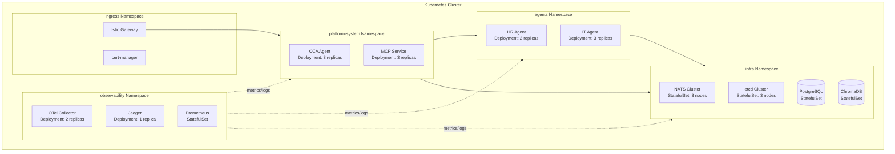

# 第八章：Kubernetes 雲原生部署 — 生產環境的基石

> 「在 K8s 上部署 AI Agent 平台，不是把 Docker 跑起來就完事 — 你需要考慮自動擴縮、健康檢查、密鑰管理、網絡策略，以及零停機更新。」

本章將展示如何將前面構建的 CCA、Specialized Agents、MCP Service 等組件部署到 Kubernetes 集群，實現生產級的可靠性和可擴展性。

---

## 8.1 集群架構設計

### 8.1.1 Namespace 隔離



### 8.1.2 資源配額與限制

```yaml
# k8s/namespaces/platform-system/resource-quota.yaml
apiVersion: v1
kind: ResourceQuota
metadata:
  name: platform-quota
  namespace: platform-system
spec:
  hard:
    requests.cpu: "8"
    requests.memory: 16Gi
    limits.cpu: "16"
    limits.memory: 32Gi
    pods: "20"
    services: "10"
    persistentvolumeclaims: "5"

---
# k8s/namespaces/platform-system/limit-range.yaml
apiVersion: v1
kind: LimitRange
metadata:
  name: platform-limit-range
  namespace: platform-system
spec:
  limits:
  - type: Container
    default:
      cpu: "500m"
      memory: 512Mi
    defaultRequest:
      cpu: "100m"
      memory: 256Mi
    max:
      cpu: "2"
      memory: 4Gi
```

---

## 8.2 CCA Agent 的 K8s 部署

### 8.2.1 Deployment 配置

```yaml
# k8s/platform/cca-agent/deployment.yaml
apiVersion: apps/v1
kind: Deployment
metadata:
  name: cca-agent
  namespace: platform-system
  labels:
    app: cca-agent
    version: v1
spec:
  replicas: 3
  strategy:
    type: RollingUpdate
    rollingUpdate:
      maxUnavailable: 1
      maxSurge: 1
  selector:
    matchLabels:
      app: cca-agent
  template:
    metadata:
      labels:
        app: cca-agent
        version: v1
    spec:
      serviceAccountName: cca-agent
      securityContext:
        runAsNonRoot: true
        runAsUser: 1000
        fsGroup: 2000
      containers:
      - name: cca-agent
        image: registry.company.internal/ai-platform/cca-agent:1.0.0
        ports:
        - containerPort: 8080
          name: http
        - containerPort: 8081
          name: grpc
        resources:
          requests:
            cpu: "500m"
            memory: "1Gi"
          limits:
            cpu: "2"
            memory: "4Gi"
        env:
        - name: LOG_LEVEL
          value: "INFO"
        - name: NATS_URL
          value: "nats://nats.infra:4222"
        - name: MCP_SERVICE_URL
          value: "http://mcp-service.platform-system:8080"
        - name: LLM_PROVIDER
          value: "ollama"
        - name: LLM_MODEL
          value: "llama3:70b"
        - name: OLLAMA_BASE_URL
          value: "http://ollama.infra:11434"
        - name: DB_HOST
          valueFrom:
            secretKeyRef:
              name: cca-secrets
              key: db-host
        - name: DB_PASSWORD
          valueFrom:
            secretKeyRef:
              name: cca-secrets
              key: db-password
        - name: LITELLM_MASTER_KEY
          valueFrom:
            secretKeyRef:
              name: cca-secrets
              key: litellm-master-key
        volumeMounts:
        - name: config
          mountPath: /app/config
          readOnly: true
        - name: tls-certs
          mountPath: /app/certs
          readOnly: true
        readinessProbe:
          httpGet:
            path: /healthz
            port: 8080
          initialDelaySeconds: 10
          periodSeconds: 5
          timeoutSeconds: 3
          failureThreshold: 3
        livenessProbe:
          httpGet:
            path: /healthz
            port: 8080
          initialDelaySeconds: 30
          periodSeconds: 10
          timeoutSeconds: 5
          failureThreshold: 3
        startupProbe:
          httpGet:
            path: /healthz
            port: 8080
          initialDelaySeconds: 5
          periodSeconds: 5
          failureThreshold: 30
      volumes:
      - name: config
        configMap:
          name: cca-config
      - name: tls-certs
        secret:
          secretName: cca-tls
```

### 8.2.2 HPA 自動擴縮

```yaml
# k8s/platform/cca-agent/hpa.yaml
apiVersion: autoscaling/v2
kind: HorizontalPodAutoscaler
metadata:
  name: cca-agent-hpa
  namespace: platform-system
spec:
  scaleTargetRef:
    apiVersion: apps/v1
    kind: Deployment
    name: cca-agent
  minReplicas: 3
  maxReplicas: 20
  metrics:
  - type: Resource
    resource:
      name: cpu
      target:
        type: Utilization
        averageUtilization: 70
  - type: Resource
    resource:
      name: memory
      target:
        type: Utilization
        averageUtilization: 80
  - type: Pods
    pods:
      metric:
        name: active_tasks
      target:
        type: AverageValue
        averageValue: "10"
  behavior:
    scaleUp:
      stabilizationWindowSeconds: 60
      policies:
      - type: Pods
        value: 2
        periodSeconds: 60
    scaleDown:
      stabilizationWindowSeconds: 300
      policies:
      - type: Percent
        value: 10
        periodSeconds: 60
```

---

## 8.3 Specialized Agents 的部署

### 8.3.1 HR Agent 的 K8s 配置

```yaml
# k8s/agents/hr-agent/deployment.yaml
apiVersion: apps/v1
kind: Deployment
metadata:
  name: hr-agent
  namespace: agents
  labels:
    app: hr-agent
    domain: human_resources
spec:
  replicas: 2
  selector:
    matchLabels:
      app: hr-agent
  template:
    metadata:
      labels:
        app: hr-agent
        domain: human_resources
    spec:
      serviceAccountName: hr-agent
      containers:
      - name: hr-agent
        image: registry.company.internal/ai-platform/hr-agent:1.2.0
        ports:
        - containerPort: 8080
        resources:
          requests:
            cpu: "300m"
            memory: "512Mi"
          limits:
            cpu: "1"
            memory: "2Gi"
        env:
        - name: AGENT_ID
          value: "hr-agent-v1"
        - name: NATS_URL
          value: "nats://nats.infra:4222"
        - name: KNOWLEDGE_BASE_URL
          value: "http://chromadb.infra:8000"
        - name: HR_API_URL
          valueFrom:
            secretKeyRef:
              name: hr-agent-secrets
              key: hr-api-url
        - name: HR_API_TOKEN
          valueFrom:
            secretKeyRef:
              name: hr-agent-secrets
              key: hr-api-token
        readinessProbe:
          httpGet:
            path: /healthz
            port: 8080
          initialDelaySeconds: 15
          periodSeconds: 5
        livenessProbe:
          httpGet:
            path: /healthz
            port: 8080
          initialDelaySeconds: 30
          periodSeconds: 10
```

### 8.3.2 IT Agent 的 K8s 配置

```yaml
# k8s/agents/it-agent/deployment.yaml
apiVersion: apps/v1
kind: Deployment
metadata:
  name: it-agent
  namespace: agents
  labels:
    app: it-agent
    domain: information_technology
spec:
  replicas: 3
  selector:
    matchLabels:
      app: it-agent
  template:
    metadata:
      labels:
        app: it-agent
        domain: information_technology
    spec:
      serviceAccountName: it-agent
      containers:
      - name: it-agent
        image: registry.company.internal/ai-platform/it-agent:1.0.0
        ports:
        - containerPort: 8080
        resources:
          requests:
            cpu: "300m"
            memory: "512Mi"
          limits:
            cpu: "1"
            memory: "2Gi"
        env:
        - name: AGENT_ID
          value: "it-agent-v1"
        - name: NATS_URL
          value: "nats://nats.infra:4222"
        - name: AD_API_URL
          valueFrom:
            secretKeyRef:
              name: it-agent-secrets
              key: ad-api-url
        - name: AD_API_TOKEN
          valueFrom:
            secretKeyRef:
              name: it-agent-secrets
              key: ad-api-token
        readinessProbe:
          httpGet:
            path: /healthz
            port: 8080
          initialDelaySeconds: 15
          periodSeconds: 5
        livenessProbe:
          httpGet:
            path: /healthz
            port: 8080
          initialDelaySeconds: 30
          periodSeconds: 10
```

---

## 8.4 密鑰管理

### 8.4.1 External Secrets Operator

```yaml
# k8s/external-secrets/it-agent-secrets.yaml
apiVersion: external-secrets.io/v1beta1
kind: ExternalSecret
metadata:
  name: it-agent-secrets
  namespace: agents
spec:
  refreshInterval: 1h
  secretStoreRef:
    name: vault-backend
    kind: ClusterSecretStore
  target:
    name: it-agent-secrets
    creationPolicy: Owner
  data:
  - secretKey: ad-api-url
    remoteRef:
      key: ai-platform/it-agent/ad-api-url
  - secretKey: ad-api-token
    remoteRef:
      key: ai-platform/it-agent/ad-api-token
  - secretKey: mail-api-token
    remoteRef:
      key: ai-platform/it-agent/mail-api-token
```

### 8.4.2 Secrets 加密存儲

```yaml
# k8s/sealed-secrets/it-agent-secrets.yaml
apiVersion: bitnami.com/v1alpha1
kind: SealedSecret
metadata:
  name: it-agent-secrets
  namespace: agents
spec:
  encryptedData:
    ad-api-url: AgBy3i4OJSWK+PiTySYZZA9rO43cGDEq...
    ad-api-token: AgBy3i4OJSWK+PiTySYZZA9rO43cGDEq...
    mail-api-token: AgBy3i4OJSWK+PiTySYZZA9rO43cGDEq...
```

---

## 8.5 網絡策略

### 8.5.1 Istio AuthorizationPolicy

```yaml
# k8s/istio/authorization-policies.yaml
apiVersion: security.istio.io/v1beta1
kind: AuthorizationPolicy
metadata:
  name: it-agent-policy
  namespace: agents
spec:
  selector:
    matchLabels:
      app: it-agent
  action: ALLOW
  rules:
  - from:
    - source:
        namespaces: ["platform-system"]
    to:
    - operation:
        methods: ["POST"]
        paths: ["/healthz", "/mcp"]
    when:
    - key: request.auth.claims[iss]
      values: ["https://auth.company.internal"]

---
apiVersion: security.istio.io/v1beta1
kind: AuthorizationPolicy
metadata:
  name: deny-all
  namespace: agents
spec:
  {}  # 默認 deny all，顯式 ALLOW 的流量才被允許
```

---

## 8.6 Helm Charts

### 8.6.1 Chart 結構

```
charts/
├── ai-platform/
│   ├── Chart.yaml
│   ├── values.yaml
│   ├── templates/
│   │   ├── _helpers.tpl
│   │   ├── cca-agent/
│   │   │   ├── deployment.yaml
│   │   │   ├── hpa.yaml
│   │   │   ├── service.yaml
│   │   │   └── servicemonitor.yaml
│   │   ├── hr-agent/
│   │   │   ├── deployment.yaml
│   │   │   ├── hpa.yaml
│   │   │   └── service.yaml
│   │   ├── it-agent/
│   │   │   ├── deployment.yaml
│   │   │   ├── hpa.yaml
│   │   │   └── service.yaml
│   │   ├── mcp-service/
│   │   │   ├── deployment.yaml
│   │   │   ├── hpa.yaml
│   │   │   └── service.yaml
│   │   └── config/
│   │       ├── configmap.yaml
│   │       └── secrets.yaml
│   └── values.yaml
├── monitoring/
│   ├── Chart.yaml
│   └── templates/
│       ├── prometheus/
│       ├── grafana/
│       └── jaeger/
└── infrastructure/
    ├── Chart.yaml
    └── templates/
        ├── nats/
        ├── chromadb/
        └── postgresql/
```

### 8.6.2 Helm Values 示例

```yaml
# charts/ai-platform/values.yaml
global:
  imageRegistry: registry.company.internal/ai-platform
  imagePullPolicy: IfNotPresent

ccaAgent:
  enabled: true
  replicaCount: 3
  image:
    repository: cca-agent
    tag: "1.0.0"
  resources:
    requests:
      cpu: "500m"
      memory: "1Gi"
    limits:
      cpu: "2"
      memory: "4Gi"
  hpa:
    enabled: true
    minReplicas: 3
    maxReplicas: 20
    targetCPUUtilization: 70

hrAgent:
  enabled: true
  replicaCount: 2
  image:
    repository: hr-agent
    tag: "1.2.0"

itAgent:
  enabled: true
  replicaCount: 3
  image:
    repository: it-agent
    tag: "1.0.0"

mcpService:
  enabled: true
  replicaCount: 3
  image:
    repository: mcp-service
    tag: "2.0.0"

ingress:
  enabled: true
  className: istio
  hosts:
  - host: ai-platform.company.internal
    paths:
    - path: /
      pathType: Prefix

monitoring:
  enabled: true
  serviceMonitor:
    enabled: true
    interval: 15s
```

---

## 8.7 零停機更新

### 8.7.1 滾動更新策略

```yaml
# 滾動更新配置
spec:
  strategy:
    type: RollingUpdate
    rollingUpdate:
      maxUnavailable: 1   # 每次最多關閉 1 個 Pod
      maxSurge: 1          # 每次最多新增 1 個 Pod
```

### 8.7.2 PreStop Hook

```yaml
# 在 Deployment 中添加 preStop hook
containers:
- name: cca-agent
  lifecycle:
    preStop:
      exec:
        command: ["/bin/sh", "-c", "sleep 15"]
```

---

## 8.8 PodDisruptionBudget

PodDisruptionBudget 確保在自愿中斷（節點維護、升級）期間維持最低可用 Pod 數量。

### 8.8.1 PDB 配置

```yaml
# k8s/platform/cca-agent/pdb.yaml
apiVersion: policy/v1
kind: PodDisruptionBudget
metadata:
  name: cca-agent-pdb
  namespace: platform-system
spec:
  minAvailable: 2  # 或使用 maxUnavailable: 1
  selector:
    matchLabels:
      app: cca-agent

---
# k8s/agents/it-agent/pdb.yaml
apiVersion: policy/v1
kind: PodDisruptionBudget
metadata:
  name: it-agent-pdb
  namespace: agents
spec:
  maxUnavailable: 1
  selector:
    matchLabels:
      app: it-agent
```

### 8.8.2 PDB 最佳實踐

| 場景 | 策略 | 說明 |
|------|------|------|
| **高可用服務** | `minAvailable: 2` | 至少保留 2 個 Pod 運行 |
| **可容忍中斷** | `maxUnavailable: 1` | 最多 1 個 Pod 中斷 |
| **狀態ful 服務** | `minAvailable: 1` | 至少保留 1 個 Pod |
| **有狀態集（NATS）** | `minAvailable: 2` | 確保 quorum |

---

## 8.9 原生 NetworkPolicy

除了 Istio AuthorizationPolicy，K8s 原生 NetworkPolicy 提供 L3/L4 層網絡隔離。

### 8.9.1 默認 deny all

```yaml
# k8s/network-policies/default-deny-all.yaml
apiVersion: networking.k8s.io/v1
kind: NetworkPolicy
metadata:
  name: default-deny-all
  namespace: agents
spec:
  podSelector: {}
  policyTypes:
  - Ingress
  - Egress

---
# k8s/network-policies/platform-system-deny-all.yaml
apiVersion: networking.k8s.io/v1
kind: NetworkPolicy
metadata:
  name: default-deny-all
  namespace: platform-system
spec:
  podSelector: {}
  policyTypes:
  - Ingress
  - Egress
```

### 8.9.2 允許特定流量

```yaml
# k8s/network-policies/allow-cca-to-agents.yaml
apiVersion: networking.k8s.io/v1
kind: NetworkPolicy
metadata:
  name: allow-cca-to-agents
  namespace: agents
spec:
  podSelector:
    matchLabels:
      app: hr-agent
  policyTypes:
  - Ingress
  ingress:
  - from:
    - namespaceSelector:
        matchLabels:
          name: platform-system
    ports:
    - protocol: TCP
      port: 8080

---
# k8s/network-policies/allow-agents-to-nats.yaml
apiVersion: networking.k8s.io/v1
kind: NetworkPolicy
metadata:
  name: allow-agents-to-nats
  namespace: agents
spec:
  podSelector:
    matchLabels:
      app: hr-agent
  policyTypes:
  - Egress
  egress:
  - to:
    - namespaceSelector:
        matchLabels:
          name: infra
    ports:
    - protocol: TCP
      port: 4222  # NATS client port
    - protocol: TCP
      port: 8222  # NATS monitoring port
```

### 8.9.3 跨 Namespace 通信

```yaml
# k8s/network-policies/allow-observability-scraping.yaml
apiVersion: networking.k8s.io/v1
kind: NetworkPolicy
metadata:
  name: allow-observability-scraping
  namespace: platform-system
spec:
  podSelector: {}
  policyTypes:
  - Ingress
  ingress:
  - from:
    - namespaceSelector:
        matchLabels:
          name: observability
    ports:
    - protocol: TCP
      port: 9090  # Prometheus metrics port
```

---

## 8.10 GPU 調度（Ollama）

### 8.10.1 GPU 節點配置

```yaml
# k8s/infra/ollama/deployment.yaml
apiVersion: apps/v1
kind: Deployment
metadata:
  name: ollama
  namespace: infra
spec:
  replicas: 1
  selector:
    matchLabels:
      app: ollama
  template:
    metadata:
      labels:
        app: ollama
    spec:
      nodeSelector:
        accelerator: nvidia-a10g  # 選擇帶 GPU 的節點
      tolerations:
      - key: nvidia.com/gpu
        operator: Exists
        effect: NoSchedule
      containers:
      - name: ollama
        image: ollama/ollama:latest
        ports:
        - containerPort: 11434
        resources:
          requests:
            cpu: "2"
            memory: "8Gi"
            nvidia.com/gpu: "1"
          limits:
            cpu: "4"
            memory: "16Gi"
            nvidia.com/gpu: "1"
        volumeMounts:
        - name: ollama-models
          mountPath: /root/.ollama
      volumes:
      - name: ollama-models
        persistentVolumeClaim:
          claimName: ollama-models-pvc
```

### 8.10.2 GPU 節點標籤

```bash
# 標記帶 GPU 的節點
kubectl label nodes gpu-node-1 accelerator=nvidia-a10g
kubectl label nodes gpu-node-2 accelerator=nvidia-a10g

# 確認節點標籤
kubectl get nodes --show-labels | grep accelerator
```

### 8.10.3 NVIDIA Device Plugin

```yaml
# 安裝 NVIDIA Device Plugin（DaemonSet）
apiVersion: apps/v1
kind: DaemonSet
metadata:
  name: nvidia-device-plugin-daemonset
  namespace: kube-system
spec:
  selector:
    matchLabels:
      name: nvidia-device-plugin-ds
  template:
    metadata:
      labels:
        name: nvidia-device-plugin-ds
    spec:
      tolerations:
      - key: nvidia.com/gpu
        operator: Exists
        effect: NoSchedule
      containers:
      - name: nvidia-device-plugin-ctr
        image: nvcr.io/nvidia/k8s-device-plugin:v0.14.0
        volumeMounts:
        - name: device-plugin
          mountPath: /var/lib/kubelet/device-plugins
      volumes:
      - name: device-plugin
        hostPath:
          path: /var/lib/kubelet/device-plugins
```

---

## 8.11 PVC 存儲

### 8.11.1 Ollama 模型存儲

```yaml
# k8s/infra/ollama/pvc.yaml
apiVersion: v1
kind: PersistentVolumeClaim
metadata:
  name: ollama-models-pvc
  namespace: infra
spec:
  accessModes:
  - ReadWriteOnce
  storageClassName: fast-ssd  # 使用 SSD 存儲類
  resources:
    requests:
      storage: 100Gi  # 足夠存儲多個 LLM 模型

---
# k8s/infra/ollama/storage-class.yaml
apiVersion: storage.k8s.io/v1
kind: StorageClass
metadata:
  name: fast-ssd
provisioner: kubernetes.io/gce-pd
parameters:
  type: pd-ssd
  replication-type: none
reclaimPolicy: Retain  # 保留數據即使 PVC 被刪除
allowVolumeExpansion: true
volumeBindingMode: WaitForFirstConsumer
```

### 8.11.2 PostgreSQL 存儲

```yaml
# k8s/infra/postgresql/pvc.yaml
apiVersion: v1
kind: PersistentVolumeClaim
metadata:
  name: postgresql-data-pvc
  namespace: infra
spec:
  accessModes:
  - ReadWriteOnce
  storageClassName: fast-ssd
  resources:
    requests:
      storage: 50Gi

---
# k8s/infra/postgresql/statefulset.yaml
apiVersion: apps/v1
kind: StatefulSet
metadata:
  name: postgresql
  namespace: infra
spec:
  serviceName: postgresql
  replicas: 1
  selector:
    matchLabels:
      app: postgresql
  template:
    metadata:
      labels:
        app: postgresql
    spec:
      containers:
      - name: postgresql
        image: postgres:16
        ports:
        - containerPort: 5432
        env:
        - name: POSTGRES_DB
          value: "ai_platform"
        - name: POSTGRES_USER
          valueFrom:
            secretKeyRef:
              name: postgresql-secrets
              key: username
        - name: POSTGRES_PASSWORD
          valueFrom:
            secretKeyRef:
              name: postgresql-secrets
              key: password
        - name: PGDATA
          value: /var/lib/postgresql/data/pgdata
        volumeMounts:
        - name: postgresql-data
          mountPath: /var/lib/postgresql/data
        resources:
          requests:
            cpu: "500m"
            memory: "1Gi"
          limits:
            cpu: "2"
            memory: "4Gi"
  volumeClaimTemplates:
  - metadata:
      name: postgresql-data
    spec:
      accessModes: ["ReadWriteOnce"]
      storageClassName: fast-ssd
      resources:
        requests:
          storage: 50Gi
```

---

## 8.12 ServiceAccount 與 RBAC

### 8.12.1 ServiceAccount 配置

```yaml
# k8s/rbac/service-accounts.yaml
apiVersion: v1
kind: ServiceAccount
metadata:
  name: cca-agent
  namespace: platform-system
  labels:
    app: cca-agent

---
apiVersion: v1
kind: ServiceAccount
metadata:
  name: hr-agent
  namespace: agents
  labels:
    app: hr-agent

---
apiVersion: v1
kind: ServiceAccount
metadata:
  name: it-agent
  namespace: agents
  labels:
    app: it-agent
```

### 8.12.2 RBAC 角色

```yaml
# k8s/rbac/agent-roles.yaml
apiVersion: rbac.authorization.k8s.io/v1
kind: Role
metadata:
  name: agent-reader
  namespace: agents
rules:
- apiGroups: [""]
  resources: ["configmaps", "secrets"]
  verbs: ["get", "list", "watch"]
- apiGroups: [""]
  resources: ["pods"]
  verbs: ["get", "list"]
- apiGroups: ["apps"]
  resources: ["deployments", "statefulsets"]
  verbs: ["get", "list", "watch"]

---
apiVersion: rbac.authorization.k8s.io/v1
kind: RoleBinding
metadata:
  name: cca-agent-binding
  namespace: platform-system
subjects:
- kind: ServiceAccount
  name: cca-agent
  namespace: platform-system
roleRef:
  kind: Role
  name: agent-reader
  apiGroup: rbac.authorization.k8s.io

---
apiVersion: rbac.authorization.k8s.io/v1
kind: RoleBinding
metadata:
  name: hr-agent-binding
  namespace: agents
subjects:
- kind: ServiceAccount
  name: hr-agent
  namespace: agents
roleRef:
  kind: Role
  name: agent-reader
  apiGroup: rbac.authorization.k8s.io

---
apiVersion: rbac.authorization.k8s.io/v1
kind: RoleBinding
metadata:
  name: it-agent-binding
  namespace: agents
subjects:
- kind: ServiceAccount
  name: it-agent
  namespace: agents
roleRef:
  kind: Role
  name: agent-reader
  apiGroup: rbac.authorization.k8s.io
```

### 8.12.3 K8s API 只讀訪問

```yaml
# k8s/rbac/k8s-reader-role.yaml
apiVersion: rbac.authorization.k8s.io/v1
kind: ClusterRole
metadata:
  name: k8s-reader
rules:
- apiGroups: [""]
  resources: ["nodes", "namespaces", "services", "endpoints"]
  verbs: ["get", "list", "watch"]
- apiGroups: ["apps"]
  resources: ["deployments", "statefulsets", "daemonsets"]
  verbs: ["get", "list", "watch"]
- apiGroups: ["metrics.k8s.io"]
  resources: ["pods", "nodes"]
  verbs: ["get", "list"]

---
apiVersion: rbac.authorization.k8s.io/v1
kind: ClusterRoleBinding
metadata:
  name: cca-agent-k8s-reader
subjects:
- kind: ServiceAccount
  name: cca-agent
  namespace: platform-system
roleRef:
  kind: ClusterRole
  name: k8s-reader
  apiGroup: rbac.authorization.k8s.io
```

### 8.12.4 RBAC 最佳實踐

| 原則 | 實踐 |
|------|------|
| **最小權限** | 每個 Agent 僅授予必要權限 |
| **命名空間隔離** | 使用 Role/RoleBinding 而非 ClusterRole |
| **定期審計** | 使用 `kubectl auth can-i` 檢查權限 |
| **避免 cluster-admin** | 永遠不要給 Agent 超級管理員權限 |
| **使用 Workload Identity** | 雲端 IAM 綁定 ServiceAccount |

---

## 本章小結

本章展示了 Kubernetes 雲原生部署的完整方案：

- **Namespace 隔離**：platform-system、agents、infra、observability 四層分離
- **Deployment 配置**：資源限制、健康檢查、啟動探針
- **HPA 自動擴縮**：基於 CPU/Memory/自定義指標的自動擴縮
- **PodDisruptionBudget**：確保自願中斷期間的可用性
- **密鑰管理**：External Secrets Operator + Vault + Sealed Secrets
- **網絡策略**：K8s NetworkPolicy + Istio AuthorizationPolicy，零信任網絡
- **GPU 調度**：NVIDIA Device Plugin、GPU 節點標籤、Ollama 部署
- **PVC 存儲**：模型存儲、數據庫存儲、StorageClass 配置
- **ServiceAccount 與 RBAC**：最小權限原則、命名空間隔離
- **Helm Charts**：多層 Chart 結構，values.yaml 配置管理
- **零停機更新**：滾動更新 + PreStop Hook

---

## 延伸閱讀

1. **Kubernetes Documentation** — https://kubernetes.io/docs/ — K8s 官方文檔。
2. **Helm Documentation** — https://helm.sh/docs/ — Helm 包管理器文檔。
3. **Istio Documentation** — https://istio.io/latest/docs/ — 服務網格文檔。
4. **External Secrets Operator** — https://external-secrets.io/ — 密鑰管理文檔。
5. **NVIDIA Device Plugin** — https://github.com/NVIDIA/k8s-device-plugin — GPU 調度文檔。
6. **《Kubernetes in Action》** — Marko Lukša, Manning. K8s 實戰經典。
7. **《Kubernetes Patterns》** — Ibolya Fanni, Bilgin Ibryam, Red Hat. K8s 設計模式。
