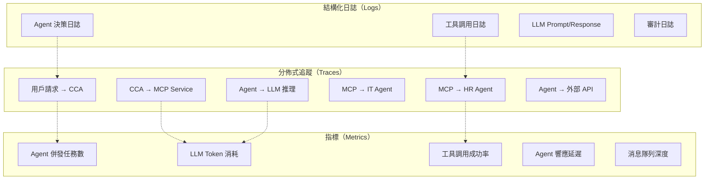
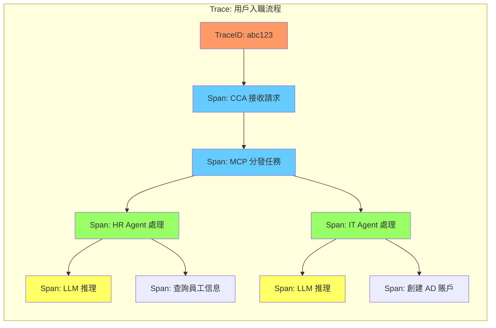

# 第九章：OpenTelemetry 實踐 — 多 Agent 系統的可觀測性

> 「在多 Agent 系統中，如果一個 Agent 出錯了你卻不知道，那比沒有 Agent 還糟糕。可觀測性不是可選項，它是生命線。」

傳統的「三大支柱」（Logs、Metrics、Traces）在多 Agent 系統中需要新的設計思路。每個 Agent 的每一次決策、每一次工具調用、每一次跨 Agent 通信，都需要被完整記錄和關聯。本章將展示如何用 OpenTelemetry 構建 AI Agent 平台的可觀測性。

---

## 9.1 AI Agent 平台的可觀測性挑戰

### 9.1.1 與傳統微服務的差異

| 維度 | 傳統微服務 | AI Agent 平台 |
|------|-----------|--------------|
| **請求流** | 確定性（A→B→C） | 非確定性（LLM 決策） |
| **延遲分佈** | 相對穩定 | 長尾明顯（LLM 推理時間波動大） |
| **錯誤模式** | 異常/超時 | 語義錯誤（工具選錯、參數錯） |
| **關聯維度** | TraceID + RequestID | TraceID + TaskID + AgentID + SessionID |
| **成本追蹤** | 無需 | 每次 LLM 調用消耗 Token |

### 9.1.2 我們需要追蹤什麼



---

## 9.2 分佈式追蹤（Traces）

### 9.2.1 Span 設計

每個 Agent 任務在追蹤系統中對應一個完整的 Trace，包含多個 Span：

```python
# observability/tracing.py
from opentelemetry import trace
from opentelemetry.sdk.trace import TracerProvider
from opentelemetry.sdk.trace.export import BatchSpanProcessor
from opentelemetry.exporter.otlp.proto.grpc.trace_exporter import OTLPSpanExporter

# 初始化 Tracer
provider = TracerProvider()
processor = BatchSpanProcessor(
    OTLPSpanExporter(endpoint="http://otel-collector.observability:4317")
)
provider.add_span_processor(processor)
trace.set_tracer_provider(provider)

tracer = trace.get_tracer("ai-platform", "1.0.0")


class AgentTracer:
    """Agent 級別的追蹤封裝"""

    @staticmethod
    def start_task_span(task_id: str, task_type: str, user_id: str):
        """開始一個任務 Span"""
        return tracer.start_as_current_span(
            f"agent.task.{task_type}",
            attributes={
                "task.id": task_id,
                "task.type": task_type,
                "user.id": user_id,
                "platform": "ai-agent-platform"
            }
        )

    @staticmethod
    def trace_tool_call(agent_id: str, tool_name: str):
        """追蹤工具調用 Span"""
        return tracer.start_as_current_span(
            f"agent.tool.{tool_name}",
            attributes={
                "agent.id": agent_id,
                "tool.name": tool_name
            }
        )

    @staticmethod
    def trace_llm_call(agent_id: str, model: str, token_count: int = 0):
        """追蹤 LLM 調用 Span"""
        return tracer.start_as_current_span(
            f"agent.llm.inference",
            attributes={
                "agent.id": agent_id,
                "llm.model": model,
                "llm.token_count": token_count
            }
        )
```

### 9.2.2 在 Agent 中使用追蹤

```python
# agents/it_agent/instrumented.py
from observability.tracing import AgentTracer

class InstrumentedITAgent:
    """帶追蹤的 IT Agent"""

    def __init__(self):
        self.tracer = AgentTracer()

    async def handle_task(self, task: dict) -> dict:
        # 1. 開始任務追蹤
        with AgentTracer.start_task_span(
            task_id=task["task_id"],
            task_type="create_it_account",
            user_id=task.get("user_id", "unknown")
        ) as span:

            # 2. 追蹤 LLM 推理
            with AgentTracer.trace_llm_call(
                agent_id="it-agent",
                model="llama3:70b"
            ) as llm_span:
                plan = await self._plan_task(task)
                llm_span.set_attribute("llm.tokens.input", plan.tokens_used.input)
                llm_span.set_attribute("llm.tokens.output", plan.tokens_used.output)

            # 3. 追蹤每個工具調用
            for tool_call in plan.tool_calls:
                with AgentTracer.trace_tool_call(
                    agent_id="it-agent",
                    tool_name=tool_call.name
                ) as tool_span:
                    result = await self._execute_tool(tool_call)
                    tool_span.set_attribute("tool.success", result.success)
                    tool_span.set_attribute("tool.duration_ms", result.duration_ms)

            # 4. 返回結構化結果
            return {
                "task_id": task["task_id"],
                "status": "success",
                "trace_id": trace.get_current_span().get_span_context().trace_id
            }
```

### 9.2.3 Span 屬性規範

```yaml
# AI Agent 平台的 Span 屬性標準
span_attributes:
  # 通用屬性
  platform.name: "ai-agent-platform"
  platform.version: "1.0.0"

  # 任務屬性
  task.id: "task_abc123"
  task.type: "create_it_account"
  task.priority: "high"

  # Agent 屬性
  agent.id: "it-agent-v1"
  agent.domain: "information_technology"
  agent.version: "1.0.0"

  # LLM 屬性
  llm.provider: "ollama"
  llm.model: "llama3:70b"
  llm.tokens.input: 1234
  llm.tokens.output: 567
  llm.temperature: 0.2
  llm.duration_ms: 3500

  # 工具屬性
  tool.name: "create_ad_account"
  tool.success: true
  tool.duration_ms: 1200
  tool.error: ""

  # 通信屬性
  communication.protocol: "mcp"
  communication.method: "tools/call"
  communication.target: "it-agent"
```

---

## 9.3 指標收集（Metrics）

### 9.3.1 自定義指標

```python
# observability/metrics.py
from opentelemetry.metrics import get_meter

meter = get_meter("ai-platform", "1.0.0")

# 1. Agent 併發任務數
active_tasks = meter.create_up_down_counter(
    "agent.tasks.active",
    description="Agent 當前活躍任務數",
    unit="1"
)

# 2. 任務完成計數
task_completed = meter.create_counter(
    "agent.tasks.completed",
    description="Agent 任務完成次數",
    unit="1"
)

# 3. 任務延遲分佈
task_duration = meter.create_histogram(
    "agent.tasks.duration",
    description="Agent 任務執行延遲",
    unit="ms"
)

# 4. LLM Token 消耗
llm_tokens = meter.create_counter(
    "agent.llm.tokens.total",
    description="LLM Token 總消耗量",
    unit="1"
)

# 5. 工具調用成功率
tool_success_rate = meter.create_counter(
    "agent.tools.calls.success",
    description="工具調用成功次數",
    unit="1"
)

# 6. 消息隊列深度
queue_depth = meter.create_gauge(
    "agent.queue.depth",
    description="消息隊列當前深度",
    unit="1"
)

# 7. Agent 響應延遲百分位
response_latency = meter.create_histogram(
    "agent.response.latency",
    description="Agent 響應延遲分佈",
    unit="ms"
)
```

### 9.3.2 Prometheus 配置

```yaml
# prometheus/prometheus.yml
global:
  scrape_interval: 15s
  evaluation_interval: 15s

scrape_configs:
- job_name: 'ai-platform-agents'
  kubernetes_sd_configs:
  - role: pod
    namespaces:
      names:
      - platform-system
      - agents
  relabel_configs:
  - source_labels: [__meta_kubernetes_pod_label_app]
    regex: (cca-agent|hr-agent|it-agent|mcp-service)
    action: keep
  - source_labels: [__address__]
    regex: '(.+):8080'
    target_label: __address__
    replacement: '$1:9090'

- job_name: 'mcp-service'
  static_configs:
  - targets: ['mcp-service.platform-system:9090']

- job_name: 'nats'
  static_configs:
  - targets: ['nats.infra:8225']
```

---

## 9.4 結構化日誌（Logs）

### 9.4.1 日誌格式設計

```python
# observability/logging.py
import structlog
import logging

# 配置 structlog
structlog.configure(
    processors=[
        structlog.processors.TimeStamper(fmt="iso"),
        structlog.processors.add_log_level,
        structlog.processors.JSONRenderer()
    ],
    logger_factory=structlog.stdlib.LoggerFactory()
)

logger = structlog.get_logger("ai-platform")


class AgentLogger:
    """Agent 專用日誌記錄器"""

    @staticmethod
    def log_task_start(task_id: str, task_type: str, user_id: str):
        logger.info(
            "task_started",
            task_id=task_id,
            task_type=task_type,
            user_id=user_id
        )

    @staticmethod
    def log_tool_call(agent_id: str, tool_name: str, arguments: dict, duration_ms: float, success: bool):
        logger.info(
            "tool_called",
            agent_id=agent_id,
            tool_name=tool_name,
            arguments=arguments,
            duration_ms=duration_ms,
            success=success
        )

    @staticmethod
    def log_llm_call(agent_id: str, model: str, tokens_used: dict, duration_ms: float):
        logger.info(
            "llm_called",
            agent_id=agent_id,
            model=model,
            tokens_input=tokens_used.get("input", 0),
            tokens_output=tokens_used.get("output", 0),
            duration_ms=duration_ms
        )

    @staticmethod
    def log_task_complete(task_id: str, status: str, duration_ms: float, errors: list = None):
        logger.info(
            "task_completed",
            task_id=task_id,
            status=status,
            duration_ms=duration_ms,
            errors=errors or []
        )

    @staticmethod
    def log_audit_event(event_type: str, user_id: str, resource: str, action: str, result: str):
        logger.info(
            "audit_event",
            event_type=event_type,
            user_id=user_id,
            resource=resource,
            action=action,
            result=result
        )
```

### 9.4.2 Loki 日誌存儲

```yaml
# loki/loki-config.yaml
auth_enabled: false

server:
  http_listen_port: 3100

ingester:
  lifecycler:
    ring:
      kvstore:
        store: inmemory
      replication_factor: 1
  chunk_idle_period: 5m
  chunk_retain_period: 30s

schema_config:
  configs:
  - from: 2024-01-01
    store: boltdb-shipper
    object_store: filesystem
    schema: v11
    index:
      prefix: index_
      period: 24h

storage_config:
  boltdb_shipper:
    active_index_directory: /loki/index
    cache_location: /loki/cache
  filesystem:
    directory: /loki/chunks

limits_config:
  enforce_metric_name: false
  reject_old_samples: true
  reject_old_samples_max_age: 168h
```

---

## 9.5 Grafana 儀表板

### 9.5.1 核心儀表板

```json
{
  "dashboard": {
    "title": "AI Agent Platform Overview",
    "panels": [
      {
        "title": "Active Tasks by Agent",
        "type": "stat",
        "targets": [
          {
            "expr": "sum by (agent_id) (agent_tasks_active)",
            "legendFormat": "{{agent_id}}"
          }
        ]
      },
      {
        "title": "Task Success Rate",
        "type": "gauge",
        "targets": [
          {
            "expr": "sum(rate(agent_tasks_completed_total{status='success'}[5m])) / sum(rate(agent_tasks_completed_total[5m])) * 100",
            "legendFormat": "Success Rate %"
          }
        ],
        "thresholds": [
          {"value": 95, "color": "red"},
          {"value": 99, "color": "yellow"},
          {"value": 100, "color": "green"}
        ]
      },
      {
        "title": "LLM Token Usage",
        "type": "timeseries",
        "targets": [
          {
            "expr": "sum(rate(agent_llm_tokens_total[1h])) by (agent_id, model)",
            "legendFormat": "{{agent_id}} - {{model}}"
          }
        ]
      },
      {
        "title": "P95 Response Latency",
        "type": "timeseries",
        "targets": [
          {
            "expr": "histogram_quantile(0.95, sum(rate(agent_response_latency_bucket[5m])) by (le, agent_id))",
            "legendFormat": "P95 - {{agent_id}}"
          }
        ]
      }
    ]
  }
}
```

---

## 9.6 告警規則

### 9.6.1 Prometheus AlertManager 配置

```yaml
# alertmanager/alertmanager.yml
global:
  resolve_timeout: 5m

route:
  group_by: ['alertname', 'agent_id']
  group_wait: 30s
  group_interval: 5m
  repeat_interval: 4h
  receiver: 'slack-notifications'

receivers:
- name: 'slack-notifications'
  slack_configs:
  - channel: '#ai-platform-alerts'
    send_resolved: true
    title: '{{ .GroupLabels.alertname }}'
    text: '{{ .CommonAnnotations.description }}'

inhibit_rules:
- source_match:
    severity: 'critical'
  target_match:
    severity: 'warning'
  equal: ['alertname', 'agent_id']
```

### 9.6.2 告警規則

```yaml
# alertmanager/rules/ai-platform.yml
groups:
- name: ai-platform
  rules:
  - alert: AgentHighErrorRate
    expr: sum(rate(agent_tasks_completed_total{status='failed'}[5m])) by (agent_id) / sum(rate(agent_tasks_completed_total[5m])) by (agent_id) > 0.1
    for: 5m
    labels:
      severity: critical
    annotations:
      summary: "Agent {{ $labels.agent_id }} 錯誤率超過 10%"
      description: "Agent {{ $labels.agent_id }} 在過去 5 分鐘內的任務失敗率為 {{ $value | humanizePercentage }}"

  - alert: AgentHighLatency
    expr: histogram_quantile(0.95, sum(rate(agent_response_latency_bucket[5m])) by (le, agent_id)) > 30000
    for: 5m
    labels:
      severity: warning
    annotations:
      summary: "Agent {{ $labels.agent_id }} P95 延遲超過 30s"
      description: "Agent {{ $labels.agent_id }} 的 P95 響應延遲為 {{ $value }}ms"

  - alert: LLMTokenBurnRate
    expr: sum(rate(agent_llm_tokens_total[1h])) > 1000000
    for: 10m
    labels:
      severity: warning
    annotations:
      summary: "LLM Token 消耗速率過高"
      description: "過去 1 小時內 LLM Token 消耗速率超過 100 萬/小時"

  - alert: QueueDepthHigh
    expr: agent_queue_depth > 1000
    for: 5m
    labels:
      severity: critical
    annotations:
      summary: "消息隊列深度過高"
      description: "消息隊列深度為 {{ $value }}，可能影響系統響應時間"
```

---

## 9.7 端到端可觀測性實戰

### 9.7.1 Trace → Metrics → Logs 關聯

```python
# 可觀測性關聯查詢
async def investigate_slow_task(task_id: str):
    """調查慢任務的根因"""

    # 1. 從 Trace 開始
    trace_data = await jaeger.get_trace(task_id)
    spans = trace_data.spans

    # 2. 找到最慢的 Span
    slowest_span = max(spans, key=lambda s: s.duration)

    # 3. 查詢對應的 Logs
    logs = await loki.query(
        f'{{task_id="{task_id}"}} | json | duration_ms > {slowest_span.duration * 0.8}'
    )

    # 4. 查詢 Metrics
    metrics = await prometheus.query(
        f'rate(agent_llm_tokens_total{{task_id="{task_id}"}}[1h])'
    )

    # 5. 組合分析
    return {
        "slowest_operation": slowest_span.name,
        "duration_ms": slowest_span.duration,
        "related_logs": logs,
        "token_usage": metrics
    }
```

---

## 9.8 LLM 專屬可觀測性模式

### 9.8.1 Prompt 與 Response 記錄

```python
# observability/llm_logging.py
from opentelemetry import trace, metrics
from opentelemetry.sdk.trace import TracerProvider
from opentelemetry.sdk.metrics import MeterProvider
import hashlib
import json
from datetime import datetime

tracer = trace.get_tracer("llm-observability", "1.0.0")
meter = metrics.get_meter("llm-observability", "1.0.0")

# 成本追蹤指標
llm_cost = meter.create_counter(
    "llm.cost.usd",
    description="LLM 調用成本（美元）",
    unit="USD"
)

llm_tokens_by_model = meter.create_counter(
    "llm.tokens.by_model",
    description="按模型分類的 Token 消耗",
    unit="1"
)

llm_latency = meter.create_histogram(
    "llm.inference.latency",
    description="LLM 推理延遲",
    unit="ms"
)

# Token 價格表（可從配置文件加載）
TOKEN_PRICING = {
    "llama3:70b": {"input": 0.0, "output": 0.0},  # 本地部署免費
    "gpt-4o": {"input": 0.0025, "output": 0.01},
    "gpt-4o-mini": {"input": 0.00015, "output": 0.0006},
    "claude-3-5-sonnet": {"input": 0.003, "output": 0.015},
}


class LLMObservability:
    """LLM 調用的完整可觀測性封裝"""

    def __init__(self, agent_id: str, model: str):
        self.agent_id = agent_id
        self.model = model
        self.pricing = TOKEN_PRICING.get(model, {"input": 0.001, "output": 0.003})

    def _hash_prompt(self, prompt: str) -> str:
        """Prompt 雜湊，用於去重和合規"""
        return hashlib.sha256(prompt.encode()).hexdigest()[:16]

    def _calculate_cost(self, input_tokens: int, output_tokens: int) -> float:
        """計算 LLM 調用成本"""
        return (input_tokens * self.pricing["input"] +
                output_tokens * self.pricing["output"])

    def trace_llm_call(self, prompt: str, context: dict = None):
        """追蹤一次完整的 LLM 調用"""
        prompt_hash = self._hash_prompt(prompt)

        with tracer.start_as_current_span(
            f"llm.inference.{self.model}",
            attributes={
                "llm.model": self.model,
                "llm.agent_id": self.agent_id,
                "llm.prompt_hash": prompt_hash,
                "llm.prompt_length": len(prompt),
                "llm.context": json.dumps(context or {}, ensure_ascii=False)[:500]
            }
        ) as span:
            yield span

    def record_llm_result(
        self,
        span: trace.Span,
        response: str,
        input_tokens: int,
        output_tokens: int,
        latency_ms: float,
        finish_reason: str = "stop"
    ):
        """記錄 LLM 調用結果"""
        cost = self._calculate_cost(input_tokens, output_tokens)

        # 設置 Span 屬性
        span.set_attribute("llm.tokens.input", input_tokens)
        span.set_attribute("llm.tokens.output", output_tokens)
        span.set_attribute("llm.tokens.total", input_tokens + output_tokens)
        span.set_attribute("llm.cost_usd", cost)
        span.set_attribute("llm.finish_reason", finish_reason)
        span.set_attribute("llm.response_length", len(response))
        span.set_attribute("llm.response_hash", self._hash_prompt(response))

        # 記錄 Metrics
        llm_cost.add(cost, {
            "agent_id": self.agent_id,
            "model": self.model
        })

        llm_tokens_by_model.add(input_tokens + output_tokens, {
            "model": self.model,
            "type": "total"
        })

        llm_latency.record(latency_ms, {
            "model": self.model,
            "agent_id": self.agent_id
        })
```

### 9.8.2 Token 成本歸因

```python
# observability/cost_attribution.py
from dataclasses import dataclass, field
from typing import Dict, List
from datetime import datetime, timedelta
import json

@dataclass
class TokenUsage:
    model: str
    input_tokens: int
    output_tokens: int
    cost_usd: float
    agent_id: str
    task_id: str
    user_id: str
    department: str
    timestamp: datetime = field(default_factory=datetime.now)


class CostAttribution:
    """Token 成本歸因系統"""

    def __init__(self):
        self.usages: List[TokenUsage] = []

    def record(self, usage: TokenUsage):
        """記錄一次 Token 使用"""
        self.usages.append(usage)

    def get_department_cost(
        self,
        department: str,
        period: timedelta = timedelta(days=30)
    ) -> float:
        """計算部門成本"""
        cutoff = datetime.now() - period
        return sum(
            u.cost_usd for u in self.usages
            if u.department == department and u.timestamp > cutoff
        )

    def get_agent_cost(
        self,
        agent_id: str,
        period: timedelta = timedelta(days=30)
    ) -> float:
        """計算 Agent 成本"""
        cutoff = datetime.now() - period
        return sum(
            u.cost_usd for u in self.usages
            if u.agent_id == agent_id and u.timestamp > cutoff
        )

    def get_cost_breakdown(self, period: timedelta = timedelta(days=7)) -> dict:
        """獲取成本分解報告"""
        cutoff = datetime.now() - period
        recent = [u for u in self.usages if u.timestamp > cutoff]

        by_department = {}
        by_agent = {}
        by_model = {}

        for u in recent:
            by_department.setdefault(u.department, 0.0)
            by_department[u.department] += u.cost_usd

            by_agent.setdefault(u.agent_id, 0.0)
            by_agent[u.agent_id] += u.cost_usd

            by_model.setdefault(u.model, 0.0)
            by_model[u.model] += u.cost_usd

        return {
            "period_days": period.days,
            "total_cost_usd": sum(u.cost_usd for u in recent),
            "total_tokens": sum(u.input_tokens + u.output_tokens for u in recent),
            "by_department": by_department,
            "by_agent": by_agent,
            "by_model": by_model,
            "request_count": len(recent)
        }

    def export_to_prometheus(self) -> str:
        """導出為 Prometheus 格式"""
        lines = []
        breakdown = self.get_cost_breakdown()

        for dept, cost in breakdown["by_department"].items():
            lines.append(
                f'llm_cost_by_department{{department="{dept}"}} {cost}'
            )

        for agent, cost in breakdown["by_agent"].items():
            lines.append(
                f'llm_cost_by_agent{{agent_id="{agent}"}} {cost}'
            )

        return "\n".join(lines)
```

### 9.8.3 Hallucination 檢測指標

```python
# observability/hallucination_detection.py
from dataclasses import dataclass
from typing import Optional, List
import re

@dataclass
class HallucinationCheck:
    has_citations: bool
    has_confidence_score: bool
    contains_known_facts: bool
    response_consistency: float  # 0-1
    tool_call_success_rate: float  # 0-1
    score: float  # 0-1, 0 = 可能 hallucination


class HallucinationDetector:
    """LLM 回應的 Hallucination 檢測"""

    def __init__(self):
        self.confidence_patterns = [
            r"我不確定",
            r"可能需要",
            r"建議確認",
            r"我不太清楚",
            r"需要更多信息"
        ]

    def check_response(
        self,
        response: str,
        context: str,
        tool_results: List[dict] = None
    ) -> HallucinationCheck:
        """檢查回應是否包含 hallucination"""

        # 1. 檢查是否有引用/來源
        has_citations = bool(re.search(r'\[.*\]|來源：|參照：', response))

        # 2. 檢查是否有信心分數
        has_confidence = any(
            re.search(pattern, response) for pattern in self.confidence_patterns
        )

        # 3. 檢查回應是否包含已知事實
        contains_known = self._check_known_facts(response, context)

        # 4. 計算一致性分數
        consistency = self._calculate_consistency(response, context)

        # 5. 工具調用成功率
        tool_success_rate = 0.0
        if tool_results:
            successful = sum(1 for t in tool_results if t.get("success", False))
            tool_success_rate = successful / len(tool_results)

        # 6. 綜合評分
        score = (
            (0.2 if has_citations else 0.0) +
            (0.2 if has_confidence else 0.0) +
            (0.3 if contains_known else 0.0) +
            (0.15 * consistency) +
            (0.15 * tool_success_rate)
        )

        return HallucinationCheck(
            has_citations=has_citations,
            has_confidence_score=has_confidence,
            contains_known_facts=contains_known,
            response_consistency=consistency,
            tool_call_success_rate=tool_success_rate,
            score=score
        )

    def _check_known_facts(self, response: str, context: str) -> bool:
        """檢查回應是否與上下文一致"""
        # 簡化實現：檢查關鍵實體是否在上下文中出現
        response_entities = set(re.findall(r'[\u4e00-\u9fa5]+', response))
        context_entities = set(re.findall(r'[\u4e00-\u9fa5]+', context))

        if not response_entities:
            return True

        overlap = len(response_entities & context_entities) / len(response_entities)
        return overlap > 0.3

    def _calculate_consistency(self, response: str, context: str) -> float:
        """計算回應與上下文的一致性"""
        # 簡化實現：基於關鍵詞重疊
        response_words = set(response.split())
        context_words = set(context.split())

        if not response_words:
            return 0.5

        overlap = len(response_words & context_words) / len(response_words)
        return min(overlap * 2, 1.0)  # 歸一化到 0-1
```

### 9.8.4 Prompt 版本管理

```python
# observability/prompt_versioning.py
from dataclasses import dataclass
from typing import Dict, Optional
from datetime import datetime
import json
import hashlib

@dataclass
class PromptVersion:
    version: str
    template: str
    variables: list
    created_at: datetime
    description: str
    hash: str


class PromptRegistry:
    """Prompt 版本管理"""

    def __init__(self):
        self.prompts: Dict[str, Dict[str, PromptVersion]] = {}

    def register(
        self,
        agent_id: str,
        prompt_name: str,
        template: str,
        variables: list,
        description: str = ""
    ) -> PromptVersion:
        """註冊新版本的 Prompt"""
        prompt_hash = hashlib.sha256(template.encode()).hexdigest()[:8]

        if agent_id not in self.prompts:
            self.prompts[agent_id] = {}

        existing = self.prompts[agent_id].get(prompt_name)
        version = "1.0"
        if existing:
            # 簡化：基於時間生成版本號
            version = f"1.{len(self.prompts[agent_id])}"

        prompt_version = PromptVersion(
            version=version,
            template=template,
            variables=variables,
            created_at=datetime.now(),
            description=description,
            hash=prompt_hash
        )

        self.prompts[agent_id][prompt_name] = prompt_version
        return prompt_version

    def get(
        self,
        agent_id: str,
        prompt_name: str,
        version: Optional[str] = None
    ) -> Optional[PromptVersion]:
        """獲取 Prompt 版本"""
        if agent_id not in self.prompts:
            return None

        if prompt_name not in self.prompts[agent_id]:
            return None

        if version:
            # 查找特定版本
            for v in self.prompts[agent_id][prompt_name]:
                if v.version == version:
                    return v
            return None

        # 返回最新版本
        return self.prompts[agent_id][prompt_name]

    def export_to_yaml(self, agent_id: str) -> str:
        """導出為 YAML 格式"""
        import yaml
        prompts = self.prompts.get(agent_id, {})
        data = {}
        for name, version in prompts.items():
            data[name] = {
                "version": version.version,
                "template": version.template,
                "variables": version.variables,
                "hash": version.hash,
                "created_at": version.created_at.isoformat()
            }
        return yaml.dump(data, allow_unicode=True)
```

---

## 9.9 OTel Collector Pipeline 配置

### 9.9.1 完整 Pipeline

```yaml
# otel-collector-config.yaml
receivers:
  otlp:
    protocols:
      grpc:
        endpoint: 0.0.0.0:4317
      http:
        endpoint: 0.0.0.0:4318

  prometheus:
    config:
      scrape_configs:
      - job_name: 'otel-collector'
        scrape_interval: 15s
        static_configs:
        - targets: ['localhost:8888']

processors:
  batch:
    timeout: 5s
    send_batch_size: 1000

  memory_limiter:
    check_interval: 5s
    limit_mib: 4000
    spike_limit_mib: 500

  # 添加 LLM 特定屬性
  attributes:
    actions:
    - key: llm.platform
      action: upsert
      value: "ai-agent-platform"
    - key: llm.environment
      action: upsert
      value: "production"

  # 敏感數據過濾
  filter:
    error_mode: ignore
    traces:
      span:
      - 'attributes["llm.prompt_hash"] != nil'

exporters:
  # Traces → Jaeger
  otlp/jaeger:
    endpoint: jaeger-collector.observability:4317
    tls:
      insecure: true

  # Metrics → Prometheus
  prometheus:
    endpoint: 0.0.0.0:8889
    namespace: ai_platform

  # Logs → Loki (via Loki Exporter)
  loki:
    endpoint: http://loki.observability:3100/loki/api/v1/push

  # Debug output (開發用)
  debug:
    verbosity: detailed

service:
  pipelines:
    traces:
      receivers: [otlp]
      processors: [memory_limiter, batch, attributes]
      exporters: [otlp/jaeger, debug]

    metrics:
      receivers: [otlp, prometheus]
      processors: [memory_limiter, batch]
      exporters: [prometheus]

    logs:
      receivers: [otlp]
      processors: [memory_limiter, batch]
      exporters: [loki, debug]
```

### 9.9.2 Agent 識別注入

```python
# observability/context_propagation.py
from opentelemetry import context, baggage
from opentelemetry.propagate import set_global_textmap
from opentelemetry.context.propagation import textmap

class AgentContextPropagator:
    """Agent 上下文傳播"""

    @staticmethod
    def inject_agent_context(
        agent_id: str,
        task_id: str,
        user_id: str,
        department: str
    ):
        """注入 Agent 上下文到 OTel Baggage"""
        ctx = context.get_current()
        ctx = baggage.set_baggage("agent.id", agent_id, context=ctx)
        ctx = baggage.set_baggage("task.id", task_id, context=ctx)
        ctx = baggage.set_baggage("user.id", user_id, context=ctx)
        ctx = baggage.set_baggage("department", department, context=ctx)
        context.attach(ctx)

    @staticmethod
    def get_agent_context() -> dict:
        """從 OTel Baggage 提取 Agent 上下文"""
        return {
            "agent_id": baggage.get_baggage("agent.id"),
            "task_id": baggage.get_baggage("task.id"),
            "user_id": baggage.get_baggage("user.id"),
            "department": baggage.get_baggage("department")
        }
```

---

## 9.10 日誌跨 Agent 關聯

### 9.10.1 TraceID 貫穿

```python
# observability/cross_agent_correlation.py
from opentelemetry import trace
import structlog

logger = structlog.get_logger("cross-agent")


class CrossAgentCorrelation:
    """跨 Agent 日誌關聯"""

    @staticmethod
    def log_with_trace(
        message: str,
        level: str = "info",
        **kwargs
    ):
        """帶 TraceID 的日誌"""
        span = trace.get_current_span()
        ctx = span.get_span_context()

        log_data = {
            "trace_id": format(ctx.trace_id, "032x"),
            "span_id": format(ctx.span_id, "016x"),
            **kwargs
        }

        getattr(logger, level)(message, **log_data)

    @staticmethod
    def create_task_log_context(task_id: str, agent_id: str) -> dict:
        """創建任務級別的日誌上下文"""
        span = trace.get_current_span()
        ctx = span.get_span_context()

        return {
            "trace_id": format(ctx.trace_id, "032x"),
            "task_id": task_id,
            "agent_id": agent_id,
            "timestamp": datetime.now().isoformat()
        }

    @staticmethod
    async def query_agent_logs(
        task_id: str,
        agent_id: Optional[str] = None,
        level: str = "info",
        time_range: str = "1h"
    ) -> List[dict]:
        """查詢特定 Agent 的日誌"""
        query = f'{{task_id="{task_id}"}}'

        if agent_id:
            query += f' | json | agent_id="{agent_id}"'

        # 使用 Loki API 查詢
        async with aiohttp.ClientSession() as session:
            async with session.get(
                f"http://loki.observability:3100/loki/api/v1/query_range",
                params={
                    "query": query,
                    "limit": 100,
                    "start": f"now-{time_range}"
                }
            ) as resp:
                data = await resp.json()
                return data.get("data", {}).get("result", [])
```

### 9.10.2 分散式追蹤鏈路圖



---

## 本章小結

本章展示了 AI Agent 平台的完整可觀測性方案：

- **分佈式追蹤**：Span 設計，任務級別追蹤，工具調用追蹤
- **指標收集**：Agent 併發、LLM Token、工具成功率、延遲分佈
- **結構化日誌**：structlog 格式化，Loki 存儲，審計日誌
- **LLM 專屬追蹤**：Prompt 記錄、Token 成本歸因、Hallucination 檢測
- **Prompt 版本管理**：版本追蹤、雜湊驗證、模板管理
- **OTel Collector**：完整 Pipeline 配置、敏感數據過濾、Agent 識別注入
- **跨 Agent 關聯**：TraceID 貫穿、日誌查詢、分散式追蹤鏈路
- **Grafana 儀表板**：核心指標可視化
- **告警規則**：Prometheus AlertManager，多級告警

---

## 延伸閱讀

1. **OpenTelemetry Documentation** — https://opentelemetry.io/docs/ — OTel 官方文檔。
2. **Prometheus Documentation** — https://prometheus.io/docs/ — 監控告警文檔。
3. **Grafana Documentation** — https://grafana.com/docs/ — 可視化文檔。
4. **《Observability Engineering》** — Charity Majors, O'Reilly. 可觀測性工程經典。
5. **《Distributed Tracing in Practice》** — Austin Parker, O'Reilly. 分佈式追蹤實戰。
6. **LangSmith Tracing** — https://docs.smith.langchain.com/ — LLM 可觀測性參考。
