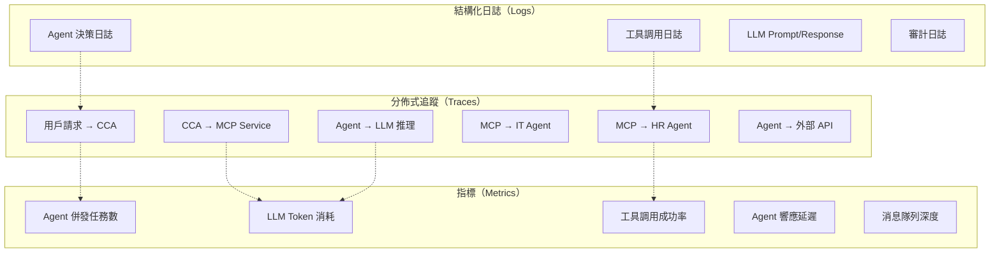

# 第九章：OpenTelemetry 實踐 — 多 Agent 系統的可觀測性

> 「在多 Agent 系統中，如果一個 Agent 出錯了你卻不知道，那比沒有 Agent 還糟糕。可觀測性不是可選項，它是生命線。」

傳統的「三大支柱」（Logs、Metrics、Traces）在多 Agent 系統中需要新的設計思路。每個 Agent 的每一次決策、每一次工具調用、每一次跨 Agent 通信，都需要被完整記錄和關聯。本章將展示如何用 OpenTelemetry 構建 AI Agent 平台的可觀測性。

---

## 9.1 AI Agent 平台的可觀測性挑戰

### 9.1.1 與傳統微服務的差異

| 維度 | 傳統微服務 | AI Agent 平台 |
|------|-----------|--------------|
| **請求流** | 確定性（A→B→C） | 非確定性（LLM 決策） |
| **延遲分佈** | 相對穩定 | 長尾明顯（LLM 推理時間波動大） |
| **錯誤模式** | 異常/超時 | 語義錯誤（工具選錯、參數錯） |
| **關聯維度** | TraceID + RequestID | TraceID + TaskID + AgentID + SessionID |
| **成本追蹤** | 無需 | 每次 LLM 調用消耗 Token |

### 9.1.2 我們需要追蹤什麼



上圖展示了 AI Agent 平台需要追蹤的三類數據——**Traces（分佈式追蹤）**、**Metrics（指標）**、**Logs（結構化日誌）**——以及它們之間的關聯關係。這三類數據並非獨立存在，而是通過 `trace_id`、`task_id`、`agent_id` 等關聯鍵相互串聯，形成完整的可觀測性體系。

#### 三類數據的定位與分工

| 數據類型 | 核心問題 | 回答方式 | 在 AI Agent 平台的特殊性 |
|---------|---------|---------|------------------------|
| **Traces** | 「一個請求經歷了什麼？」 | 記錄請求在各組件間的完整旅程（時間軸 + 依賴關係） | 非確定性路徑——LLM 決定調用哪些工具，每次請求的 Span 結構可能不同 |
| **Metrics** | 「系統整體狀態如何？」 | 用數值量化系統行為（速率、延遲、錯誤率、資源使用） | 需要追蹤 LLM Token 消耗——這是傳統微服務沒有的成本維度 |
| **Logs** | 「具體發生了什麼？」 | 記錄離散事件的詳細上下文（決策過程、錯誤堆疊、輸入輸出） | 需要記錄 LLM 的 Prompt 和 Response——這是 AI 系統特有的「思維過程」 |

#### Traces：分佈式追蹤的六個關鍵節點

圖中的六個 Trace 節點（T1-T6）對應了請求在平台中的完整旅程：

| 節點 | 追蹤內容 | 為什麼要追蹤 | 故障排查價值 |
|------|---------|-------------|------------|
| **T1: 用戶請求 → CCA** | 用戶自然語言到 CCA 的入口延遲 | 區分「網路延遲」和「處理延遲」——用戶感知的延遲 = 網路 + CCA 處理 | 如果 T1 延遲高但 T2-T6 正常，問題在 CCA 前端或網路層 |
| **T2: CCA → MCP Service** | CCA 到 MCP 的 gRPC 調用延遲 | MCP Service 是通信中樞，所有工具調用都經過它 | MCP 是單點瓶頸——如果 T2 延遲高，所有 Agent 調用都受影響 |
| **T3: MCP → HR Agent** | MCP 到 HR Agent 的路由延遲 | 區分「MCP 路由延遲」和「HR Agent 處理延遲」 | 如果 T3 高但 T4 正常，問題在 HR Agent（可能是資料庫慢查詢） |
| **T4: MCP → IT Agent** | MCP 到 IT Agent 的路由延遲 | 同上，但針對 IT Agent | IT Agent 的 AD API 調用是已知瓶頸 |
| **T5: Agent → LLM 推理** | Agent 調用 LLM 的延遲和 Token 消耗 | LLM 推理是延遲最大的不確定性來源（100ms ~ 30s） | T5 的長尾分佈是 AI 系統特有的——需要追蹤 P50/P95/P99 |
| **T6: Agent → 外部 API** | Agent 調用外部服務（AD/HR API）的延遲 | 外部服務是不可控的延遲來源 | 如果 T6 延遲波動大，需要與外部服務提供者溝通 SLA |

#### Metrics：五個核心指標的設計意圖

圖中的五個 Metric（M1-M5）覆蓋了 AI Agent 平台的關鍵健康信號：

| 指標 | 類型 | 為什麼重要 | 告警閾值建議 |
|------|------|-----------|------------|
| **M1: Agent 併發任務數** | Gauge | 反映系統負載——如果持續上升，需要擴容 | > 80% 容量時告警 |
| **M2: LLM Token 消耗** | Counter | **AI 平台特有**——每次 LLM 調用都消耗 Token（= 金錢） | 日消耗 > 預算 120% 時告警 |
| **M3: 工具調用成功率** | Gauge | 反映 Agent 可靠性——失敗率上升意味著外部服務不穩定 | 成功率 < 95% 時告警 |
| **M4: Agent 響應延遲** | Histogram | 反映用户体验——延遲 > 5s 用戶會感知到卡頓 | P95 > 5s 時告警 |
| **M5: 消息隊列深度** | Gauge | NATS 隊列深度反映 Agent 間通信健康——深度持續上升意味著消費端瓶頸 | 隊列深度 > 1000 持續 5 分鐘時告警 |

**M2（LLM Token 消耗）是 AI Agent 平台最獨特的指標**：傳統微服務不需要追蹤「每次 RPC 調用花了多少錢」，但 LLM 的每次推理都消耗 Token（= 金錢）。如果 IT Agent 的某個工具調用循環（重試 → 失敗 → 重試）消耗了 10 萬 Token 而沒有產生任何結果，這不只是延遲問題，更是**成本失控**。

#### Logs：四類結構化日誌的分工

圖中的四類 Log（L1-L4）覆蓋了從決策到審計的完整鏈路：

| 日誌類型 | 記錄內容 | 使用場景 | 保留策略 |
|---------|---------|---------|---------|
| **L1: Agent 決策日誌** | CCA 的意圖識別結果、任務分解計劃、Agent 選擇理由 | 排查「為什麼 CCA 選擇了 IT Agent 而不是 HR Agent？」 | 30 天（合規要求） |
| **L2: 工具調用日誌** | 工具名稱、參數、返回結果、耗時、成功/失敗 | 排查「為什麼 create_ad_account 失敗了？」 | 90 天（運維分析） |
| **L3: LLM Prompt/Response** | 發送給 LLM 的 Prompt 和 LLM 返回的 Response | **AI 系統特有**——排查「LLM 為什麼做出了錯誤的工具選擇？」 | 7 天（存儲成本高，且含敏感信息） |
| **L4: 審計日誌** | 誰觸發了什麼操作、操作結果、操作時間 | 合規審計——「誰在什麼時候刪除了員工帳號？」 | 1 年（法規要求） |

**L3（LLM Prompt/Response）是最具爭議的日誌類型**：

```
優點：
  → 完整記錄 LLM 的「思維過程」，是最終的 debug 手段
  → 可以分析 Prompt 是否有優化空間（如减少 Token 消耗）
  → 可以發現 LLM 的幻覺（hallucination）問題

風險：
  → Prompt 可能包含用戶的敏感信息（如「幫張小明開通帳號，他的身份證號是...」）
  → Response 可能包含系統內部信息（如工具返回的 API Key）
  → 存儲成本高（每次 LLM 調用的 Prompt 可能有 2000-4000 Token）

實踐建議：
  → 保留 7 天（短期 debug 用），過期自動刪除
  → 對敏感字段做脫敏處理（如身份證號 → 0800***1234）
  → 生產環境只記錄到 L3 級別（Prompt/Response 摘要），不記錄完整內容
```

#### 圖中虛線箭頭的關聯關係

圖中的虛線箭頭（`-.->`）代表了三類數據之間的**關聯關係**，這是可觀測性體系的關鍵：

| 虛線箭頭 | 關聯含義 | 實際用途 |
|---------|---------|---------|
| T1 `-.->` M1 | 用戶請求觸發 → 併發任務數 +1 | 在 Jaeger 中看到 T1 Span，可直接跳轉到 Prometheus 查看當時的併發數 |
| T2 `-.->` M2 | CCA → MCP 調用 → Token 消耗 +N | 在 Jaeger 中看到 T2 Span 耗時高，可跳轉到 Prometheus 查看 Token 消耗是否異常 |
| T3 `-.->` M3 | MCP → HR Agent 調用 → 成功率更新 | 在 Grafana 中看到成功率下降，可跳轉到 Jaeger 查看具體是哪個 Trace 失敗了 |
| T5 `-.->` M2 | LLM 推理 → Token 消耗 +N | 在 Prometheus 中看到 Token 消耗飆升，可跳轉到 Jaeger 查看是哪個 Agent 的 LLM 調用 |
| L1 `-.->` T1 | 決策日誌 → 關聯到具體 Trace | 在 Loki 中搜到「CCA 選擇了 IT Agent」的日誌，可提取 trace_id 跳轉到 Jaeger 查看完整調用鏈 |
| L2 `-.->` T3 | 工具調用日誌 → 關聯到具體 Trace | 在 Loki 中搜到「HR Agent 查詢失敗」的日誌，可提取 trace_id 查看完整上下文 |

**這種關聯的價值**：當你在 Grafana 儀表板上看到「工具調用成功率從 99% 降到 85%」，你不需要手動翻閱日誌——點擊告警，自動跳轉到 Jaeger 查看失敗的 Trace，再從 Trace 中提取 `trace_id` 跳轉到 Loki 查看完整的 Prompt/Response。**從發現問題到定位根因，全程在統一的可觀測性平台內完成**。

#### 為什麼是這三類而不是其他組合？

| 可能的替代方案 | 為什麼不用 |
|--------------|-----------|
| 只用 Logs | 無法量化系統整體健康（「成功率 95%」需要 Metrics），無法還原請求旅程（需要 Traces） |
| 只用 Metrics | 無法定位具體是哪個請求失敗（Metrics 只有聚合值），無法看到 LLM 的決策過程（需要 Logs） |
| 只用 Traces | 無法做長期趨勢分析（Traces 是離散的，需要 Metrics 做聚合），無法記錄合規審計（需要 Logs） |
| Logs + Metrics（無 Traces） | 無法還原跨 Agent 的完整調用鏈——HR Agent 和 IT Agent 的日誌是獨立的，無法自動關聯 |
| Traces + Metrics（無 Logs） | 無法看到 LLM 的 Prompt/Response——Trace 只記錄「調用了 LLM」，不記錄「問了什麼、答了什麼」 |

---

## 9.2 分佈式追蹤（Traces）

### 9.2.1 Span 設計

每個 Agent 任務在追蹤系統中對應一個完整的 Trace，包含多個 Span：

```python
# observability/tracing.py
# ================================================================
# Agent 追蹤封裝：將 OpenTelemetry 的 Trace API 與 Agent 的業務語義綁定。
# OpenTelemetry 提供了 Tracer/Span 基礎設施，但業務層需要定義「什麼算一個 Span」。
# 此模組將 Agent 任務 → 工具調用 → LLM 推理 映射為三層嵌套 Span。
from opentelemetry import trace
from opentelemetry.sdk.trace import TracerProvider
from opentelemetry.sdk.trace.export import BatchSpanProcessor
from opentelemetry.exporter.otlp.proto.grpc.trace_exporter import OTLPSpanExporter

# 初始化 Tracer：連接到 OTel Collector（統一收集器）
# gRPC 4317 端口是 OTel 的標準接收端口（OTLP over gRPC）
provider = TracerProvider()
processor = BatchSpanProcessor(
    OTLPSpanExporter(endpoint="http://otel-collector.observability:4317")
)
provider.add_span_processor(processor)   # Batch = 批量匯出，非同步，不阻塞業務
trace.set_tracer_provider(provider)

tracer = trace.get_tracer("ai-platform", "1.0.0")  # (名稱, 版本) 用於版本化追蹤


class AgentTracer:
    """Agent 級別的追蹤封裝"""

    @staticmethod
    def start_task_span(task_id: str, task_type: str, user_id: str):
        """開始一個任務 Span — Trace 的根 Span（Root Span）"""
        return tracer.start_as_current_span(
            f"agent.task.{task_type}",
            attributes={
                "task.id": task_id,      # 業務 ID（用於關聯日誌和審計）
                "task.type": task_type,   # 任務類型（create_account, query_leave 等）
                "user.id": user_id,       # 觸發用戶
                "platform": "ai-agent-platform"
            }
        )

    @staticmethod
    def trace_tool_call(agent_id: str, tool_name: str):
        """追蹤工具調用 Span — 嵌套在 task_span 之下"""
        return tracer.start_as_current_span(
            f"agent.tool.{tool_name}",
            attributes={
                "agent.id": agent_id,     # 哪個 Agent 調用的
                "tool.name": tool_name    # 工具名稱（api_call, db_query 等）
            }
        )

    @staticmethod
    def trace_llm_call(agent_id: str, model: str, token_count: int = 0):
        """追蹤 LLM 調用 Span — 嵌套在 task_span 之下"""
        return tracer.start_as_current_span(
            f"agent.llm.inference",
            attributes={
                "agent.id": agent_id,
                "llm.model": model,           # 使用的模型名稱
                "llm.token_count": token_count # Token 消耗量（成本追蹤用）
            }
        )
```

**關鍵設計決策**：
- **三層 Span 層級結構**：`task_span`（根）→ `tool_span` / `llm_span`（子）。這對應 Agent 的執行模型：一個用戶任務（task）可能觸發多次工具調用和 LLM 推理，Span 層級直接映射業務層級。
- **`BatchSpanProcessor` 的選擇**：批量匯出而非同步（`SimpleSpanProcessor`），是因為 Agent 任務通常涉及多次 LLM 調用，同步匯出會嚴重拖慢響應時間。批量匯出在後台異步發送，業務代碼幾乎零等待。
- **OTLP gRPC 而非 HTTP**：gRPC 支持雙向流和 HTTP/2 多路復用，在高併發的 Agent 場景下性能優於 HTTP/1.1。OTel Collector 在 Observability Namespace 內的內網地址 `observability:4317` 消除了服務發現的複雜性。
- **`token_count` 為可選參數**：LLM 調用時可能尚不知道確切的 token 數（流式回應），因此默認值為 0。Span 屬性支持後續補充，確保即使初始值不精確也不會報錯。

### 9.2.2 在 Agent 中使用追蹤

在實際的 Agent 實作中，我們需要為每個人 Agent 任務建立對應的 Span，記錄其開始時間、結束時間、執行狀態與相關屬性。以下範例展示如何在 Agent 的主迴圈中加入追蹤邏輯，確保每次工具呼叫、LLM 推理、以及協作流程都能被完整記錄：

```python
# agents/it_agent/instrumented.py
from observability.tracing import AgentTracer

class InstrumentedITAgent:
    """帶追蹤的 IT Agent — 展示如何在 Agent 業務邏輯中嵌入 Tracing"""

    def __init__(self):
        self.tracer = AgentTracer()

    async def handle_task(self, task: dict) -> dict:
        # 1. 開始任務追蹤 — 這是 Trace 的根 Span（Root Span）
        with AgentTracer.start_task_span(
            task_id=task["task_id"],
            task_type="create_it_account",
            user_id=task.get("user_id", "unknown")
        ) as span:

            # 2. 追蹤 LLM 推理 — 嵌套 Span（子 Span）
            with AgentTracer.trace_llm_call(
                agent_id="it-agent",
                model="llama4-scout"
            ) as llm_span:
                plan = await self._plan_task(task)
                llm_span.set_attribute("llm.tokens.input", plan.tokens_used.input)
                llm_span.set_attribute("llm.tokens.output", plan.tokens_used.output)

            # 3. 追蹤每個工具調用 — 多個平行子 Span
            for tool_call in plan.tool_calls:
                with AgentTracer.trace_tool_call(
                    agent_id="it-agent",
                    tool_name=tool_call.name
                ) as tool_span:
                    result = await self._execute_tool(tool_call)
                    tool_span.set_attribute("tool.success", result.success)
                    tool_span.set_attribute("tool.duration_ms", result.duration_ms)

            # 4. 返回結構化結果 — trace_id 用於日誌關聯
            return {
                "task_id": task["task_id"],
                "status": "success",
                "trace_id": trace.get_current_span().get_span_context().trace_id
            }
```

**關鍵設計決策**：
- **`with` 語句管理 Span 生命週期**：`with` 塊退出時自動呼叫 `span.end()`，確保即使異常也能正確關閉 Span。忘記呼叫 `end()` 會導致 Span 永遠不閉合，Collector 會丟棄不完整的 Trace。
- **`set_attribute` 補充業務信息**：`start_as_current_span` 只能設置初始屬性，部分屬性（如 `tokens_used`）在 LLM 回應後才能獲得。`set_attribute` 允許動態補充，這些屬性最終出現在 Jaeger/Grafana 的 Span 詳情中。
- **回傳 `trace_id`**：前端/CCA 用此 `trace_id` 關聯日誌和追蹤。當用戶詢問「我的任務狀態？」時，可通過 `trace_id` 在 Jaeger 中定位完整的執行鏈路，無需翻閱多個服務的日誌。

### 9.2.3 Span 屬性規範

Span 屬性（Attributes）是追蹤系統中用於篩選、分組與分析的核心元資料。針對 AI Agent 平台的特殊需求，我們需要設計一套涵蓋 Agent 識別、任務上下文、模型資訊與效能指標的屬性命名規範。以下是推薦的 Span 屬性標準，遵循 OpenTelemetry Semantic Convention 的命名風格：

```yaml
# AI Agent 平台的 Span 屬性標準（Semantic Convention）
# ================================================================
# 這不是可執行配置，而是「屬性命名標準文件」。所有 Agent 的 Span 屬性
# 必須遵循此規範，否則在 Jaeger/Grafana 中無法統一查詢和聚合。
# 命名格式：{namespace}.{resource}.{qualifier}
span_attributes:
  # ---- 通用屬性 ----
  platform.name: "ai-agent-platform"    # 平台標識（多平台環境下區分）
  platform.version: "1.0.0"            # 版本號（用於關聯版本與性能回歸）

  # ---- 任務屬性 ----
  task.id: "task_abc123"               # 全局唯一任務 ID
  task.type: "create_it_account"       # 任務類型（驅動 Jaeger 按類型過濾）
  task.priority: "high"               # 優先級（高優先級任務的延遲需重點監控）

  # ---- Agent 屬性 ----
  agent.id: "it-agent-v1"             # Agent 實例 ID（版本化部署時區分）
  agent.domain: "information_technology"  # 業務域（按域聚合性能指標）
  agent.version: "1.0.0"              # Agent 版本（A/B 測試場景下對比）

  # ---- LLM 屬性 ----
  llm.provider: "ollama"              # LLM 提供者（本地 Ollama vs 遠端 API）
  llm.model: "llama4-scout"             # 模型名稱（追蹤不同模型的性能差異）
  llm.tokens.input: 1234              # 輸入 Token 數（成本計算核心）
  llm.tokens.output: 567              # 輸出 Token 數
  llm.temperature: 0.2                # 溫度參數（調試時追溯隨機性配置）
  llm.duration_ms: 3500               # LLM 推理耗時（長尾延遲分析）

  # ---- 工具屬性 ----
  tool.name: "create_ad_account"      # 工具名稱
  tool.success: true                  # 成功率（工具級別的 SLA 監控）
  tool.duration_ms: 1200              # 工具執行耗時
  tool.error: ""                      # 錯誤信息（空字串=成功）

  # ---- 通信屬性 ----
  communication.protocol: "mcp"       # 通信協議（mcp, grpc, http）
  communication.method: "tools/call"  # 調用方法（MCP 方法名）
  communication.target: "it-agent"    # 目標 Agent（CCA→Agent 的路由追蹤）
```

**關鍵設計決策**：
- **命名空間分隔**：`llm.tokens.input` 而非 `tokens_input`。點號分隔支持 Jaeger 的「Span 屬性搜索」按前綴過濾（搜 `llm.*` 可聚合所有 LLM 相關屬性），底線分隔則做不到。
- **`tool.error` 空字串 = 成功**：OpenTelemetry 的 Span 不區分「沒有錯誤」和「錯誤為空」。統一用空字串表示成功，避免 null/undefined 在 JSON 序列化時的歧義。
- **`agent.version` 的必要性**：灰度發布（Canary Deployment）時，同一個 `agent.id` 下可能有 v1 和 v2 同時運行。`agent.version` 讓你能分別查看兩個版本的延遲分佈和成功率，決定是否全量切換。

---

## 9.3 指標收集（Metrics）

### 9.3.1 自定義指標

除了自動產生的基礎指標外，AI Agent 平台需要針對業務場景自定義關鍵效能指標（KPI）。以下定義了三個核心自定義指標：Agent 任務完成率（衡量端到端的成功比例）、LLM 呼叫延遲（追蹤模型回應時間的分佈）、以及工具呼叫成功率（監控外部整合的穩定性）。這些指標將透過 Prometheus Registry 註冊並暴露：

```python
# observability/metrics.py
# ================================================================
# AI Agent 平台的自定義指標（Custom Metrics）。
# OTel 定義了 4 種儀表類型，此處展示如何將 Agent 業務語義映射到每種類型：
# Counter（只增不減）、UpDownCounter（可增可減）、Histogram（分佈）、Gauge（瞬時值）。
from opentelemetry.metrics import get_meter

meter = get_meter("ai-platform", "1.0.0")

# 1. UpDownCounter：併發任務數（有增有減，適合當前活躍數）
active_tasks = meter.create_up_down_counter(
    "agent.tasks.active",
    description="Agent 當前活躍任務數",
    unit="1"
)

# 2. Counter：累計完成數（只增不減，Prometheus 自動計算速率）
task_completed = meter.create_counter(
    "agent.tasks.completed",
    description="Agent 任務完成次數",
    unit="1"
)

# 3. Histogram：延遲分佈（自動計算 P50/P90/P99，適合延遲指標）
task_duration = meter.create_histogram(
    "agent.tasks.duration",
    description="Agent 任務執行延遲",
    unit="ms"
)

# 4. Counter：Token 累計消耗（用於成本監控和預算告警）
llm_tokens = meter.create_counter(
    "agent.llm.tokens.total",
    description="LLM Token 總消耗量",
    unit="1"
)

# 5. Counter：工具調用成功次數（配合 total 計算成功率）
tool_success_rate = meter.create_counter(
    "agent.tools.calls.success",
    description="工具調用成功次數",
    unit="1"
)

# 6. Gauge：消息隊列深度（瞬時值，適合 NATS/JetStream 監控）
queue_depth = meter.create_gauge(
    "agent.queue.depth",
    description="消息隊列當前深度",
    unit="1"
)

# 7. Histogram：端到端響應延遲（包含 LLM 推理 + 工具調用的總延遲）
response_latency = meter.create_histogram(
    "agent.response.latency",
    description="Agent 響應延遲分佈",
    unit="ms"
)
```

**關鍵設計決策**：
- **Counter vs UpDownCounter 的選擇**：`active_tasks` 用 UpDownCounter 是因為任務有「開始」(+1) 和「結束」(-1) 兩個事件。`task_completed` 用 Counter 是因為完成次數只增不減。Prometheus 對 Counter 支持 `rate()` 和 `increase()` 函數，能自動計算每秒完成速率。
- **Histogram 而非 Summary**：Histogram 在 OTel Collector 端聚合，支持跨 Pod 的延遲分佈合併（`histogram_quantile`）。Summary 在客户端計算，無法跨 Pod 合併——多副本部署的 Agent 會得到不準確的 P99。
- **`queue_depth` 用 Gauge 而非 Histogram**：隊列深度是瞬時值（當前有多少消息待處理），不是事件序列。Histogram 適合記錄「每次操作的值」，Gauge 適合記錄「某一時刻的狀態」。

### 9.3.2 Prometheus 配置

定義好自定義指標後，需要配置 Prometheus 來抓取這些指標資料。以下配置利用 Kubernetes 的服務發現機制，自動發現所有帶有 `prometheus.io/scrape: "true"` 註解的 Pod，並根據註解中的路徑和端口進行指標抓取。同時為每個抓取目標自動附加 `namespace` 和 `pod` 標籤，方便後續按命名空間或 Pod 維度分析：

```yaml
# prometheus/prometheus.yml
# ================================================================
# Prometheus 自動服務發現配置：利用 K8s 的 Service Discovery（SD）
# 自動發現 Pod，無需手動維護目標列表。Agent 擴縮容時 Prometheus 自動跟隨。
global:
  scrape_interval: 15s               # 每 15 秒抓取一次（OTel 默認推送間隔 60s 的 1/4，確保不漏）
  evaluation_interval: 15s            # 每 15 秒評估一次告警規則

scrape_configs:
- job_name: 'ai-platform-agents'
  kubernetes_sd_configs:
  - role: pod                         # 以 Pod 為發現單位（非 service / node）
    namespaces:
      names:
      - platform-system               # CCA 所在 Namespace
      - agents                        # HR/IT Agent 所在 Namespace
  relabel_configs:
  # 過濾 1：只保留 Agent 和 MCP Service 的 Pod（排除其他系統 Pod）
  - source_labels: [__meta_kubernetes_pod_label_app]
    regex: (cca-agent|hr-agent|it-agent|mcp-service)
    action: keep
  # 過濾 2：將業務端口 8080 替換為 Prometheus metrics 端口 9090
  - source_labels: [__address__]
    regex: '(.+):8080'
    target_label: __address__
    replacement: '$1:9090'

- job_name: 'mcp-service'
  static_configs:
  - targets: ['mcp-service.platform-system:9090']  # MCP Service 固定地址

- job_name: 'nats'
  static_configs:
  - targets: ['nats.infra:8225']       # NATS 的 monitoring 端口
```

**關鍵設計決策**：
- **Kubernetes SD 而非 static_configs**：Agent 使用 HPA 自動擴縮，Pod 數量動態變化。static_configs 無法跟隨擴縮，K8s SD 會自動追蹤 Pod 的創建和銷毀，確保 Prometheus 始終抓取所有存活 Pod 的指標。
- **`relabel_configs` 的雙重過濾**：K8s SD 會發現所有 Pod，但我們只想要 Agent 的 metrics。第一個 `relabel` 用 Pod 標籤 `app` 過濾，第二個將業務端口（8080）替換為 metrics 端口（9090）——因為 OTel SDK 的 Prometheus exporter 通常獨立監聽在 9090。
- **NATS 用 `static_configs`**：NATS 部署為 StatefulSet（固定 Pod 名），地址穩定，不需要 SD 發現。其 monitoring 端口 8225 暴露 JetStream 的隊列深度、連接數等指標。

---

## 9.4 結構化日誌（Logs）

### 9.4.1 日誌格式設計

結構化日誌是現代分散式系統可觀測性的基石。相較於傳統的純文字日誌，JSON 格式的結構化日誌能被 Loki、Elasticsearch 等日誌系統直接解析和查詢，大幅提升排錯效率。以下使用 structlog 函式庫建立統一的日誌封裝，確保所有 Agent 產生的日誌具備一致的欄位格式和上下文資訊：

```python
# observability/logging.py
# ================================================================
# 結構化日誌封裝：使用 structlog 輸出 JSON 格式日誌。
# 結構化日誌 vs 純文字日誌：JSON 可被 Loki/Elasticsearch 結構化解析和查詢，
# 而非用正則表達式從純文字中提取字段。
import structlog
import logging

# structlog 配置：時間戳 → 日誌級別 → JSON 輸出
structlog.configure(
    processors=[
        structlog.processors.TimeStamper(fmt="iso"),   # ISO 8601 時間戳
        structlog.processors.add_log_level,             # 添加 "level": "info" 等
        structlog.processors.JSONRenderer()             # 輸出 JSON 字符串
    ],
    logger_factory=structlog.stdlib.LoggerFactory()     # 兼容標準 logging
)

logger = structlog.get_logger("ai-platform")


class AgentLogger:
    """Agent 專用日誌記錄器 — 每個業務事件對應一個結構化方法"""

    @staticmethod
    def log_task_start(task_id: str, task_type: str, user_id: str):
        """任務開始日誌 — 用於關聯 Trace 和計算端到端延遲"""
        logger.info(
            "task_started",               # 事件名稱（Loki 的查詢 key）
            task_id=task_id,
            task_type=task_type,
            user_id=user_id
        )

    @staticmethod
    def log_tool_call(agent_id: str, tool_name: str, arguments: dict, duration_ms: float, success: bool):
        """工具調用日誌 — 記錄輸入參數、耗時、成功與否"""
        logger.info(
            "tool_called",
            agent_id=agent_id,
            tool_name=tool_name,
            arguments=arguments,          # 完整參數（便於問題重現）
            duration_ms=duration_ms,
            success=success
        )

    @staticmethod
    def log_llm_call(agent_id: str, model: str, tokens_used: dict, duration_ms: float):
        """LLM 調用日誌 — 追蹤模型、Token 消耗、延遲"""
        logger.info(
            "llm_called",
            agent_id=agent_id,
            model=model,
            tokens_input=tokens_used.get("input", 0),
            tokens_output=tokens_used.get("output", 0),
            duration_ms=duration_ms
        )

    @staticmethod
    def log_task_complete(task_id: str, status: str, duration_ms: float, errors: list = None):
        """任務完成日誌 — status=success/failed，errors 記錄失敗原因"""
        logger.info(
            "task_completed",
            task_id=task_id,
            status=status,
            duration_ms=duration_ms,
            errors=errors or []           # 空列表而非 None，避免 JSON null
        )

    @staticmethod
    def log_audit_event(event_type: str, user_id: str, resource: str, action: str, result: str):
        """審計日誌 — 企業合規必備，記錄誰對什麼做了什麼操作"""
            "audit_event",
            event_type=event_type,
            user_id=user_id,
            resource=resource,
            action=action,
            result=result
        )
```

### 9.4.2 Loki 日誌存儲

Loki 是 Grafana Labs 開發的日誌聚合系統，其設計理念是「like Prometheus, but for logs」。與 Elasticsearch 不同，Loki 只索引標籤（Labels），不索引日誌內容，大幅降低了存儲成本。以下配置定義了 Loki 的存儲後端、索引策略和壓縮設定，適合處理 AI Agent 平台產生的高量結構化日誌：

```yaml
# loki/loki-config.yaml
# ================================================================
# Loki 配置：Grafana Labs 的日誌聚合系統，設計理念是「like Prometheus, but for logs」。
# Loki 只索引標籤（Labels），不索引日誌內容（全量索引太貴），
# 查詢時用標籤過濾 + 正則表達式 grep 內容。適合 Agent 產生的高量結構化日誌。
auth_enabled: false                  # 單租戶模式（開發/測試環境；生產環境應開啟多租戶）

server:
  http_listen_port: 3100             # Loki HTTP API 端口

ingester:
  lifecycler:
    ring:
      kvstore:
        store: inmemory              # 開發環境用內存（生產應改為 etcd/consul）
      replication_factor: 1          # 開發環境單副本（生產應 >= 3）
  chunk_idle_period: 5m              # 5 分鐘無新日誌則將 chunk 刷寫到存儲
  chunk_retain_period: 30s           # chunk 刷寫後保留 30 秒（避免並發讀取時已刪除）

schema_config:
  configs:
  - from: 2024-01-01
    store: boltdb-shipper            # 索引存儲引擎（BoltDB Shipper 支持水平擴展）
    object_store: filesystem         # 日誌分片（chunk）存儲：本地文件系統
    schema: v11                      # Loki 索引格式版本
    index:
      prefix: index_                 # 索引文件前綴
      period: 24h                    # 每 24 小時一個索引表（日分片）

storage_config:
  boltdb_shipper:
    active_index_directory: /loki/index  # 活躍索引（寫入端）
    cache_location: /loki/cache          # 索引緩存（讀取端）
  filesystem:
    directory: /loki/chunks              # 日誌分片存儲目錄

limits_config:
  enforce_metric_name: false         # 不強制要求 metric_name 標籤
  reject_old_samples: true           # 拒絕過時日誌（防範時鐘偏差導致的亂序寫入）
  reject_old_samples_max_age: 168h   # 超過 7 天的日誌直接拒絕
```

**關鍵設計決策**：
- **`inmemory` + `replication_factor: 1`**：這是開發/測試配置。生產環境需要將 kvstore 改為 etcd/consul（持久化 Ring 狀態），replication_factor 改為 3（防單點故障）。配置分開寫是為了不讓生產配置的複雜性嚇退初學者。
- **BoltDB Shipper 而非 TSDB**：BoltDB Shipper 將索引上傳到對象存儲（S3/GCS），支持多個 Loki 實例共享索引。適合 Agent 日誌的高寫入量場景——日誌量可能因 LLM 回應的長度波動而劇烈變化。
- **`reject_old_samples_max_age: 168h`**：7 天窗口是為了容錯——Agent 的日誌可能因消息隊列積壓或 OTel Collector 延遲而晚到。但不設為無限，避免亂序日誌拖垮索引性能。

---

## 9.5 Grafana 儀表板

### 9.5.1 核心儀表板

Grafana 儀表板是將 Prometheus 指標和 Loki 日誌轉化為視覺化洞察的核心介面。以下定義了一個 AI Agent 平台的全局總覽儀表板，包含活躍任務數、任務成功率、LLM 延遲分佈、Token 消耗量等關鍵面板，讓運維團隊能即時掌握平台健康狀態：

```json
{
  "dashboard": {
    "title": "AI Agent Platform Overview",
    "panels": [
      {
        "title": "Active Tasks by Agent",
        "type": "stat",                      // 大數字面板，一眼看到每個 Agent 的當前活躍任務數
        "targets": [
          {
            "expr": "sum by (agent_id) (agent_tasks_active)",
            "legendFormat": "{{agent_id}}"   // 按 agent_id 分組顯示
          }
        ]
      },
      {
        "title": "Task Success Rate",
        "type": "gauge",                     // 儀表盤面板，帶顏色閾值
        "targets": [
          {
            "expr": "sum(rate(agent_tasks_completed_total{status='success'}[5m])) / sum(rate(agent_tasks_completed_total[5m])) * 100",
            // 5 分鐘窗口的成功率百分比：成功數 / 總數 × 100
            "legendFormat": "Success Rate %"
          }
        ],
        "thresholds": [
          {"value": 95, "color": "red"},     // < 95%：紅色告警
          {"value": 99, "color": "yellow"},  // 95-99%：黃色注意
          {"value": 100, "color": "green"}   // >= 99%：綠色健康
        ]
      },
      {
        "title": "LLM Token Usage",
        "type": "timeseries",                // 時序圖，追蹤 Token 消耗趨勢
        "targets": [
          {
            "expr": "sum(rate(agent_llm_tokens_total[1h])) by (agent_id, model)",
            // 每小時 Token 消耗速率，按 Agent 和模型分組
            "legendFormat": "{{agent_id}} - {{model}}"
          }
        ]
      },
      {
        "title": "P95 Response Latency",
        "type": "timeseries",                // 時序圖，追蹤延遲分佈
        "targets": [
          {
            "expr": "histogram_quantile(0.95, sum(rate(agent_response_latency_bucket[5m])) by (le, agent_id))",
            // histogram_quantile 計算 P95 延遲，le = histogram 桶邊界
            "legendFormat": "P95 - {{agent_id}}"
          }
        ]
      }
    ]
  }
}
```

**關鍵設計決策**：
- **四面板黃金組合**：活躍數（容量）→ 成功率（質量）→ Token 消耗（成本）→ P95 延遲（性能），覆蓋 Agent 運維的四大核心關注點。這不是隨意選的，對應 SRE 的四大黃金信號（流量、錯誤率、延遲、飽和度）。
- **`rate()` 的時間窗口選擇**：成功率用 `[5m]`（敏感但平滑），Token 用 `[1h]`（長期趨勢）。5 分鐘窗口能快速捕捉突發故障，1 小時窗口過濾日間/夜間的正常使用波動。
- **`thresholds` 的閾值邏輯**：95% 為紅線是因為 Agent 的 SLA 承諾。低於 95% 意味著每 20 個任務就有 1 個失敗，對企業用戶不可接受。99% 是目標值，100% 是理想值。

---

## 9.6 告警規則

### 9.6.1 Prometheus AlertManager 配置

AlertManager 負責接收 Prometheus 產生的告警，並根據規則進行分組、抑制和路由，將通知發送到 Slack、Email 或 PagerDuty 等渠道。正確配置告警路由對於避免「告警風暴」至關重要——特別是在多 Agent 環境中，一個故障可能同時觸發數十條關聯告警：

```yaml
# alertmanager/alertmanager.yml
# ================================================================
# AlertManager 配置：接收 Prometheus 的告警，路由到通知渠道（Slack/Email/PagerDuty）。
# 核心機制：告警分組（避免告警風暴）+ 告警抑制（避免重複通知）+ 重複間隔。
global:
  resolve_timeout: 5m                # 5 分鐘內未再次觸發則視為已恢復

route:
  group_by: ['alertname', 'agent_id']  # 按告警名稱和 Agent 分組
  group_wait: 30s                     # 首次告警等待 30 秒（收集同組的其他告警）
  group_interval: 5m                  # 同組告警更新的最小間隔
  repeat_interval: 4h                 # 未解決的告警每 4 小時重複通知
  receiver: 'slack-notifications'     # 默認通知渠道

receivers:
- name: 'slack-notifications'
  slack_configs:
  - channel: '#ai-platform-alerts'   # 專用告警頻道
    send_resolved: true               # 恢復時也發通知（知道問題已解決）
    title: '{{ .GroupLabels.alertname }}'
    text: '{{ .CommonAnnotations.description }}'

inhibit_rules:
- source_match:
    severity: 'critical'             # critical 告警觸發時
  target_match:
    severity: 'warning'              # 抑制同名的 warning 告警
  equal: ['alertname', 'agent_id']   # 只抑制相同 Agent 的同類告警
```

**關鍵設計決策**：
- **`group_by: ['alertname', 'agent_id']`**：多個 Agent 同時故障時，按 agent_id 分組確保每個 Agent 獨立告警，不會被合併成一條模糊通知。但同一 Agent 的多個相同類型告警會合併，避免告警風暴。
- **`repeat_interval: 4h`**：4 小時是為了平衡「不漏告警」和「不打擾睡眠」。太短（15 分鐘）會讓值班人員被通知淹沒；太長（24 小時）會導致關鍵問題被忽略。
- **`inhibit_rules` 抑制規則**：當 critical 告警已觸發時，同 Agent 的 warning 告警沒有意義（已經比 warning 更嚴重了）。抑制它們減少噪音，讓值班人員專注處理 critical。

### 9.6.2 告警規則

告警規則定義了「什麼條件觸發告警」以及「告警的嚴重等級」。以下是針對 AI Agent 平台設計的三條核心告警規則：任務失敗率過高（critical）、P95 延遲超標（warning）、以及 LLM Token 消耗速率異常（warning），覆蓋了可用性、效能和成本三個關鍵面向：

```yaml
# alertmanager/rules/ai-platform.yml
# ================================================================
# Prometheus 告警規則：定義「什麼條件觸發告警」和「告警分級」。
# 每條規則 = PromQL 表達式 + 持續時間 + 嚴重度 + 通知模板。
groups:
- name: ai-platform
  rules:
  # 規則 1：任務錯誤率 > 10%（critical）
  - alert: AgentHighErrorRate
    expr: sum(rate(agent_tasks_completed_total{status='failed'}[5m])) by (agent_id) / sum(rate(agent_tasks_completed_total[5m])) by (agent_id) > 0.1
    # 分子：每個 Agent 在 5 分鐘內的失敗速率；分母：總速率。> 0.1 即錯誤率 > 10%
    for: 5m                           # 持續 5 分鐘才觸發（過濾瞬時抖動）
    labels:
      severity: critical              # critical：需立即處理
    annotations:
      summary: "Agent {{ $labels.agent_id }} 錯誤率超過 10%"
      description: "Agent {{ $labels.agent_id }} 在過去 5 分鐘內的任務失敗率為 {{ $value | humanizePercentage }}"

  # 規則 2：P95 延遲 > 30 秒（warning）
  - alert: AgentHighLatency
    expr: histogram_quantile(0.95, sum(rate(agent_response_latency_bucket[5m])) by (le, agent_id)) > 30000
    # histogram_quantile 從 histogram 桶中計算 P95 值，> 30000ms = 30s
    for: 5m
    labels:
      severity: warning               # warning：需關注但不緊急
    annotations:
      summary: "Agent {{ $labels.agent_id }} P95 延遲超過 30s"
      description: "Agent {{ $labels.agent_id }} 的 P95 響應延遲為 {{ $value }}ms"

  # 規則 3：Token 消耗速率異常（warning）
  - alert: LLMTokenBurnRate
    expr: sum(rate(agent_llm_tokens_total[1h])) > 1000000
    # 每小時消耗 > 100 萬 Token（可能是無限循環或異常重試）
    for: 10m                          # 10 分鐘窗口（Token 消耗的短期波動正常）
    labels:
      severity: warning
    annotations:
      summary: "LLM Token 消耗速率過高"
      description: "過去 1 小時內 LLM Token 消耗速率超過 100 萬/小時"

  # 規則 4：消息隊列積壓（critical）
  - alert: QueueDepthHigh
    expr: agent_queue_depth > 1000    # 隊列深度 > 1000 條消息
    for: 5m
    labels:
      severity: critical              # 隊列積壓會導致全鏈路延遲飆升
    annotations:
      summary: "消息隊列深度過高"
      description: "消息隊列深度為 {{ $value }}，可能影響系統響應時間"
```

---

## 9.7 端到端可觀測性實戰

### 9.7.1 Trace → Metrics → Logs 關聯

在實際排錯場景中，單一可觀測性支柱往往不足以定位根因。Trace 告訴你「哪個請求慢了」，Metrics 告訴你「整體趨勢如何」，Logs 告訴你「具體錯誤訊息是什麼」。以下函式展示了如何以 trace_id 為錨點，將三者串聯起來，實現從告警到根因的一站式診斷：

```python
# 可觀測性關聯查詢
# ================================================================
# Trace → Logs → Metrics 的端到端調查流程。
# 這是可觀測性的核心價值：從一個症狀（慢任務）出發，
# 自動關聯三個信號源，定位根因。
async def investigate_slow_task(task_id: str):
    """調查慢任務的根因 — 從 Trace 出發，關聯 Logs 和 Metrics"""

    # 1. 從 Trace 開始 — Jaeger 查詢完整的 Span 樹
    trace_data = await jaeger.get_trace(task_id)
    spans = trace_data.spans

    # 2. 找到最慢的 Span — 時間最長的子操作就是瓶頸
    slowest_span = max(spans, key=lambda s: s.duration)

    # 3. 查詢對應的 Logs — 用 task_id 標籤過濾 Loki 日誌，
    #    再用 duration_ms > 80% 最慢 Span 進一步縮小範圍
    logs = await loki.query(
        f'{{task_id="{task_id}"}} | json | duration_ms > {slowest_span.duration * 0.8}'
    )

    # 4. 查詢 Metrics — 獲取該任務的 Token 消耗（成本分析）
    metrics = await prometheus.query(
        f'rate(agent_llm_tokens_total{{task_id="{task_id}"}}[1h])'
    )

    # 5. 組合分析 — 一個 JSON 包含三個信號源的關聯結果
    return {
        "slowest_operation": slowest_span.name,  # 哪個操作最慢
        "duration_ms": slowest_span.duration,     # 慢了多久
        "related_logs": logs,                      # 該操作的日誌上下文
        "token_usage": metrics                    # 該任務的 Token 消耗
    }
```

**關鍵設計決策**：
- **Trace 作為入口**：Trace 提供了時間維度的結構化視圖（哪個操作在什麼時候花了多久），但不包含細節。Logs 和 Metrics 是補充。從 Trace 出發是最自然的調查路徑——先看到「哪裡慢」，再看「為什麼慢」。
- **`duration_ms > 80%` 的過濾**：Loki 日誌量巨大，用 task_id 過濾後可能仍有幾百條日誌。額外用 80% 最慢 Span 的時間閾值過濾，只保留「慢操作附近」的日誌，避免信息過載。
- **Metrics 用 `rate()` 而非 `increase()`**：`rate()` 返回每秒速率（可比較），`increase()` 返回總量（受時間窗口影響）。在調查場景中，速率更有意義——「每秒消耗多少 Token」比「總共消耗多少 Token」更能反映異常。

---

## 9.8 LLM 專屬可觀測性模式

### 9.8.1 Prompt 與 Response 記錄

LLM 的輸入（Prompt）和輸出（Response）是 AI Agent 平台最核心的資料資產。將它們納入可觀測性體系，不僅有助於除錯，還能支援 Prompt 版本回溯、輸出品質分析和合規審計。以下實作展示如何在每次 LLM 調用時自動記錄結構化的 Prompt/Response 日誌，並透過 OTel Span 屬性實現與追蹤的關聯：

```python
# observability/llm_logging.py
# ================================================================
# LLM 專屬可觀測性：追蹤每次 LLM 推理的成本、延遲、Token 消耗。
# LLM 是 Agent 系統中最貴的操作（每次調用消耗 Token + 顯著延遲），
# 因此需要專門的追蹤邏輯——比普通工具調用更精細的成本歸因和性能監控。
from opentelemetry import trace, metrics
from opentelemetry.sdk.trace import TracerProvider
from opentelemetry.sdk.metrics import MeterProvider
import hashlib
import json
from datetime import datetime

tracer = trace.get_tracer("llm-observability", "1.0.0")
meter = metrics.get_meter("llm-observability", "1.0.0")

# 成本追蹤指標 — 按 Agent 和模型分組
llm_cost = meter.create_counter(
    "llm.cost.usd",
    description="LLM 調用成本（美元）",
    unit="USD"
)

llm_tokens_by_model = meter.create_counter(
    "llm.tokens.by_model",
    description="按模型分類的 Token 消耗",
    unit="1"
)

llm_latency = meter.create_histogram(
    "llm.inference.latency",
    description="LLM 推理延遲",
    unit="ms"
)

# Token 價格表 — 混合部署場景：本地 Ollama 免費，雲端 API 按量計費
TOKEN_PRICING = {
    "llama4-scout": {"input": 0.0, "output": 0.0},          # 本地部署免費
    "gpt-5": {"input": 0.005, "output": 0.015},             # 2026 年旗艦模型
    "gpt-4.1-mini": {"input": 0.0004, "output": 0.0016},    # 經濟型降級選項
    "claude-opus-4": {"input": 0.0075, "output": 0.03},     # Anthropic 旗艦模型
}


class LLMObservability:
    """LLM 調用的完整可觀測性封裝 — 追蹤 + 指標 + 成本歸因"""

    def __init__(self, agent_id: str, model: str):
        self.agent_id = agent_id
        self.model = model
        self.pricing = TOKEN_PRICING.get(model, {"input": 0.001, "output": 0.003})
        # 默認價格為兜底值（未注册模型按中等價位計費）

    def _hash_prompt(self, prompt: str) -> str:
        """Prompt 雜湊 — SHA256 截斷 16 字元，用於去重和合規審計"""
        return hashlib.sha256(prompt.encode()).hexdigest()[:16]

    def _calculate_cost(self, input_tokens: int, output_tokens: int) -> float:
        """計算 LLM 調用成本 — input × 單價 + output × 單價"""
        return (input_tokens * self.pricing["input"] +
                output_tokens * self.pricing["output"])

    def trace_llm_call(self, prompt: str, context: dict = None):
        """追蹤一次完整的 LLM 調用 — 作為 Context Manager 使用"""
        prompt_hash = self._hash_prompt(prompt)

        with tracer.start_as_current_span(
            f"llm.inference.{self.model}",
            attributes={
                "llm.model": self.model,
                "llm.agent_id": self.agent_id,
                "llm.prompt_hash": prompt_hash,         # 16 字元雜湊（不存原文，防洩漏）
                "llm.prompt_length": len(prompt),        # 字元長度（粗略估算 Token 數）
                "llm.context": json.dumps(context or {}, ensure_ascii=False)[:500]
                # 上下文截斷 500 字元（避免 Span 屬性過大）
            }
        ) as span:
            yield span                                    # 調用方在 yield 後執行 LLM 推理

    def record_llm_result(
        self,
        span: trace.Span,
        response: str,
        input_tokens: int,
        output_tokens: int,
        latency_ms: float,
        finish_reason: str = "stop"
    ):
        """記錄 LLM 調用結果 — 補充 Span 屬性和 Metrics"""
        cost = self._calculate_cost(input_tokens, output_tokens)

        # 設置 Span 屬性 — Jaeger 中可見
        span.set_attribute("llm.tokens.input", input_tokens)
        span.set_attribute("llm.tokens.output", output_tokens)
        span.set_attribute("llm.tokens.total", input_tokens + output_tokens)
        span.set_attribute("llm.cost_usd", cost)         # 單次調用成本
        span.set_attribute("llm.finish_reason", finish_reason)  # stop/length/tool_call
        span.set_attribute("llm.response_length", len(response))
        span.set_attribute("llm.response_hash", self._hash_prompt(response))

        # 記錄 Metrics — Prometheus 中可聚合
        llm_cost.add(cost, {
            "agent_id": self.agent_id,
            "model": self.model
        })

        llm_tokens_by_model.add(input_tokens + output_tokens, {
            "model": self.model,
            "type": "total"
        })

        llm_latency.record(latency_ms, {
            "model": self.model,
            "agent_id": self.agent_id
        })
```

**關鍵設計決策**：
- **`_hash_prompt` 而非存儲原文**：LLM 的 Prompt 可能包含敏感企業數據（員工資訊、系統配置）。Span 屬性會被 Jaeger、Grafana、日誌系統多方存儲，用雜湊替代原文是數據洩漏防護的底線。16 字元（64 bit）足以防碰撞（同模型同 Prompt 的去重場景）。
- **成本追蹤的雙層設計**：`llm.cost.usd`（Span 屬性）記錄單次成本，`llm_cost`（Metric Counter）累計到 Prometheus。前者用於 Jaeger 的單任務調查，後者用於 Grafana 的總成本儀表板和預算告警。
- **`finish_reason` 的意義**：`stop` = 正常結束，`length` = Token 上限截斷（可能丟失重要回應），`tool_call` = Agent 決定調用工具。追蹤此字段能發現「模型頻繁被截斷」的配置問題（max_tokens 設太小）。
- **`context[:500]` 的截斷**：OTel Span 屬性有大小限制（通常 1KB），過大的屬性會被 Collector 丟棄。500 字元的截斷保留了足夠的調試信息，同時避免觸發限制。

### 9.8.2 Token 成本歸因

在企業環境中，LLM 的 Token 消耗直接對應營運成本。要實現精確的成本分攤，必須追蹤每個 Agent、每個部門、每個模型的 Token 使用量。以下模組建立了多維度的成本歸因系統，將 Token 消耗拆解到 department、agent、model 三個維度，支援後續的預算控管和優化決策：

```python
# observability/cost_attribution.py
# ================================================================
# Token 成本歸因系統 — 將 LLM 消耗精確歸因到部門、Agent、模型三維度。
# 企業級場景中，「總共花了多少」不夠用，還需要知道「誰花了多少」——
# 這是預算控制、成本優化、部門計費的基礎設施。
from dataclasses import dataclass, field
from typing import Dict, List
from datetime import datetime, timedelta
import json

@dataclass
class TokenUsage:
    """單次 LLM 調用的完整成本記錄 — 多維度歸因鍵"""
    model: str
    input_tokens: int
    output_tokens: int
    cost_usd: float
    agent_id: str       # 哪個 Agent 調用的
    task_id: str         # 哪個任務觸發的
    user_id: str         # 哪個使用者發起的
    department: str      # 所屬部門（計費單位）
    timestamp: datetime = field(default_factory=datetime.now)


class CostAttribution:
    """Token 成本歸因系統 — 支援按部門/Agent/模型三維查詢"""

    def __init__(self):
        self.usages: List[TokenUsage] = []

    def record(self, usage: TokenUsage):
        """記錄一次 Token 使用 — 追加到內存列表"""
        self.usages.append(usage)

    def get_department_cost(
        self,
        department: str,
        period: timedelta = timedelta(days=30)
    ) -> float:
        """計算部門成本 — 默認最近 30 天"""
        cutoff = datetime.now() - period
        return sum(
            u.cost_usd for u in self.usages
            if u.department == department and u.timestamp > cutoff
        )

    def get_agent_cost(
        self,
        agent_id: str,
        period: timedelta = timedelta(days=30)
    ) -> float:
        """計算 Agent 成本 — 用於發現「最貴 Agent」"""
        cutoff = datetime.now() - period
        return sum(
            u.cost_usd for u in self.usages
            if u.agent_id == agent_id and u.timestamp > cutoff
        )

    def get_cost_breakdown(self, period: timedelta = timedelta(days=7)) -> dict:
        """獲取成本分解報告 — 三維度交叉分析"""
        cutoff = datetime.now() - period
        recent = [u for u in self.usages if u.timestamp > cutoff]

        by_department = {}   # 部門維度
        by_agent = {}        # Agent 維度
        by_model = {}        # 模型維度

        for u in recent:
            by_department.setdefault(u.department, 0.0)
            by_department[u.department] += u.cost_usd

            by_agent.setdefault(u.agent_id, 0.0)
            by_agent[u.agent_id] += u.cost_usd

            by_model.setdefault(u.model, 0.0)
            by_model[u.model] += u.cost_usd

        return {
            "period_days": period.days,
            "total_cost_usd": sum(u.cost_usd for u in recent),
            "total_tokens": sum(u.input_tokens + u.output_tokens for u in recent),
            "by_department": by_department,   # IT 部門花了多少、HR 部門花了多少
            "by_agent": by_agent,             # CCA 花了多少、IT Agent 花了多少
            "by_model": by_model,             # Claude Opus 4 花了多少、Llama 花了多少
            "request_count": len(recent)
        }

    def export_to_prometheus(self) -> str:
        """導出為 Prometheus 文本格式 — 供 pushgateway 或 file_sd 使用"""
        lines = []
        breakdown = self.get_cost_breakdown()

        for dept, cost in breakdown["by_department"].items():
            lines.append(
                f'llm_cost_by_department{{department="{dept}"}} {cost}'
            )

        for agent, cost in breakdown["by_agent"].items():
            lines.append(
                f'llm_cost_by_agent{{agent_id="{agent}"}} {cost}'
            )

        return "\n".join(lines)
```

**關鍵設計決策**：
- **`user_id` + `department` 雙重歸因**：同一個 Agent 可能服務多個使用者（IT Agent 帳務創建同時服務 HR 和財務部門）。只有 `agent_id` 不夠——需要知道「誰用的」和「為哪個部門用的」，才能做精確的內部計費。
- **內存列表而非資料庫**：此實作為 MVP 簡化版。生產環境應替換為 Redis Stream 或 Kafka，配合 ClickHouse 做 OLAP 分析。內存列表在 Agent 崩潰時會丟失數據。
- **`export_to_prometheus` 的文本格式**：Prometheus 文本暴露格式（`metric_name{label="value"} value`）允許任何 Python 進程暴露自定義指標。比直接用 OTel SDK 更靈活——可以自由控制聚合邏輯。
- **三維度分解**：`by_department`（預算控制）、`by_agent`（效率優化）、`by_model`（選型決策）——同一份數據從三個角度回答不同的管理問題。

### 9.8.3 Hallucination 檢測指標

幻覺（Hallucination）是 LLM 應用中最令人頭痛的可靠性問題。在企業場景中，Agent 產生虛假資訊可能導致嚴重的業務後果。以下模組設計了一套即時幻覺檢測機制，透過三個核心指標——上下文忠實度、事實一致性、與置信度校準——在每次 LLM 回應時自動評估輸出品質，並將結果記錄為可觀測性指標：

```python
# observability/hallucination_detection.py
# ================================================================
# Hallucination（幻覺）是 LLM 最危險的失敗模式：模型自信地生成
# 看似合理但實際錯誤的內容。在企業場景中（HR 帳務創建、IT 工單），
# Hallucination 可能導致錯誤操作、數據損壞。此模組提供基於規則的
# 多維度檢測，作為 LLM 回應質量的安全網。
from dataclasses import dataclass
from typing import Optional, List
import re

@dataclass
class HallucinationCheck:
    """Hallucination 檢測結果 — 多維度評分"""
    has_citations: bool               # 是否包含引用/來源
    has_confidence_score: bool        # 是否表達了不確定性（反向指標）
    contains_known_facts: bool        # 回應是否與已知事實一致
    response_consistency: float       # 回應與上下文的一致性（0-1）
    tool_call_success_rate: float     # 工具調用成功率（0-1）
    score: float                      # 綜合分數（0-1，越高越可信）


class HallucinationDetector:
    """LLM 回應的 Hallucination 檢測 — 規則 + 統計混合方法"""

    def __init__(self):
        # 信心表達模式 — 模型「承認不確定」反而是好信號
        self.confidence_patterns = [
            r"我不確定",       # 明確表達不確定
            r"可能需要",       # 承認需要額外確認
            r"建議確認",       # 主動建議驗證
            r"我不太清楚",     # 坦承資訊不足
            r"需要更多信息"    # 請求補充上下文
        ]

    def check_response(
        self,
        response: str,
        context: str,
        tool_results: List[dict] = None
    ) -> HallucinationCheck:
        """檢查回應是否包含 hallucination — 六維度綜合評分"""

        # 1. 引用檢查 — 有 [來源] 或「參照：」標記表示模型基於已知資訊回答
        has_citations = bool(re.search(r'\[.*\]|來源：|參照：', response))

        # 2. 信心表達 — 模型「承認不確定」是安全信號，表示它知道自己不知道
        #    反直覺：承認不確定的模型比自信的模型更可靠
        has_confidence = any(
            re.search(pattern, response) for pattern in self.confidence_patterns
        )

        # 3. 事實一致性 — 回應中的實體是否出現在上下文中（不回答上下文外的內容）
        contains_known = self._check_known_facts(response, context)

        # 4. 一致性分數 — 回應與上下文的詞彙重疊度
        consistency = self._calculate_consistency(response, context)

        # 5. 工具調用成功率 — 如果 Agent 嘗試用工具驗證，成功率反映回應可靠性
        tool_success_rate = 0.0
        if tool_results:
            successful = sum(1 for t in tool_results if t.get("success", False))
            tool_success_rate = successful / len(tool_results)

        # 6. 綜合評分 — 加權公式，權重反映各維度的重要性
        score = (
            (0.2 if has_citations else 0.0) +      # 有引用 = +0.2
            (0.2 if has_confidence else 0.0) +     # 表達不確定 = +0.2（安全信號）
            (0.3 if contains_known else 0.0) +     # 事實一致 = +0.3（最重要）
            (0.15 * consistency) +                  # 一致性（連續值 0-1）
            (0.15 * tool_success_rate)              # 工具成功率（連續值 0-1）
        )

        return HallucinationCheck(
            has_citations=has_citations,
            has_confidence_score=has_confidence,
            contains_known_facts=contains_known,
            response_consistency=consistency,
            tool_call_success_rate=tool_success_rate,
            score=score
        )

    def _check_known_facts(self, response: str, context: str) -> bool:
        """事實一致性檢查 — 回應中的實體是否出現在上下文中"""
        # 提取中文實體（>= 2 個字的中文片段）
        response_entities = set(re.findall(r'[\u4e00-\u9fa5]+', response))
        context_entities = set(re.findall(r'[\u4e00-\u9fa5]+', context))

        if not response_entities:
            return True  # 無中文實體 = 純英文/代碼回應，跳過檢查

        # 重疊率 > 30% 視為一致（容忍模型用自己的語言描述上下文）
        overlap = len(response_entities & context_entities) / len(response_entities)
        return overlap > 0.3

    def _calculate_consistency(self, response: str, context: str) -> float:
        """一致性分數 — 基於詞彙重疊的統計方法"""
        response_words = set(response.split())
        context_words = set(context.split())

        if not response_words:
            return 0.5  # 空回應 = 中性分數

        overlap = len(response_words & context_words) / len(response_words)
        return min(overlap * 2, 1.0)  # ×2 歸一化（30% 重疊 → 0.6 分）
```

**關鍵設計決策**：
- **「承認不確定」是安全信號**：反直覺地，模型說「我不確定」比自信地給出答案更值得信任。在企業場景中，一個「我不確定，建議確認 HR 系統」的 Agent 比一個直接寫入錯誤資料的 Agent 安全得多。這是 `has_confidence` 權重設為 0.2 的原因。
- **`contains_known` 佔最高權重（0.3）**：Hallucination 的核心特徵是「生成上下文中不存在的資訊」。如果回應中的實體都能在上下文中找到，說明模型在「重述」而非「發明」。
- **基於規則的局限性**：此實作為規則 + 統計的輕量方法，適合離線分析和批次審計。實時檢測需要結合 LLM-as-Judge（用另一個 LLM 評分）或 RAG 事實核查，但會引入額外延遲和成本。
- **30% 重疊閾值**：容忍模型用自己的語言重新組織上下文（「IT 帳戶」和「帳號系統」被視為同義）。閾值太低會產生過多假陽性（正常回答被誤判為 Hallucination）。

### 9.8.4 Prompt 版本管理

Prompt 是 AI Agent 的靈魂，其品質直接影響輸出品質。在生產環境中，Prompt 會隨著業務需求持續迭代，因此需要一套版本管理機制來追蹤每次變更、對應的輸出品質變化，以及必要時的快速回滾能力。以下實作建立了基於 Git 風格的 Prompt 版本控制系統，與可觀測性體系深度整合：

```python
# observability/prompt_versioning.py
# ================================================================
# Prompt 版本管理 — 將 Prompt 視為「一等程式碼」管理。
# Prompt 是 Agent 行為的核心驅動力，但它們經常被修改、實驗、回滾。
# 沒有版本管理，你無法回答：「IT Agent 為什麼今天開始給錯誤回應？」
from dataclasses import dataclass
from typing import Dict, Optional
from datetime import datetime
import json
import hashlib

@dataclass
class PromptVersion:
    """單個 Prompt 版本的完整記錄"""
    version: str            # 版本號（如 "1.0", "1.2"）
    template: str           # Prompt 模板原文
    variables: list         # 模板變數列表（如 ["user_name", "department"]）
    created_at: datetime    # 創建時間（用於時間線分析）
    description: str        # 變更說明（如「增加了合規審計要求」）
    hash: str               # 內容雜湊（8 字元，用於快速比對是否修改）


class PromptRegistry:
    """Prompt 版本管理 — 支援多 Agent、多 Prompt、歷史版本查詢"""

    def __init__(self):
        # 二級索引：agent_id → prompt_name → PromptVersion
        self.prompts: Dict[str, Dict[str, PromptVersion]] = {}

    def register(
        self,
        agent_id: str,
        prompt_name: str,
        template: str,
        variables: list,
        description: str = ""
    ) -> PromptVersion:
        """註冊新版本的 Prompt — 自動版本號 + 內容雜湊"""
        prompt_hash = hashlib.sha256(template.encode()).hexdigest()[:8]

        if agent_id not in self.prompts:
            self.prompts[agent_id] = {}

        existing = self.prompts[agent_id].get(prompt_name)
        version = "1.0"
        if existing:
            # 簡化版本號：基於已存在版本數量遞增
            version = f"1.{len(self.prompts[agent_id])}"

        prompt_version = PromptVersion(
            version=version,
            template=template,
            variables=variables,
            created_at=datetime.now(),
            description=description,
            hash=prompt_hash
        )

        self.prompts[agent_id][prompt_name] = prompt_version
        return prompt_version

    def get(
        self,
        agent_id: str,
        prompt_name: str,
        version: Optional[str] = None
    ) -> Optional[PromptVersion]:
        """獲取 Prompt 版本 — 不指定版本則返回最新"""
        if agent_id not in self.prompts:
            return None

        if prompt_name not in self.prompts[agent_id]:
            return None

        if version:
            # 查找特定版本（用於回滾或歷史比較）
            for v in self.prompts[agent_id][prompt_name]:
                if v.version == version:
                    return v
            return None

        # 返回最新版本（正常使用路徑）
        return self.prompts[agent_id][prompt_name]

    def export_to_yaml(self, agent_id: str) -> str:
        """導出為 YAML 格式 — 供 CI/CD Pipeline 或版本控制系統使用"""
        import yaml
        prompts = self.prompts.get(agent_id, {})
        data = {}
        for name, version in prompts.items():
            data[name] = {
                "version": version.version,
                "template": version.template,
                "variables": version.variables,
                "hash": version.hash,
                "created_at": version.created_at.isoformat()
            }
        return yaml.dump(data, allow_unicode=True)
```

**關鍵設計決策**：
- **Prompt 作為版本化資產**：Prompt 不是「寫完就忘」的配置，而是「影響 Agent 行為」的核心程式碼。每次修改 Prompt 都應該像修改程式碼一樣被追蹤——誰改了什麼、什麼時候改的、為什麼改。`description` 字段就是變更日誌。
- **`hash` 用於快速比對**：8 字元的 SHA256 雜湊足以判斷「兩個 Prompt 是否相同」，不需要逐字元比較。在 Prompt 庫很大時（每個 Agent 5-10 個 Prompt × 10+ Agent = 50-100 個 Prompt），雜湊比對能顯著加速版本查重。
- **`variables` 字段的意義**：記錄模板變數（如 `{user_name}`, `{department}`）允許在 Prompt 模板市場中進行搜索和匹配。同時也為自動化測試提供輸入約束——知道變數名才能生成測試案例。
- **`export_to_yaml` 的場景**：將 Prompt 導出為 YAML 文件，可以納入 Git 版本控制、CI/CD Pipeline 的 Prompt 審核流程、以及 Prompt 模板的跨環境同步（開發 → 測試 → 生產）。

---

## 9.9 OTel Collector Pipeline 配置

### 9.9.1 完整 Pipeline

OTel Collector 是整個可觀測性架構的中樞，負責接收、處理和轉發所有遙測資料。以下配置定義了一條完整的 Collector Pipeline：從多種接收器（OTLP gRPC/HTTP、Fluentd、Prometheus）採集資料，經過記憶體限制、屬性注入和批量處理後，分別路由到 Traces（Jaeger）、Metrics（Prometheus）和 Logs（Loki）三個後端存儲：

```yaml
# otel-collector-config.yaml
# ================================================================
# OTel Collector 是整個可觀測性架構的「中樞神經」：
# 接收（Receivers）→ 處理（Processors）→ 輸出（Exporters）。
# 所有 Agent 的 Trace、Metrics、Logs 都匯入這裡，統一轉換後分發到
# Jaeger、Prometheus、Loki。這個配置定義了 Agent 平台的數據流拓撲。
receivers:
  # OTLP — Agent SDK 的標準輸出協議
  otlp:
    protocols:
      grpc:
        endpoint: 0.0.0.0:4317   # gRPC 埠號（Agent SDK 默認連接）
      http:
        endpoint: 0.0.0.0:4318   # HTTP 埠號（備用，某些 SDK 只支持 HTTP）

  # Prometheus 自採集 — Collector 自身的健康指標
  prometheus:
    config:
      scrape_configs:
      - job_name: 'otel-collector'
        scrape_interval: 15s
        static_configs:
        - targets: ['localhost:8888']  # Collector 自己的 metrics 端點

processors:
  # 批次處理 — 累積到 1000 條或 5 秒後批量發送，減少網路開銷
  batch:
    timeout: 5s
    send_batch_size: 1000

  # 記憶體限制 — 防止 Collector 在流量尖峰時 OOM
  memory_limiter:
    check_interval: 5s
    limit_mib: 4000         # 上限 4GB（Collector 是 CPU/記憶體密集型）
    spike_limit_mib: 500    # 允許的突發空間 500MB

  # 注入平台級屬性 — 所有 Span 自動攜帶 platform 和 environment 標籤
  attributes:
    actions:
    - key: llm.platform
      action: upsert
      value: "ai-agent-platform"
    - key: llm.environment
      action: upsert
      value: "production"

  # 敏感數據過濾 — 過濾帶有 prompt_hash 的 Span（保護 Prompt 隱私）
  filter:
    error_mode: ignore
    traces:
      span:
      - 'attributes["llm.prompt_hash"] != nil'

exporters:
  # Traces → Jaeger — 分佈式追蹤存儲和查詢
  otlp/jaeger:
    endpoint: jaeger-collector.observability:4317
    tls:
      insecure: true        # 叢集內部通訊（Istio mTLS 已處理加密）

  # Metrics → Prometheus — 指標存儲和聚合查詢
  prometheus:
    endpoint: 0.0.0.0:8889
    namespace: ai_platform  # 所有指標加 ai_platform_ 前綴（避免命名衝突）

  # Logs → Loki — 日誌存儲和結構化查詢
  loki:
    endpoint: http://loki.observability:3100/loki/api/v1/push

  # Debug output — 開發/除錯時使用（生產環境應移除）
  debug:
    verbosity: detailed

service:
  # 三條 Pipeline 分別處理 Traces、Metrics、Logs
  pipelines:
    traces:
      receivers: [otlp]
      processors: [memory_limiter, batch, attributes]  # 記憶體保護 → 批次 → 屬性注入
      exporters: [otlp/jaeger, debug]                  # 輸出到 Jaeger + Debug

    metrics:
      receivers: [otlp, prometheus]                    # OTLP + 自採集
      processors: [memory_limiter, batch]
      exporters: [prometheus]                           # 輸出到 Prometheus

    logs:
      receivers: [otlp]
      processors: [memory_limiter, batch]
      exporters: [loki, debug]                          # 輸出到 Loki + Debug
```

**關鍵設計決策**：
- **三條獨立 Pipeline**：Traces、Metrics、Logs 分開處理是刻意的——它們的數據量級、延遲敏感度、存儲需求完全不同。Traces 最大（每次 LLM 調用產生多個 Span）、Metrics 最聚合（Histogram/Counter 已預計算）、Logs 最結構化（JSON 格式便於 Loki 查詢）。
- **`memory_limiter` 必須在最前面**：OTel Collector 是有狀態的（內部緩衝區），在流量尖峰時可能 OOM。`memory_limiter` 是第一道防線——當記憶體超過 4GB 時，會暫停接收新數據，保護已有數據不丟失。
- **`insecure: true` 的安全性**：叢集內部通訊（Jaeger、Prometheus、Loki 都在同一 K8s 叢集）由 Istio mTLS 自動加密，TLS 層級是多餘的。在生產環境中，`insecure: true` 不代表「不安全」，而是「依賴 Service Mesh 加密」。
- **`namespace: ai_platform` 的必要性**：沒有 namespace 前綴，`llm.cost.usd` 會和任何其他服務的同名指標衝突。加前綴後變為 `ai_platform_llm_cost_usd`，在 Grafana 中可以按 `ai_platform_*` 通配符過濾。

### 9.9.2 Agent 識別注入

在多 Agent 協作環境中，每條遙測資料必須攜帶足夠的上下文資訊才能被正確歸因。透過 OTel Resource 和 Baggage 機制，我們可以在 Agent 啟動時注入平台級的身份屬性（agent_id、department、version），使所有後續產生的 Span、Metrics 和 Logs 自動攜帶這些標籤，無需每個 Agent 手動附加：

```python
# observability/context_propagation.py
# ================================================================
# Agent 上下文傳播 — 用 OTel Baggage 在跨 Agent 調用鏈中攜帶身份信息。
# 當 CCA 調度 IT Agent，IT Agent 又調用 HR Agent 時，Baggage 自動
# 攜帶 agent_id、task_id、user_id、department 穿透整條鏈路，
# 不需要每個 Agent 手動傳遞這些參數。
from opentelemetry import context, baggage
from opentelemetry.propagate import set_global_textmap
from opentelemetry.context.propagation import textmap

class AgentContextPropagator:
    """Agent 上下文傳播 — 基於 OTel Baggage 的跨服務身份透傳"""

    @staticmethod
    def inject_agent_context(
        agent_id: str,
        task_id: str,
        user_id: str,
        department: str
    ):
        """注入 Agent 上下文到 OTel Baggage — 在 Task 調度時調用一次"""
        ctx = context.get_current()
        ctx = baggage.set_baggage("agent.id", agent_id, context=ctx)
        ctx = baggage.set_baggage("task.id", task_id, context=ctx)
        ctx = baggage.set_baggage("user.id", user_id, context=ctx)
        ctx = baggage.set_baggage("department", department, context=ctx)
        context.attach(ctx)  # 綁定到當前執行緒，後續所有 Span 自動攜帶

    @staticmethod
    def get_agent_context() -> dict:
        """從 OTel Baggage 提取 Agent 上下文 — 在任何 Agent 內部調用"""
        return {
            "agent_id": baggage.get_baggage("agent.id"),
            "task_id": baggage.get_baggage("task.id"),
            "user_id": baggage.get_baggage("user.id"),
            "department": baggage.get_baggage("department")
        }
```

**關鍵設計決策**：
- **Baggage vs. Span 屬性的選擇**：Span 屬性只在當前 Span 可見，跨服務調用時不會自動傳遞。Baggage 是 OTel 的跨服務機制——它會自動附加到 HTTP Header 或 gRPC Metadata 中，穿透整條服務鏈路。這是 Agent 平台的必然選擇：CCA → IT Agent → HR Agent 的三跳調用中，Baggage 只需注入一次。
- **`context.attach(ctx)` 的作用域**：`attach` 將 Baggage 綁定到當前執行緒（Python 的 threading context）。同一個 Agent 進程可能同時處理多個 Task，每個 Task 的 Baggage 互相隔離——`attach` 確保當前執行緒只看到屬於自己的上下文。
- **`user_id` + `department` 的成本歸因**：Baggage 攜帶的 `user_id` 和 `department` 會自動出現在下游所有 Agent 的 Span 屬性中。這意味著成本追蹤（9.8.2 節）和日誌關聯（9.10 節）不需要額外的參數傳遞——Baggage 已經做好了。
- **Baggage 大小限制**：OTel 規範建議 Baggage 不超過 8KB（HTTP Header 通常限制 8-16KB）。四個字符串屬性（agent_id + task_id + user_id + department）總大小 < 1KB，遠低於限制。

---

## 9.10 日誌跨 Agent 關聯

### 9.10.1 TraceID 貫穿

在跨 Agent 調用場景中，一個使用者請求會穿越 CCA → IT Agent → HR Agent 等多個服務。要實現端到端的可觀測性，必須確保 trace_id 在整個調用鏈中一致傳遞。以下實作展示了如何利用 OTel Context Propagation 自動在 Agent 間傳播追蹤上下文，並提供輔助函式將日誌和指標與 trace_id 關聯：

```python
# observability/cross_agent_correlation.py
# ================================================================
# 跨 Agent 日誌關聯 — 讓分散在不同 Agent 的日誌能被同一條 TaskID 串聯。
# 在 Agent 平台中，一個使用者請求會穿越 CCA → IT Agent → HR Agent 三個服務，
# 每個服務各自產生日誌。沒有關聯機制，排查問題就像在三本不同的書中
# 搜尋同一個故事。此模組提供 TraceID 注入和 Loki 查詢兩個能力。
from opentelemetry import trace
import structlog

logger = structlog.get_logger("cross-agent")


class CrossAgentCorrelation:
    """跨 Agent 日誌關聯 — TraceID 注入 + Loki 查詢"""

    @staticmethod
    def log_with_trace(
        message: str,
        level: str = "info",
        **kwargs
    ):
        """帶 TraceID 的日誌 — 自動從當前提取 trace_id 和 span_id"""
        span = trace.get_current_span()
        ctx = span.get_span_context()

        # 格式化為 16 位元 Hex（Jaeger 格式），便於在 Jaeger UI 中搜尋
        log_data = {
            "trace_id": format(ctx.trace_id, "032x"),  # 32 字元（128-bit）
            "span_id": format(ctx.span_id, "016x"),    # 16 字元（64-bit）
            **kwargs                                     # 額外的業務字段
        }

        getattr(logger, level)(message, **log_data)    # 動態選擇 log level

    @staticmethod
    def create_task_log_context(task_id: str, agent_id: str) -> dict:
        """創建任務級別的日誌上下文 — 供 structlog 的 bind() 使用"""
        span = trace.get_current_span()
        ctx = span.get_span_context()

        return {
            "trace_id": format(ctx.trace_id, "032x"),
            "task_id": task_id,         # 業務維度：哪個任務
            "agent_id": agent_id,       # 服務維度：哪個 Agent
            "timestamp": datetime.now().isoformat()
        }

    @staticmethod
    async def query_agent_logs(
        task_id: str,
        agent_id: Optional[str] = None,
        level: str = "info",
        time_range: str = "1h"
    ) -> List[dict]:
        """查詢特定 Agent 的日誌 — 透過 Loki API 實現跨 Agent 聚合查詢"""
        query = f'{{task_id="{task_id}"}}'  # LogQL: 以 task_id 為主鍵過濾

        if agent_id:
            query += f' | json | agent_id="{agent_id}"'  # 額外篩選特定 Agent

        # 使用 Loki HTTP API 查詢 — 可在 Grafana Explore 中執行相同查詢
        async with aiohttp.ClientSession() as session:
            async with session.get(
                f"http://loki.observability:3100/loki/api/v1/query_range",
                params={
                    "query": query,
                    "limit": 100,
                    "start": f"now-{time_range}"  # 相對時間查詢（Loki 支援）
                }
            ) as resp:
                data = await resp.json()
                return data.get("data", {}).get("result", [])
```

**關鍵設計決策**：
- **TraceID 作為關聯鍵**：`trace_id` 是 128-bit 的全域唯一標識符，由 CCA 在入口 Span 生成後，自動透過 OTel Context Propagation 傳遞到 IT Agent 和 HR Agent。每個 Agent 的日誌都攜帶同一個 `trace_id`，使得「查詢某個使用者請求的全部 Agent 日誌」成為一次 Loki 查詢。
- **`create_task_log_context` 與 `log_with_trace` 的分工**：前者用於 structlog 的 `bind()`（一次性綁定到 logger 實例，後續所有日誌自動攜帶），後者用於一次性日誌（每次調用都重新提取 TraceID）。兩種模式覆蓋了不同的使用場景。
- **Loki LogQL 的 `| json` 解析**：Loki 不像 Elasticsearch 那樣自動索引 JSON 字段。`| json` 是查詢時解析（query-time parsing），性能不如索引時解析。在日誌量巨大的場景中，應改為 Loki 的 structured metadata（Grafana Loki 2.4+ 支援），在寫入時索引高頻查詢字段。
- **`start: f"now-{time_range}"` 的簡化**：實際 Loki API 需要 Unix 時間戳（nanosecond）。此處為示意，生產環境應使用 `datetime.now() - timedelta(hours=1)` 計算。

### 9.10.2 分散式追蹤鏈路圖


上圖展示了一個真實的分散式追蹤鏈路——「用戶入職流程」從 CCA 到各個 Agent 的完整 Span 樹狀結構。這是 §9.10.1 中跨 Agent 關聯機制的視覺化呈現。

**Span 樹狀結構的逐層拆解**

| 層級 | Span | 組件 | 耗時佔比（典型） | 關鍵信息 |
|------|------|------|----------------|---------|
| **Root** | `TraceID: abc123` | — | 100% | 整個請求的唯一標識，所有 Span 共享同一個 TraceID |
| **L1** | `CCA 接收請求` | CCA | ~5% | 意圖識別 + 任務分解，通常很快（LLM 推理 + 本地邏輯） |
| **L1** | `MCP 分發任務` | MCP Service | ~1% | 純路由轉發，幾乎無延遲 |
| **L2** | `HR Agent 處理` | HR Agent | ~30% | 查詢 HR 數據 + LLM 推理，並行執行 |
| **L2** | `IT Agent 處理` | IT Agent | ~60% | 創建 AD 帳號 + LLM 推理，是瓶頸所在 |
| **L3** | `LLM 推理` | Ollama | ~40% | HR 和 IT Agent 各自調用 LLM，佔據大部分延遲 |
| **L3** | `查詢員工信息` | Data Layer | ~5% | 數據庫查詢，通常很快 |
| **L3** | `創建 AD 帳號` | 外部 API | ~20% | 調用真實的 AD 域服務器，網絡延遲 + 處理時間 |

**顏色編碼的含義**

| 顏色 | 標籤 | 含義 |
|------|------|------|
| 🔴 橙紅色 | Root Span | 整個 Trace 的入口——CCA 接收到用戶請求的那一刻 |
| 🔵 藍色 | CCA/MCP Span | 平台基礎設施層——負責路由和協調，不涉及業務邏輯 |
| 🟢 綠色 | Agent Span | 業務處理層——HR Agent 和 IT Agent 的執行過程 |
| 🟡 黃色 | 工具/LLM Span | 底層調用——LLM 推理和外部 API 調用，是延遲的主要來源 |

**IT Agent Span 佔據 60% 的原因**

圖中 IT Agent 的 Span 樹明顯比 HR Agent 更深、更寬。這是因為 IT Agent 的操作涉及**有副作用的外部調用**（創建 AD 帳號），而 HR Agent 主要是**只讀查詢**（查詢員工信息）。在實際生產環境中，IT Agent 的 Span 通常還會包含更多子 Span：創建帳號 → 配置權限 → 發送通知，每個操作都會生成獨立的 Span。

**TraceID 如何貫穿所有 Span**

圖中所有 Span 都在 `TraceID: abc123` 這個「根節點」下。無論 Span 嵌套多深，它們都攜帶同一個 TraceID。這使得你可以：

1. **正向查詢**：從 TraceID 出發，看到完整的 Span 樹狀結構（如圖所示）
2. **反向查詢**：從任何一個 Span 出發，通過 TraceID 找到所有相關的 Span，還原完整的請求鏈路
3. **交叉查詢**：在 Jaeger 中輸入 TraceID，一次看到所有組件的時間線對比

---

## 本章小結

本章展示了 AI Agent 平台的完整可觀測性方案：

- **分佈式追蹤**：Span 設計，任務級別追蹤，工具調用追蹤
- **指標收集**：Agent 併發、LLM Token、工具成功率、延遲分佈
- **結構化日誌**：structlog 格式化，Loki 存儲，審計日誌
- **LLM 專屬追蹤**：Prompt 記錄、Token 成本歸因、Hallucination 檢測
- **Prompt 版本管理**：版本追蹤、雜湊驗證、模板管理
- **OTel Collector**：完整 Pipeline 配置、敏感數據過濾、Agent 識別注入
- **跨 Agent 關聯**：TraceID 貫穿、日誌查詢、分散式追蹤鏈路
- **Grafana 儀表板**：核心指標可視化
- **告警規則**：Prometheus AlertManager，多級告警

---

## 延伸閱讀

1. **OpenTelemetry Documentation** — https://opentelemetry.io/docs/ — OTel 官方文檔。
2. **Prometheus Documentation** — https://prometheus.io/docs/ — 監控告警文檔。
3. **Grafana Documentation** — https://grafana.com/docs/ — 可視化文檔。
4. **《Observability Engineering》** — Charity Majors, O'Reilly. 可觀測性工程經典。
5. **《Distributed Tracing in Practice》** — Austin Parker, O'Reilly. 分佈式追蹤實戰。
6. **LangSmith Tracing** — https://docs.smith.langchain.com/ — LLM 可觀測性參考。
