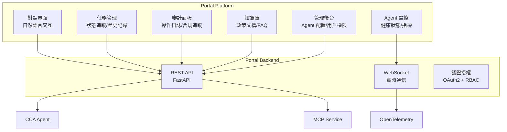

# 第十章：Portal Platform — 用戶與 AI Agent 的交互界面

> 「Portal 是 AI 平台的『臉』。用戶不關心你用了什麼框架、什麼協議，他們只關心：能不能快速完成任務、結果可不可靠、出錯了怎麼辦。」

Portal 是連接用戶與 AI Agent 的橋樑。它不僅是一個聊天界面，更是一個完整的業務協作平台 — 包含任務管理、審計追蹤、知識庫瀏覽、Agent 監控等功能。本章將展示如何構建一個生產級的 Portal Platform。

---

## 10.1 Portal 的功能架構

### 10.1.1 核心功能模塊



### 10.1.2 技術棧選型

| 組件 | 技術選型 | 理由 |
|------|---------|------|
| **前端框架** | Next.js 14 | SSR/SSG 混合，React 生態 |
| **UI 組件** | shadcn/ui | 可定製，無依賴綁定 |
| **狀態管理** | Zustand | 輕量，TypeScript 友好 |
| **實時通信** | Socket.IO | WebSocket + 自動降級 |
| **後端框架** | FastAPI | 異步高性能，Python 生態 |
| **認證** | OAuth2 + JWT | 企業級 SSO 集成 |

---

## 10.2 對話界面實現

### 10.2.1 消息流設計

```typescript
// frontend/types/message.ts
interface Message {
  id: string;
  role: 'user' | 'assistant' | 'system';
  content: string;
  timestamp: string;
  metadata?: {
    taskId?: string;
    agentId?: string;
    toolCalls?: ToolCall[];
    tokenUsage?: { input: number; output: number };
    durationMs?: number;
    traceId?: string;
  };
}

interface ToolCall {
  name: string;
  arguments: Record<string, unknown>;
  result: string;
  success: boolean;
  durationMs: number;
}

interface Task {
  id: string;
  type: string;
  status: 'pending' | 'running' | 'completed' | 'failed';
  messages: Message[];
  createdAt: string;
  completedAt?: string;
  auditLog: AuditEntry[];
}

interface AuditEntry {
  timestamp: string;
  action: string;
  agentId: string;
  toolName: string;
  result: string;
  userId: string;
}
```

### 10.2.2 聊天組件

```tsx
// frontend/components/ChatInterface.tsx
'use client';

import { useState, useRef, useEffect } from 'react';
import { useSocket } from '@/lib/socket';
import { MessageBubble } from './MessageBubble';
import { ToolCallCard } from './ToolCallCard';
import { TypingIndicator } from './TypingIndicator';

export function ChatInterface() {
  const [messages, setMessages] = useState<Message[]>([]);
  const [input, setInput] = useState('');
  const [isTyping, setIsTyping] = useState(false);
  const messagesEndRef = useRef<HTMLDivElement>(null);
  const socket = useSocket();

  useEffect(() => {
    socket.on('message', (message: Message) => {
      setMessages(prev => [...prev, message]);
      setIsTyping(false);
    });

    socket.on('tool_call', (toolCall: ToolCall) => {
      setMessages(prev => {
        const last = prev[prev.length - 1];
        if (last?.role === 'assistant' && last.metadata?.taskId) {
          return [...prev.slice(0, -1), {
            ...last,
            metadata: {
              ...last.metadata,
              toolCalls: [...(last.metadata.toolCalls || []), toolCall]
            }
          }];
        }
        return prev;
      });
    });

    return () => {
      socket.off('message');
      socket.off('tool_call');
    };
  }, [socket]);

  useEffect(() => {
    messagesEndRef.current?.scrollIntoView({ behavior: 'smooth' });
  }, [messages]);

  const handleSend = async () => {
    if (!input.trim()) return;

    const userMessage: Message = {
      id: crypto.randomUUID(),
      role: 'user',
      content: input,
      timestamp: new Date().toISOString()
    };

    setMessages(prev => [...prev, userMessage]);
    setInput('');
    setIsTyping(true);

    socket.emit('send_message', {
      content: input,
      sessionId: getCurrentSessionId()
    });
  };

  return (
    <div className="flex flex-col h-screen">
      <div className="flex-1 overflow-y-auto p-4 space-y-4">
        {messages.map(msg => (
          <MessageBubble key={msg.id} message={msg} />
        ))}
        {isTyping && <TypingIndicator />}
        <div ref={messagesEndRef} />
      </div>

      <div className="border-t p-4">
        <div className="flex gap-2">
          <input
            type="text"
            value={input}
            onChange={(e) => setInput(e.target.value)}
            onKeyPress={(e) => e.key === 'Enter' && handleSend()}
            placeholder="描述您的需求..."
            className="flex-1 p-2 border rounded"
          />
          <button
            onClick={handleSend}
            className="px-4 py-2 bg-blue-500 text-white rounded"
          >
            發送
          </button>
        </div>
      </div>
    </div>
  );
}
```

### 10.2.3 消息氣泡組件

```tsx
// frontend/components/MessageBubble.tsx
export function MessageBubble({ message }: { message: Message }) {
  const isUser = message.role === 'user';

  return (
    <div className={`flex ${isUser ? 'justify-end' : 'justify-start'}`}>
      <div className={`max-w-[70%] rounded-lg p-3 ${
        isUser
          ? 'bg-blue-500 text-white'
          : 'bg-gray-100 text-gray-900'
      }`}>
        <p className="whitespace-pre-wrap">{message.content}</p>

        {/* 顯示工具調用結果 */}
        {message.metadata?.toolCalls?.map((tc, i) => (
          <ToolCallCard key={i} toolCall={tc} />
        ))}

        {/* 顯示元數據 */}
        {message.metadata && (
          <div className="mt-2 text-xs opacity-70">
            {message.metadata.agentId && (
              <span>Agent: {message.metadata.agentId}</span>
            )}
            {message.metadata.durationMs && (
              <span> | 耗時: {message.metadata.durationMs}ms</span>
            )}
          </div>
        )}
      </div>
    </div>
  );
}
```

---

## 10.3 任務管理面板

### 10.3.1 任務列表

```tsx
// frontend/components/TaskList.tsx
export function TaskList() {
  const [tasks, setTasks] = useState<Task[]>([]);
  const [filter, setFilter] = useState('all');

  useEffect(() => {
    fetchTasks().then(setTasks);
  }, [filter]);

  return (
    <div className="space-y-4">
      <div className="flex gap-2 mb-4">
        {['all', 'pending', 'running', 'completed', 'failed'].map(f => (
          <button
            key={f}
            onClick={() => setFilter(f)}
            className={`px-3 py-1 rounded ${
              filter === f ? 'bg-blue-500 text-white' : 'bg-gray-200'
            }`}
          >
            {f === 'all' ? '全部' : f}
          </button>
        ))}
      </div>

      <div className="space-y-2">
        {tasks.map(task => (
          <TaskCard key={task.id} task={task} />
        ))}
      </div>
    </div>
  );
}

function TaskCard({ task }: { task: Task }) {
  const statusColors = {
    pending: 'bg-yellow-100 text-yellow-800',
    running: 'bg-blue-100 text-blue-800',
    completed: 'bg-green-100 text-green-800',
    failed: 'bg-red-100 text-red-800'
  };

  return (
    <div className="border rounded-lg p-4 hover:shadow-md transition-shadow">
      <div className="flex justify-between items-start">
        <div>
          <h3 className="font-medium">{task.type}</h3>
          <p className="text-sm text-gray-500">ID: {task.id}</p>
        </div>
        <span className={`px-2 py-1 rounded text-sm ${statusColors[task.status]}`}>
          {task.status}
        </span>
      </div>

      <div className="mt-2 text-sm text-gray-600">
        <span>創建時間: {new Date(task.createdAt).toLocaleString('zh-TW')}</span>
        {task.completedAt && (
          <span> | 完成時間: {new Date(task.completedAt).toLocaleString('zh-TW')}</span>
        )}
      </div>

      <div className="mt-3">
        <Link href={`/tasks/${task.id}`} className="text-blue-500 hover:underline">
          查看詳情 →
        </Link>
      </div>
    </div>
  );
}
```

### 10.3.2 任務詳情頁

```tsx
// frontend/app/tasks/[id]/page.tsx
export default async function TaskDetail({ params }: { params: { id: string } }) {
  const task = await fetchTask(params.id);

  return (
    <div className="max-w-4xl mx-auto p-6 space-y-6">
      <h1 className="text-2xl font-bold">任務詳情</h1>

      {/* 基本信息 */}
      <Card>
        <CardHeader>基本信息</CardHeader>
        <CardContent className="grid grid-cols-2 gap-4">
          <div>
            <label className="text-sm text-gray-500">任務 ID</label>
            <p className="font-mono">{task.id}</p>
          </div>
          <div>
            <label className="text-sm text-gray-500">狀態</label>
            <StatusBadge status={task.status} />
          </div>
          <div>
            <label className="text-sm text-gray-500">創建時間</label>
            <p>{new Date(task.createdAt).toLocaleString('zh-TW')}</p>
          </div>
          <div>
            <label className="text-sm text-gray-500">耗時</label>
            <p>{task.durationMs}ms</p>
          </div>
        </CardContent>
      </Card>

      {/* 對話記錄 */}
      <Card>
        <CardHeader>對話記錄</CardHeader>
        <CardContent>
          {task.messages.map(msg => (
            <MessageBubble key={msg.id} message={msg} />
          ))}
        </CardContent>
      </Card>

      {/* 工具調用記錄 */}
      <Card>
        <CardHeader>工具調用記錄</CardHeader>
        <CardContent>
          {task.auditLog.map((entry, i) => (
            <AuditEntryCard key={i} entry={entry} />
          ))}
        </CardContent>
      </Card>

      {/* 追蹤信息 */}
      <Card>
        <CardHeader>追蹤信息</CardHeader>
        <CardContent>
          <div className="font-mono text-sm">
            <p>Trace ID: {task.traceId}</p>
            <p>Span ID: {task.spanId}</p>
          </div>
          <a
            href={`http://jaeger.observability:16686/trace/${task.traceId}`}
            target="_blank"
            rel="noopener noreferrer"
            className="text-blue-500 hover:underline"
          >
            在 Jaeger 中查看完整追蹤 →
          </a>
        </CardContent>
      </Card>
    </div>
  );
}
```

---

## 10.4 審計面板

### 10.4.1 審計日誌查詢

```tsx
// frontend/components/AuditPanel.tsx
export function AuditPanel() {
  const [logs, setLogs] = useState<AuditEntry[]>([]);
  const [filters, setFilters] = useState({
    userId: '',
    agentId: '',
    toolName: '',
    startDate: '',
    endDate: ''
  });

  useEffect(() => {
    fetchAuditLogs(filters).then(setLogs);
  }, [filters]);

  return (
    <div className="space-y-4">
      <h2 className="text-xl font-bold">審計日誌</h2>

      {/* 篩選器 */}
      <Card>
        <CardContent className="grid grid-cols-5 gap-4">
          <input
            type="text"
            placeholder="用戶 ID"
            value={filters.userId}
            onChange={(e) => setFilters({...filters, userId: e.target.value})}
            className="border rounded px-3 py-2"
          />
          <select
            value={filters.agentId}
            onChange={(e) => setFilters({...filters, agentId: e.target.value})}
            className="border rounded px-3 py-2"
          >
            <option value="">所有 Agent</option>
            <option value="hr-agent">HR Agent</option>
            <option value="it-agent">IT Agent</option>
          </select>
          <input
            type="text"
            placeholder="工具名稱"
            value={filters.toolName}
            onChange={(e) => setFilters({...filters, toolName: e.target.value})}
            className="border rounded px-3 py-2"
          />
          <input
            type="date"
            value={filters.startDate}
            onChange={(e) => setFilters({...filters, startDate: e.target.value})}
            className="border rounded px-3 py-2"
          />
          <input
            type="date"
            value={filters.endDate}
            onChange={(e) => setFilters({...filters, endDate: e.target.value})}
            className="border rounded px-3 py-2"
          />
        </CardContent>
      </Card>

      {/* 日誌表格 */}
      <Card>
        <Table>
          <TableHeader>
            <TableRow>
              <TableHead>時間</TableHead>
              <TableHead>用戶</TableHead>
              <TableHead>Agent</TableHead>
              <TableHead>工具</TableHead>
              <TableHead>結果</TableHead>
              <TableHead>操作</TableHead>
            </TableRow>
          </TableHeader>
          <TableBody>
            {logs.map((log, i) => (
              <TableRow key={i}>
                <TableCell>{new Date(log.timestamp).toLocaleString('zh-TW')}</TableCell>
                <TableCell>{log.userId}</TableCell>
                <TableCell>{log.agentId}</TableCell>
                <TableCell>{log.toolName}</TableCell>
                <TableCell>
                  <StatusBadge status={log.result} />
                </TableCell>
                <TableCell>
                  <Button variant="ghost" size="sm">詳情</Button>
                </TableCell>
              </TableRow>
            ))}
          </TableBody>
        </Table>
      </Card>
    </div>
  );
}
```

---

## 10.5 知識庫管理

### 10.5.1 文檔上傳與瀏覽

```tsx
// frontend/components/KBManager.tsx
export function KBManager() {
  const [documents, setDocuments] = useState<Document[]>([]);
  const [uploading, setUploading] = useState(false);

  const handleUpload = async (files: FileList) => {
    setUploading(true);
    const formData = new FormData();
    Array.from(files).forEach(f => formData.append('files', f));

    await fetch('/api/kb/upload', {
      method: 'POST',
      body: formData
    });

    setUploading(false);
    fetchDocuments().then(setDocuments);
  };

  return (
    <div className="space-y-4">
      <div className="flex justify-between items-center">
        <h2 className="text-xl font-bold">知識庫管理</h2>
        <div>
          <input
            type="file"
            multiple
            accept=".pdf,.md,.txt"
            onChange={(e) => e.target.files && handleUpload(e.target.files)}
            className="hidden"
            id="file-upload"
          />
          <label
            htmlFor="file-upload"
            className="cursor-pointer bg-blue-500 text-white px-4 py-2 rounded"
          >
            上傳文檔
          </label>
        </div>
      </div>

      <div className="grid grid-cols-3 gap-4">
        {documents.map(doc => (
          <Card key={doc.id}>
            <CardContent>
              <h3 className="font-medium">{doc.title}</h3>
              <p className="text-sm text-gray-500">{doc.category}</p>
              <p className="text-sm">Chunks: {doc.chunkCount}</p>
              <p className="text-sm">上傳時間: {new Date(doc.uploadedAt).toLocaleDateString('zh-TW')}</p>
            </CardContent>
          </Card>
        ))}
      </div>
    </div>
  );
}
```

---

## 10.6 實時監控面板

### 10.6.1 WebSocket 連接

```typescript
// frontend/lib/socket.ts
import { io } from 'socket.io-client';

export const socket = io(process.env.NEXT_PUBLIC_WS_URL || 'ws://localhost:8080', {
  auth: {
    token: getAuthToken()
  }
});

// 監聽 Agent 健康狀態
socket.on('agent:health', (data) => {
  console.log('Agent health update:', data);
});

// 監聽實時指標
socket.on('metrics:update', (data) => {
  console.log('Metrics update:', data);
});

// 監聽告警
socket.on('alert:triggered', (data) => {
  console.log('Alert triggered:', data);
});
```

### 10.6.2 監控儀表板

```tsx
// frontend/components/MonitorDashboard.tsx
export function MonitorDashboard() {
  const [metrics, setMetrics] = useState<Metrics>({});

  useEffect(() => {
    const socket = useSocket();
    socket.on('metrics:update', setMetrics);
    return () => { socket.off('metrics:update'); };
  }, []);

  return (
    <div className="grid grid-cols-4 gap-4">
      <StatCard
        title="活躍任務"
        value={metrics.activeTasks || 0}
        icon="🔄"
      />
      <StatCard
        title="成功率"
        value={`${metrics.successRate || 100}%`}
        icon="✅"
      />
      <StatCard
        title="平均延遲"
        value={`${metrics.avgLatency || 0}ms`}
        icon="⏱️"
      />
      <StatCard
        title="Token 消耗"
        value={metrics.tokenUsage || 0}
        icon="🪙"
      />
    </div>
  );
}
```

---

## 10.7 OAuth2/OIDC 集成

### 10.7.1 後端認證配置

```python
# portal/backend/auth/oauth2.py
from fastapi import FastAPI, Depends, HTTPException, status
from fastapi.security import HTTPBearer, HTTPAuthorizationCredentials
from authlib.integrations.starlette_client import OAuth
from jose import JWTError, jwt
from datetime import datetime, timedelta
from typing import Optional
import httpx

# OAuth2 配置
oauth = OAuth()

# Azure AD 配置（企業常用）
oauth.register(
    name='azure',
    client_id='YOUR_CLIENT_ID',
    client_secret='YOUR_CLIENT_SECRET',
    server_metadata_url='https://login.microsoftonline.com/{tenant}/v2.0/.well-known/openid-configuration',
    client_kwargs={
        'scope': 'openid email profile User.Read',
        'token_endpoint_auth_method': 'client_secret_post'
    }
)

# Google Workspace 配置（可選）
oauth.register(
    name='google',
    client_id='YOUR_GOOGLE_CLIENT_ID',
    client_secret='YOUR_GOOGLE_CLIENT_SECRET',
    server_metadata_url='https://accounts.google.com/.well-known/openid-configuration',
    client_kwargs={'scope': 'openid email profile'}
)

# JWT 配置
JWT_SECRET = "your-secret-key-here"  # 實際使用環境變量
JWT_ALGORITHM = "HS256"
JWT_EXPIRY_HOURS = 8

security = HTTPBearer()


class AuthService:
    """認證服務"""

    @staticmethod
    def create_access_token(
        user_id: str,
        email: str,
        roles: list,
        department: str
    ) -> str:
        """創建 JWT Token"""
        payload = {
            "sub": user_id,
            "email": email,
            "roles": roles,
            "department": department,
            "exp": datetime.utcnow() + timedelta(hours=JWT_EXPIRY_HOURS),
            "iat": datetime.utcnow()
        }
        return jwt.encode(payload, JWT_SECRET, algorithm=JWT_ALGORITHM)

    @staticmethod
    def verify_token(token: str) -> dict:
        """驗證 JWT Token"""
        try:
            payload = jwt.decode(token, JWT_SECRET, algorithms=[JWT_ALGORITHM])
            return payload
        except JWTError:
            raise HTTPException(
                status_code=status.HTTP_401_UNAUTHORIZED,
                detail="Invalid or expired token"
            )


async def get_current_user(
    credentials: HTTPAuthorizationCredentials = Depends(security)
) -> dict:
    """獲取當前用戶"""
    return AuthService.verify_token(credentials.credentials)


# FastAPI 依賴注入
app = FastAPI()


@app.get("/api/auth/login")
async def login(request: Request):
    """重定向到 OAuth2 提供商"""
    redirect_uri = request.url_for('auth_callback')
    return await oauth.azure.authorize_redirect(request, redirect_uri)


@app.get("/api/auth/callback")
async def auth_callback(request: Request):
    """OAuth2 回調處理"""
    token = await oauth.azure.authorize_access_token(request)
    user_info = token.get('userinfo')

    # 創建 JWT
    access_token = AuthService.create_access_token(
        user_id=user_info['sub'],
        email=user_info['email'],
        roles=user_info.get('roles', ['user']),
        department=user_info.get('department', 'unknown')
    )

    return {"access_token": access_token, "token_type": "bearer"}
```

### 10.7.2 前端認證管理

```typescript
// frontend/lib/auth.ts
'use client';

import { create } from 'zustand';
import { persist } from 'zustand/middleware';

interface User {
  id: string;
  email: string;
  name: string;
  roles: string[];
  department: string;
}

interface AuthState {
  user: User | null;
  token: string | null;
  isLoading: boolean;
  login: () => Promise<void>;
  logout: () => void;
  getToken: () => string | null;
}

export const useAuth = create<AuthState>()(
  persist(
    (set, get) => ({
      user: null,
      token: null,
      isLoading: true,

      login: async () => {
        try {
          // 重定向到 OAuth2 登入頁面
          window.location.href = '/api/auth/login';
        } catch (error) {
          console.error('Login failed:', error);
        }
      },

      logout: () => {
        set({ user: null, token: null });
        window.location.href = '/logout';
      },

      getToken: () => get().token,
    }),
    {
      name: 'auth-storage',
      partialize: (state) => ({ token: state.token }),
    }
  )
);

// API 請求攔截器
export async function fetchWithAuth(url: string, options: RequestInit = {}) {
  const token = useAuth.getState().getToken();

  const response = await fetch(url, {
    ...options,
    headers: {
      ...options.headers,
      'Authorization': `Bearer ${token}`,
      'Content-Type': 'application/json',
    },
  });

  if (response.status === 401) {
    useAuth.getState().logout();
    throw new Error('Unauthorized');
  }

  return response;
}
```

---

## 10.8 RBAC 中間件

### 10.8.1 後端 RBAC

```python
# portal/backend/auth/rbac.py
from functools import wraps
from fastapi import HTTPException, status
from typing import List, Callable

# 角色定義
class Role:
    ADMIN = "admin"
    HR_MANAGER = "hr_manager"
    IT_ADMIN = "it_admin"
    USER = "user"
    VIEWER = "viewer"

# 權限矩陣
PERMISSIONS = {
    Role.ADMIN: [
        "agent:create", "agent:update", "agent:delete",
        "user:manage", "audit:view", "system:configure"
    ],
    Role.HR_MANAGER: [
        "agent:hr:*", "user:view", "employee:manage",
        "audit:view:hr"
    ],
    Role.IT_ADMIN: [
        "agent:it:*", "system:monitor", "audit:view:it",
        "infrastructure:manage"
    ],
    Role.USER: [
        "chat:create", "task:create", "task:view:own",
        "kb:read"
    ],
    Role.VIEWER: [
        "chat:read", "task:read", "audit:read"
    ],
}


def require_permission(permission: str):
    """權限檢查裝飾器"""
    def decorator(func: Callable):
        @wraps(func)
        async def wrapper(*args, **kwargs):
            user = kwargs.get('current_user')
            if not user:
                raise HTTPException(
                    status_code=status.HTTP_401_UNAUTHORIZED,
                    detail="Not authenticated"
                )

            user_roles = user.get('roles', [])
            user_permissions = set()
            for role in user_roles:
                user_permissions.update(PERMISSIONS.get(role, []))

            # 檢查權限（支持通配符）
            has_permission = False
            for p in user_permissions:
                if p == permission or p.endswith('*'):
                    prefix = p.rstrip('*')
                    if permission.startswith(prefix):
                        has_permission = True
                        break

            if not has_permission:
                raise HTTPException(
                    status_code=status.HTTP_403_FORBIDDEN,
                    detail=f"Permission denied: {permission}"
                )

            return await func(*args, **kwargs)
        return wrapper
    return decorator


# 使用範例
@app.post("/api/agents")
@require_permission("agent:create")
async def create_agent(
    agent_config: AgentConfig,
    current_user: dict = Depends(get_current_user)
):
    """創建 Agent（需要 agent:create 權限）"""
    # 創建邏輯
    pass


@app.get("/api/audit/logs")
@require_permission("audit:view")
async def get_audit_logs(
    current_user: dict = Depends(get_current_user)
):
    """查詢審計日誌（需要 audit:view 權限）"""
    # 部門過濾
    if Role.ADMIN not in current_user.get('roles', []):
        # 非管理員只能看自己部門
        return await get_logs_by_department(current_user['department'])
    return await get_all_logs()
```

---

## 10.9 錯誤處理 UX

### 10.9.1 全局錯誤邊界

```tsx
// frontend/components/ErrorBoundary.tsx
'use client';

import React from 'react';

interface Props {
  children: React.ReactNode;
  fallback?: React.ReactNode;
}

interface State {
  hasError: boolean;
  error: Error | null;
}

export class ErrorBoundary extends React.Component<Props, State> {
  constructor(props: Props) {
    super(props);
    this.state = { hasError: false, error: null };
  }

  static getDerivedStateFromError(error: Error): State {
    return { hasError: true, error };
  }

  componentDidCatch(error: Error, errorInfo: React.ErrorInfo) {
    console.error('Error caught by boundary:', error, errorInfo);
    // 上報錯誤到監控系統
    reportError(error, errorInfo);
  }

  render() {
    if (this.state.hasError) {
      return this.props.fallback || (
        <div className="min-h-[200px] flex items-center justify-center border rounded-lg bg-red-50">
          <div className="text-center p-6">
            <h3 className="text-lg font-medium text-red-800">出了點問題</h3>
            <p className="text-sm text-red-600 mt-2">
              {this.state.error?.message || '發生未知錯誤'}
            </p>
            <button
              onClick={() => this.setState({ hasError: false, error: null })}
              className="mt-4 px-4 py-2 bg-red-600 text-white rounded hover:bg-red-700"
            >
              重試
            </button>
          </div>
        </div>
      );
    }

    return this.props.children;
  }
}
```

### 10.9.2 Agent 錯誤狀態處理

```tsx
// frontend/components/AgentErrorState.tsx
export function AgentErrorState({ error, onRetry }: { error: AgentError; onRetry: () => void }) {
  const errorMessages: Record<string, { title: string; description: string; action: string }> = {
    'AGENT_TIMEOUT': {
      title: 'Agent 回應超時',
      description: 'Agent 處理時間過長，可能是系統繁忙',
      action: '請稍後重試'
    },
    'AGENT_UNAVAILABLE': {
      title: 'Agent 暫時不可用',
      description: '該 Agent 正在維護或升級中',
      action: '請聯繫系統管理員'
    },
    'TOOL_EXECUTION_FAILED': {
      title: '工具執行失敗',
      description: 'Agent 無法完成操作',
      action: '請檢查輸入信息是否正確'
    },
    'LLM_ERROR': {
      title: 'AI 模型錯誤',
      description: '語言模型處理請求時出錯',
      action: '請重新描述您的需求'
    },
    'RATE_LIMITED': {
      title: '請求過於頻繁',
      description: '系統限制了您的請求頻率',
      action: '請等待 30 秒後重試'
    }
  };

  const errorInfo = errorMessages[error.code] || {
    title: '未知錯誤',
    description: error.message,
    action: '請聯繫系統管理員'
  };

  return (
    <div className="border border-red-200 rounded-lg p-4 bg-red-50">
      <div className="flex items-start gap-3">
        <div className="text-red-500 text-xl">⚠️</div>
        <div className="flex-1">
          <h4 className="font-medium text-red-800">{errorInfo.title}</h4>
          <p className="text-sm text-red-600 mt-1">{errorInfo.description}</p>
          <p className="text-sm text-red-500 mt-2">{errorInfo.action}</p>

          {error.traceId && (
            <p className="text-xs text-gray-500 mt-2">
              追蹤 ID: {error.traceId}
            </p>
          )}
        </div>
      </div>

      <div className="mt-4 flex gap-2">
        <button
          onClick={onRetry}
          className="px-4 py-2 bg-red-600 text-white rounded hover:bg-red-700"
        >
          重試
        </button>
        <button
          onClick={() => window.open(`/support?traceId=${error.traceId}`)}
          className="px-4 py-2 border border-red-300 rounded hover:bg-red-100"
        >
          聯繫支持
        </button>
      </div>
    </div>
  );
}
```

---

## 10.10 對話線程管理

### 10.10.1 會話存儲

```python
# portal/backend/conversation/thread.py
from datetime import datetime
from typing import List, Optional
from pydantic import BaseModel
import uuid

class ConversationThread(BaseModel):
    id: str = Field(default_factory=lambda: str(uuid.uuid4()))
    user_id: str
    title: str
    created_at: datetime = Field(default_factory=datetime.now)
    updated_at: datetime = Field(default_factory=datetime.now)
    messages: List[dict] = []
    metadata: dict = {}

    class Config:
        json_encoders = {datetime: lambda v: v.isoformat()}


class ThreadManager:
    """對話線程管理器"""

    def __init__(self, db):
        self.db = db

    async def create_thread(self, user_id: str, title: str) -> ConversationThread:
        """創建新線程"""
        thread = ConversationThread(user_id=user_id, title=title)
        await self.db.threads.insert_one(thread.dict())
        return thread

    async def get_thread(self, thread_id: str) -> Optional[ConversationThread]:
        """獲取線程"""
        data = await self.db.threads.find_one({"id": thread_id})
        if data:
            return ConversationThread(**data)
        return None

    async def add_message(
        self,
        thread_id: str,
        role: str,
        content: str,
        metadata: dict = None
    ):
        """添加消息到線程"""
        message = {
            "id": str(uuid.uuid4()),
            "role": role,
            "content": content,
            "timestamp": datetime.now().isoformat(),
            "metadata": metadata or {}
        }

        await self.db.threads.update_one(
            {"id": thread_id},
            {
                "$push": {"messages": message},
                "$set": {"updated_at": datetime.now()}
            }
        )
        return message

    async def list_threads(
        self,
        user_id: str,
        limit: int = 20,
        offset: int = 0
    ) -> List[ConversationThread]:
        """列出用戶的線程"""
        cursor = self.db.threads.find(
            {"user_id": user_id}
        ).sort(
            "updated_at", -1
        ).skip(offset).limit(limit)

        threads = []
        async for doc in cursor:
            threads.append(ConversationThread(**doc))
        return threads

    async def search_threads(
        self,
        user_id: str,
        query: str
    ) -> List[ConversationThread]:
        """搜索線程"""
        cursor = self.db.threads.find({
            "user_id": user_id,
            "$text": {"$search": query}
        }).sort("updated_at", -1).limit(10)

        threads = []
        async for doc in cursor:
            threads.append(ConversationThread(**doc))
        return threads
```

### 10.10.2 前端線程 UI

```tsx
// frontend/components/ThreadSidebar.tsx
export function ThreadSidebar() {
  const [threads, setThreads] = useState<ConversationThread[]>([]);
  const [selectedId, setSelectedId] = useState<string | null>(null);
  const [searchQuery, setSearchQuery] = useState('');

  useEffect(() => {
    fetchThreads().then(setThreads);
  }, []);

  const handleSearch = async () => {
    if (searchQuery.trim()) {
      const results = await searchThreads(searchQuery);
      setThreads(results);
    } else {
      fetchThreads().then(setThreads);
    }
  };

  return (
    <div className="w-64 border-r h-full flex flex-col">
      <div className="p-4 border-b">
        <input
          type="text"
          placeholder="搜索對話..."
          value={searchQuery}
          onChange={(e) => setSearchQuery(e.target.value)}
          onKeyPress={(e) => e.key === 'Enter' && handleSearch()}
          className="w-full px-3 py-2 border rounded"
        />
      </div>

      <div className="flex-1 overflow-y-auto">
        {threads.map(thread => (
          <div
            key={thread.id}
            onClick={() => setSelectedId(thread.id)}
            className={`p-4 border-b cursor-pointer hover:bg-gray-50 ${
              selectedId === thread.id ? 'bg-blue-50 border-l-4 border-l-blue-500' : ''
            }`}
          >
            <h4 className="font-medium text-sm truncate">{thread.title}</h4>
            <p className="text-xs text-gray-500 mt-1">
              {new Date(thread.updatedAt).toLocaleDateString('zh-TW')}
            </p>
          </div>
        ))}
      </div>

      <div className="p-4 border-t">
        <button
          onClick={() => createNewThread()}
          className="w-full px-4 py-2 bg-blue-500 text-white rounded hover:bg-blue-600"
        >
          新對話
        </button>
      </div>
    </div>
  );
}
```

---

## 本章小結

本章展示了 Portal Platform 的完整實現：

- **對話界面**：實時聊天，WebSocket 通信，工具調用可視化
- **任務管理**：任務列表、詳情頁、狀態追蹤
- **審計面板**：日誌查詢、篩選器、合規追蹤
- **知識庫管理**：文檔上傳、分類、向量化
- **實時監控**：WebSocket 指標推送，告警通知
- **OAuth2/OIDC**：企業 SSO 集成，JWT Token 管理
- **RBAC**：基於角色的訪問控制，權限矩陣
- **錯誤 UX**：全局錯誤邊界，Agent 錯誤狀態處理
- **對話線程**：會話存儲、搜索、歷史管理

---

## 延伸閱讀

1. **Next.js Documentation** — https://nextjs.org/docs/ — React 全棧框架。
2. **Socket.IO Documentation** — https://socket.io/docs/ — 實時通信框架。
3. **shadcn/ui Documentation** — https://ui.shadcn.com/ — UI 組件庫。
4. **Authlib Documentation** — https://authlib.org/ — OAuth2/OIDC 客戶端。
5. **《Designing for the Social Web》** — Joshua Porter. 用戶體驗設計經典。
6. **《Building Micro-Frontends》** — Luca Mezzalira, O'Reilly. 微前端架構。
