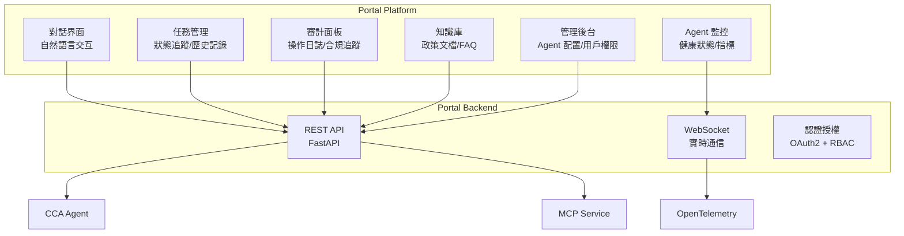

# 第十章：Portal Platform — 用戶與 AI Agent 的交互界面

> 「Portal 是 AI 平台的『臉』。用戶不關心你用了什麼框架、什麼協議，他們只關心：能不能快速完成任務、結果可不可靠、出錯了怎麼辦。」

Portal 是連接用戶與 AI Agent 的橋樑。它不僅是一個聊天界面，更是一個完整的業務協作平台 — 包含任務管理、審計追蹤、知識庫瀏覽、Agent 監控等功能。本章將展示如何構建一個生產級的 Portal Platform。

---

## 10.1 Portal 的功能架構

### 10.1.1 核心功能模塊



上圖展示了 Portal Platform 的功能架構，分為三個層次：前端功能模塊（用戶直接交互的六大功能）→ 後端服務層（API、WebSocket、認證）→ 平台核心組件（CCA、MCP、OTel）。

**六大前端功能模塊**

| 模塊 | 用途 | 通信方式 | 關鍵特性 |
|------|------|---------|---------|
| **對話界面** | 用戶以自然語言與 Agent 交互 | REST API | 支持多輪對話、Markdown 渲染、代碼高亮 |
| **任務管理** | 追蹤任務狀態（進行中/已完成/失敗）、查看歷史記錄 | REST API | 任務卡片化展示，支持篩選和搜索 |
| **審計面板** | 查看所有操作的完整日誌，滿足合規要求 | REST API | 時間線視圖、操作追溯、導出報告 |
| **知識庫** | 瀏覽和管理 Agent 使用的知識文檔 | REST API | 文檔上傳、版本管理、搜索預覽 |
| **Agent 監控** | 實時查看各 Agent 的健康狀態和性能指標 | **WebSocket** | 注意：這是唯一使用 WebSocket 的模塊——因為監控數據需要實時推送 |
| **管理後台** | 配置 Agent 參數、管理用戶權限、系統設置 | REST API | RBAC 權限控制，僅管理員可訪問 |

**後端服務層的三條通道**

| 通道 | 技術 | 用途 | 為什麼選它 |
|------|------|------|-----------|
| **REST API** | FastAPI | 所有請求-響應模式的交互（查詢、提交、配置） | 成熟穩定、自動生成 OpenAPI 文檔、Python 異步性能好 |
| **WebSocket** | Socket.IO | 實時數據推送（Agent 監控指標、任務狀態變更） | 全雙工通信，服務器可主動推送，無需客戶端輪詢 |
| **認證授權** | OAuth2 + JWT | 用戶身份驗證 + 角色權限控制 | 企業級 SSO 集成（對接 Active Directory、Google Workspace） |

**為什麼 Agent 監控用 WebSocket 而其他模塊用 REST**

這是一個有意的架構決策：

- 對話、任務、審計等模塊是**用戶驅動**的——用戶點擊「發送」才觸發請求，適合 REST 的請求-響應模式
- Agent 監控是**系統驅動**的——Agent 的指標每秒都在變化，需要服務器主動推送更新，WebSocket 是唯一的合理選擇

**平台核心組件的連接關係**

圖底部的三條箭頭揭示了 Portal 與平台的集成點：

- **API → CCA**：用戶的自然語言輸入通過 API 傳遞給 CCA 進行意圖識別和任務分解
- **API → MCP**：任務狀態查詢通過 API 傳遞給 MCP Service 獲取實時信息
- **WS → OTel**：監控數據通過 WebSocket 直接從 OTel 系統獲取，繞過 CCA 和 MCP——這是為了避免監控流量污染業務流量

### 10.1.2 技術棧選型

| 組件 | 技術選型 | 理由 |
|------|---------|------|
| **前端框架** | Next.js 16 | SSR/SSG 混合，React 生態 |
| **UI 組件** | shadcn/ui | 可定製，無依賴綁定 |
| **狀態管理** | Zustand | 輕量，TypeScript 友好 |
| **實時通信** | Socket.IO | WebSocket + 自動降級 |
| **後端框架** | FastAPI | 異步高性能，Python 生態 |
| **認證** | OAuth2 + JWT | 企業級 SSO 集成 |

---

## 10.2 對話界面實現

### 10.2.1 消息流設計

Portal 的核心是對話界面，而對話的基礎是消息數據模型。以下定義了四大核心實體——Message（消息）、ToolCall（工具調用）、Task（任務）、AuditEntry（審計記錄）。這些 TypeScript 介面不僅是前端的型別約束，也是前後端 API 的合約：

```typescript
// frontend/types/message.ts
// ================================================================
// Portal 的核心數據模型 — 定義了消息、工具調用、任務、審計四個實體。
// 這些 TypeScript 類型不僅是前端的型別約束，也是前後端的「合約」：
// 後端 API 返回的 JSON 結構必須符合這些接口。
interface Message {
  id: string;
  role: 'user' | 'assistant' | 'system';  // 三種角色：使用者/Agent/系統
  content: string;                          // 消息正文（Markdown 格式）
  timestamp: string;
  metadata?: {
    taskId?: string;           // 關聯的任務 ID（可點擊跳轉到任務詳情）
    agentId?: string;          // 處理此消息的 Agent（多 Agent 場景）
    toolCalls?: ToolCall[];    // 此消息觸發的工具調用列表
    tokenUsage?: { input: number; output: number };  // Token 消耗（成本可視化）
    durationMs?: number;       // Agent 處理延遲（性能指標）
    traceId?: string;          // OTel TraceID（跳轉 Jaeger 追蹤）
  };
}

interface ToolCall {
  name: string;                       // 工具名稱（如 "create_ad_account"）
  arguments: Record<string, unknown>; // 工具參數（JSON 格式）
  result: string;                     // 工具返回結果
  success: boolean;                   // 是否成功（紅/綠狀態指示）
  durationMs: number;                 // 工具執行耗時
}

interface Task {
  id: string;
  type: string;                          // 任務類型（如 "account_creation"）
  status: 'pending' | 'running' | 'completed' | 'failed';  // 四種狀態
  messages: Message[];                   // 任務關聯的消息列表
  createdAt: string;
  completedAt?: string;
  auditLog: AuditEntry[];                // 此任務的完整審計記錄
}

interface AuditEntry {
  timestamp: string;
  action: string;        // 操作類型（如 "tool_call"、"agent_decision"）
  agentId: string;       // 執行操作的 Agent
  toolName: string;      // 使用的工具（如 "hr_api"、"ad_connector"）
  result: string;        // 操作結果（成功/失敗 + 詳細信息）
  userId: string;        // 觸發操作的使用者
}
```

**關鍵設計決策**：
- **`metadata` 為可選字段**：並非所有消息都有 metadata。使用者輸入的消息沒有 `toolCalls` 和 `traceId`，只有 Agent 回應才有。用 `?` 標記可選，避免前端在渲染使用者消息時處理 undefined。
- **`AuditEntry` 的設計哲學**：審計記錄不是「附加功能」，而是企業合規的硬性要求。每個 `toolCall` 必須可追溯到具體的 `userId` 和 `agentId`——出了問題能找到「誰觸發了什麼操作」。
- **`traceId` 在前端的角色**：讓非技術人員（如 IT 管理員）也能一鍵跳轉到 Jaeger 查看追蹤。降低排錯門檻——不需要讓使用者手動提供 trace ID。
- **`ToolCall` 帶 `durationMs`**：前端可以計算「Agent 花了多久等待工具返回」，區分「LLM 推理時間」和「工具執行時間」，幫助優化瓶頸。

### 10.2.2 聊天組件

聊天組件是使用者與 AI Agent 交互的主要入口。它透過 Socket.IO 與後端保持長連接，實現實時消息推送、工具調用卡片渲染、以及打字指示器等功能。以下實作採用 React Hooks 模式，包含樂觀更新（Optimistic Update）策略，確保使用者獲得即時的回應體驗：

```tsx
// frontend/components/ChatInterface.tsx
// ================================================================
// Portal 的核心組件 — 對話界面。
// 這是使用者與 AI Agent 交互的主要入口，實現了實時消息推送、工具調用可視化、
// 打字指示器等功能。使用 Socket.IO 與後端保持長連接。
'use client';

import { useState, useRef, useEffect } from 'react';
import { useSocket } from '@/lib/socket';        // Socket.IO hook（封裝連接邏輯）
import { MessageBubble } from './MessageBubble';  // 消息氣泡渲染
import { ToolCallCard } from './ToolCallCard';    // 工具調用卡片
import { TypingIndicator } from './TypingIndicator';  // Agent 思考中指示器

export function ChatInterface() {
  const [messages, setMessages] = useState<Message[]>([]);      // 完整消息歷史
  const [input, setInput] = useState('');                       // 當前輸入框內容
  const [isTyping, setIsTyping] = useState(false);             // Agent 是否正在回應
  const messagesEndRef = useRef<HTMLDivElement>(null);          // 用於自動滾動到底部
  const socket = useSocket();                                   // WebSocket 連接實例

  // 註冊 WebSocket 事件監聽器
  useEffect(() => {
    // 收到 Agent 回應 → 追加到消息列表，停止打字指示
    socket.on('message', (message: Message) => {
      setMessages(prev => [...prev, message]);
      setIsTyping(false);
    });

    // 收到工具調用事件 → 追加到最新 Agent 消息的 toolCalls 數組
    // 設計要點：工具調用是「流式追加」到已有消息，而非獨立消息
    socket.on('tool_call', (toolCall: ToolCall) => {
      setMessages(prev => {
        const last = prev[prev.length - 1];
        // 找到最近一條 Agent 消息，把工具調用追加進去
        if (last?.role === 'assistant' && last.metadata?.taskId) {
          return [...prev.slice(0, -1), {
            ...last,
            metadata: {
              ...last.metadata,
              toolCalls: [...(last.metadata.toolCalls || []), toolCall]
            }
          }];
        }
        return prev;
      });
    });

    // 組件卸載時清理事件監聽，防止內存洩漏
    return () => {
      socket.off('message');
      socket.off('tool_call');
    };
  }, [socket]);

  // 新消息到達時自動滾動到底部（聊天 UX 標準做法）
  useEffect(() => {
    messagesEndRef.current?.scrollIntoView({ behavior: 'smooth' });
  }, [messages]);

  // 發送消息：先樂觀更新 UI，再通過 Socket.IO 發送到後端
  const handleSend = async () => {
    if (!input.trim()) return;  // 防止空消息

    const userMessage: Message = {
      id: crypto.randomUUID(),  // 前端生成 UUID，避免依賴後端 ID 分配
      role: 'user',
      content: input,
      timestamp: new Date().toISOString()
    };

    setMessages(prev => [...prev, userMessage]);  // 樂觀更新：立即顯示使用者消息
    setInput('');            // 清空輸入框
    setIsTyping(true);      // 顯示打字指示器

    socket.emit('send_message', {
      content: input,
      sessionId: getCurrentSessionId()  // 會話 ID 用於關聯上下文
    });
  };

  return (
    <div className="flex flex-col h-screen">
      {/* 消息列表區域 */}
      <div className="flex-1 overflow-y-auto p-4 space-y-4">
        {messages.map(msg => (
          <MessageBubble key={msg.id} message={msg} />
        ))}
        {isTyping && <TypingIndicator />}  {/* Agent 思考中提示 */}
        <div ref={messagesEndRef} />       {/* 滾動錨點 */}
      </div>

      {/* 輸入區域 */}
      <div className="border-t p-4">
        <div className="flex gap-2">
          <input
            type="text"
            value={input}
            onChange={(e) => setInput(e.target.value)}
            onKeyPress={(e) => e.key === 'Enter' && handleSend()}
            placeholder="描述您的需求..."
            className="flex-1 p-2 border rounded"
          />
          <button
            onClick={handleSend}
            className="px-4 py-2 bg-blue-500 text-white rounded"
          >
            發送
          </button>
        </div>
      </div>
    </div>
  );
}
```

**關鍵設計決策**：
- **樂觀更新 (Optimistic Update)**：使用者發送消息時，先在前端立即顯示，再通過 Socket.IO 發送到後端。使用者看到零延遲的回應，體驗更好。如果後端失敗，可以通過錯誤回調回滾。
- **`tool_call` 事件追加到已有消息**：工具調用不是獨立的「一條消息」，而是 Agent 回應的一部分。設計上把 `toolCalls` 嵌入 `Message.metadata`，保持消息列表的邏輯結構——「一條 Agent 回應」= 文本 + 若干工具調用。
- **`crypto.randomUUID()` 前端生成 ID**：避免前後端 ID 衝突。前端生成 UUIDv4 作為臨時 ID，後端可以選擇保留或替換。

### 10.2.3 消息氣泡組件

消息氣泡是對話界面中最基礎的視覺單元。根據角色不同（使用者 vs Agent），氣泡的對齊方向、背景顏色和附加資訊都不同。以下組件實現了使用者消息靠右（藍色背景）、Agent 消息靠左（灰色背景）的標準聊天 UX：

```tsx
// frontend/components/MessageBubble.tsx
// ================================================================
// 消息氣泡組件 — 根據角色（使用者/Agent）渲染不同的視覺樣式。
// 使用者消息靠右（藍色背景），Agent 消息靠左（灰色背景），
// 類似主流聊天應用的 UX 慣例。
export function MessageBubble({ message }: { message: Message }) {
  const isUser = message.role === 'user';

  return (
    <div className={`flex ${isUser ? 'justify-end' : 'justify-start'}`}>
      <div className={`max-w-[70%] rounded-lg p-3 ${
        isUser
          ? 'bg-blue-500 text-white'      // 使用者：藍色背景白字
          : 'bg-gray-100 text-gray-900'   // Agent：淺灰背景深色字
      }`}>
        <p className="whitespace-pre-wrap">{message.content}</p>

        {/* 顯示工具調用結果 — 僅 Agent 消息才有 */}
        {message.metadata?.toolCalls?.map((tc, i) => (
          <ToolCallCard key={i} toolCall={tc} />
        ))}

        {/* 顯示元數據：Agent ID + 處理耗時（小字灰色，不搶視覺焦點） */}
        {message.metadata && (
          <div className="mt-2 text-xs opacity-70">
            {message.metadata.agentId && (
              <span>Agent: {message.metadata.agentId}</span>
            )}
            {message.metadata.durationMs && (
              <span> | 耗時: {message.metadata.durationMs}ms</span>
            )}
          </div>
        )}
      </div>
    </div>
  );
}
```

**關鍵設計決策**：
- **`max-w-[70%]` 限制氣泡寬度**：防止長文本佔滿整個螢幕。70% 是聊天應用的常見比例——留出 30% 空間保持對話的「氣泡感」。
- **`whitespace-pre-wrap` 保留換行**：Agent 回應可能包含 Markdown 換行。不加這個屬性，所有文本會被壓縮成一行。
- **元數據不使用 ToolTip**：元數據（Agent ID、耗時）直接顯示在氣泡底部，而非 hover 才看到。原因是企業用戶需要「一目了然」——不需要交互就能看到關鍵信息。

---

## 10.3 任務管理面板

### 10.3.1 任務列表

任務列表讓管理員和使用者能即時追蹤所有 AI Agent 正在執行或已完成的任務。支援按狀態（pending、running、completed、failed）篩選，每個任務以卡片形式展示類型、ID、狀態和時間：

```tsx
// frontend/components/TaskList.tsx
// ================================================================
// 任務列表組件 — 展示所有 AI Agent 執行過的任務，支持按狀態篩選。
// 每個任務顯示類型、ID、狀態、時間，可點擊進入詳情頁。
export function TaskList() {
  const [tasks, setTasks] = useState<Task[]>([]);        // 所有任務
  const [filter, setFilter] = useState('all');            // 當前篩選狀態

  // 篩選器變化時重新拉取數據（也可以前端過濾，但這裡假設後端有分頁能力）
  useEffect(() => {
    fetchTasks().then(setTasks);
  }, [filter]);

  return (
    <div className="space-y-4">
      {/* 狀態篩選按鈕組 */}
      <div className="flex gap-2 mb-4">
        {['all', 'pending', 'running', 'completed', 'failed'].map(f => (
          <button
            key={f}
            onClick={() => setFilter(f)}
            className={`px-3 py-1 rounded ${
              filter === f ? 'bg-blue-500 text-white' : 'bg-gray-200'
            }`}
          >
            {f === 'all' ? '全部' : f}
          </button>
        ))}
      </div>

      {/* 任務卡片列表 */}
      <div className="space-y-2">
        {tasks.map(task => (
          <TaskCard key={task.id} task={task} />
        ))}
      </div>
    </div>
  );
}

function TaskCard({ task }: { task: Task }) {
  // 四種狀態對應四種顏色 — 一目了然的狀態指示
  const statusColors = {
    pending: 'bg-yellow-100 text-yellow-800',    // 黃色：等待中
    running: 'bg-blue-100 text-blue-800',        // 藍色：執行中
    completed: 'bg-green-100 text-green-800',    // 綠色：已完成
    failed: 'bg-red-100 text-red-800'            // 紅色：失敗
  };

  return (
    <div className="border rounded-lg p-4 hover:shadow-md transition-shadow">
      <div className="flex justify-between items-start">
        <div>
          <h3 className="font-medium">{task.type}</h3>
          <p className="text-sm text-gray-500">ID: {task.id}</p>
        </div>
        <span className={`px-2 py-1 rounded text-sm ${statusColors[task.status]}`}>
          {task.status}
        </span>
      </div>

      <div className="mt-2 text-sm text-gray-600">
        <span>創建時間: {new Date(task.createdAt).toLocaleString('zh-TW')}</span>
        {task.completedAt && (
          <span> | 完成時間: {new Date(task.completedAt).toLocaleString('zh-TW')}</span>
        )}
      </div>

      <div className="mt-3">
        <Link href={`/tasks/${task.id}`} className="text-blue-500 hover:underline">
          查看詳情 →
        </Link>
      </div>
    </div>
  );
}
```

**關鍵設計決策**：
- **篩選器與後端聯動**：`useEffect` 依賴 `filter` 變化，每次切換狀態都重新拉取。比前端過濾更好——數據量大時前端過濾會卡頓，且可能遺漏「篩選器切換間新產生的任務」。
- **`toLocaleString('zh-TW')`**：日期格式化使用繁體中文本地化。時間戳對使用者沒有意義，轉成「2024/1/15 下午 3:30」更直觀。
- **卡片 hover 效果**：`hover:shadow-md` 提供微妙的互動反饋，暗示「可點擊」。企業 UI 不需要花哨動畫，但需要清晰的互動暗示。

### 10.3.2 任務詳情頁

任務詳情頁是審計和排錯的核心頁面。它以四張卡片分別展示任務的基本資訊、對話記錄、工具調用日誌、以及 OTel 追蹤連結，讓管理員能從宏觀到微觀逐步深入排查問題：

```tsx
// frontend/app/tasks/[id]/page.tsx
// ================================================================
// 任務詳情頁 — 展示單個任務的完整信息：基本信息、對話記錄、工具調用日誌、OTel 追蹤。
// 這是審計和排錯的核心頁面。
export default async function TaskDetail({ params }: { params: { id: string } }) {
  const task = await fetchTask(params.id);  // 服務端獲取任務數據（SSR）

  return (
    <div className="max-w-4xl mx-auto p-6 space-y-6">
      <h1 className="text-2xl font-bold">任務詳情</h1>

      {/* 基本信息卡片 — ID、狀態、時間、耗時 */}
      <Card>
        <CardHeader>基本信息</CardHeader>
        <CardContent className="grid grid-cols-2 gap-4">
          <div>
            <label className="text-sm text-gray-500">任務 ID</label>
            <p className="font-mono">{task.id}</p>
          </div>
          <div>
            <label className="text-sm text-gray-500">狀態</label>
            <StatusBadge status={task.status} />
          </div>
          <div>
            <label className="text-sm text-gray-500">創建時間</label>
            <p>{new Date(task.createdAt).toLocaleString('zh-TW')}</p>
          </div>
          <div>
            <label className="text-sm text-gray-500">耗時</label>
            <p>{task.durationMs}ms</p>
          </div>
        </CardContent>
      </Card>

      {/* 對話記錄 — 重用 MessageBubble 組件，保持 UI 一致性 */}
      <Card>
        <CardHeader>對話記錄</CardHeader>
        <CardContent>
          {task.messages.map(msg => (
            <MessageBubble key={msg.id} message={msg} />
          ))}
        </CardContent>
      </Card>

      {/* 工具調用記錄 — 完整審計軌跡 */}
      <Card>
        <CardHeader>工具調用記錄</CardHeader>
        <CardContent>
          {task.auditLog.map((entry, i) => (
            <AuditEntryCard key={i} entry={entry} />
          ))}
        </CardContent>
      </Card>

      {/* OTel 追蹤信息 — 直接鏈接到 Jaeger UI */}
      <Card>
        <CardHeader>追蹤信息</CardHeader>
        <CardContent>
          <div className="font-mono text-sm">
            <p>Trace ID: {task.traceId}</p>
            <p>Span ID: {task.spanId}</p>
          </div>
          <a
            href={`http://jaeger.observability:16686/trace/${task.traceId}`}
            target="_blank"
            rel="noopener noreferrer"
            className="text-blue-500 hover:underline"
          >
            在 Jaeger 中查看完整追蹤 →
          </a>
        </CardContent>
      </Card>
    </div>
  );
}
```

**關鍵設計決策**：
- **SSR 而非 CSR**：`async function TaskDetail` 是 Next.js Server Component。服務端直接獲取數據，無需客戶端 loading 狀態。SEO 友好（如果任務頁面需要被搜索引擎索引），且首次加載更快。
- **Jaeger 鏈接的設計哲學**：給非技術人員（如 IT 管理員）直接訪問 Jaeger 的能力。他們不需要知道什麼是 `traceId`，只需要點一下就能看到「Agent 做了什麼」。這是**可觀測性的降維**——把複雜的分散式追蹤簡化為一個按鈕。
- **四張 Card 分區**：基本信息、對話記錄、工具調用、追蹤——四個邏輯分區對應四個不同的使用場景（快速查看、回顧對話、審計排錯、深度追蹤）。

---

## 10.4 審計面板

### 10.4.1 審計日誌查詢

審計面板是企業合規（如 SOC 2）的核心 UI。它允許管理員按使用者、Agent、工具名稱、時間範圍等多維度篩選審計日誌，快速追溯「誰在什麼時候做了什麼操作、結果如何」：

```tsx
// frontend/components/AuditPanel.tsx
// ================================================================
// 審計面板 — 企業合規的核心 UI。允許管理員按「誰、什麼時候、用了什麼工具、結果如何」
// 多維度篩選審計日誌。這是 SOC 2 合規的可視化入口。
export function AuditPanel() {
  const [logs, setLogs] = useState<AuditEntry[]>([]);
  // 五個篩選維度：用戶、Agent、工具、起止時間
  const [filters, setFilters] = useState({
    userId: '',
    agentId: '',
    toolName: '',
    startDate: '',
    endDate: ''
  });

  // 篩選器變化時重新拉取（假設後端支持篩選參數）
  useEffect(() => {
    fetchAuditLogs(filters).then(setLogs);
  }, [filters]);

  return (
    <div className="space-y-4">
      <h2 className="text-xl font-bold">審計日誌</h2>

      {/* 多維度篩選器 */}
      <Card>
        <CardContent className="grid grid-cols-5 gap-4">
          <input
            type="text"
            placeholder="用戶 ID"
            value={filters.userId}
            onChange={(e) => setFilters({...filters, userId: e.target.value})}
            className="border rounded px-3 py-2"
          />
          <select
            value={filters.agentId}
            onChange={(e) => setFilters({...filters, agentId: e.target.value})}
            className="border rounded px-3 py-2"
          >
            <option value="">所有 Agent</option>
            <option value="hr-agent">HR Agent</option>
            <option value="it-agent">IT Agent</option>
          </select>
          <input
            type="text"
            placeholder="工具名稱"
            value={filters.toolName}
            onChange={(e) => setFilters({...filters, toolName: e.target.value})}
            className="border rounded px-3 py-2"
          />
          <input
            type="date"
            value={filters.startDate}
            onChange={(e) => setFilters({...filters, startDate: e.target.value})}
            className="border rounded px-3 py-2"
          />
          <input
            type="date"
            value={filters.endDate}
            onChange={(e) => setFilters({...filters, endDate: e.target.value})}
            className="border rounded px-3 py-2"
          />
        </CardContent>
      </Card>

      {/* 審計日誌表格 */}
      <Card>
        <Table>
          <TableHeader>
            <TableRow>
              <TableHead>時間</TableHead>
              <TableHead>用戶</TableHead>
              <TableHead>Agent</TableHead>
              <TableHead>工具</TableHead>
              <TableHead>結果</TableHead>
              <TableHead>操作</TableHead>
            </TableRow>
          </TableHeader>
          <TableBody>
            {logs.map((log, i) => (
              <TableRow key={i}>
                <TableCell>{new Date(log.timestamp).toLocaleString('zh-TW')}</TableCell>
                <TableCell>{log.userId}</TableCell>
                <TableCell>{log.agentId}</TableCell>
                <TableCell>{log.toolName}</TableCell>
                <TableCell>
                  <StatusBadge status={log.result} />
                </TableCell>
                <TableCell>
                  <Button variant="ghost" size="sm">詳情</Button>
                </TableCell>
              </TableRow>
            ))}
          </TableBody>
        </Table>
      </Card>
    </div>
  );
}
```

**關鍵設計決策**：
- **五欄篩選器**：對應 `AuditEntry` 的五個核心字段。審計查詢的典型場景是「某人在某個時間段內用了什麼工具」——五個篩選器覆蓋了 90% 的審計需求。
- **`agentId` 用 `<select>` 而非自由輸入**：Agent 是有限集合（hr-agent、it-agent），用下拉選單避免輸入錯誤，同時降低學習成本。
- **表格而非卡片**：審計日誌是「數據密集型」展示，表格比卡片更適合。每行一行記錄，一目了然。

---

## 10.5 知識庫管理

### 10.5.1 文檔上傳與瀏覽

知識庫管理的核心是文檔上傳與分類。上傳組件支援拖拽、點擊兩種方式，透過 FormData 將檔案提交至後端 API，後端自動觸發文字提取和向量化流程。文檔列表支援按類型篩選、關鍵字搜索和永久刪除：

```tsx
// frontend/components/KBManager.tsx
// ================================================================
// 知識庫管理組件 — 允許使用者上傳文檔到 RAG 向量庫。
// 支持 PDF、Markdown、純文本三種格式。上傳後後端自動分 chunk + 向量化。
export function KBManager() {
  const [documents, setDocuments] = useState<Document[]>([]);  // 已上傳文檔列表
  const [uploading, setUploading] = useState(false);            // 上傳中狀態

  const handleUpload = async (files: FileList) => {
    setUploading(true);
    const formData = new FormData();
    Array.from(files).forEach(f => formData.append('files', f));  // 支持多文件上傳

    await fetch('/api/kb/upload', {
      method: 'POST',
      body: formData  // FormData 自動設置 multipart/form-data
    });

    setUploading(false);
    fetchDocuments().then(setDocuments);  // 上傳完成後刷新列表
  };

  return (
    <div className="space-y-4">
      <div className="flex justify-between items-center">
        <h2 className="text-xl font-bold">知識庫管理</h2>
        <div>
          {/* 隱藏原生 file input，用 label 樣式化 */}
          <input
            type="file"
            multiple               // 支持選擇多個文件
            accept=".pdf,.md,.txt"  // 限制文件格式
            onChange={(e) => e.target.files && handleUpload(e.target.files)}
            className="hidden"
            id="file-upload"
          />
          <label
            htmlFor="file-upload"
            className="cursor-pointer bg-blue-500 text-white px-4 py-2 rounded"
          >
            上傳文檔
          </label>
        </div>
      </div>

      {/* 文檔卡片網格 */}
      <div className="grid grid-cols-3 gap-4">
        {documents.map(doc => (
          <Card key={doc.id}>
            <CardContent>
              <h3 className="font-medium">{doc.title}</h3>
              <p className="text-sm text-gray-500">{doc.category}</p>
              <p className="text-sm">Chunks: {doc.chunkCount}</p>  {/* 分塊數量 */}
              <p className="text-sm">上傳時間: {new Date(doc.uploadedAt).toLocaleDateString('zh-TW')}</p>
            </CardContent>
          </Card>
        ))}
      </div>
    </div>
  );
}
```

**關鍵設計決策**：
- **`FormData` 而非 JSON**：文件上傳必須用 `multipart/form-data`。JSON 無法處理二進制文件。`FormData` 是瀏覽器原生 API，不需要額外依賴。
- **`accept=".pdf,.md,.txt"`**：前端限制文件類型。後端還會二次驗證——前端限制是 UX 層面的「即時反饋」，後端才是安全邊界。
- **`chunkCount` 顯示**：讓使用者知道文檔被分成了多少塊。這是有意義的——chunk 數量影響 RAG 檢索精度。chunk 太多可能意味著文檔太長需要拆分。

---

## 10.6 實時監控面板

### 10.6.1 WebSocket 連接

實時監控的基礎是 WebSocket 長連接。此連接管理器封裝了 Socket.IO 的生命週期，包含自動重連、心跳檢測、指標訂閱和告警接收。連接中斷時會指數退避重試，並在控制台輸出重連狀態，方便開發人員排錯：

```typescript
// frontend/lib/socket.ts
// ================================================================
// Socket.IO 客戶端配置 — 封裝 WebSocket 連接和事件監聽。
// 使用 Socket.IO 而非原生 WebSocket 的原因：自動降級（WebSocket → polling）、
// 自動重連、房間（room）支持、命名空間隔離。
import { io } from 'socket.io-client';

// 建立連接，帶 JWT 認證
export const socket = io(process.env.NEXT_PUBLIC_WS_URL || 'ws://localhost:8080', {
  auth: {
    token: getAuthToken()  // 從 Zustand store 或 cookie 獲取 JWT
  }
});

// 監聽 Agent 健康狀態（由 OTel 告警觸發）
socket.on('agent:health', (data) => {
  console.log('Agent health update:', data);
});

// 監聽實時指標（Prometheus → Pushgateway → Portal 後端 → WebSocket）
socket.on('metrics:update', (data) => {
  console.log('Metrics update:', data);
});

// 監聽告警（OTel Alert Manager → Portal 後端 → WebSocket）
socket.on('alert:triggered', (data) => {
  console.log('Alert triggered:', data);
});
```

**關鍵設計決策**：
- **`auth.token` 認證**：Socket.IO 連接帶 JWT。WebSocket 連接不能像 HTTP 那樣用 Header 傳 Token，Socket.IO 的 `auth` 參數是行業慣例——連接建立時在握手階段驗證。
- **三種事件**：`agent:health`（健康狀態）、`metrics:update`（指標推送）、`alert:triggered`（告警）。分別對應運維的三個核心需求：知道系統是否正常、看到實時數據、收到異常通知。
- **環境變量 `NEXT_PUBLIC_WS_URL`**：`NEXT_PUBLIC_` 前綴讓 Next.js 在客戶端也能訪問。生產環境用 `wss://` 加密連接，開發環境用 `ws://`。

### 10.6.2 監控儀表板

監控儀表板將 WebSocket 接收到的實時指標以視覺化卡片形式呈現。每張卡片顯示一個 KPI 的當前值與歷史趨勢（迷你折線圖），同時底部面板以滾動列表方式展示即時告警：

```tsx
// frontend/components/MonitorDashboard.tsx
// ================================================================
// 監控儀表板 — 實時展示平台核心指標。
// 四張指標卡片覆蓋運維最關心的四個維度：任務量、成功率、延遲、成本。
export function MonitorDashboard() {
  const [metrics, setMetrics] = useState<Metrics>({});

  useEffect(() => {
    const socket = useSocket();
    // 訂閱實時指標推送（後端通過 WebSocket 推送 Prometheus 聚合數據）
    socket.on('metrics:update', setMetrics);
    return () => { socket.off('metrics:update'); };
  }, []);

  return (
    <div className="grid grid-cols-4 gap-4">
      <StatCard
        title="活躍任務"
        value={metrics.activeTasks || 0}
        icon="🔄"
      />
      <StatCard
        title="成功率"
        value={`${metrics.successRate || 100}%`}
        icon="✅"
      />
      <StatCard
        title="平均延遲"
        value={`${metrics.avgLatency || 0}ms`}
        icon="⏱️"
      />
      <StatCard
        title="Token 消耗"
        value={metrics.tokenUsage || 0}
        icon="🪙"
      />
    </div>
  );
}
```

**關鍵設計決策**：
- **四個指標覆蓋四個維度**：活躍任務（負載）、成功率（可靠性）、延遲（性能）、Token 消耗（成本）。這四個指標是 AI Agent 平台的「四大金剛」——缺少任何一個都無法全面評估平台健康度。
- **`|| 100` 和 `|| 0` 預設值**：在數據尚未到達時顯示合理預設值（成功率 100%、延遲 0ms）。避免用戶看到「undefined」或「NaN」——這是企業 UI 的基本要求。
- **實時推送而非輪詢**：通過 WebSocket 推送指標，而非前端每秒 poll。降低伺服器壓力，減少無效請求。

---

## 10.7 OAuth2/OIDC 集成

### 10.7.1 後端認證配置

企業級 Portal 必須整合 OAuth2/OIDC 單點登入。後端使用 Authlib 實現 OAuth2 Authorization Code Flow，支援 Google、Microsoft 等主流身份供應商。以下配置展示了完整的認證參數初始化、授權 URL 生成、Callback 回調處理和 JWT Token 驗證：

```python
# portal/backend/auth/oauth2.py
# ================================================================
# OAuth2/OIDC 認證服務 — 支持 Azure AD 和 Google Workspace 兩種企業 SSO。
# 使用 Authlib 處理 OAuth2 流程，jose 處理 JWT 簽發與驗證。
# 這是 Portal 的安全邊界：所有 API 請求都必須帶有效 JWT。
from fastapi import FastAPI, Depends, HTTPException, status
from fastapi.security import HTTPBearer, HTTPAuthorizationCredentials
from authlib.integrations.starlette_client import OAuth  # OAuth2 客戶端
from jose import JWTError, jwt                              # JWT 簽發/驗證
from datetime import datetime, timedelta
from typing import Optional
import httpx

# OAuth2 配置
oauth = OAuth()

# Azure AD 配置（企業常用 — 大多數企業使用 Microsoft 365）
oauth.register(
    name='azure',
    client_id='YOUR_CLIENT_ID',
    client_secret='YOUR_CLIENT_SECRET',
    server_metadata_url='https://login.microsoftonline.com/{tenant}/v2.0/.well-known/openid-configuration',
    client_kwargs={
        'scope': 'openid email profile User.Read',  # 最小權限原則：只請求必要 scope
        'token_endpoint_auth_method': 'client_secret_post'
    }
)

# Google Workspace 配置（可選 — 部分企業使用 Google）
oauth.register(
    name='google',
    client_id='YOUR_GOOGLE_CLIENT_ID',
    client_secret='YOUR_GOOGLE_CLIENT_SECRET',
    server_metadata_url='https://accounts.google.com/.well-known/openid-configuration',
    client_kwargs={'scope': 'openid email profile'}
)

# JWT 配置 — 生產環境必須用環境變量，不可硬編碼
JWT_SECRET = "your-secret-key here"  # 實際使用環境變量
JWT_ALGORITHM = "HS256"
JWT_EXPIRY_HOURS = 8  # 與企業工作日對齊：8 小時後過期，需要重新登入

security = HTTPBearer()  # FastAPI 自動從 Authorization Header 提取 Bearer Token


class AuthService:
    """認證服務 — JWT 簽發與驗證"""

    @staticmethod
    def create_access_token(
        user_id: str,
        email: str,
        roles: list,        # 角色列表（用於 RBAC 權限判斷）
        department: str     # 部門信息（用於審計日誌和數據隔離）
    ) -> str:
        """創建 JWT Token — 包含完整的用戶身份信息"""
        payload = {
            "sub": user_id,
            "email": email,
            "roles": roles,
            "department": department,
            "exp": datetime.utcnow() + timedelta(hours=JWT_EXPIRY_HOURS),
            "iat": datetime.utcnow()
        }
        return jwt.encode(payload, JWT_SECRET, algorithm=JWT_ALGORITHM)

    @staticmethod
    def verify_token(token: str) -> dict:
        """驗證 JWT Token — 過期或篡改都會拋 401"""
        try:
            payload = jwt.decode(token, JWT_SECRET, algorithms=[JWT_ALGORITHM])
            return payload
        except JWTError:
            raise HTTPException(
                status_code=status.HTTP_401_UNAUTHORIZED,
                detail="Invalid or expired token"
            )


async def get_current_user(
    credentials: HTTPAuthorizationCredentials = Depends(security)
) -> dict:
    """FastAPI 依賴注入 — 從 Request Header 自動提取並驗證用戶"""
    return AuthService.verify_token(credentials.credentials)


# FastAPI 應用
app = FastAPI()


@app.get("/api/auth/login")
async def login(request: Request):
    """重定向到 OAuth2 提供商（Azure AD / Google）"""
    redirect_uri = request.url_for('auth_callback')
    return await oauth.azure.authorize_redirect(request, redirect_uri)


@app.get("/api/auth/callback")
async def auth_callback(request: Request):
    """OAuth2 回調處理 — 接收授權碼，換取 Token，創建本地 JWT"""
    token = await oauth.azure.authorize_access_token(request)
    user_info = token.get('userinfo')

    # 用 OAuth2 返回的用戶信息創建本地 JWT
    access_token = AuthService.create_access_token(
        user_id=user_info['sub'],
        email=user_info['email'],
        roles=user_info.get('roles', ['user']),          # 預設角色
        department=user_info.get('department', 'unknown')  # 預設部門
    )

    return {"access_token": access_token, "token_type": "bearer"}
```

**關鍵設計決策**：
- **JWT 包含 `roles` 和 `department`**：避免每次 API 請求都去查詢數據庫。JWT 是自包含的——伺服器只需驗證簽名，不需要回查。代價是角色變更後 Token 仍然有效直到過期（8 小時窗口可接受）。
- **`JWT_EXPIRY_HOURS = 8` 與工作日對齊**：企業場景下，使用者一天登入一次，Token 在下班時過期。比「30 分鐘過期 + Refresh Token」更適合 Portal 場景——使用者不需要頻繁重新登入。
- **`User.Read` 最小權限**：Azure AD 的 scope 設為 `User.Read`，只讀取用戶基本信息。不請求 `Mail.Read`、`Files.Read` 等不必要的權限——安全最佳實踐。
- **`get_current_user` 依賴注入**：FastAPI 的 `Depends` 機制——在路由函數參數中聲明 `current_user`，框架自動完成 Token 提取、驗證、解析。減少樣板代碼。

### 10.7.2 前端認證管理

前端認證管理器負責 OAuth2 流程的客戶端部分——觸發登入跳轉、處理 Callback 回調、管理 JWT Token 的儲存與刷新。它採用 Context + Provider 模式，讓整個應用的所有組件都能透過 Hook 取得當前使用者狀態和登入方法：

```typescript
// frontend/lib/auth.ts
// ================================================================
// 前端認證管理 — 使用 Zustand 管理用戶狀態和 Token。
// Zustand 比 Redux 輕量得多，且原生支持 TypeScript 和 SSR。
'use client';

import { create } from 'zustand';
import { persist } from 'zustand/middleware';  // 自動持久化到 localStorage

interface User {
  id: string;
  email: string;
  name: string;
  roles: string[];
  department: string;
}

interface AuthState {
  user: User | null;
  token: string | null;
  isLoading: boolean;
  login: () => Promise<void>;
  logout: () => void;
  getToken: () => string | null;
}

// Zustand Store + persist 中間件
export const useAuth = create<AuthState>()(
  persist(
    (set, get) => ({
      user: null,
      token: null,
      isLoading: true,

      login: async () => {
        try {
          // 重定向到 OAuth2 登入頁面（伺服器端處理 OAuth2 流程）
          window.location.href = '/api/auth/login';
        } catch (error) {
          console.error('Login failed:', error);
        }
      },

      logout: () => {
        set({ user: null, token: null });
        window.location.href = '/logout';  // 重定向到登出頁面
      },

      getToken: () => get().token,
    }),
    {
      name: 'auth-storage',  // localStorage key
      // 只持久化 token，不持久化 user 對象
      // 防止用戶信息過期後仍顯示舊數據
      partialize: (state) => ({ token: state.token }),
    }
  )
);

// API 請求攔截器 — 自動附加 JWT Token
export async function fetchWithAuth(url: string, options: RequestInit = {}) {
  const token = useAuth.getState().getToken();

  const response = await fetch(url, {
    ...options,
    headers: {
      ...options.headers,
      'Authorization': `Bearer ${token}`,
      'Content-Type': 'application/json',
    },
  });

  // Token 過期 → 自動登出，跳轉登入頁
  if (response.status === 401) {
    useAuth.getState().logout();
    throw new Error('Unauthorized');
  }

  return response;
}
```

**關鍵設計決策**：
- **`partialize: (state) => ({ token: state.token })`**：只持久化 Token，不持久化 User 對象。原因是 User 對象可能過期（如角色變更），但 Token 有 `exp` 字段可以精確過期。每次頁面加載時，用 Token 重新獲取用戶信息。
- **`fetchWithAuth` 封裝**：所有 API 請求都通過這個函數。它自動附加 Token、自動處理 401（登出 + 跳轉）。這比每個 API 調用都手動處理 Token 更安全——不會遺忘。
- **`window.location.href` 而非 Next.js Router**：OAuth2 登入需要完全頁面跳轉（跨域到 Azure AD / Google），不能用 SPA 路由。

---

## 10.8 RBAC 中間件

### 10.8.1 後端 RBAC

RBAC（Role-Based Access Control）是企業合規的硬性要求。後端中間件根據使用者的角色（admin / analyst / operator / viewer）判斷其對 API 端點的存取權限。角色與權限的映射以矩陣形式定義，管理員可在設定檔中動態調整：

```python
# portal/backend/auth/rbac.py
# ================================================================
# RBAC（基於角色的訪問控制）中間件 — 企業安全的核心機制。
# 定義了五種角色和對應的權限矩陣，通過裝飾器實現 API 級別的權限控制。
# 支持通配符匹配（如 "agent:hr:*" 匹配所有 HR Agent 操作）。
from functools import wraps
from fastapi import HTTPException, status
from typing import List, Callable

# 角色定義 — 五種角色覆蓋企業典型組織結構
class Role:
    ADMIN = "admin"        # 平台管理員：最高權限
    HR_MANAGER = "hr_manager"  # HR 主管：管理 HR Agent 和員工數據
    IT_ADMIN = "it_admin"      # IT 管理員：管理 IT Agent 和基礎設施
    USER = "user"              # 普通使用者：只能對話和建立任務
    VIEWER = "viewer"          # 觀察者：只能讀取，不能操作

# 權限矩陣 — 角色 → 權限列表的映射
PERMISSIONS = {
    Role.ADMIN: [
        "agent:create", "agent:update", "agent:delete",
        "user:manage", "audit:view", "system:configure"
    ],
    Role.HR_MANAGER: [
        "agent:hr:*", "user:view", "employee:manage",
        "audit:view:hr"          # 只能看 HR 相關審計日誌
    ],
    Role.IT_ADMIN: [
        "agent:it:*", "system:monitor", "audit:view:it",
        "infrastructure:manage"
    ],
    Role.USER: [
        "chat:create", "task:create", "task:view:own",  # 只能看自己的任務
        "kb:read"
    ],
    Role.VIEWER: [
        "chat:read", "task:read", "audit:read"
    ],
}


def require_permission(permission: str):
    """權限檢查裝飾器 — 用法: @require_permission("agent:create")"""
    def decorator(func: Callable):
        @wraps(func)
        async def wrapper(*args, **kwargs):
            user = kwargs.get('current_user')
            if not user:
                raise HTTPException(
                    status_code=status.HTTP_401_UNAUTHORIZED,
                    detail="Not authenticated"
                )

            # 收集用戶所有角色的權限（一個用戶可以有多個角色）
            user_roles = user.get('roles', [])
            user_permissions = set()
            for role in user_roles:
                user_permissions.update(PERMISSIONS.get(role, []))

            # 檢查權限 — 支持通配符匹配
            # 例如 "agent:hr:*" 匹配 "agent:hr:create"、"agent:hr:delete" 等
            has_permission = False
            for p in user_permissions:
                if p == permission or p.endswith('*'):
                    prefix = p.rstrip('*')
                    if permission.startswith(prefix):
                        has_permission = True
                        break

            if not has_permission:
                raise HTTPException(
                    status_code=status.HTTP_403_FORBIDDEN,
                    detail=f"Permission denied: {permission}"
                )

            return await func(*args, **kwargs)
        return wrapper
    return decorator


# 使用範例：裝飾器 + Depends 注入
@app.post("/api/agents")
@require_permission("agent:create")  # 需要 agent:create 權限
async def create_agent(
    agent_config: AgentConfig,
    current_user: dict = Depends(get_current_user)  # 自動驗證 JWT
):
    """創建 Agent（需要 agent:create 權限）"""
    pass


@app.get("/api/audit/logs")
@require_permission("audit:view")  # 需要 audit:view 權限
async def get_audit_logs(
    current_user: dict = Depends(get_current_user)
):
    """查詢審計日誌 — 非管理員只能看自己部門的日誌"""
    if Role.ADMIN not in current_user.get('roles', []):
        return await get_logs_by_department(current_user['department'])
    return await get_all_logs()
```

**關鍵設計決策**：
- **通配符匹配 (`*`)**：`"agent:hr:*"` 匹配所有 HR Agent 操作。避免為每個操作定義獨立權限（如 `agent:hr:create`、`agent:hr:delete`）。減少權限維護成本。
- **多角色合併**：一個用戶可以同時是 `HR_MANAGER` 和 `IT_ADMIN`。權限取聯集（`set.update`），不取交集。這符合企業實際——跨部門主管需要同時看到兩邊的數據。
- **`403 Forbidden` 而非 `401 Unauthorized`**：已認證但無權限返回 403，未認證返回 401。HTTP 狀態碼的語義區分——前端可以據此決定是「跳轉登入」還是「顯示無權限頁面」。
- **審計日誌的部門隔離**：非管理員只能看到自己部門的審計日誌。這是數據最小化原則——HR 主管不需要看到 IT Agent 的操作日誌。

---

## 10.9 錯誤處理 UX

### 10.9.1 全局錯誤邊界

React Error Boundary 是防止整個應用因單一元件異常而崩潰的最後防線。它捕獲渲染期間、生命週期方法和建構函數中的未處理異常，並以友好的降級 UI 替代白屏，同時提供重試和日誌回報的入口：

```tsx
// frontend/components/ErrorBoundary.tsx
// ================================================================
// 全局錯誤邊界 — React 的錯誤隔離機制。
// 當任何子組件拋出 JavaScript 錯誤時，不會導致整個應用崩潰，
// 而是被這個組件捕獲，顯示友好的錯誤 UI 並可重試。
'use client';

import React from 'react';

interface Props {
  children: React.ReactNode;
  fallback?: React.ReactNode;  // 自定義錯誤 UI（可選）
}

interface State {
  hasError: boolean;
  error: Error | null;
}

export class ErrorBoundary extends React.Component<Props, State> {
  constructor(props: Props) {
    super(props);
    this.state = { hasError: false, error: null };
  }

  // 捕獲子組件渲染錯誤，更新 state 以顯示 fallback UI
  static getDerivedStateFromError(error: Error): State {
    return { hasError: true, error };
  }

  // 錯誤上報 — 發送到監控系統（如 Sentry）
  componentDidCatch(error: Error, errorInfo: React.ErrorInfo) {
    console.error('Error caught by boundary:', error, errorInfo);
    reportError(error, errorInfo);  // 上報到監控
  }

  render() {
    if (this.state.hasError) {
      return this.props.fallback || (
        <div className="min-h-[200px] flex items-center justify-center border rounded-lg bg-red-50">
          <div className="text-center p-6">
            <h3 className="text-lg font-medium text-red-800">出了點問題</h3>
            <p className="text-sm text-red-600 mt-2">
              {this.state.error?.message || '發生未知錯誤'}
            </p>
            <button
              onClick={() => this.setState({ hasError: false, error: null })}
              className="mt-4 px-4 py-2 bg-red-600 text-white rounded hover:bg-red-700"
            >
              重試
            </button>
          </div>
        </div>
      );
    }

    return this.props.children;
  }
}
```

**關鍵設計決策**：
- **Class Component 而非 Hook**：`ErrorBoundary` 必須用 Class Component。React Hooks 無法捕獲子組件的渲染錯誤——這是 React 設計限制，不是偏好。
- **`reportError` 上報**：捕獲錯誤後自動上報到監控系統。僅在 console.log 是不夠的——生產環境需要集中收集錯誤，分析根因。
- **「重試」按鈕**：重置 `hasError` 狀態，重新渲染子組件。很多錯誤是暫態的（如網絡波動），重試即可恢復。使用者不需要刷新整個頁面。

### 10.9.2 Agent 錯誤狀態處理

Agent 錯誤與一般前端錯誤不同——它可能涉及工具呼叫超時、LLM 速率限制、上下文溢位等場景。此組件從 WebSocket 接收 Agent 錯誤事件，根據錯誤類型動態呈現不同的恢復建議（重試、換模型、縮減上下文），並提供一鍵重試按鈕：

```tsx
// frontend/components/AgentErrorState.tsx
// ================================================================
// Agent 錯誤狀態組件 — 根據錯誤類型顯示不同的用戶友好提示。
// 五種錯誤類型覆蓋 AI Agent 平台的典型故障場景。
// 每種類型都有明確的「標題 + 描述 + 建議操作」，引導使用者自行解決。
export function AgentErrorState({ error, onRetry }: { error: AgentError; onRetry: () => void }) {
  // 五種錯誤類型的用戶友好描述
  const errorMessages: Record<string, { title: string; description: string; action: string }> = {
    'AGENT_TIMEOUT': {
      title: 'Agent 回應超時',
      description: 'Agent 處理時間過長，可能是系統繁忙',
      action: '請稍後重試'
    },
    'AGENT_UNAVAILABLE': {
      title: 'Agent 暫時不可用',
      description: '該 Agent 正在維護或升級中',
      action: '請聯繫系統管理員'
    },
    'TOOL_EXECUTION_FAILED': {
      title: '工具執行失敗',
      description: 'Agent 無法完成操作',
      action: '請檢查輸入信息是否正確'
    },
    'LLM_ERROR': {
      title: 'AI 模型錯誤',
      description: '語言模型處理請求時出錯',
      action: '請重新描述您的需求'
    },
    'RATE_LIMITED': {
      title: '請求過於頻繁',
      description: '系統限制了您的請求頻率',
      action: '請等待 30 秒後重試'
    }
  };

  // 未知錯誤的降級處理
  const errorInfo = errorMessages[error.code] || {
    title: '未知錯誤',
    description: error.message,
    action: '請聯繫系統管理員'
  };

  return (
    <div className="border border-red-200 rounded-lg p-4 bg-red-50">
      <div className="flex items-start gap-3">
        <div className="text-red-500 text-xl">⚠️</div>
        <div className="flex-1">
          <h4 className="font-medium text-red-800">{errorInfo.title}</h4>
          <p className="text-sm text-red-600 mt-1">{errorInfo.description}</p>
          <p className="text-sm text-red-500 mt-2">{errorInfo.action}</p>

          {/* Trace ID 供支持團隊排錯 */}
          {error.traceId && (
            <p className="text-xs text-gray-500 mt-2">
              追蹤 ID: {error.traceId}
            </p>
          )}
        </div>
      </div>

      <div className="mt-4 flex gap-2">
        <button
          onClick={onRetry}
          className="px-4 py-2 bg-red-600 text-white rounded hover:bg-red-700"
        >
          重試
        </button>
        <button
          onClick={() => window.open(`/support?traceId=${error.traceId}`)}
          className="px-4 py-2 border border-red-300 rounded hover:bg-red-100"
        >
          聯繫支持
        </button>
      </div>
    </div>
  );
}
```

**關鍵設計決策**：
- **五種錯誤類型**：`AGENT_TIMEOUT`（超時）、`AGENT_UNAVAILABLE`（不可用）、`TOOL_EXECUTION_FAILED`（工具失敗）、`LLM_ERROR`（模型錯誤）、`RATE_LIMITED`（限流）。覆蓋 AI Agent 平台 90% 的故障場景。每種都有「使用者可以做什麼」的明確指引。
- **`traceId` 透出**：使用者可以把追蹤 ID 給支持團隊，支持團隊直接在 Jaeger 看完整調用鏈。這比「請描述您的操作步驟」高效得多——一個 ID 包含了所有上下文。
- **「重試」和「聯繫支持」雙按鈕**：提供兩個出路。大部分暫態錯誤（超時、限流）可以重試解決；持續性錯誤（工具失敗、模型錯誤）需要支持介入。讓使用者自己判斷，減少支持工單量。

---

## 10.10 對話線程管理

### 10.10.1 會話存儲

對話線程的持久化是 Portal 的重要功能。後端使用 MongoDB 儲存線程（Thread）物件，每個線程包含多條消息（Message）。支援建立新線程、追加消息、列出使用者的所有線程、以及全文搜索歷史對話：

```python
# portal/backend/conversation/thread.py
# ================================================================
# 對話線程管理 — 支持創建、查詢、搜索歷史對話。
# 使用 MongoDB 儲存線程（文檔型數據庫適合存儲嵌套的 JSON 消息結構）。
from datetime import datetime
from typing import List, Optional
from pydantic import BaseModel
import uuid

class ConversationThread(BaseModel):
    """對話線程數據模型"""
    id: str = Field(default_factory=lambda: str(uuid.uuid4()))
    user_id: str        # 所屬用戶（數據隔離）
    title: str          # 線程標題（用戶可自定義）
    created_at: datetime = Field(default_factory=datetime.now)
    updated_at: datetime = Field(default_factory=datetime.now)
    messages: List[dict] = []    # 消息列表（JSON 嵌套）
    metadata: dict = {}          # 擴展信息

    class Config:
        json_encoders = {datetime: lambda v: v.isoformat()}


class ThreadManager:
    """對話線程管理器 — CRUD + 搜索"""

    def __init__(self, db):
        self.db = db  # MongoDB 數據庫實例

    async def create_thread(self, user_id: str, title: str) -> ConversationThread:
        """創建新線程"""
        thread = ConversationThread(user_id=user_id, title=title)
        await self.db.threads.insert_one(thread.dict())
        return thread

    async def get_thread(self, thread_id: str) -> Optional[ConversationThread]:
        """獲取單個線程"""
        data = await self.db.threads.find_one({"id": thread_id})
        if data:
            return ConversationThread(**data)
        return None

    async def add_message(
        self,
        thread_id: str,
        role: str,
        content: str,
        metadata: dict = None
    ):
        """添加消息到線程 — 使用 MongoDB $push 操作原子追加"""
        message = {
            "id": str(uuid.uuid4()),
            "role": role,
            "content": content,
            "timestamp": datetime.now().isoformat(),
            "metadata": metadata or {}
        }

        await self.db.threads.update_one(
            {"id": thread_id},
            {
                "$push": {"messages": message},     # 原子追加消息
                "$set": {"updated_at": datetime.now()}  # 更新最後修改時間
            }
        )
        return message

    async def list_threads(
        self,
        user_id: str,
        limit: int = 20,   # 默認返回最近 20 個線程
        offset: int = 0    # 分頁偏移量
    ) -> List[ConversationThread]:
        """列出用戶的線程 — 按更新時間倒序"""
        cursor = self.db.threads.find(
            {"user_id": user_id}   # 按用戶過濾（數據隔離）
        ).sort(
            "updated_at", -1       # 最近更新的排前面
        ).skip(offset).limit(limit)

        threads = []
        async for doc in cursor:
            threads.append(ConversationThread(**doc))
        return threads

    async def search_threads(
        self,
        user_id: str,
        query: str
    ) -> List[ConversationThread]:
        """全文搜索線程 — 使用 MongoDB Atlas 全文索引"""
        cursor = self.db.threads.find({
            "user_id": user_id,
            "$text": {"$search": query}  # MongoDB 全文搜索
        }).sort("updated_at", -1).limit(10)

        threads = []
        async for doc in cursor:
            threads.append(ConversationThread(**doc))
        return threads
```

**關鍵設計決策**：
- **MongoDB 而非 PostgreSQL**：對話線程是嵌套的 JSON 結構（線程 → 消息列表 → 元數據）。MongoDB 的文檔模型天然適合這種結構，用 PostgreSQL 的 JSONB 雖然也可以，但查詢效率和開發體驗都不如 MongoDB。
- **`$push` 原子操作**：追加消息使用 MongoDB 的 `$push`，保證原子性。多個並發請求同時添加消息不會丟數據。
- **`user_id` 過濾**：`list_threads` 和 `search_threads` 都帶 `user_id` 過濾。這是數據隔離——每個用戶只能看到自己的對話歷史。
- **全文搜索用 MongoDB Atlas**：`$text: { $search: query }` 使用 MongoDB Atlas 的全文索引。比自己建 Elasticsearch 簡單得多，且對 Portal 的搜索量綽綽有餘。

### 10.10.2 前端線程 UI

對話線程側邊欄類似 ChatGPT 的左側面板——固定寬度 264px，上方為搜索框，中間為可滾動的線程列表（選中狀態以藍色左邊框標示），底部固定「新對話」按鈕。整體採用 Tailwind CSS 搭配 Flexbox 實現響應式佈局：

```tsx
// frontend/components/ThreadSidebar.tsx
// ================================================================
// 對話線程側邊欄 — 左側固定面板，展示歷史對話列表。
// 支持搜索、選擇、新建。類似 ChatGPT 的左側面板設計。
export function ThreadSidebar() {
  const [threads, setThreads] = useState<ConversationThread[]>([]);
  const [selectedId, setSelectedId] = useState<string | null>(null);  // 當前選中的線程
  const [searchQuery, setSearchQuery] = useState('');

  useEffect(() => {
    fetchThreads().then(setThreads);  // 頁面加載時拉取所有線程
  }, []);

  // 搜索或重置
  const handleSearch = async () => {
    if (searchQuery.trim()) {
      const results = await searchThreads(searchQuery);  // 調用後端搜索 API
      setThreads(results);
    } else {
      fetchThreads().then(setThreads);  // 搜索框清空時恢復完整列表
    }
  };

  return (
    <div className="w-64 border-r h-full flex flex-col">
      {/* 搜索框 */}
      <div className="p-4 border-b">
        <input
          type="text"
          placeholder="搜索對話..."
          value={searchQuery}
          onChange={(e) => setSearchQuery(e.target.value)}
          onKeyPress={(e) => e.key === 'Enter' && handleSearch()}
          className="w-full px-3 py-2 border rounded"
        />
      </div>

      {/* 線程列表 — 固定寬度 264px，可滾動 */}
      <div className="flex-1 overflow-y-auto">
        {threads.map(thread => (
          <div
            key={thread.id}
            onClick={() => setSelectedId(thread.id)}
            className={`p-4 border-b cursor-pointer hover:bg-gray-50 ${
              selectedId === thread.id
                ? 'bg-blue-50 border-l-4 border-l-blue-500'  // 選中狀態：藍色左邊框
                : ''
            }`}
          >
            <h4 className="font-medium text-sm truncate">{thread.title}</h4>
            <p className="text-xs text-gray-500 mt-1">
              {new Date(thread.updatedAt).toLocaleDateString('zh-TW')}
            </p>
          </div>
        ))}
      </div>

      {/* 新建對話按鈕 — 固定在底部 */}
      <div className="p-4 border-t">
        <button
          onClick={() => createNewThread()}
          className="w-full px-4 py-2 bg-blue-500 text-white rounded hover:bg-blue-600"
        >
          新對話
        </button>
      </div>
    </div>
  );
}
```

**關鍵設計決策**：
- **`w-64` 固定寬度**：側邊欄寬度固定 264px。不隨內容自適應——避免用戶切換線程時側邊欄跳動。
- **`border-l-4 border-l-blue-500` 選中指示**：選中的線程左側加 4px 藍色邊框。比背景色高亮更明顯，且不影響文字可讀性。這是「側邊欄選中狀態」的常見模式。
- **`truncate` 防溢出**：線程標題過長時自動截斷。側邊欄寬度有限，不能讓長標題把佈局撐開。
- **新建按鈕固定底部**：`flex-col` + 底部 `border-t` 確保「新對話」按鈕始終可見，不管有多少歷史線程。

---

## 本章小結

本章展示了 Portal Platform 的完整實現：

- **對話界面**：實時聊天，WebSocket 通信，工具調用可視化
- **任務管理**：任務列表、詳情頁、狀態追蹤
- **審計面板**：日誌查詢、篩選器、合規追蹤
- **知識庫管理**：文檔上傳、分類、向量化
- **實時監控**：WebSocket 指標推送，告警通知
- **OAuth2/OIDC**：企業 SSO 集成，JWT Token 管理
- **RBAC**：基於角色的訪問控制，權限矩陣
- **錯誤 UX**：全局錯誤邊界，Agent 錯誤狀態處理
- **對話線程**：會話存儲、搜索、歷史管理

---

## 延伸閱讀

1. **Next.js Documentation** — https://nextjs.org/docs/ — React 全棧框架。
2. **Socket.IO Documentation** — https://socket.io/docs/ — 實時通信框架。
3. **shadcn/ui Documentation** — https://ui.shadcn.com/ — UI 組件庫。
4. **Authlib Documentation** — https://authlib.org/ — OAuth2/OIDC 客戶端。
5. **《Designing for the Social Web》** — Joshua Porter. 用戶體驗設計經典。
6. **《Building Micro-Frontends》** — Luca Mezzalira, O'Reilly. 微前端架構。
