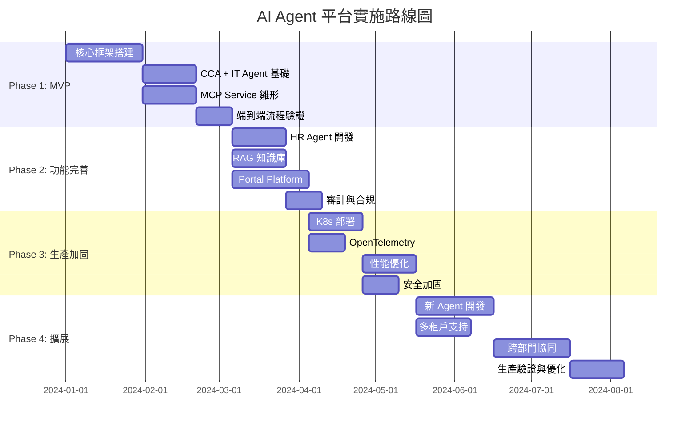
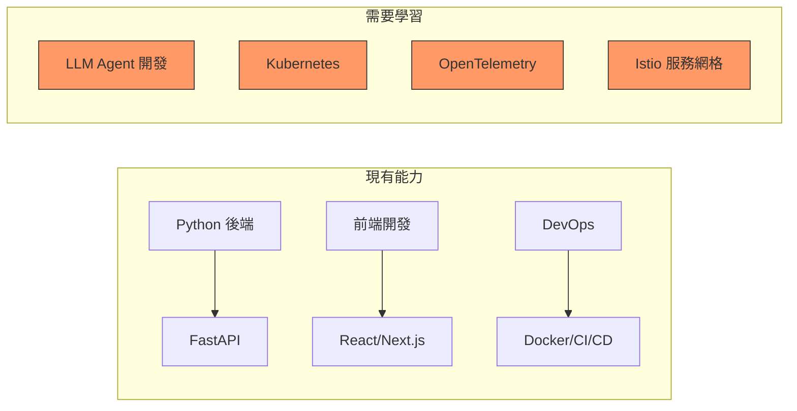
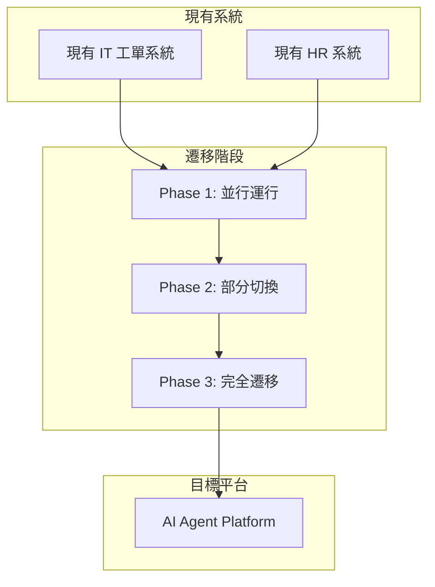
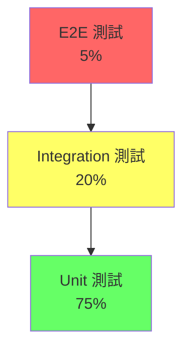

# 第十一章：實作路線圖 — 從 MVP 到生產環境

> 「不要試圖一步到位。好的架構是演進出來的，不是設計出來的。先跑通，再優化，最後擴展。」

本章將展示如何將前面構建的所有組件整合成一個可執行的實作路線圖，從 MVP 到完整生產環境的分階段實施策略。

---

## 11.1 實施策略概述

### 11.1.1 四階段實施路線



---

## 11.2 Phase 1: MVP（4-6 週）

### 11.2.1 目標

- **核心功能**：CCA 接收用戶請求 → 任務分解 → IT Agent 創建 AD 賬戶 → 返回結果
- **驗證標準**：端到端流程跑通，能成功創建一個 AD 賬戶

### 11.2.2 任務清單

| 任務 | 負責人 | 工時 | 依賴 |
|------|--------|------|------|
| 搭建 Python 項目結構 | 後端 | 2 天 | - |
| 實現 CCA 基礎框架 | 後端 | 5 天 | - |
| 實現 IT Agent 基礎版本 | 後端 | 5 天 | - |
| 實現 MCP Service 雛形 | 後端 | 5 天 | - |
| 配置 LiteLLM + Ollama | DevOps | 3 天 | - |
| 實現 AD API 集成 | 後端 | 3 天 | - |
| 端到端流程測試 | QA | 5 天 | 所有上游任務 |
| 修復 Bug 和優化 | 全員 | 5 天 | 測試完成 |

### 11.2.3 MVP 技術架構

```yaml
# mvp-stack.yaml
core:
  cca_agent:
    type: single_process
    llm: ollama/llama3:70b
    memory: in_memory

  it_agent:
    type: single_process
    tools: [create_ad_account, configure_permissions, send_notification]
    llm: ollama/llama3:70b

  mcp_service:
    type: http_json_rpc
    transport: http
    auth: api_key

infrastructure:
  database: sqlite  # MVP 階段用 SQLite
  vector_store: chromadb
  message_queue: none  # MVP 階段無需消息隊列
  cache: in_memory

monitoring:
  logging: structlog
  tracing: none  # MVP 階段暫不實現
  metrics: none

deployment:
  mode: docker_compose
  orchestration: docker-compose up
```

---

## 11.3 Phase 2: 功能完善（6-8 週）

### 11.3.1 目標

- **新增功能**：HR Agent、RAG 知識庫、Portal Platform、審計日誌
- **驗證標準**：能處理完整的 HR + IT 入職流程，有基本的用戶界面

### 11.3.2 任務清單

| 任務 | 負責人 | 工時 | 依賴 |
|------|--------|------|------|
| HR Agent 開發 | 後端 | 10 天 | Phase 1 完成 |
| RAG 知識庫構建 | 後端 | 5 天 | Phase 1 完成 |
| 審計日誌模塊 | 後端 | 5 天 | Phase 1 完成 |
| Portal Backend (FastAPI) | 後端 | 10 天 | Phase 1 完成 |
| Portal Frontend (Next.js) | 前端 | 15 天 | Portal Backend |
| 實時通信 (WebSocket) | 全棧 | 5 天 | Portal Backend |
| 集成測試 | QA | 10 天 | 所有上游任務 |
| 性能測試 | QA | 5 天 | 集成測試 |

### 11.3.3 架構演進

```yaml
# phase2-stack.yaml
core:
  cca_agent:
    type: kubernetes_deployment
    replicas: 2
    llm: ollama/llama3:70b
    memory: postgresql

  hr_agent:
    type: kubernetes_deployment
    replicas: 2
    tools: [query_employee, update_employee, query_policy]
    llm: ollama/llama3:70b

  it_agent:
    type: kubernetes_deployment
    replicas: 2
    tools: [create_ad_account, configure_permissions, send_notification]
    llm: ollama/llama3:70b

  mcp_service:
    type: http_json_rpc
    transport: http
    auth: jwt

infrastructure:
  database: postgresql
  vector_store: chromadb
  message_queue: nats
  cache: redis

monitoring:
  logging: structlog + loki
  tracing: opentelemetry + jaeger
  metrics: opentelemetry + prometheus

deployment:
  mode: kubernetes
  orchestration: helm charts
```

---

## 11.4 Phase 3: 生產加固（4-6 週）

### 11.4.1 目標

- **生產就緒**：完整的 K8s 部署、可觀測性、安全加固、性能優化
- **驗證標準**：通過壓力測試（50 併發用戶），99.9% 可用性

### 11.4.2 任務清單

| 任務 | 負責人 | 工時 | 依賴 |
|------|--------|------|------|
| K8s 集群搭建 | DevOps | 5 天 | Phase 2 完成 |
| Helm Charts 開發 | DevOps | 5 天 | Phase 2 完成 |
| Istio 服務網格配置 | DevOps | 5 天 | K8s 集群 |
| OpenTelemetry 集成 | 後端 | 5 天 | Phase 2 完成 |
| Grafana 儀表板 | DevOps | 3 天 | OpenTelemetry |
| 告警規則配置 | DevOps | 2 天 | Grafana |
| 性能優化 | 後端 | 10 天 | Phase 2 完成 |
| 安全加固 | 安全 | 5 天 | Phase 2 完成 |
| 壓力測試 | QA | 5 天 | 所有上游任務 |
| 災難恢復演練 | DevOps | 3 天 | 壓力測試 |

---

## 11.5 Phase 4: 擴展（8-12 週）

### 11.5.1 目標

- **擴展能力**：新 Agent、多租戶、跨部門協同
- **驗證標準**：能支持 5+ 個 Agent，處理複雜的跨部門工作流

### 11.5.2 擴展方向

| 方向 | 說明 | 優先級 |
|------|------|--------|
| **財務 Agent** | 處理報銷、預算審批 | 高 |
| **法務 Agent** | 合同審查、法律諮詢 | 中 |
| **多租戶支持** | 不同部門獨立配置 | 高 |
| **跨部門協同** | 複雜工作流（如採購審批） | 高 |
| **移動端 Portal** | React Native App | 中 |
| **語音交互** | TTS/STT 集成 | 低 |

---

## 11.6 風險管理

### 11.6.1 常見風險與應對

| 風險 | 影響 | 概率 | 應對策略 |
|------|------|------|---------|
| **LLM 推理質量不穩定** | 任務失敗率高 | 高 | Prompt 優化、多模型切換、人工審核 |
| **AD API 限流** | 高併發時失敗 | 中 | 重試機制、消息隊列緩衝 |
| **數據安全合規** | 法律風險 | 中 | 敏感數據脫敏、審計日誌、RBAC |
| **K8s 集群不穩定** | 服務中斷 | 低 | 多 AZ 部署、災難恢復演練 |
| **團隊技能不足** | 交付延期 | 中 | 培訓、外部諮詢、漸進式學習 |

### 11.6.2 回滾策略

```yaml
# 每次部署都必須有回滾方案
rollback_strategy:
  - name: "代碼回滾"
    trigger: "部署後 5 分鐘內錯誤率 > 10%"
    action: "git revert + 重新部署"
    max_time: "5 分鐘"

  - name: "配置回滾"
    trigger: "配置變更導致服務異常"
    action: "kubectl rollout undo deployment/<name>"
    max_time: "2 分鐘"

  - name: "完整回滾"
    trigger: "嚴重故障無法定位"
    action: "切換到上一個穩定版本的 Helm Release"
    max_time: "10 分鐘"
```

---

## 11.7 團隊組建建議

### 11.7.1 核心團隊（Phase 1-2）

| 角色 | 人數 | 職責 |
|------|------|------|
| **技術負責人** | 1 | 架構設計、技術決策、代碼審查 |
| **後端工程師** | 2-3 | CCA、Agent、MCP Service 開發 |
| **前端工程師** | 1 | Portal Platform 開發 |
| **DevOps 工程師** | 1 | 基礎設施、CI/CD、K8s |
| **QA 工程師** | 1 | 測試策略、自動化測試 |

### 11.7.2 擴展團隊（Phase 3-4）

| 角色 | 人數 | 職責 |
|------|------|------|
| **安全工程師** | 1 | 安全審計、合規、滲透測試 |
| **SRE 工程師** | 1 | 可觀測性、告警、災難恢復 |
| **產品經理** | 1 | 需求分析、用戶體驗、優先級管理 |

---

---

## 11.8 成本估算

### 11.8.1 硬體與基礎設施成本

以下估算基於台灣主要雲端供應商（AWS、GCP、Azure）的中等規格配置：

| 資源 | 規格 | 月成本（USD） | 備註 |
|------|------|--------------|------|
| **K8s 集群（GKE）** | 3 worker nodes, n2-standard-8 | $600 | 控制平面免費 |
| **Ollama GPU 實例** | A10G 24GB VRAM | $800 | 本地推理用 |
| **PostgreSQL** | Cloud SQL, 2 vCPU, 8GB RAM | $150 | 含自動備份 |
| **Redis** | Memorystore, 4GB | $100 | 緩存 + 會話存儲 |
| **NATS** | 自建 on K8s | $0 | 隨 K8s 集群運行 |
| **ChromaDB** | 自建 on K8s | $0 | 隨 K8s 集群運行 |
| **Jaeger + Prometheus** | 自建 on K8s | $0 | 隨 K8s 集群運行 |
| **Grafana Cloud** | Pro 方案 | $50 | 或自建 Grafana |
| **對象存儲（GCS）** | 100GB | $5 | 知識庫文檔存儲 |
| **負載均衡器** | Cloud Load Balancer | $20 | Portal 入口 |
| **合計** | | **~$1,725/月** | |

### 11.8.2 軟體授權成本

| 軟體 | 授權 | 成本 |
|------|------|------|
| LangGraph / LangChain | MIT | 免費 |
| Letta | Apache 2.0 | 免費 |
| OpenTelemetry | Apache 2.0 | 免費 |
| Kubernetes (GKE) | Google | $0 控制平面 |
| Istio | Apache 2.0 | 免費 |
| LiteLLM Proxy | MIT | 免費 |
| ChromaDB | Apache 2.0 | 免費 |
| FastAPI | MIT | 免費 |
| Next.js | MIT | 免費 |
| PostgreSQL | PostgreSQL License | 免費 |

### 11.8.3 人力成本估算

| 階段 | 團隊規模 | 時長 | 人力成本（USD） |
|------|---------|------|----------------|
| Phase 1: MVP | 3 人 | 6 週 | $45,000 |
| Phase 2: 功能完善 | 5 人 | 8 週 | $80,000 |
| Phase 3: 生產加固 | 6 人 | 6 週 | $72,000 |
| Phase 4: 擴展 | 6 人 | 12 週 | $144,000 |
| **合計** | | **32 週** | **$341,000** |

> 假設工程師平均月薪 $15,000 USD（台灣資深工程師薪資）

### 11.8.4 總擁有成本（TCO）第一年

| 類別 | 成本（USD） |
|------|------------|
| 基礎設施（12 個月） | $20,700 |
| 人力開發 | $341,000 |
| 培訓與認證 | $5,000 |
| 外部諮詢（可選） | $20,000 |
| **第一年 TCO** | **$386,700** |

> 預計第二年 TCO 降至 ~$120,000（僅基礎設施 + 維護人力）

---

## 11.9 團隊技能矩陣

### 11.9.1 必備技能

| 技能領域 | 初級 | 中級 | 高級 |
|---------|------|------|------|
| **Python 開發** | FastAPI、Pydantic | 異步編程、類型系統 | 架構設計、性能調優 |
| **LLM/Agent** | Prompt Engineering | LangGraph、Tool Calling | RAG 架構、Agent 評估 |
| **Kubernetes** | Pod/Deployment 管理 | Helm、Service Mesh | 集群管理、安全加固 |
| **雲端服務** | GCP/AWS 基礎 | VPC、IAM、存儲 | 多 AZ 架構、災難恢復 |
| **前端開發** | React 基礎 | Next.js、WebSocket | 實時 UI、性能優化 |
| **DevOps** | Docker、CI/CD | Terraform、ArgoCD | GitOps、SRE 實踐 |
| **安全** | OAuth2 基礎 | RBAC、NetworkPolicy | 滲透測試、合規審計 |

### 11.9.2 技能缺口分析



### 11.9.3 培訓計劃

| 培訓主題 | 時長 | 方式 | 目標 |
|---------|------|------|------|
| **LangGraph + Agent 開發** | 2 週 | 內部工作坊 | 全體後端掌握 Agent 開發 |
| **Kubernetes 基礎** | 1 週 | 線上課程（Coursera） | 後端 + DevOps |
| **OpenTelemetry 入門** | 3 天 | 官方文檔 + 實操 | DevOps + SRE |
| **Istio 服務網格** | 2 天 | 官方教程 | DevOps |
| **安全合規** | 1 天 | 外部講師 | 全體 |

---

## 11.10 關鍵績效指標（KPI）

### 11.10.1 技術 KPI

| 指標 | Phase 1 目標 | Phase 2 目標 | Phase 3 目標 | Phase 4 目標 |
|------|------------|------------|------------|------------|
| **任務成功率** | > 70% | > 85% | > 95% | > 98% |
| **平均響應時間** | < 30s | < 15s | < 8s | < 5s |
| **P95 響應時間** | < 60s | < 30s | < 20s | < 12s |
| **系統可用性** | N/A | > 99% | > 99.9% | > 99.95% |
| **Agent 併發數** | 5 | 20 | 50 | 100+ |
| **API 錯誤率** | < 15% | < 8% | < 2% | < 1% |
| **MTTR（平均恢復時間）** | 手動 | < 30 分鐘 | < 10 分鐘 | < 5 分鐘 |

### 11.10.2 業務 KPI

| 指標 | Phase 1 目標 | Phase 2 目標 | Phase 3 目標 | Phase 4 目標 |
|------|------------|------------|------------|------------|
| **IT 工單自動化率** | 10% | 40% | 70% | 85% |
| **平均工單處理時間** | 4 小時 | 2 小時 | 30 分鐘 | 15 分鐘 |
| **用戶滿意度** | 60% | 75% | 85% | 90% |
| **人力節省** | 0.5 FTE | 1.5 FTE | 3 FTE | 5 FTE |
| **ROI** | -80% | -40% | +20% | +80% |

### 11.10.3 質量 KPI

| 指標 | 目標 | 測量方式 |
|------|------|---------|
| **代碼覆蓋率** | > 80% | pytest-cov |
| **代碼審查率** | 100% | GitHub PR |
| **安全漏洞** | 0 嚴重/高危 | Snyk / Trivy |
| **文檔完整性** | > 90% | 模塊文檔覆蓋 |
| **部署頻率** | 每週 1+ | ArgoCD metrics |

---

## 11.11 詳細里程碑

### Phase 1: MVP 里程碑

| 里程碑 | 預計完成 | 驗證方式 | 成功標準 |
|--------|---------|---------|---------|
| **M1.1** CCA 框架可運行 | Week 2 | 單元測試 + 手動測試 | 能接收請求並分解任務 |
| **M1.2** IT Agent 可創建 AD 賬戶 | Week 4 | 集成測試 | AD API 調用成功 |
| **M1.3** MCP Service 可用 | Week 5 | API 測試 | tools/list 和 tools/call 正常 |
| **M1.4** 端到端流程跑通 | Week 6 | E2E 測試 | 完整入職流程演示 |

### Phase 2: 功能完善里程碑

| 里程碑 | 預計完成 | 驗證方式 | 成功標準 |
|--------|---------|---------|---------|
| **M2.1** HR Agent 上線 | Week 10 | 集成測試 | 能處理 HR 請求 |
| **M2.2** RAG 知識庫可用 | Week 11 | 準確率測試 | 問題回答準確率 > 80% |
| **M2.3** Portal 上線 | Week 14 | 用戶測試 | 5 名內部用戶試用 |
| **M2.4** 審計日誌完整 | Week 15 | 安全審計 | 所有操作可追溯 |

### Phase 3: 生產加固里程碑

| 里程碑 | 預計完成 | 驗證方式 | 成功標準 |
|--------|---------|---------|---------|
| **M3.1** K8s 部署完成 | Week 18 | 部署驗證 | 所有服務 Pod 運行正常 |
| **M3.2** OTel 監控完整 | Week 19 | Dashboard 驗證 | Traces/Metrics/Logs 可查 |
| **M3.3** 壓力測試通過 | Week 22 | 壓力測試報告 | 50 併發，P95 < 20s |
| **M3.4** 安全審計通過 | Week 23 | 安全掃描報告 | 0 嚴重漏洞 |

### Phase 4: 擴展里程碑

| 里程碑 | 預計完成 | 驗證方式 | 成功標準 |
|--------|---------|---------|---------|
| **M4.1** 新 Agent 上線 | Week 28 | 功能測試 | 5+ Agent 可用 |
| **M4.2** 多租戶支持 | Week 30 | 隔離測試 | 部門間數據隔離 |
| **M4.3** 跨部門協同 | Week 34 | 流程測試 | 複雜工作流可執行 |
| **M4.4** 生產驗證完成 | Week 36 | 生產監控 | 連續 30 天穩定運行 |

---

## 11.12 漸進式遷移策略

### 11.12.1 從現有系統遷移



### 11.12.2 並行運行策略

| 階段 | 策略 | 風險等級 |
|------|------|---------|
| **Phase 1** | 新平台僅處理測試請求 | 低 |
| **Phase 2** | 新平台處理 20% 真實流量 | 中 |
| **Phase 3** | 新平台處理 80% 真實流量 | 中 |
| **Phase 4** | 完全切換，舊系統下線 | 高 |

---

## 11.13 質量保證策略

### 11.13.1 測試金字塔



### 11.13.2 各階段測試重點

| 階段 | 測試類型 | 工具 | 覆蓋率目標 |
|------|---------|------|-----------|
| **Phase 1** | Unit + Integration | pytest, httpx | > 60% |
| **Phase 2** | + E2E + Performance | Playwright, Locust | > 70% |
| **Phase 3** | + Security + Chaos | Snyk, Chaos Mesh | > 80% |
| **Phase 4** | + Contract Testing | Pact | > 85% |

---

## 本章小結

本章展示了 AI Agent 平台的完整實作路線圖：

- **四階段實施**：MVP → 功能完善 → 生產加固 → 擴展
- **漸進式複雜度**：從 Docker Compose 到 Kubernetes，從 SQLite 到 PostgreSQL
- **成本估算**：第一年 TCO ~$386,700，第二年降至 ~$120,000
- **團隊技能**：需要補強 LLM Agent、K8s、OTel 技能
- **KPI 體系**：技術、業務、質量三維度量化目標
- **里程碑**：每階段 4 個關鍵里程碑，有明確驗證標準
- **風險管理**：識別風險、制定應對策略、準備回滾方案
- **團隊組建**：核心團隊 + 擴展團隊，按階段配置人力

---

## 延伸閱讀

1. **《The Lean Startup》** — Eric Ries. 精益創業方法論。
2. **《Accelerate》** — Nicole Forsgren, Jez Humble, Gene Kim. 高效 Dev 實踐。
3. **《Team Topologies》** — Matthew Skelton, Manuel Pais. 團隊組織設計。
4. **《Site Reliability Engineering》** — Google. SRE 實踐經典。
5. **《Continuous Delivery》** — Jez Humble, David Farley. 持續交付最佳實踐。
6. **《Cost Estimating for Cloud》** — AWS/GCP 官方定價文檔。
